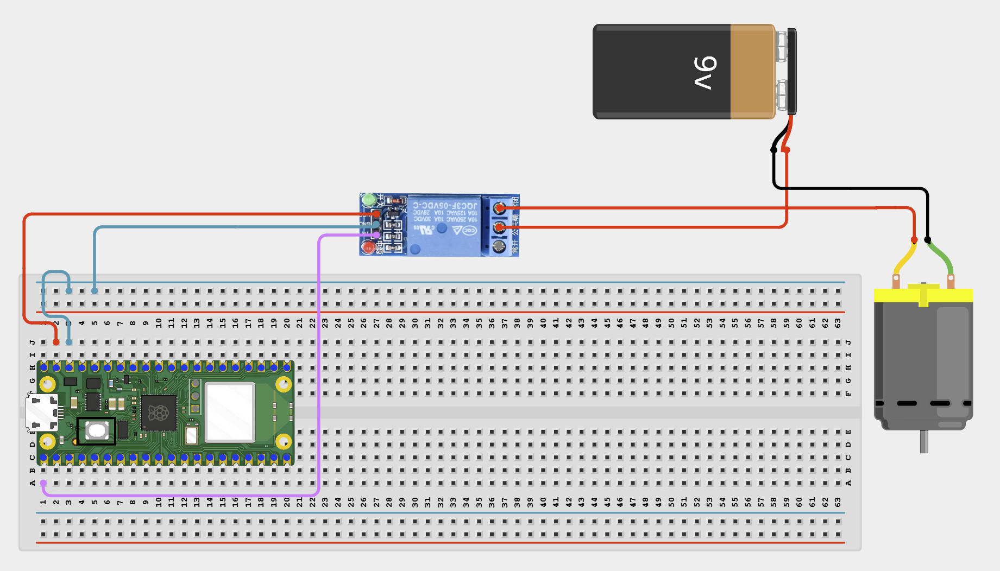

# Project 1.8.8: Online Motor Controller

**Beginner Embedded Systems Project Using Raspberry Pi Pico 2 W and MicroPython**

## Pico 2 W Diagram


---

## Overview

Build a browser-controlled DC motor project using a relay module and external power.

This project demonstrates safe switching of a motor from a web page.

The final result should open a web page with START and STOP buttons that control the motor state.

## Required Components

|  |  |  |  |
| --- | --- | --- | --- |
| <br>Raspberry Pi Pico 2 W | <br>1-channel relay module | <br>Small DC motor | External power supply |
| <br>Breadboard | <br>Jumper wires | 2.4 GHz Wi-Fi network | Phone or computer browser |


## Circuit Connections

| Component Pin                   | Connects To                    | Pico GPIO / Physical Pin Number | Notes              |
| ------------------------------- | ------------------------------ | ------------------------------- | ------------------ |
| Relay VCC                       | 5V / VSYS                      | Physical pin 40                 | Module power       |
| Relay GND                       | GND                            | Physical pin 38                 |                    |
| Relay IN                        | GPIO 0                         | GPIO 0 / physical pin 1         | Usually active-low |
| External motor supply positive  | Relay COM                      | Not a GPIO pin                  | Motor power input  |
| Relay NO                        | Motor positive terminal        | Not a GPIO pin                  | Motor gets power   |
| Motor negative terminal         | External motor supply negative | Not a GPIO pin                  |                    |

## Step-by-Step Assembly

### Step 1: Place the Raspberry Pi Pico 2 W


### Step 2: Place the Relay Module and Motor

Keep the motor and external supply separate from the Pico wiring.


### Step 3: Connect Relay Power

Connect relay VCC to 5V / VSYS and relay GND to GND.


### Step 4: Connect the Relay IN Pin

Connect relay IN to GPIO 0.


### Step 5: Wire the Motor Power Through the Relay

Connect external motor supply positive to relay COM, relay NO to motor positive, and motor negative to external supply negative.



---

## Testing Individual Components

### Relay Click Test

```python
from machine import Pin
import time

relay = Pin(0, Pin.OUT)
relay.value(1)
time.sleep(1)
relay.value(0)
print('Relay ON if active-low')
time.sleep(1)
relay.value(1)
print('Relay OFF')
```

### Wi-Fi Connection Test

```python
import network
import time

SSID = 'YOUR_WIFI_NAME'
PASSWORD = 'YOUR_WIFI_PASSWORD'

wlan = network.WLAN(network.STA_IF)
wlan.active(True)
wlan.connect(SSID, PASSWORD)

for _ in range(15):
    if wlan.isconnected():
        break
    print('Connecting...')
    time.sleep(1)

print('Connected:', wlan.isconnected())
if wlan.isconnected():
    print('IP address:', wlan.ifconfig()[0])
```

---

## Full Project Code

```python
import network
import socket
import time
from machine import Pin

SSID = 'YOUR_WIFI_NAME'
PASSWORD = 'YOUR_WIFI_PASSWORD'

relay = Pin(0, Pin.OUT)
relay.value(1)
motor_on = False

wlan = network.WLAN(network.STA_IF)
wlan.active(True)
wlan.connect(SSID, PASSWORD)

print('Connecting to Wi-Fi...')
for _ in range(15):
    if wlan.isconnected():
        break
    time.sleep(1)

if not wlan.isconnected():
    raise RuntimeError('Wi-Fi connection failed')

ip_address = wlan.ifconfig()[0]
print('Connected. Open http://{} in your browser'.format(ip_address))

def web_page(is_on):
    state = 'RUNNING' if is_on else 'STOPPED'
    return '''<!DOCTYPE html>
<html>
<head><meta name='viewport' content='width=device-width, initial-scale=1'><title>Motor Control</title></head>
<body style='font-family:Arial;text-align:center;padding:40px'>
    <h1>Online Motor Control</h1>
    <p>Motor state: STATE_TEXT</p>
    <a href='/start'><button style='padding:16px 28px;font-size:20px'>START</button></a>
    <a href='/stop'><button style='padding:16px 28px;font-size:20px'>STOP</button></a>
    <p>Use only when the motor area is clear.</p>
</body>
</html>'''.replace('STATE_TEXT', state)

address = socket.getaddrinfo('0.0.0.0', 80)[0][-1]
server = socket.socket()
server.bind(address)
server.listen(1)

while True:
    client, client_address = server.accept()
    print('Client connected from', client_address)
    request = client.recv(1024).decode()

    if 'GET /start' in request:
        motor_on = True
        relay.value(0)
        print('Motor STARTED')
    elif 'GET /stop' in request:
        motor_on = False
        relay.value(1)
        print('Motor STOPPED')

    response = web_page(motor_on)
    client.send('HTTP/1.1 200 OK\r\nContent-Type: text/html\r\nConnection: close\r\n\r\n'.encode())
    client.sendall(response.encode())
    client.close()
```

---

## How the Code Works

| Code Section | What It Does | Why It Matters |
| --- | --- | --- |
| `relay.value(1)` | Starts relay OFF for most active-low modules | Motor should not start unexpectedly |
| `motor_on` | Stores current motor state | Page shows whether motor is running |
| `/start` and `/stop` | Browser commands change relay state | Controls motor remotely |
| Relay hardware | Switches external motor power | Protects Pico from motor current |

---

## Expected Result

Opening the Pico IP address in a browser shows START and STOP buttons that control the motor through the relay.

---

## Troubleshooting

| Problem | Possible Cause | Solution |
| --- | --- | --- |
| Motor does not spin | External supply or load wiring issue | Check motor supply, relay COM, relay NO, and motor wires |
| Motor runs all the time | Active-low logic misunderstood | Confirm `relay.value(0)` means ON for your module |
| Relay clicks but motor does not move | Motor wiring or supply current issue | Test the motor with the external supply |

## Source Text Preserved From DOCX

The following source text from the original Word document is preserved here because it was not already present verbatim in the cleaned MkDocs version.

- | Project Story Beginner Extension Project: This project is more advanced than the earlier beginner projects. Complete the basic projects first before attempting this one. |
- | Phone or computer browser | 1 | Used to open the web page | Must be on the same network |
- Before starting this project, make sure you have completed the foundational sections at the beginning of the manual:
- - Software Installation and Setup.
- - Safety Guidelines.
- - Breadboard Basics.
- - Reading Circuit Diagrams.
- ## Project-Specific Setup Notes
- - Use a 2.4 GHz Wi-Fi network because Pico W / Pico 2 W projects usually do not connect to 5 GHz-only networks
- - Replace the SSID and PASSWORD placeholders in the code with your own Wi-Fi details before running
- - Do not save real Wi-Fi passwords in shared class files or screenshots
- | Project-Specific Safety Note Never power the motor directly from a Pico GPIO pin. Always use the flyback diode across the motor terminals. Disconnect motor power before changing any wires. Keep fingers, hair, and loose items away from the spinning motor. Use only low-voltage DC motors in this beginner project. |
- | Relay NO | Motor positive terminal | Not a GPIO pin | Motor gets power when relay is on |
- Place the Raspberry Pi Pico 2W on the breadboard so it sits across the center gap.
- Keep the USB port facing outward so you can easily connect it to your computer.
- Place the 1-channel relay module on the breadboard or beside it where the pins are easy to reach.
- Keep the motor and external power supply separate from the Pico wiring.
- Identify relay VCC, GND, IN, COM, and NO before wiring.
- Connect relay GND to GND.
- This pin controls the relay from the web page.
- Connect the external motor supply positive wire to relay COM.
- Connect relay NO to the motor positive terminal.
- Connect the motor negative terminal to the external motor supply negative wire.
- ### Step 7: Check the Motor Before Powering
- Make sure the motor can run freely and that the external supply matches its voltage rating.
- ## Wiring Check
- ✓ Pico 2W is placed correctly across the breadboard center gap
- ✓ Relay VCC connects to 5V / VSYS
- ✓ Relay GND connects to GND
- ✓ Relay IN connects to GPIO 0
- ✓ External motor supply positive connects to relay COM
- ✓ Relay NO connects to motor positive terminal
- ✓ Motor negative terminal connects to external supply negative
- ✓ Diode stripe end connects to motor positive
- ✓ Diode non-striped end connects to motor negative
- ✓ No loose jumper wires
- Do not power the motor directly from the Pico. Use an external low-voltage supply, keep the wiring clear, and disconnect power before changing wires.
- Before running the full project, test each part separately. This makes it easier to find wiring or code problems.
- Check that the relay changes state before connecting the motor to the final system.
- Expected test result: You should hear the relay click on and off.
- Check that the Pico connects to Wi-Fi and prints its IP address.
- Expected test result: The Shell should show Connected: True and print an IP address.
- Upload and run this code after the individual tests work correctly.
- | relay.value(1) | Starts the relay in the OFF state for most active-low modules | The motor should not start unexpectedly at power-up |
- | motor_on | Stores the current motor state | The page can show whether the motor should be running |
- | /start and /stop requests | Change the relay state from browser commands | This is how the motor is controlled remotely |
- | Flyback diode in hardware | Protects against voltage spikes when the motor turns off | This is critical for motor safety |
- After entering your Wi-Fi details and running the code, the Shell should print an IP address. Opening that address in a browser should show START and STOP buttons that control the motor through the relay.
- | Motor does not spin | External supply missing or load wiring is wrong | Check the motor power supply, relay COM, relay NO, and motor wires |
- | Motor runs all the time | Active-low logic misunderstood or relay wiring wrong | Check that relay.value(0) means ON for your module and confirm you used the NO contact |
- | Relay clicks but motor does not move | Motor wiring or supply current issue | Test the motor with the correct external supply and recheck connections |
- | Strange reset behavior | Electrical noise or supply issues | Recheck the diode orientation and keep motor power separate from the Pico USB power |
- - Add an LED that shows the motor state
- - Add a timed auto-stop button on the web page
- - Show how many times the motor has been started
- 1. Why does a motor need external power?
- 2. Why is the flyback diode important in a motor project?
- 3. Why should the motor start in the OFF state when the project powers on?
- Save the file to your computer as:
- If you want the program to run automatically when the Pico powers on, save the final version to the Pico as: