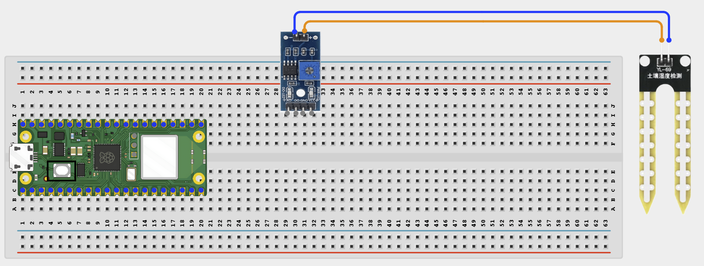
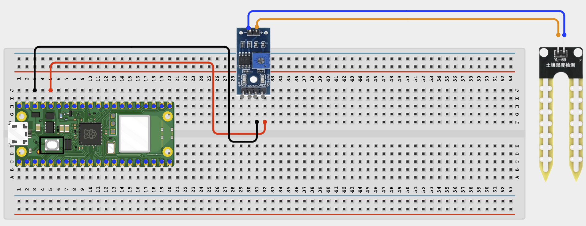
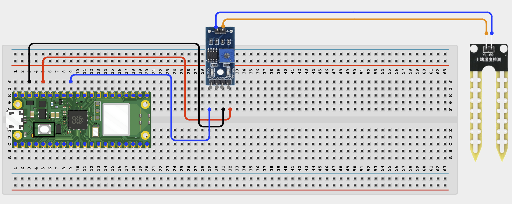

# Project 1.9.2

## Cloud Soil Moisture Display

# Overview

Build a plant moisture monitor that shows soil moisture and watering advice on a web page.

This project demonstrates inverse sensor scaling, status messages, and browser-based feedback.

In this beginner version, the readings are displayed on a web page on your local Wi-Fi network. The final result should show a moisture percentage, a simple status, and plant advice.

# Required Components

|  |  |  |  |
| --- | --- | --- | --- |
| <br>Raspberry Pi Pico 2 W | <br>Soil moisture sensor | <br>Breadboard | <br>Jumper wires |
| Small plant or pot of soil | 2.4 GHz Wi-Fi network | Phone or computer browser |  |


# Circuit Connections

| Component Pin | Connects To | Pico GPIO / Physical Pin Number | Notes |
| --- | --- | --- | --- |
| Soil sensor VCC | 3.3V | Physical pin 36 |  |
| Soil sensor GND | GND | Physical pin 38 |  |
| Soil sensor AOUT | GPIO 27 | GPIO 27 / physical pin 32 | ADC input |

# Step-by-Step Assembly

### Step 1: Place the Raspberry Pi Pico 2W

Place the Raspberry Pi Pico 2W on the breadboard so it sits across the center gap.
Keep the USB port facing outward so you can easily connect it to your computer.


### Step 2: Place the Soil Moisture Sensor

Place the soil moisture sensor module on the breadboard, or position it so the probe can be inserted into soil.

Identify VCC, GND, and AOUT before wiring.

Check the printed pin labels on your module because pin order can vary.



### Step 3: Connect the Soil Sensor VCC

Connect soil sensor VCC to 3.3V.

Connect soil sensor GND to GND.



### Step 5: Connect the Soil Sensor Signal Pin

Connect soil sensor AOUT to GPIO 27.

GPIO 27 is the ADC input used by this project.



## Wiring Check

✓ Pico 2W is placed correctly across the breadboard center gap

✓ Soil moisture sensor VCC connects to 3.3V

✓ Soil moisture sensor GND connects to GND

✓ Soil moisture sensor AOUT connects to GPIO 27

✓ No loose jumper wires

## Beginner Note

Test the sensor in dry soil and wet soil before choosing moisture thresholds. Soil and sensor readings can vary.

## Safety Note

Do not pour water onto the Pico or breadboard. Insert only the soil probe into the soil, and avoid damaging plant roots.

# Testing Individual Components

Before running the full project, test each part separately. This makes it easier to find wiring or code problems.

## Soil moisture ADC test

Check that the soil moisture sensor reading changes between dry and wet conditions.

```python
from machine import ADC, Pin
import time
adc = ADC(Pin(27))
while True:
    print(adc.read_u16())
    time.sleep(0.5)
```

Expected test result: The raw ADC value should change when the sensor moves between dry air, dry soil, and wet soil.

## Wi-Fi connection test

Check that the Pico connects to Wi-Fi and prints its IP address.

```python
import network
import time
SSID = 'YOUR_WIFI_NAME'
PASSWORD = 'YOUR_WIFI_PASSWORD'
wlan = network.WLAN(network.STA_IF)
wlan.active(True)
wlan.connect(SSID, PASSWORD)
for _ in range(15):
    if wlan.isconnected():
        break
    print('Connecting...')
    time.sleep(1)
print('Connected:', wlan.isconnected())
if wlan.isconnected():
    print('IP address:', wlan.ifconfig()[0])
```

Expected test result: The Shell should show Connected: True and print an IP address.

# Full Project Code

Upload and run this code after the individual tests work correctly.

```python
import network
import socket
import time
from machine import ADC, Pin

SSID = 'YOUR_WIFI_NAME'
PASSWORD = 'YOUR_WIFI_PASSWORD'

adc = ADC(Pin(27))
DRY_VALUE = 58000
WET_VALUE = 20000

wlan = network.WLAN(network.STA_IF)
wlan.active(True)
wlan.connect(SSID, PASSWORD)

print('Connecting to Wi-Fi...')
for _ in range(15):
    if wlan.isconnected():
        break
    time.sleep(1)

if not wlan.isconnected():
    raise RuntimeError('Wi-Fi connection failed')

ip_address = wlan.ifconfig()[0]
print('Connected. Open http://{} in your browser'.format(ip_address))

def moisture_info():
    raw = adc.read_u16()
    if raw <= WET_VALUE:
        percent = 100
    elif raw >= DRY_VALUE:
        percent = 0
    else:
        percent = int((DRY_VALUE - raw) / (DRY_VALUE - WET_VALUE) * 100)

    if percent < 25:
        status = 'WATER NOW'
        advice = 'Soil is very dry. Water the plant soon.'
        color = 'red'
    elif percent < 50:
        status = 'Water Soon'
        advice = 'Soil is getting dry. Check the plant today.'
        color = 'orange'
    else:
        status = 'Good'
        advice = 'Soil moisture looks healthy right now.'
        color = 'green'

    return raw, percent, status, advice, color

def web_page(raw, percent, status, advice, color):
    return """<!DOCTYPE html>
<html>
<head>
    <meta name='viewport' content='width=device-width, initial-scale=1'>
    <meta http-equiv='refresh' content='5'>
    <title>Soil Moisture Monitor</title>
</head>
<body style='font-family:Arial;text-align:center;padding:30px'>
    <h1>Plant Moisture Monitor</h1>
    <h2 style='color:STATUS_COLOR'>PERCENT_TEXT%</h2>
    <p><strong>STATUS_TEXT</strong></p>
    <p>ADVICE_TEXT</p>
    <p>Raw ADC: RAW_TEXT</p>
    <p>Page refreshes every 5 seconds</p>
</body>
</html>""".replace('STATUS_COLOR', color).replace('PERCENT_TEXT', str(percent)).replace('STATUS_TEXT', status).replace('ADVICE_TEXT', advice).replace('RAW_TEXT', str(raw))

address = socket.getaddrinfo('0.0.0.0', 80)[0][-1]
server = socket.socket()
server.bind(address)
server.listen(1)

while True:
    client, client_address = server.accept()
    print('Client connected from', client_address)
    client.recv(1024)
    raw, percent, status, advice, color = moisture_info()
    response = web_page(raw, percent, status, advice, color)
    client.send('HTTP/1.1 200 OK\r\nContent-Type: text/html\r\nConnection: close\r\n\r\n'.encode())
    client.sendall(response.encode())
    client.close()
```

# How the Code Works

| Code Section | What It Does | Why It Matters |
| --- | --- | --- |
| Calibration values | Store dry and wet ADC readings | The sensor must be scaled to become a useful percentage |
| Inverse calculation | Turns lower wet readings into higher moisture percentages | Soil sensors often work in the opposite direction from what beginners expect |
| Status and advice | Generates helpful plant-care messages | The project becomes more meaningful than only showing a number |
| web_page() | Builds the browser page with percentage, status, and advice | This creates a simple local monitoring dashboard |

# Expected Result

After entering your Wi-Fi details and running the code, the Shell should print an IP address. Opening that address in a browser should show the soil moisture percentage, a status label, and watering advice that changes when the soil becomes wetter or drier.

# Troubleshooting

| Problem | Possible Cause | Solution |
| --- | --- | --- |
| Shows 100% when dry | Calibration values are reversed | Swap DRY_VALUE and WET_VALUE if your sensor behaves the other way around |
| No visible change | Sensor is not making good soil contact or wrong ADC pin used | Check the probe placement and confirm AOUT is on GPIO 27 |
| Sensor corrodes over time | This is common with basic resistive probes | Remove the sensor when not needed or use a capacitive sensor in long-term projects |
