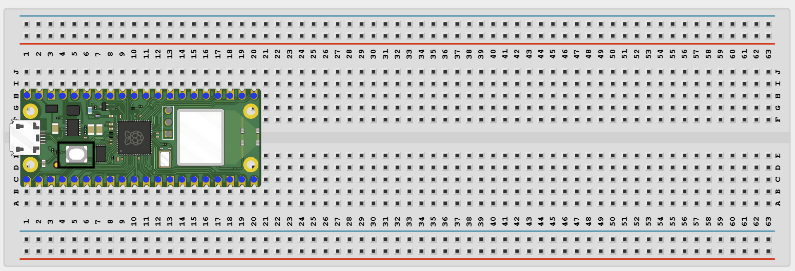
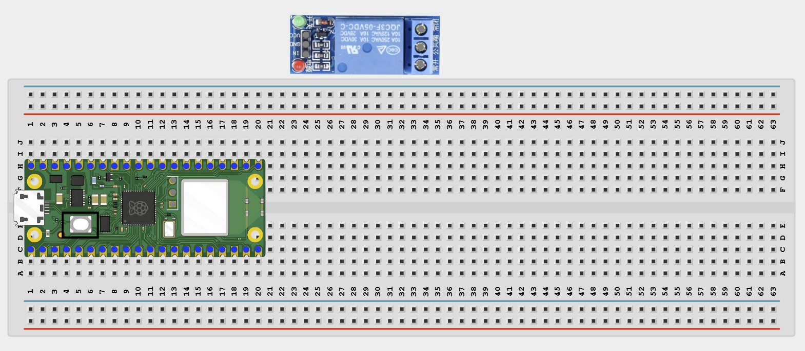
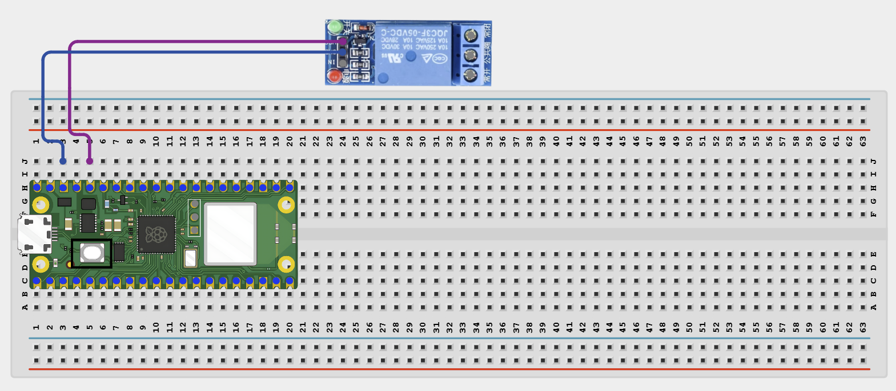
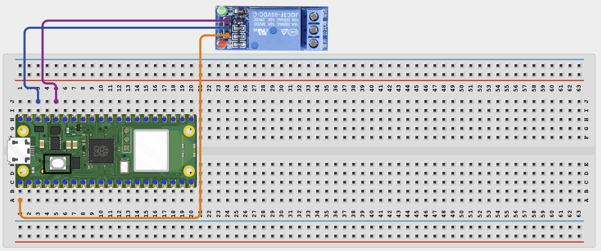

# Project 1.9.3

## Cloud Timer Switch

# Overview

Build a web-controlled relay timer switch that turns a low-voltage load on for a chosen amount of time.

In this beginner version, the control page runs on your local Wi-Fi network instead of a public cloud service.

The final result should let you start a timed relay session from a browser and watch the countdown until the relay turns off automatically.

# Required Components

|  |  |  |  |
| --- | --- | --- | --- |
| <br>Raspberry Pi Pico 2 W | <br>1-channel relay module | Optional low-voltage test load | <br>Breadboard |
| <br>Jumper wires | 2.4 GHz Wi-Fi network | Phone or computer browser |  |


# Circuit Connections

| Component Pin | Connects To | Pico GPIO / Physical Pin Number | Notes |
| --- | --- | --- | --- |
| Relay VCC | 5V / VSYS | Physical pin 40 | Module power |
| Relay GND | GND | Physical pin 38 |  |
| Relay IN | GPIO 0 | GPIO 0 / physical pin 1 | Usually active-low |
| Optional load positive | Relay NO or COM depending on load wiring | Not a GPIO pin | Use only a safe low-voltage test load |

# Step-by-Step Assembly

### Step 1: Place the Raspberry Pi Pico 2W

Place the Raspberry Pi Pico 2W on the breadboard so it sits across the center gap.
Keep the USB port facing outward so you can easily connect it to your computer.



### Step 2: Place the Relay Module

Place the 1-channel relay module on the breadboard or beside it where the pins are easy to reach.

Identify VCC, GND, IN, COM, NO, and NC before wiring.

Keep the relay load side separate from the Pico logic side.



### Step 3: Connect Relay Power

Connect relay VCC to 5V / VSYS.

Connect relay GND to GND.



### Step 4: Connect the Relay IN Pin

Connect relay IN to GPIO 0.

This pin switches the relay on and off.



### Step 5: Connect Only a Safe Optional Load

If you use a test load, use only a low-voltage load.

Wire the load through the relay COM and NO contacts according to the load's power supply.

Do not connect mains AC power in this beginner project.

## Wiring Check

✓ Pico 2W is placed correctly across the breadboard center gap

✓ Relay VCC connects to 5V / VSYS

✓ Relay GND connects to GND

✓ Relay IN connects to GPIO 0

✓ Optional load uses only safe low-voltage relay wiring

✓ No loose jumper wires

## Safety Note

Do not connect mains AC power. Use an external supply for any load that needs more current than the Pico can provide.

# Testing Individual Components

Before running the full project, test each part separately. This makes it easier to find wiring or code problems.

## Relay click test

Check that the relay changes state before using the timer web page.

```python
from machine import Pin
import time
relay = Pin(0, Pin.OUT)
relay.value(1)
time.sleep(1)
relay.value(0)
print('Relay ON if active-low')
time.sleep(1)
relay.value(1)
print('Relay OFF')
```

Expected test result: You should hear the relay click on and off.

## Wi-Fi connection test

Check that the Pico connects to Wi-Fi and prints its IP address.

```python
import network
import time
SSID = 'YOUR_WIFI_NAME'
PASSWORD = 'YOUR_WIFI_PASSWORD'
wlan = network.WLAN(network.STA_IF)
wlan.active(True)
wlan.connect(SSID, PASSWORD)
for _ in range(15):
    if wlan.isconnected():
        break
    print('Connecting...')
    time.sleep(1)
print('Connected:', wlan.isconnected())
if wlan.isconnected():
    print('IP address:', wlan.ifconfig()[0])
```

Expected test result: The Shell should show Connected: True and print an IP address.

# Full Project Code

Upload and run this code after the individual tests work correctly.

```python
import network
import socket
import time
from machine import Pin

SSID = 'YOUR_WIFI_NAME'
PASSWORD = 'YOUR_WIFI_PASSWORD'

relay = Pin(0, Pin.OUT)
relay.value(1)

timer_active = False
duration_seconds = 0
remaining_seconds = 0
start_ms = 0


def format_time(seconds):
    minutes = seconds // 60
    secs = seconds % 60
    return '{:02d}:{:02d}'.format(minutes, secs)


def start_timer(seconds):
    global timer_active, duration_seconds, remaining_seconds, start_ms
    duration_seconds = max(1, min(3600, seconds))
    remaining_seconds = duration_seconds
    start_ms = time.ticks_ms()
    timer_active = True
    relay.value(0)
    print('Timer started for', duration_seconds, 'seconds')


def stop_timer():
    global timer_active, remaining_seconds
    timer_active = False
    remaining_seconds = 0
    relay.value(1)
    print('Timer stopped')


def web_page(active, remaining):
    status = 'RUNNING' if active else 'IDLE'
    return '''<!DOCTYPE html>
<html>
<head>
    <meta name='viewport' content='width=device-width, initial-scale=1'>
    <meta http-equiv='refresh' content='1'>
    <title>Timer Switch</title>
</head>
<body style='font-family:Arial;text-align:center;padding:40px'>
    <h1>Timer Switch</h1>
    <h2>State: STATUS_TEXT</h2>
    <h2>Remaining: TIME_TEXT</h2>
    <form>
        <input type='number' name='seconds' min='1' max='3600' placeholder='Seconds'>
        <button type='submit'>START</button>
    </form>
    <p>Quick presets:</p>
    <a href='/?seconds=10'><button>10 sec</button></a>
    <a href='/?seconds=30'><button>30 sec</button></a>
    <a href='/?seconds=60'><button>60 sec</button></a>
    <a href='/?seconds=120'><button>120 sec</button></a>
    <p><a href='/stop'><button>STOP / CANCEL</button></a></p>
</body>
</html>'''.replace('STATUS_TEXT', status).replace('TIME_TEXT', format_time(remaining))


wlan = network.WLAN(network.STA_IF)
wlan.active(True)
wlan.connect(SSID, PASSWORD)

print('Connecting to Wi-Fi...')
for _ in range(15):
    if wlan.isconnected():
        break
    time.sleep(1)

if not wlan.isconnected():
    raise RuntimeError('Wi-Fi connection failed')

ip_address = wlan.ifconfig()[0]
print('Connected. Open http://{} in your browser'.format(ip_address))

address = socket.getaddrinfo('0.0.0.0', 80)[0][-1]
server = socket.socket()
server.bind(address)
server.listen(1)
server.settimeout(0.2)

while True:
    if timer_active:
        elapsed = time.ticks_diff(time.ticks_ms(), start_ms) // 1000
        remaining_seconds = max(0, duration_seconds - elapsed)
        if remaining_seconds == 0:
            stop_timer()

    try:
        client, client_address = server.accept()
    except OSError:
        continue

    print('Client connected from', client_address)
    request = client.recv(1024).decode()

    if 'GET /stop' in request:
        stop_timer()
    elif 'seconds=' in request:
        try:
            start = request.find('seconds=') + 8
            end = request.find(' ', start)
            value = int(request[start:end].split('&')[0])
            start_timer(value)
        except ValueError:
            pass

    response = web_page(timer_active, remaining_seconds)
    client.send('HTTP/1.1 200 OK\r\nContent-Type: text/html\r\nConnection: close\r\n\r\n'.encode())
    client.sendall(response.encode())
    client.close()
```

# How the Code Works

| Code Section | What It Does | Why It Matters |
| --- | --- | --- |
| Timer state variables | Store whether the timer is active and how much time remains | The relay timer needs memory of its current state |
| start_timer() | Starts the countdown and turns the relay on | This is the main action when the web page starts a timed session |
| Non-blocking update loop | Keeps updating the timer while still serving browser requests | The page stays responsive and the countdown continues |
| Preset and form input | Let the user choose a timer duration from the browser | This makes the project easy to test and use |

# Expected Result

After entering your Wi-Fi details and running the code, the Shell should print an IP address. Opening that address in a browser should show timer controls. Starting a timer should turn the relay on and begin a countdown. When the countdown reaches zero, the relay should turn off automatically.

# Troubleshooting

| Problem | Possible Cause | Solution |
| --- | --- | --- |
| Relay is always on | Active-low behavior is misunderstood | Check that GPIO LOW means relay ON for your module |
| Countdown does not change | The timer variables are not updating or page is not refreshing | Check the auto-refresh and the non-blocking loop |
| Timer never starts | The seconds value is not being parsed from the request | Watch the Shell and recheck the URL parsing code |
