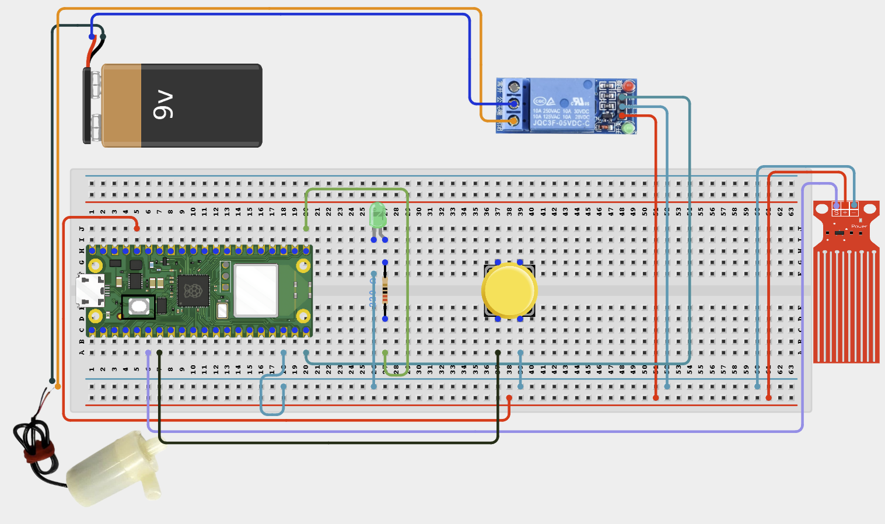

# Project 2.1.10: Farm Pump Safety System

**Intermediate Embedded Systems Project Using Raspberry Pi Pico 2 W and MicroPython**

---
## Overview

This project builds a pump safety controller that checks whether source water is available before allowing a pump test cycle to run.

Students will wire a water level sensor, a start/stop push button, and a relay output, then test how the Pico blocks unsafe pump operation.

The final system should run the relay only when water is available, stop immediately on a manual emergency button press, and report the safety state in the Thonny Shell.

## Required Components

|  |  |  |  |
| --- | --- | --- | --- |
| <br>Water level sensor | <br>External pump power supply | <br>Raspberry Pi Pico 2 W | <br>Push button |
| <br>1-channel relay module | <br>LED and 220 Ω resistor | <br>Breadboard and jumper wires |   |


## Circuit Connections


| Component terminal | Connect to | Pico physical pin | Notes |
|---|---|---|---|
| Water level sensor VCC | 3.3V | Physical pin 36 | Sensor power |
| Water level sensor GND | GND | Any GND pin | Common ground |
| Water level sensor AOUT | GPIO 26 | GPIO 26 / physical pin 31 | ADC water-level input |
| Push button one side | GPIO 5 | GPIO 5 / physical pin 7 | Input uses internal pull-up |
| Push button other side | GND | Any GND pin | Pressing the button pulls the input low |
| Relay IN | GPIO 15 | GPIO 15 / physical pin 20 | Relay control output |
| Relay VCC | Relay module supply | Module dependent | Use only a 3.3V-compatible driver or suitable interface board |
| Relay GND | GND | Any GND pin | Common ground if the module is not isolated |
| Status LED anode | GPIO 16 through 220 Ω resistor | GPIO 16 / physical pin 21 | Active relay indicator |
| Status LED cathode | GND | Any GND pin | Return path for LED |

---

## Wiring Diagram



```
  Raspberry Pi Pico 2 W
  ┌─────────────────────┐
  │                     │
  │  GPIO 4  ───────────┤──── Water Level Sensor ──── GND
  │  GPIO 5  ───────────┤──── Push Button ──── GND
  │                     │
  │  GPIO 15 ───────────┤──── Relay IN
  │  GPIO 16 ────220Ω───┤──── Status LED (+)
  │                     │
  │  GND     ───────────┤──── Status LED (-)
  │  GND     ───────────┤──── Relay GND
  │  GND     ───────────┤──── Water Level Sensor GND
  │  GND     ───────────┤──── Push Button GND
  │                     │
  └─────────────────────┘

  Relay Module            External Supply
  ┌──────────┐            ┌────────────┐
  │  COM ────┼────────────┤ (+)        │
  │  NO  ────┼──┐         │            │
  └──────────┘  │         └────────────┘
                │              │
                │         Pump (+)
                │
                └────────────── Pump (-) ──── External Supply (-)
```

---

## Step-by-Step Assembly

### Step 1: Place the Raspberry Pi Pico 2W
Place the Raspberry Pi Pico 2W on the breadboard so it sits across the center gap. Keep the USB port facing outward so you can easily connect it to your computer.

### Step 2: Place the Water Level Sensor
Place the water level sensor where it can show whether source water is available. This guide expects the switch to close to GND when water is available.

### Step 3: Connect the Water Level Sensor
Connect one water level sensor wire to **GPIO 4**. Connect the other water level sensor wire to **GND**. The code uses the Pico internal pull-up, so water available reads LOW.

### Step 4: Place the Control Button
Place the push button across the breadboard center gap. Connect one side of the button to **GPIO 5**. Connect the opposite side of the button to **GND**.

### Step 5: Place and Wire the Relay Module
Identify relay VCC, GND, IN, COM, NO, and NC before wiring. Connect relay IN to **GPIO 15**. Connect relay VCC to the supply required by the relay module label. Connect relay GND to Pico GND and to the external pump supply GND where shared grounding is required.

### Step 6: Place and Connect the Status LED
Place the status LED on the breadboard. Identify the long leg as the anode (+) and the short leg as the cathode (-). Connect the status LED long leg through a 220Ω resistor to **GPIO 16**. Connect the status LED short leg to **GND**.

### Step 7: Keep the Pump on the Relay Contact Side
Keep the real pump disconnected for the first relay-control test. If you later connect a pump, route the external pump supply positive wire through relay **COM** and **NO**. Connect the pump negative lead directly to the external pump supply negative wire.

### Wiring Check

- [x] Pico 2W is placed correctly across the breadboard center gap
- [x] Water level sensor connects between GPIO 4 and GND
- [x] Control button connects between GPIO 5 and GND
- [x] Relay IN connects to GPIO 15
- [x] Relay VCC connects to the correct relay supply
- [x] Relay GND, Pico GND, and external pump supply GND share a common reference where required
- [x] Status LED long leg connects through a 220Ω resistor to GPIO 16
- [x] Status LED short leg connects to GND
- [x] Pump positive path uses relay COM and NO only if a real pump is connected
- [x] No pump current is routed through the Pico
- [x] No loose jumper wires

> **Intermediate Note**
> The code treats water available as LOW on GPIO 4. Test the water level sensor in both positions before connecting any real pump.

> **Safety Note**
> Do not power the pump from the Pico. Use an external pump supply, keep electronics away from water, and keep the first pump test short and supervised.

---

## Testing Individual Components

Before running the full project, test each part separately. This makes it easier to find wiring, library, or code problems.

### Hardware Setup

- Build the water level sensor, push button, relay, and LED wiring with the pump disconnected
- Confirm the water level sensor moves freely and changes state clearly when lifted or lowered

### Test the Input Sensor

- Print the water level sensor value in the Shell and confirm the reading changes when the water level changes
- Press and release the push button several times to confirm the Pico detects each button press cleanly

### Test the Output Device

- Run a short relay click test and confirm the status LED turns on only when the relay is active
- If the relay behaves backward, change `RELAY_ON` and `RELAY_OFF` to match your module

### Test Communication

- Watch the Thonny Shell while changing the water level and pressing the button
- Confirm the messages clearly show READY, LOCKOUT, RUNNING, and emergency-stop events

### Run the Full System

- With water available, press the button to start a protected pump cycle and verify the relay stops at the maximum runtime
- Repeat the test with the water level sensor moved to the low-water position and confirm the relay never starts

### Save the Project

- Save the final program to the Pico and write down the water-level threshold used in your setup
- Record whether your relay module was active-high or active-low for future maintenance

### Additional Testing and Calibration Checks

- **Water level sensor test**: raise and lower the water level around the sensor and confirm the Shell state changes
- **Relay click test**: run the system with no pump connected and confirm the relay clicks only during a safe cycle
- **Pump safety test**: after bench validation, connect the pump power through the relay and keep electronics away from water
- **No-water dry-run warning**: lower the water level below the safe threshold and verify the relay never starts
- **Manual stop test**: start a cycle, then press the button during the run and confirm the relay stops immediately

---

## Full Project Code

After completing and checking the circuit connections, open Thonny IDE. Copy and paste the code below into a new file, or upload the project file to the Raspberry Pi Pico 2 W, then run it from Thonny.

```python
from machine import ADC, Pin
import time

water_sensor = ADC(26)
control_button = Pin(5, Pin.IN, Pin.PULL_UP)
relay = Pin(15, Pin.OUT)
status_led = Pin(16, Pin.OUT)

RELAY_ON = 1
RELAY_OFF = 0
MAX_RUN_SECONDS = 15
LOCKOUT_DELAY = 2
MIN_SAFE_LEVEL = 30

relay.value(RELAY_OFF)
status_led.value(0)
lockout = False
run_count = 0


def water_level_percent():
    return int((water_sensor.read_u16() / 65535) * 100)


def water_available():
    return water_level_percent() >= MIN_SAFE_LEVEL


def button_pressed():
    return control_button.value() == 0


def stop_pump(reason):
    relay.value(RELAY_OFF)
    status_led.value(0)
    print('Pump OFF - {}'.format(reason))


def wait_for_button_release():
    while button_pressed():
        time.sleep(0.05)


def run_protected_cycle():
    global lockout, run_count
    if not water_available():
        lockout = True
        stop_pump('dry-run protection active: water level too low')
        return
    relay.value(RELAY_ON)
    status_led.value(1)
    run_count += 1
    print('Pump ON - protected run #{}'.format(run_count))
    start_time = time.time()
    while time.time() - start_time < MAX_RUN_SECONDS:
        if button_pressed():
            lockout = True
            stop_pump('manual emergency stop button pressed')
            wait_for_button_release()
            return
        if not water_available():
            lockout = True
            stop_pump('water level dropped during run')
            return
        time.sleep(0.2)
    stop_pump('maximum safe test runtime reached')


print('=== Farm Pump Safety System ===')

while True:
    if not water_available() and not lockout:
        lockout = True
        print('LOCKOUT: waiting for safe water level before pump can run.')

    if water_available() and lockout:
        lockout = False
        print('Water level restored. System returned to READY state.')

    if button_pressed():
        time.sleep_ms(50)
        if button_pressed():
            run_protected_cycle()
            wait_for_button_release()
            time.sleep(LOCKOUT_DELAY)

    status = 'READY' if water_available() and not lockout else 'LOCKOUT'
    print('Status: {} | Water level: {}% | Completed runs: {}'.format(status, water_level_percent(), run_count))
    time.sleep(2)
```

---

## How the Code Works

| Code Section | What It Does | Why It Matters |
|--------------|--------------|----------------|
| `water_available()` | Reads the water level sensor state | The relay must never start if the water source is empty |
| `run_protected_cycle()` | Runs the relay only while water is available and the button is not used as an emergency stop | This is the main safety routine for the project |
| `lockout` state | Remembers that an unsafe condition occurred | Students can see how real systems remain cautious after a fault |
| Status print messages | Show READY or LOCKOUT and count finished runs | Serial feedback makes the controller easier to test and debug |

---

## Expected Result

When the water level sensor indicates water is available, pressing the push button should turn the relay and status LED on for a short protected run.

If the water level sensor indicates no water, the relay should stay off and the Shell should report a dry-run protection lockout.

If the button is pressed during a run, the relay should turn off immediately and the Shell should report a manual emergency stop.

---

## Troubleshooting

| Problem | Possible cause | Solution |
|---------|----------------|----------|
| The relay turns on when no water is available | The water level sensor orientation is reversed | Adjust `MIN_SAFE_LEVEL` or invert the `water_available()` rule to match your hardware |
| The pump never starts | The relay module may be active-low or the system is still locked out | Check relay polarity, Shell messages, and water level sensor wiring |
| The system keeps re-entering lockout | The water level sensor signal is unstable or mounted poorly | Mount the float securely and confirm the switch makes a clean open/close change |
| The button starts and stops unexpectedly | The button wiring is loose or bouncing heavily | Check the GPIO 5 connection and keep the debounce delay in the code |

---
