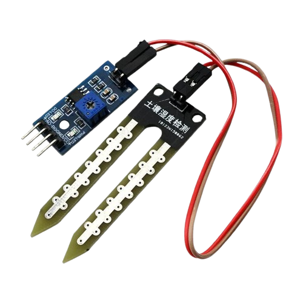
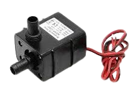
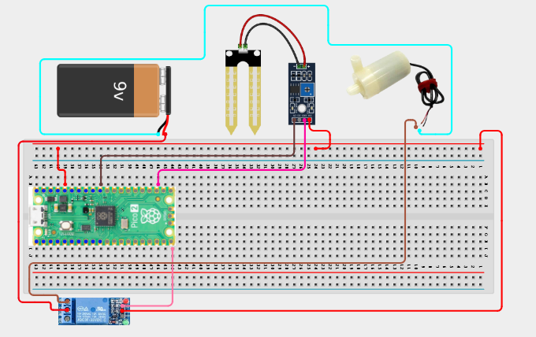

# Project 2.1.15: Multi-plant Irrigation System

**Intermediate Embedded Systems Project Using Raspberry Pi Pico 2 W and MicroPython**

---
## Overview

This project expands irrigation control from one plant to multiple independent zones with separate sensors and relay outputs.

Students will build a three-zone controller, calibrate each sensor path, and compare how different dry thresholds change system behaviour.

The final system should read each zone in sequence, water only the dry zones, and keep each zone independent from the others.

## Required Components

|  |  |  |  |
| --- | --- | --- | --- |
| <br>Soil moisture sensor | <br>Breadboard | <br>Raspberry Pi Pico 2 W | <br>3-channel relay module or three single relays |
| <br>Small DC pump or low-voltage indicator load | <br>External power supply |   |   |


## Circuit Connections


| Component terminal | Connect to | Pico physical pin | Notes |
|---|---|---|---|
| Soil sensor AOUT | GPIO 26 | GPIO 26 / physical pin 31 | ADC soil input |
| Relay IN | GPIO 15 | GPIO 15 / physical pin 20 | Single pump control used by the code |
| Sensor VCC | 3.3V | Physical pin 36 | Common sensor power |
| Sensor GND | GND | Physical pin 38 | Common sensor ground |
| Relay VCC and GND | External supply and Pico GND | Power pins | Share ground where required |
| Pump/load positive path | Relay COM to NO contacts | Not a Pico GPIO | External power only |

---

## Wiring Diagram



```
  Raspberry Pi Pico 2 W
  ┌─────────────────────┐
  │                     │
  │  GPIO 26 ───────────┤──── Zone A Soil AOUT
  │  GPIO 27 ───────────┤──── Zone B Soil AOUT
  │  GPIO 28 ───────────┤──── Zone C Soil AOUT
  │                     │
  │  GPIO 15 ───────────┤──── Zone A Relay IN
  │  GPIO 16 ───────────┤──── Zone B Relay IN
  │  GPIO 17 ───────────┤──── Zone C Relay IN
  │                     │
  │  3.3V    ───────────┤──── All Sensor VCC
  │  GND     ───────────┤──── All Sensor GND
  │  GND     ───────────┤──── Relay GND
  │                     │
  └─────────────────────┘

  Relay Module (3-Channel)    External Supply
  ┌──────────────────┐        ┌────────────┐
  │  Zone A COM ─────┼────────┤ (+)        │
  │  Zone A NO  ─────┼──┐     │            │
  │  Zone B COM ─────┼──┼─────┤ (+)        │
  │  Zone B NO  ─────┼──┼──┐  │            │
  │  Zone C COM ─────┼──┼──┼──┤ (+)        │
  │  Zone C NO  ─────┼──┼──┼──┼──┐         │
  │  VCC       ──────┼──┼──┼──┼──┼─────────┤ (+)
  │  GND       ──────┼──┼──┼──┼──┼──┐      │
  └──────────────────┘  │  │  │  │  │      │
                         │  │  │  │  │      └────────────┘
                         │  │  │  │  │           │
                         │  │  │  │  └───────────┘
                         │  │  │  │        Zone C Pump (+)
                         │  │  │  └──────────── Zone B Pump (+)
                         │  │  └─────────────── Zone A Pump (+)
                         │  │
                         └──┴────────────────── All Pump (-) to Supply (-)
```

---

## Step-by-Step Assembly

### Step 1: Place the Raspberry Pi Pico 2W
Place the Raspberry Pi Pico 2W on the breadboard so it sits across the center gap. Keep the USB port facing outward so you can easily connect it to your computer.

### Step 2: Label the Three Plant Zones
Label the three soil sensors and relay channels as Zone A, Zone B, and Zone C before wiring. Check each soil sensor for VCC, GND, and AOUT / AO / Signal.

### Step 3: Connect the Soil Sensor Power Rails
Connect each soil sensor VCC pin to **3.3V**. Connect each soil sensor GND pin to **GND**.

### Step 4: Connect Zone A Soil Sensor
Connect Zone A soil sensor AOUT, AO, or Signal to **GPIO 26**.

### Step 5: Connect Zone B Soil Sensor
Connect Zone B soil sensor AOUT, AO, or Signal to **GPIO 27**.

### Step 6: Connect Zone C Soil Sensor
Connect Zone C soil sensor AOUT, AO, or Signal to **GPIO 28**.

### Step 7: Place the Relay Hardware
Place the relay hardware where the three control inputs and load terminals are easy to reach. Identify VCC, GND, IN, COM, NO, and NC for each channel used.

### Step 8: Connect Zone A Relay
Connect Zone A relay IN to **GPIO 15**.

### Step 9: Connect Zone B Relay
Connect Zone B relay IN to **GPIO 16**.

### Step 10: Connect Zone C Relay
Connect Zone C relay IN to **GPIO 17**.

### Step 11: Power the Relay Hardware
Power the relay module from the supply required by its label. Connect relay GND to Pico GND and to the external pump or load supply GND where shared grounding is required.

### Step 12: Wire Each Zone Load
For each zone, connect the external supply positive wire to that zone relay **COM**. Connect that zone relay **NO** to the pump or safe test load positive lead. Connect the pump or load negative lead to the external supply negative wire.

### Wiring Check

- [x] Pico 2W is placed correctly across the breadboard center gap
- [x] Zone A soil signal connects to GPIO 26
- [x] Zone B soil signal connects to GPIO 27
- [x] Zone C soil signal connects to GPIO 28
- [x] Zone A relay IN connects to GPIO 15
- [x] Zone B relay IN connects to GPIO 16
- [x] Zone C relay IN connects to GPIO 17
- [x] Relay hardware uses external power and shared ground where required
- [x] Each pump or test load is switched through its own relay COM and NO path
- [x] No load current is routed through the Pico
- [x] No loose jumper wires

> **Intermediate Note**
> Label every sensor and relay wire before testing. Calibrate each zone separately because soil and sensor readings can differ from plant to plant.

> **Safety Note**
> Use external power for pumps or high-current loads. Keep water away from the Pico and breadboard, and never let a pump run dry.

---

## Testing Individual Components

Before running the full project, test each part separately. This makes it easier to find wiring, library, or code problems.

### Hardware Setup

- Build one zone completely first, then duplicate the pattern for the other two zones
- Label the sensor and relay wires so you do not mix the zones later

### Test the Input Sensors

- Check all three ADC channels separately and confirm that each soil sensor changes independently
- Record dry and wet reference values for each sensor if the probes behave differently

### Test the Output Devices

- Test each relay channel one at a time before connecting real pumps
- Verify that activating one zone does not energise the wrong output channel

### Run the Full System

- Upload the final code and dry only one zone at first to see whether the correct zone waters
- Then test multiple dry zones and confirm that each zone still behaves independently

### Save the Project

- Save the code and note the threshold values used for each zone
- Record which zones dried faster in your test so you can discuss plant-specific tuning

### Additional Testing and Calibration Checks

**Calibration and tuning notes**

- Test the zones one by one before trying multi-zone conditions
- If one sensor behaves very differently from the others, store separate calibration values instead of copying the same numbers blindly
- For safe classroom work, use LEDs or low-voltage loads before using three real pumps
- If two zones share one water source, supervise the tubing so each pump path stays correct

**Quick testing checklist**

- [ ] All three ADC channels respond independently
- [ ] Each relay channel can be tested individually
- [ ] Drying one zone triggers only that zone
- [ ] Each zone rearms independently after recovery
- [ ] Zone thresholds can be tuned without affecting the others

---

## Full Project Code

After completing and checking the circuit connections, open Thonny IDE. Copy and paste the code below into a new file, or upload the project file to the Raspberry Pi Pico 2 W, then run it from Thonny.

```python
from machine import ADC, Pin
import time

RELAY_ON = 0
RELAY_OFF = 1
PUMP_RUN_S = 4
MIN_REST_S = 30

soil = ADC(26)
relay = Pin(15, Pin.OUT)

dry_threshold = 35
recovery_threshold = 45
dry_ref = 52000
wet_ref = 22000
ready = True
last_cycle = time.time() - MIN_REST_S

relay.value(RELAY_OFF)


def clamp(value, low, high):
    return max(low, min(high, value))


def moisture_percent():
    raw = soil.read_u16()
    span = dry_ref - wet_ref
    if span == 0:
        return 0
    percent = int(((dry_ref - raw) * 100) / span)
    return clamp(percent, 0, 100)


def water_plant():
    global ready, last_cycle
    relay.value(RELAY_ON)
    print("Pump ON")
    time.sleep(PUMP_RUN_S)
    relay.value(RELAY_OFF)
    last_cycle = time.time()
    ready = False
    print("Pump OFF")


print("Single-plant irrigation demo ready")

while True:
    moisture = moisture_percent()
    now = time.time()

    if moisture >= recovery_threshold:
        ready = True

    if ready and moisture <= dry_threshold and (now - last_cycle) >= MIN_REST_S:
        water_plant()
    else:
        print("Moisture:{}% Ready:{}".format(moisture, ready))

    time.sleep(5)
```

---

## How the Code Works

| Code Section | What It Does | Why It Matters |
|--------------|--------------|----------------|
| zones list | Stores each zone's sensor, relay, thresholds, and state | Structured data makes the project scalable |
| `moisture_percent(zone)` | Calculates a calibrated moisture percentage per zone | Each zone can be tuned without rewriting the whole program |
| `water_zone(zone)` | Runs one pump output for a timed cycle | The same function can be reused for every zone |
| Per-zone ready and last_cycle values | Track re-arming and minimum rest independently | One zone should not block the others unnecessarily |

---

## Expected Result

Each zone should report its own moisture percentage. When one zone becomes dry enough, only that zone's relay should switch on for a timed watering cycle. The other zones should continue to report their own status independently.

---

## Troubleshooting

| Problem | Possible cause | Solution |
|---------|----------------|----------|
| The wrong pump turns on | Zone wiring labels or relay pin assignments are mixed up | Label each zone and compare the wiring with the code one channel at a time |
| One sensor always reads 0% or 100% | The ADC input or sensor calibration is wrong | Recheck that zone's ADC pin and record fresh dry and wet values |
| All zones water too often | Thresholds are too aggressive or rest timing is too short | Increase the recovery thresholds or the shared `MIN_REST_S` value |
| The relay module behaves unpredictably | The external supply and Pico ground are not referenced correctly | Confirm the shared ground path unless the relay module is fully isolated |

---
