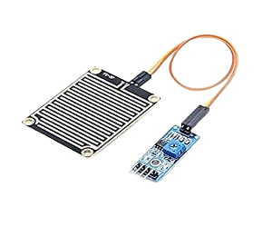

# Project 2.1.22: Rainfall Monitoring Station

**Intermediate Embedded Systems Project Using Raspberry Pi Pico 2 W and MicroPython**

---
## Overview

This project builds a rainfall monitoring station that counts pulse events and estimates rainfall activity over time.

Students will connect a pulse-output rain sensor, count tip events, estimate a running rainfall total, classify rainfall intensity, and add a manual reset button for a new observation session.

The final system should detect each rain pulse, estimate total rainfall for the active session, classify light, moderate, or heavy rainfall, and show the current rain state on LEDs.

### Project Story

The real-world use case is a school weather station or farm demo where students want to observe rainfall intensity and event totals without using a full commercial weather station.

---

## Learning Objectives

- Count sensor pulses reliably with edge detection
- Estimate rainfall total from repeated sensor events
- Classify activity level from event rate instead of only total count
- Use a reset button to start a new monitoring session
- Explain the difference between a true tipping-bucket measurement and a simple rain-detection proxy
- Think about how weather data changes over time, not just at one moment

---

## Required Components

|  |  |  |  |
| --- | --- | --- | --- |
| <br>Pulse-output rain sensor or tipping-bucket rain gauge | <br>Breadboard and jumper wires | <br>Raspberry Pi Pico 2 W | <br>Push button |
| <br>Blue LED and 220 Ω resistor | <br>Red LED and 220 Ω resistor |   |   |


## Before You Begin

Before starting this project, make sure you have completed the foundational sections at the beginning of the manual:

- **Software Installation and Setup**
- **Safety Guidelines**
- **Breadboard Basics**
- **Reading Circuit Diagrams**

### Project-Specific Setup Notes

- No external library is required. This project uses only built-in MicroPython modules
- Run `import os` and `print(os.listdir())` in the Thonny Shell to confirm the Pico file system is responding before you save the code
- If you have a real tipping-bucket gauge, set MM_PER_TIP to the value from the sensor documentation
- If you only have a simple digital rain detector, treat the count as a rain-event proxy rather than a true millimetre total

### Project-Specific Safety Note

Keep electronics away from water and wet surfaces.

Keep the Pico and breadboard indoors or in a protected enclosure while only the rain-sensing head is exposed.

Do not allow rainwater to run down the wires into the electronics.

---

## Circuit Connections


|---------------|-------------|---------------------------------|-------|
| Rain sensor VCC | Module dependent | Follow sensor label | Use a safe low-voltage arrangement |
| Rain sensor GND | GND | Any GND pin | Common ground |
| Rain sensor pulse output | GPIO 4 | GPIO 4 / physical pin 6 | Digital pulse input |
| Reset button one side | GPIO 5 | GPIO 5 / physical pin 7 | Uses internal pull-up |
| Reset button other side | GND | Any GND pin | Pressing pulls the input low |
| Blue LED anode | GPIO 16 through 220 Ω resistor | GPIO 16 / physical pin 21 | Rain activity indicator |
| Red LED anode | GPIO 17 through 220 Ω resistor | GPIO 17 / physical pin 22 | Heavy-rain indicator |
| LED cathodes | GND | Any GND pin | Return path |

---

## Wiring Diagram

```
  Rain sensor pulse output    -> GPIO 4
  Reset button                -> GPIO 5 and GND
  GPIO 16 -> 220Ω -> Blue LED anode
  GPIO 17 -> 220Ω -> Red LED anode
  LED cathodes                -> GND
```

---

## Step-by-Step Assembly

### Step 1: Place the Raspberry Pi Pico 2W
Place the Raspberry Pi Pico 2W on the breadboard so it sits across the center gap. Keep the USB port facing outward so you can easily connect it to your computer.

### Step 2: Position the Rain Sensor
Mount the rain sensor or tipping-bucket sensing head where it can detect rainfall. Keep the Pico and breadboard in a dry protected location. Identify VCC, GND, and pulse output before wiring.

### Step 3: Connect the Rain Sensor
Connect rain sensor VCC to the safe low-voltage supply required by the sensor label. Connect rain sensor GND to GND. Connect rain sensor pulse output to GPIO 4.

### Step 4: Place the Reset Button
Place the reset push button across the breadboard center gap. Connect one side of the reset button to GPIO 5. Connect the opposite side of the button to GND.

### Step 5: Place and Connect the Rain LEDs
Place the blue rain LED and red heavy-rain LED on the breadboard. Identify each LED long leg as the anode (+) and each short leg as the cathode (-). Connect the blue LED long leg through a 220Ω resistor to GPIO 16. Connect the red LED long leg through a 220Ω resistor to GPIO 17. Connect both LED short legs to GND.

### Wiring Check

- [x] Pico 2W is placed correctly across the breadboard center gap
- [x] Rain sensor pulse output connects to GPIO 4
- [x] Rain sensor GND connects to GND
- [x] Reset button connects between GPIO 5 and GND
- [x] Blue LED long leg connects through a 220Ω resistor to GPIO 16
- [x] Red LED long leg connects through a 220Ω resistor to GPIO 17
- [x] Both LED short legs connect to GND
- [x] No loose jumper wires

> **Intermediate Note**
> If you use a real tipping-bucket gauge, set MM_PER_TIP from the sensor documentation. If you use a simple digital rain detector, treat the count as a rainfall-event proxy.

> **Safety Note**
> Keep the Pico, breadboard, USB cable, and jumper wires away from water. Do not allow rainwater to run down the wires into the electronics.

---

## Testing Individual Components

Before running the full project, test each part separately. This makes it easier to find wiring, library, or code problems.

### Hardware Setup

- Mount the rain-sensing head first and confirm the wire path keeps the electronics dry
- Add the LEDs and reset button only after the pulse signal is stable

### Test the Input Sensor

- Trigger one pulse manually or with a safe test method and confirm the event counter increases by one
- Press the reset button and confirm the total resets in the serial output

### Test the Output Device

- Confirm the blue LED turns on when recent rain activity exists and the red LED turns on only for heavy event rates
- Make sure the LEDs return to the correct state after activity slows down

### Test Communication

- Watch the Thonny Shell and confirm it prints the tip count, estimated total, and intensity label
- Use the printed event rate to tune the light, moderate, and heavy thresholds

### Run the Full System

- Generate spaced pulses and then faster pulses to compare light, moderate, and heavy behaviour
- Check that the running total increases correctly with each new event

### Save the Project

- Save the final code and record the event-rate thresholds and per-tip value used in your station
- Write down whether your hardware is a true rainfall gauge or only a rainfall proxy

### Additional Testing and Calibration Checks

- **Pulse test**: trigger one pulse and confirm the count increases by exactly one
- **Rate test**: trigger pulses slowly and then more quickly to compare light, moderate, and heavy intensity states
- **Reset test**: press the reset button and confirm the count and total return to zero
- **Output response test**: confirm the LEDs match the current activity state
- **Calibration note**: if your hardware is not a true tipping bucket, report the total as an estimated proxy value rather than a certified rainfall depth

---

## Full Project Code

After completing and checking the circuit connections, open Thonny IDE. Copy and paste the code below into a new file, or upload the project file to the Raspberry Pi Pico 2 W, then run it from Thonny.

```python
from machine import Pin
import time

rain_sensor = Pin(4, Pin.IN, Pin.PULL_UP)
reset_button = Pin(5, Pin.IN, Pin.PULL_UP)
rain_led = Pin(16, Pin.OUT)
heavy_led = Pin(17, Pin.OUT)

ACTIVE_LEVEL = 0
MM_PER_TIP = 0.28
LIGHT_RATE = 2
HEAVY_RATE = 6
RATE_WINDOW_SECONDS = 60
DEBOUNCE_MS = 250

tip_count = 0
tip_times = []
previous_state = rain_sensor.value()
last_button_ms = 0


def button_pressed():
    global last_button_ms
    now_ms = time.ticks_ms()
    if reset_button.value() == 0 and time.ticks_diff(now_ms, last_button_ms) > DEBOUNCE_MS:
        while reset_button.value() == 0:
            time.sleep(0.02)
        last_button_ms = now_ms
        return True
    return False


def current_rate(now):
    while tip_times and (now - tip_times[0]) > RATE_WINDOW_SECONDS:
        tip_times.pop(0)
    return len(tip_times)


print('=== Rainfall Monitoring Station ===')
print('If you are not using a true tipping bucket, treat totals as a rainfall proxy.\n')

while True:
    now = time.time()
    state = rain_sensor.value()

    if button_pressed():
        tip_count = 0
        tip_times = []
        print('Rainfall session reset.')

    if previous_state == 1 and state == ACTIVE_LEVEL:
        tip_count += 1
        tip_times.append(now)
        print('Rain event detected. Tip count = {}'.format(tip_count))

    previous_state = state
    rate = current_rate(now)
    total_mm = tip_count * MM_PER_TIP

    if rate >= HEAVY_RATE:
        intensity = 'HEAVY'
        rain_led.value(1)
        heavy_led.value(1)
    elif rate >= LIGHT_RATE:
        intensity = 'MODERATE'
        rain_led.value(1)
        heavy_led.value(0)
    elif rate > 0:
        intensity = 'LIGHT'
        rain_led.value(1)
        heavy_led.value(0)
    else:
        intensity = 'NONE'
        rain_led.value(0)
        heavy_led.value(0)

    print('Tips: {} | Estimated total: {:.2f} mm | Rate window: {} | Intensity: {}'.format(
        tip_count, total_mm, rate, intensity
    ))
    time.sleep(1)
```

---

## How the Code Works

| Code Section | What It Does | Why It Matters |
|--------------|--------------|----------------|
| Pulse edge detection | Counts each new rain pulse only once | This avoids counting a single pulse multiple times while the signal stays active |
| MM_PER_TIP | Converts event count into an estimated rainfall total | Students can connect pulse counting to a physical quantity |
| Rate window | Looks at recent tip times to estimate current intensity | Rainfall rate matters as much as total amount in many real systems |
| Reset button | Clears the current observation session | This is useful for classroom experiments or a new daily observation period |

---

## Expected Result

Each new rain pulse should increase the event count and the estimated total.

The blue LED should indicate recent rainfall activity, while the red LED should turn on only during high event rates.

The serial monitor should show the tip count, estimated total rainfall, and current intensity label.

---

## Troubleshooting

| Problem | Possible cause | Solution |
|---------|----------------|----------|
| The count increases too fast | One pulse is being counted multiple times because of bounce or signal noise | Add mechanical stability to the sensor and confirm the edge detection works with one clean transition |
| The LEDs never turn on | No recent pulse events are being detected | Check the sensor output level and confirm whether your module is active-low or active-high |
| The total looks unrealistic | MM_PER_TIP does not match the hardware or the sensor is only a rain-detection proxy | Update MM_PER_TIP for your real sensor or describe the output as a proxy measurement |
| The reset button does nothing | The button wiring is wrong | Check the GPIO 5 button connection and confirm it pulls low when pressed |

---

## Challenge Extensions

- Decide how you would calibrate this project if you had a known measured volume of water and a real tipping-bucket mechanism
- Explain why rainfall intensity can matter more than daily total when planning flood response or drainage checks
- Add an OLED display that shows total rainfall and the current intensity label
- Add Wi-Fi upload so the station can share values to a local dashboard
- Add a wind or temperature sensor so the rainfall station becomes part of a larger weather system
- Add a real-time clock or NTP time source for automatic daily reset at midnight

---

## Reflection Questions

1. Why is event rate useful in addition to total rainfall?
2. Why should a simple rain detector not be described as a fully calibrated rainfall gauge?
3. How could mounting angle or debris affect the result?
4. What would you improve before leaving this station outside for long periods?

---

## Save Your Work

Save the file to your computer as:

```
project_185_rainfall_monitoring_station.py
```

If you want the program to run automatically when the Pico powers on, save the final version to the Pico as:

```
main.py
```

---

## Next Project

**Project 186: Smart Drainage Blockage Detector**