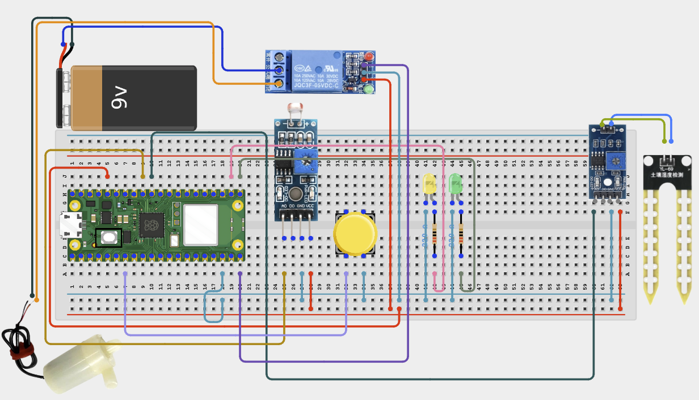

# Project 2.1.27: Solar-ready Irrigation Controller

**Intermediate Embedded Systems Project Using Raspberry Pi Pico 2 W and MicroPython**

---
## Overview

This project builds an irrigation controller that uses soil moisture plus a light-based solar-availability proxy before watering.

Students will combine a soil sensor, an LDR-based light sensor, relay control, pending-irrigation logic, and a manual test button into one energy-aware build.

The final system should water immediately when the soil is dry and the light level is high enough, but defer watering and show a pending state when solar conditions are not ready yet.

## Required Components

|  |  |  |  |
| --- | --- | --- | --- |
| <br>Soil moisture sensor (analog output) | <br>Green LED and 220 Ω resistor | <br>Raspberry Pi Pico 2 W | <br>LDR module with analog output |
| <br>Relay module or transistor relay driver | <br>Push button | <br>Yellow LED and 220 Ω resistor | <br>Breadboard and jumper wires |


## Circuit Connections


| Component terminal | Connect to | Pico physical pin | Notes |
|---|---|---|---|
| Soil sensor VCC | 3.3V | Physical pin 36 | Sensor power |
| Soil sensor GND | GND | Any GND pin | Common ground |
| Soil sensor AOUT | GPIO 26 | GPIO 26 / physical pin 31 | Analog soil input |
| LDR module VCC | 3.3V | Physical pin 36 | Sensor power |
| LDR module AOUT | GPIO 27 | GPIO 27 / physical pin 32 | ADC light input from module |
| LDR module GND | GND | Any GND pin | Common ground |
| Manual test button one side | GPIO 5 | GPIO 5 / physical pin 7 | Uses internal pull-up |
| Manual test button other side | GND | Any GND pin | Pressing pulls the input low |
| Relay IN | GPIO 15 | GPIO 15 / physical pin 20 | Irrigation relay control |
| Green LED anode | GPIO 16 through 220 Ω resistor | GPIO 16 / physical pin 21 | Solar-ready indicator |
| Yellow LED anode | GPIO 17 through 220 Ω resistor | GPIO 17 / physical pin 22 | Pending-irrigation indicator |
| LED cathodes | GND | Any GND pin | Return path |

---

## Wiring Diagram



```
  Raspberry Pi Pico 2 W
  ┌─────────────────────┐
  │                     │
  │  GPIO 26 ───────────┤──── Soil Sensor AOUT
  │  GPIO 27 ───────────┤──── LDR Module AOUT
  │                     │
  │  GPIO 5  ───────────┤──── Manual Button ──── GND
  │                     │
  │  GPIO 15 ───────────┤──── Relay IN
  │  GPIO 16 ────220Ω───┤──── Green LED (+)
  │  GPIO 17 ────220Ω───┤──── Yellow LED (+)
  │                     │
  │  3.3V    ───────────┤──── Soil Sensor VCC
  │  3.3V    ───────────┤──── LDR Module VCC
  │                     │
  │  GND     ───────────┤──── Soil Sensor GND
  │  GND     ───────────┤──── LDR Module GND
  │  GND     ───────────┤──── Green LED (-)
  │  GND     ───────────┤──── Yellow LED (-)
  │  GND     ───────────┤──── Relay GND
  │  GND     ───────────┤──── Manual Button GND
  │                     │
  └─────────────────────┘

  Relay Module            External Supply
  ┌──────────┐            ┌────────────┐
  │  COM ────┼────────────┤ (+)        │
  │  NO  ────┼──┐         │            │
  └──────────┘  │         └────────────┘
                │              │
                │         Pump (+)
                │
                └────────────── Pump (-) ──── External Supply (-)
```

---

## Step-by-Step Assembly

### Step 1: Place the Raspberry Pi Pico 2W
Place the Raspberry Pi Pico 2W on the breadboard so it sits across the center gap. Keep the USB port facing outward so you can easily connect it to your computer.

### Step 2: Position and Connect the Soil Sensor
Place the soil moisture probe so the sensing end can enter the soil sample. Connect soil sensor VCC to 3.3V. Connect soil sensor GND to GND. Connect soil sensor AOUT, AO, or Signal to GPIO 26.

### Step 3: Connect the LDR Module
Place the LDR module where it can sense the light level. Connect LDR module VCC to 3.3V. Connect LDR module AOUT to GPIO 27. Connect LDR module GND to GND.

### Step 4: Place the Manual Test Button
Place the manual test push button across the breadboard center gap. Connect one side of the button to GPIO 5. Connect the opposite side of the button to GND.

### Step 5: Place and Wire the Relay Module
Identify relay VCC, GND, IN, COM, NO, and NC before wiring. Connect relay IN to GPIO 15. Power the relay module according to its label. Connect relay GND to Pico GND and to the external pump or valve supply GND where shared grounding is required.

### Step 6: Place and Connect the Indicator LEDs
Place the green solar-ready LED and yellow pending-irrigation LED on the breadboard. Connect the green LED long leg through a 220Ω resistor to GPIO 16. Connect the yellow LED long leg through a 220Ω resistor to GPIO 17. Connect both LED short legs to GND.

### Step 7: Keep the Irrigation Load on the Relay Side
If you connect a pump or valve, route the external supply positive wire through relay COM and NO. Connect the pump or valve negative lead to the external supply negative wire.

### Wiring Check

- [x] Pico 2W is placed correctly across the breadboard center gap
- [x] Soil sensor AOUT / AO / Signal connects to GPIO 26
- [x] LDR module AOUT connects to GPIO 27
- [x] Manual test button connects between GPIO 5 and GND
- [x] Relay IN connects to GPIO 15
- [x] Green LED long leg connects through a 220Ω resistor to GPIO 16
- [x] Yellow LED long leg connects through a 220Ω resistor to GPIO 17
- [x] Both LED short legs connect to GND
- [x] No loose jumper wires

> **Intermediate Note**
> Test the LDR in bright light and shade before trusting the solar-ready logic. The system can delay watering when the light proxy is too low.

> **Safety Note**
> Use external load power for pumps or valves. Keep electronics away from water and never let a pump run dry.

---

## Testing Individual Components

Before running the full project, test each part separately. This makes it easier to find wiring, library, or code problems.

### Hardware Setup

- Build the soil sensor and LDR module first, then add the relay and indicator LEDs
- Check the LDR junction carefully because an incorrect divider will give confusing light readings

### Test the Input Sensor

- Record dry and wet soil values for calibration
- Measure light values in bright light and shade so you can set realistic LIGHT_DARK and LIGHT_BRIGHT points

### Test the Output Device

- Run a relay click test with no pump connected and confirm the green and yellow LEDs show solar-ready and pending states correctly
- If the relay output behaves backward, adjust the relay logic before connecting external power

### Test Communication

- Watch the serial monitor and confirm it prints soil percentage, light percentage, pending status, and watering events
- Use the serial output to explain why the controller delayed watering in low light

### Run the Full System

- Create a dry-soil condition in bright light and confirm the system waters immediately
- Then create dry soil in low light and confirm the pending LED turns on instead of watering immediately

### Save the Project

- Save the final code and record the light and soil thresholds that matched your classroom setup
- Write down how this daylight proxy differs from a real battery-voltage measurement

### Additional Testing and Calibration Checks

- **Dry/wet reading test**: calibrate the soil sensor with dry and wet samples before trusting the irrigation threshold
- **Bright/dark light test**: record the ADC values in bright light and shade before finalising LIGHT_DARK and LIGHT_BRIGHT
- **Threshold condition test**: create dry soil in both bright and low-light conditions to compare immediate watering and pending mode
- **Output response test**: confirm the LEDs and relay match the printed state
- **Relay click test**: perform the first relay test with no pump connected
- **Pump safety test**: supervise the first short run if you connect a real pump

---

## Full Project Code

After completing and checking the circuit connections, open Thonny IDE. Copy and paste the code below into a new file, or upload the project file to the Raspberry Pi Pico 2 W, then run it from Thonny.

```python
from machine import ADC, Pin
import time

soil_sensor = ADC(26)
light_sensor = ADC(27)
manual_button = Pin(5, Pin.IN, Pin.PULL_UP)
relay = Pin(15, Pin.OUT)
ready_led = Pin(16, Pin.OUT)
pending_led = Pin(17, Pin.OUT)

RELAY_ON = 1
RELAY_OFF = 0
SOIL_DRY = 52000
SOIL_WET = 22000
LIGHT_DARK = 15000
LIGHT_BRIGHT = 56000
DRY_THRESHOLD = 35
DAYLIGHT_THRESHOLD = 60
WATER_SECONDS = 4
COOLDOWN_SECONDS = 90
DEBOUNCE_MS = 250

pending_irrigation = False
last_watered = time.time() - COOLDOWN_SECONDS
last_button_ms = 0


def clamp(value, low, high):
    if value < low:
        return low
    if value > high:
        return high
    return value


def scaled_percent(raw, low_point, high_point):
    span = high_point - low_point
    if span <= 0:
        return 0
    percent = int(((raw - low_point) * 100) / span)
    return clamp(percent, 0, 100)


def soil_percent():
    return scaled_percent(SOIL_DRY - soil_sensor.read_u16(), 0, SOIL_DRY - SOIL_WET)


def light_percent():
    return scaled_percent(light_sensor.read_u16(), LIGHT_DARK, LIGHT_BRIGHT)


def button_pressed():
    global last_button_ms
    now_ms = time.ticks_ms()
    if manual_button.value() == 0 and time.ticks_diff(now_ms, last_button_ms) > DEBOUNCE_MS:
        while manual_button.value() == 0:
            time.sleep(0.02)
        last_button_ms = now_ms
        return True
    return False


def relay_on():
    relay.value(RELAY_ON)


def relay_off():
    relay.value(RELAY_OFF)


def water_once(reason):
    global last_watered
    relay_on()
    print(reason)
    time.sleep(WATER_SECONDS)
    relay_off()
    last_watered = time.time()


relay_off()
print('=== Solar Ready Irrigation Controller ===')
print('Dry soil can be delayed when the solar proxy says light is too low.\n')

while True:
    soil = soil_percent()
    light = light_percent()
    now = time.time()

    if button_pressed():
        water_once('Manual maintenance test cycle started by button press.')

    if soil <= DRY_THRESHOLD:
        if light >= DAYLIGHT_THRESHOLD and (now - last_watered) >= COOLDOWN_SECONDS:
            pending_irrigation = False
            ready_led.value(1)
            pending_led.value(0)
            water_once('Solar-ready watering started | Soil: {}% | Light: {}%'.format(soil, light))
        else:
            pending_irrigation = True
            ready_led.value(0)
            pending_led.value(1)
            relay_off()
            print('Dry soil detected, but irrigation is pending because light is only {}%.'.format(light))
    else:
        pending_irrigation = False
        ready_led.value(1 if light >= DAYLIGHT_THRESHOLD else 0)
        pending_led.value(0)
        relay_off()
        print('Soil: {}% | Light: {}% | No watering needed.'.format(soil, light))

    time.sleep(5)
```

---

## How the Code Works

| Code Section | What It Does | Why It Matters |
|--------------|--------------|----------------|
| LDR module output | Converts the LDR voltage into a light percentage | This provides a simple solar-ready proxy for the controller |
| pending_irrigation flag | Remembers that soil is dry even when light conditions are not ready yet | This prevents the dry condition from being ignored completely |
| DAYLIGHT_THRESHOLD | Defines when the light level is good enough to allow watering | Students can tune the rule for their environment |
| Manual test button | Allows one short maintenance cycle without waiting for the energy rule | This helps with hardware testing and maintenance |

---

## Expected Result

When the soil is dry and the light level is above the solar-ready threshold, the relay should run one watering cycle.

When the soil is dry but the light level is low, the yellow pending LED should turn on and the system should delay watering.

The serial monitor should show the soil percentage, light percentage, and whether the system watered or deferred the action.

---

## Troubleshooting

| Problem | Possible cause | Solution |
|---------|----------------|----------|
| The light percentage is always near zero | The LDR module is wired incorrectly | Check that the LDR module with analog output form a divider and that the junction goes to GPIO 27 |
| The system never waters in bright light | DAYLIGHT_THRESHOLD is too high or LIGHT_BRIGHT is not calibrated correctly | Measure the bright-light ADC value again and lower the threshold if needed |
| The pending LED never turns on | The soil is not actually below the dry threshold or the light logic is reversed | Confirm the soil percentage and the light percentage with the serial output |
| The relay runs too often | COOLDOWN_SECONDS is too short | Increase the cooldown to better match your plant and watering hardware |

---
