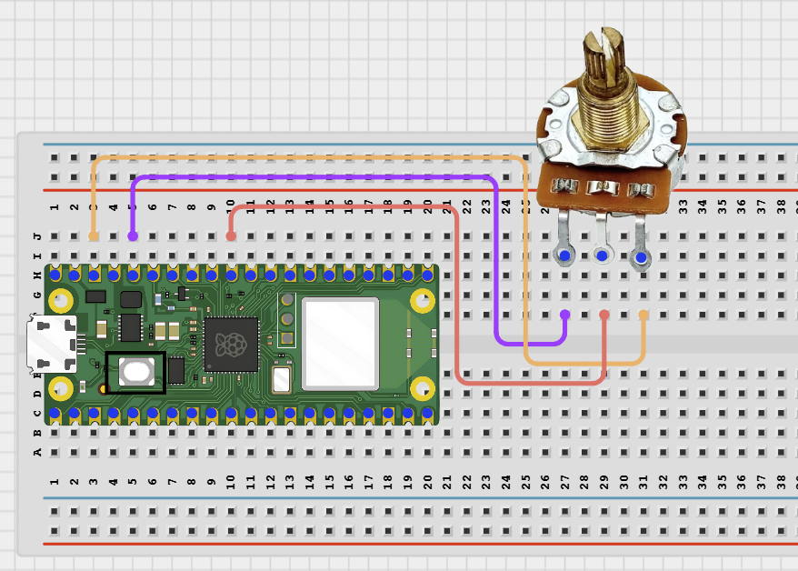

# Project 2.1.5: Data Streaming

**Intermediate Embedded Systems Project Using Raspberry Pi Pico 2 W and MicroPython**

---
## Overview

This project demonstrates how a Pico can stream live sensor data to a phone over BLE at different update speeds.

The same streaming pattern can later be reused for real sensors such as soil moisture, water level, or temperature.

The final system should let the student start and stop streaming, change the interval, and request an instant reading.

## Required Components

|  |  |  |  |
| --- | --- | --- | --- |
| <br>10kΩ potentiometer | <br>Raspberry Pi Pico 2 W | <br>Breadboard and jumper wires | <br>Phone with BLE app |


## Circuit Connections


| Component terminal | Connect to | Pico physical pin | Notes |
|---|---|---|---|
| Potentiometer left pin | 3.3V | Physical pin 36 | Outer pin |
| Potentiometer middle pin | GPIO 26 | GPIO 26 / physical pin 31 | ADC0 input |
| Potentiometer right pin | GND | Physical pin 38 | Outer pin |

---

## Wiring Diagram



```text
Raspberry Pi Pico 2 W
┌─────────────────────┐
│                     │
│  3.3V ──────────────┤──── Potentiometer left pin
│  GPIO 26 ───────────┤──── Potentiometer middle pin (ADC0)
│  GND ───────────────┤──── Potentiometer right pin
│                     │
└─────────────────────┘
```

---

## Step-by-Step Assembly

### Step 1: Place the Raspberry Pi Pico 2W

Place the Raspberry Pi Pico 2W on the breadboard so it sits across the center gap. Keep the USB port facing outward so you can easily connect it to your computer.

### Step 2: Place the Potentiometer

Insert the potentiometer onto the breadboard. Make sure each of the three potentiometer pins sits on a separate breadboard row.

### Step 3: Connect One Outer Pin

Connect one outer potentiometer pin to 3.3V.

### Step 4: Connect the Middle Pin

Connect the potentiometer middle pin to GPIO 26 (ADC0).

### Step 5: Connect the Other Outer Pin

Connect the other outer potentiometer pin to GND.

### Step 6: Check the Knob Movement

Turn the knob slowly and make sure the potentiometer does not pull loose from the breadboard.

---

## Wiring Check

- [x] Pico 2W is placed correctly across the breadboard center gap
- [x] One potentiometer outer pin connects to 3.3V
- [x] Potentiometer middle pin connects to GPIO 26
- [x] Other potentiometer outer pin connects to GND
- [x] No loose jumper wires

> **Intermediate Note**
>
> This project uses wireless UART on the Raspberry Pi Pico 2W. Use a terminal app such as nRF Connect, LightBlue, or another UART terminal to connect to `AIDER_StreamDemo` and send commands. Turn the knob slowly during testing so the streamed values are easy to observe.

---

## Testing Individual Components

Before running the full project, test each part separately. This makes it easier to find wiring, library, or code problems.

### Hardware setup

- Build the potentiometer circuit
- Check that the middle pin is the only wire going to GPIO 26

### Test the input sensor

- Run a short ADC script and rotate the potentiometer through its full range
- Confirm the raw value rises and falls smoothly

### Test the data format

- Upload the final code and watch the raw and percentage messages in the Shell
- Confirm the percentage changes in the same direction as the knob position

### Test communication

- Connect to `AIDER_StreamDemo` from the BLE app
- Send `once`, `status`, `fast`, `slow`, `stream off`, and `stream on` to verify the command interface

### Run the full system

- Turn the knob while the data is streaming
- Compare the feel of fast and slow intervals and decide which is easier to monitor

### Save the project

- Save the working code
- Note which data format would be easiest to graph or log in a later project

---

## Full Project Code

After completing and checking the circuit connections, open Thonny IDE. Copy and paste the code below into a new file, or upload the project file to the Raspberry Pi Pico 2 W, then run it from Thonny.

```python
from machine import ADC
import bluetooth
import time
from ble_uart import BLEUART

DEVICE_NAME = "AIDER_StreamDemo"
sensor = ADC(26)
ble = bluetooth.BLE()
ble.active(True)
uart = BLEUART(ble, name=DEVICE_NAME)

interval_ms = 1000
stream_enabled = True
last_stream_ms = time.ticks_ms()
command_queue = []


def send_line(message):
    print(message)
    uart.write((message + "\n").encode())


def on_rx(data):
    command = data.decode("utf-8").strip().lower()
    if command:
        command_queue.append(command)


def current_reading():
    raw_value = sensor.read_u16()
    percent = int((raw_value * 100) / 65535)
    return raw_value, percent


def send_reading():
    raw_value, percent = current_reading()
    send_line("Raw:{} Percent:{}%".format(raw_value, percent))


uart.on_rx(on_rx)
send_line("Bluetooth data streaming demo ready")

while True:
    now = time.ticks_ms()
    if stream_enabled and time.ticks_diff(now, last_stream_ms) >= interval_ms:
        send_reading()
        last_stream_ms = now

    if command_queue:
        command = command_queue.pop(0)
        if command == "once":
            send_reading()
        elif command == "stream on":
            stream_enabled = True
            send_line("Streaming enabled")
        elif command == "stream off":
            stream_enabled = False
            send_line("Streaming disabled")
        elif command == "fast":
            interval_ms = 500
            send_line("Interval set to 500 ms")
        elif command == "slow":
            interval_ms = 3000
            send_line("Interval set to 3000 ms")
        elif command.startswith("set "):
            interval_ms = int(command.split()[1])
            send_line("Interval set to {} ms".format(interval_ms))
        elif command == "status":
            raw_value, percent = current_reading()
            send_line("Streaming:{} Interval:{}ms Raw:{} Percent:{}%".format(
                stream_enabled, interval_ms, raw_value, percent))
        elif command == "help":
            send_line("Commands: once, stream on, stream off, fast, slow, set <ms>, status, help")
        else:
            send_line("Unknown command. Send help.")

    time.sleep_ms(80)
```

---

## How the Code Works

| Code Section | What It Does | Why It Matters |
|--------------|--------------|----------------|
| interval_ms | Sets how often a sample should be sent | Controls the streaming speed |
| current_reading() | Returns both raw data and a percentage | Shows how one sensor can be represented in different ways |
| stream_enabled | Turns the continuous stream on or off | Useful for reducing message noise during testing |
| Interval commands | Switch between fast, slow, or custom update rates | Help students compare how data behaviour changes with timing |

---

## Expected Result

The phone receives repeated raw and percentage readings while streaming is enabled. The student can slow the stream down, speed it up, stop it, or request one reading on demand.

---

## Troubleshooting

| Problem | Possible cause | Solution |
|---------|----------------|----------|
| Readings do not change | The potentiometer middle pin is not on GPIO 26 | Reconnect the middle pin to GPIO 26 and keep the outer pins on 3.3V and GND. |
| Streaming is too noisy | The interval is too fast for manual observation | Use slow or set a larger interval value. |
| Percentage looks stuck | The potentiometer is only turning through a small part of its range or the wiring is wrong | Rotate through the full range and check the outer-pin wiring. |
| Phone cannot find the BLE device | The Pico is not advertising or the BLE helper files are missing | Confirm ble_uart.py and ble_advertising.py are saved on the Pico, restart the board, and scan again from nRF Connect or LightBlue. |
| Commands do not change the system state | The phone is connected to the wrong service or the command text is different from the expected command | Reconnect to the BLE UART service and send the exact command shown in the test section. |

---
