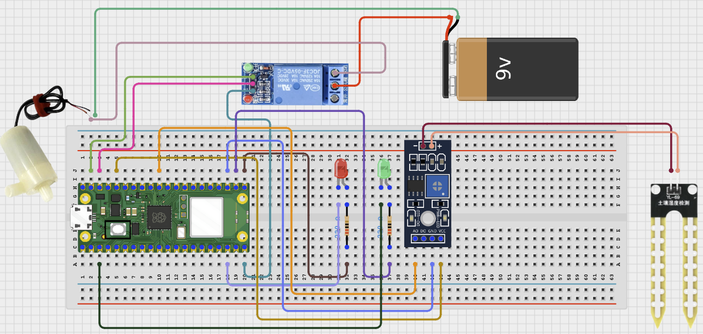

# Project 2.2.1: Automated Irregation Timer

**Intermediate Embedded Systems Project Using Raspberry Pi Pico 2 W and MicroPython**

---
## Overview

This project adds interval-based timing to an irrigation system so the pump can only run after a chosen delay has expired.

Students will combine a soil moisture reading with a repeating timer, two status LEDs, and a relay-controlled pump output.

The final system should wait for the timer interval, confirm that the soil is dry, run the pump for one timed cycle, and then restart the countdown.

---

## Required Components

|  |  |  |  |
| --- | --- | --- | --- |
| <br>Soil moisture sensor | <br>LED's and 220 Ω resistor | <br>Raspberry Pi Pico 2 W | <br>1-channel relay module |
| <br>Small DC water pump | <br>External pump power supply | <br>Breadboard, jumper wires, tubing, water container |


## Circuit Connections


| Component terminal | Connect to | Pico physical pin | Notes |
|---|---|---|---|
| Soil sensor VCC | 3.3V output | Physical pin 36 | Power the sensor from 3.3V |
| Soil sensor GND | GND | Any GND pin | Common ground |
| Soil sensor AOUT | GPIO 26 ADC0 | GPIO 26 / physical pin 31 | ADC input |
| Relay IN | GPIO 15 | GPIO 15 / physical pin 20 | Pump control |
| Relay VCC | Relay module supply | Module dependent | Use a 3.3V-compatible relay module or suitable driver |
| Relay GND | GND | Any GND pin | Common ground when the relay module is not isolated |
| Timer-ready LED anode | GPIO 16 through 220 Ω resistor | GPIO 16 / physical pin 21 | Green LED |
| Pump LED anode | GPIO 17 through 220 Ω resistor | GPIO 17 / physical pin 22 | Red LED |
| Both LED cathodes | GND | Any GND pin | Common return path |
| Pump supply path | Relay COM to NO contacts | Not a Pico GPIO | External pump power only |

---

## Wiring Diagram



```text
Raspberry Pi Pico 2 W
┌──────────────────────────┐
│                          │
│  GPIO 26 ────────────────┤──── Soil sensor AOUT (ADC)
│  3.3V  ─────────────────┤──── Soil sensor VCC
│  GND   ─────────────────┤──── Soil sensor GND
│  GPIO 15 ────────────────┤──── Relay IN control
│  GPIO 16 ────────────────┤──── Timer-ready (green) LED via 220Ω
│  GPIO 17 ────────────────┤──── Pump (red) LED via 220Ω
│  GND   ─────────────────┤──── LED returns
│                          │
└──────────────────────────┘

Relay Module (external power supply)
├── IN (GPIO 15) from Pico
├── VCC (external relay supply)
├── GND (Pico GND + external supply GND)
├── COM (from pump supply positive)
└── NO (to pump positive)

Water pump (external power supply)
├── Positive from relay NO
└── Negative to supply negative
```

---

## Step-by-Step Assembly

### Step 1: Place the Raspberry Pi Pico 2W

Place the Raspberry Pi Pico 2W on the breadboard so it sits across the center gap. Keep the USB port facing outward so you can easily connect it to your computer.

### Step 2: Position the Soil Moisture Sensor

Place the soil moisture probe so the sensing end can enter the soil sample. Identify VCC, GND, and AOUT / AO / Signal on the sensor module.

### Step 3: Connect Soil Sensor Power

Connect the soil sensor VCC pin to 3.3V. Connect the soil sensor GND pin to GND.

### Step 4: Connect Soil Sensor AOUT

Connect the soil sensor AOUT, AO, or Signal pin to GPIO 26 (ADC0).

### Step 5: Place the Relay Module

Place the relay module where its IN, VCC, GND, COM, and NO terminals are easy to reach.

### Step 6: Connect Relay IN

Connect relay IN to GPIO 15.

### Step 7: Power the Relay Module

Connect relay VCC to the correct relay module supply. Connect relay GND to Pico GND and to the external pump supply GND where shared grounding is required.

### Step 8: Place the Timer-Ready LED

Place the green timer-ready LED on the breadboard. Connect its long leg through a 220Ω resistor to GPIO 16. Connect its short leg to GND.

### Step 9: Place the Pump LED

Place the red pump LED on the breadboard. Connect its long leg through a 220Ω resistor to GPIO 17. Connect its short leg to GND.

### Step 10: Wire the Pump Through the Relay

Connect the external pump supply positive wire to relay COM. Connect relay NO to the pump positive lead. Connect the pump negative lead to the external pump supply negative wire.

---

## Wiring Check

- [x] Pico 2W is placed correctly across the breadboard center gap
- [x] Soil sensor VCC connects to 3.3V
- [x] Soil sensor GND connects to GND
- [x] Soil sensor AOUT / AO / Signal connects to GPIO 26
- [x] Relay IN connects to GPIO 15
- [x] Relay module uses the correct external supply and shared ground where required
- [x] Green LED long leg connects through a 220Ω resistor to GPIO 16
- [x] Red LED long leg connects through a 220Ω resistor to GPIO 17
- [x] Both LED short legs connect to GND
- [x] Pump positive path uses relay COM and NO
- [x] Pump negative connects to external pump supply negative
- [x] No loose jumper wires

> **Intermediate Note**
>
> This timer uses elapsed time after startup, not the real time of day. Use the classroom test interval first, then return to a realistic interval after the wiring is proven.

> **Safety Note**
>
> Use an external pump supply and keep the Pico, breadboard, USB cable, and jumper wires away from water. Never let the pump run dry.

---

## Testing Individual Components

Before running the full project, test each part separately. This makes it easier to find wiring, library, or code problems.

### Hardware setup

- Build the soil sensor, LEDs, and relay stage before connecting the pump
- Keep the two LEDs visible so the timing behaviour is easy to observe

### Test the input sensor

- Run a short ADC test and record dry and wet calibration values
- Confirm that the calculated moisture percentage reacts to real soil changes

### Test the output device

- Verify that the timer-ready LED turns on only after the interval has expired
- Verify that the pump LED matches the relay state before connecting the real pump

### Run the full system

- Use TEST_MODE first so the interval is short enough for classroom testing
- Check that the system waits for the timer, then waters only if the soil is still below the dry threshold
- After a watering cycle, confirm that the timer restarts and the system does not immediately retrigger

### Save the project

- Save the working code and note whether TEST_MODE is enabled or disabled
- Record the interval and threshold values you selected for your final test

---

## Full Project Code

```python
from machine import ADC, Pin
import time

TEST_MODE = True
WATER_INTERVAL_S = 30 if TEST_MODE else 6 * 3600
PUMP_RUN_S = 5
RELAY_ON = 0
RELAY_OFF = 1

soil = ADC(26)
relay = Pin(15, Pin.OUT)
timer_led = Pin(16, Pin.OUT)
pump_led = Pin(17, Pin.OUT)

dry_reading = 52000
wet_reading = 22000
dry_threshold = 35
recovery_threshold = 45
last_watered = time.time() - WATER_INTERVAL_S
ready_to_water = True

relay.value(RELAY_OFF)
timer_led.value(0)
pump_led.value(0)

def clamp(value, low, high):
	if value < low:
		return low
	if value > high:
		return high
	return value

def moisture_percent(raw_value):
	span = dry_reading - wet_reading
	if span == 0:
		return 0
	percent = int(((dry_reading - raw_value) * 100) / span)
	return clamp(percent, 0, 100)

def run_pump():
	relay.value(RELAY_ON)
	pump_led.value(1)
	print("Pump ON: timer condition met")
	time.sleep(PUMP_RUN_S)
	relay.value(RELAY_OFF)
	pump_led.value(0)
	print("Pump OFF: timed cycle complete")

print("Automated irrigation timer ready")

while True:
	now = time.time()
	moisture = moisture_percent(soil.read_u16())
	seconds_since = int(now - last_watered)
	timer_ready = seconds_since >= WATER_INTERVAL_S
	timer_led.value(1 if timer_ready else 0)
	if moisture >= recovery_threshold:
		ready_to_water = True
	if timer_ready and ready_to_water and moisture <= dry_threshold:
		run_pump()
		last_watered = time.time()
		ready_to_water = False
	else:
		remaining = max(0, WATER_INTERVAL_S - seconds_since)
		print("Moisture:{}% TimerReady:{} Remaining:{}s".format(
			moisture,
			timer_ready,
			remaining,
		))
	time.sleep(5)
```

---

## How the Code Works

| Code Section | What It Does | Why It Matters |
|--------------|--------------|----------------|
| TEST_MODE and WATER_INTERVAL_S | Control whether the timer is in classroom test mode or real-use mode | Students can validate the logic quickly, then switch to realistic timings |
| timer_ready | Tracks whether the interval has expired | The pump should never run before this condition becomes true |
| ready_to_water | Requires the soil to recover before another timed cycle | This adds hysteresis and prevents repeated watering on one dry reading |
| timer_led and pump_led | Show the system state visually | Indicators make debugging easier without reading every serial message |

---

## Expected Result

The green LED should turn on when the interval has expired. If the soil is also below the dry threshold, the pump should run for one timed burst and the red LED should light during the cycle. If the soil is still moist, the timer should wait without watering.

---

## Troubleshooting

| Problem | Possible cause | Solution |
|---------|----------------|----------|
| The timer seems stuck | TEST_MODE is off and the interval is several hours long | Enable TEST_MODE or temporarily reduce WATER_INTERVAL_S for classroom testing. |
| The pump runs every time the timer is ready | The soil never re-arms above the recovery threshold | Check the calibration values and confirm that the soil can reach the recovery percentage. |
| The LEDs do not show the expected state | LED polarity or resistor wiring is wrong | Recheck the LED anode/cathode direction and the GPIO pin numbers. |
| The pump starts immediately at boot | The relay logic is reversed or the soil is already dry and the timer is allowed | Confirm RELAY_ON / RELAY_OFF and inspect the live moisture reading. |

---

