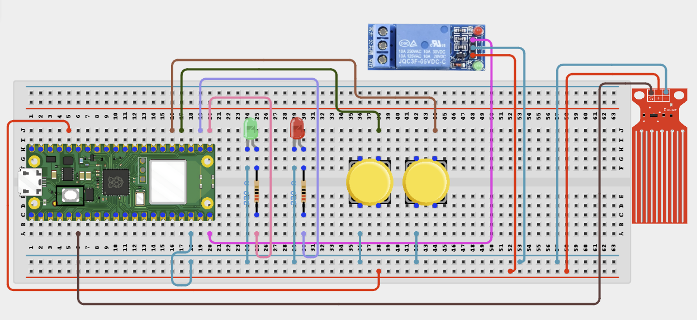

# Project 2.2.6: Automated Water Pump Protection

**Intermediate Embedded Systems Project Using Raspberry Pi Pico 2 W and MicroPython**

---
## Overview

This project protects a pump from dry running by watching a water-level safety input and latching a protection state if the water source becomes unsafe.

Students will build a water-level safety input, a relay-controlled pump path, status LEDs, a start button, and a protection reset button.

The final system should allow the pump to start only when water is available, stop it immediately if the water source drops too low, and require a manual reset after a protection event.

### Project Story

The real-world use case is a reservoir or source tank where a pump must stop immediately if the intake water is too low. A latched protection state is safer than automatic restart after a low-water condition.

---

## Learning Objectives

- Design a latched safety system rather than a simple threshold trigger
- Use manual start and reset buttons for controlled testing
- Protect a relay-driven pump from dry-run conditions
- Understand why a fault latch is safer than automatic restart
- Test safety logic carefully before connecting a real pump

---

## Required Components

|  |  |  |  |
| --- | --- | --- | --- |
| <br>Water level sensor or float switch | <br>External power supply | <br>Raspberry Pi Pico 2 W | <br>Push button |
| <br>1-channel relay module | <br>Small DC pump or safe test load | <br>Green LED and 220 Ω resistor | <br>Red LED and 220 Ω resistor |
| <br>Breadboard and jumper wires |   |   |   |


## Before You Begin

Before starting this project, make sure you have completed the foundational sections at the beginning of the manual:

- Software Installation and Setup
- Safety Guidelines
- Breadboard Basics
- Reading Circuit Diagrams

### Project-Specific Setup Notes

- No external library is required. This project uses only built-in MicroPython modules.
- The code in this manual treats GPIO 4 as `LOW` when water is available and `HIGH` when the water level is unsafe.
- If your switch works in the opposite direction, change `WATER_AVAILABLE_VALUE` in the code from `0` to `1`.

### Project-Specific Safety Note

Do not power motors, pumps, fans, valves, or relay coils directly from Pico GPIO pins. Use an external power supply for pumps, motors, relay modules, and fans when required.

- If the relay module is controlled by the Pico, connect Pico GND to the external supply GND unless the relay module is fully opto-isolated and wired correctly.
- Check whether your relay module is active-low or active-high before testing the final load.
- Keep electronics away from water and dry your hands before touching the circuit.
- Do not let exposed jumper connections touch water.
- Do not let a pump run dry.
- Never test a real pump without a verified water source and secure tubing.

---

## Circuit Connections


|---------------|-------------|---------------------------------|-------|
| Water level sensor output | GPIO 4 | GPIO 4 / physical pin 6 | Uses internal pull-up in code |
| Start button | GPIO 18 to GND | GPIO 18 / physical pin 24 | Active-low start request |
| Reset button | GPIO 19 to GND | GPIO 19 / physical pin 25 | Active-low protection reset |
| Relay IN | GPIO 15 | GPIO 15 / physical pin 20 | Pump control |
| Green LED anode | GPIO 16 through 220 Ω resistor | GPIO 16 / physical pin 21 | Ready indicator |
| Green LED cathode | GND | Any GND pin | LED return |
| Red LED anode | GPIO 17 through 220 Ω resistor | GPIO 17 / physical pin 22 | Protection indicator |
| Red LED cathode | GND | Any GND pin | LED return |

---

## Wiring Diagram



```text
Raspberry Pi Pico 2 W
┌─────────────────────────────────┐
│                                 │
│  GPIO 4  ───────────────────────┤──── Water level sensor output
│  GPIO 18 ───────────────────────┤──── Start button ─── GND
│  GPIO 19 ───────────────────────┤──── Reset button ─── GND
│  GPIO 15 ───────────────────────┤──── Relay IN
│  GPIO 16 ─ 220 Ω ─ Green LED ───┤──── Ready indicator
│  GPIO 17 ─ 220 Ω ─ Red LED ─────┤──── Protection indicator
│  GND     ───────────────────────┤──── Common ground
│                                 │
└─────────────────────────────────┘

Pump power path:
External supply positive -> Relay COM
Relay NO -> Pump positive
Pump negative -> External supply negative

Relay module power:
Relay VCC -> Module supply as labelled
Relay GND -> Pico GND and external supply GND where shared grounding is required
```

---

## Step-by-Step Assembly

### Step 1: Place the Raspberry Pi Pico 2W

Place the Raspberry Pi Pico 2W on the breadboard so it sits across the center gap.

Keep the USB port facing outward so you can easily connect it to your computer.

### Step 2: Place the Water Level Sensor

Position the water level sensor where it can indicate whether water is available.

Identify the switch output and ground reference before wiring.

### Step 3: Connect the Water Level Sensor

Connect the water level sensor output to GPIO 4.

Connect the switch ground reference as required by your water level sensor or sensor type.

The code uses an internal pull-up on GPIO 4.

### Step 4: Place the Start Button

Place the start push button across the breadboard center gap.

Connect one side of the start button to GPIO 18.

Connect the opposite side of the start button to GND.

### Step 5: Place the Reset Button

Place the reset push button across the breadboard center gap.

Connect one side of the reset button to GPIO 19.

Connect the opposite side of the reset button to GND.

### Step 6: Place and Wire the Relay Module

Identify relay VCC, GND, IN, COM, NO, and NC before wiring.

Connect relay IN to GPIO 15.

Power the relay module from the supply required by its label.

Connect relay GND to Pico GND and to the external pump supply GND where shared grounding is required.

### Step 7: Place and Connect the Indicator LEDs

Place the green LED and red LED on the breadboard.

Connect the green LED long leg through a 220 Ω resistor to GPIO 16.

Connect the red LED long leg through a 220 Ω resistor to GPIO 17.

Connect both LED short legs to GND.

### Step 8: Wire the Pump Through the Relay

Connect the external pump supply positive wire to relay COM.

Connect relay NO to the pump positive lead.

Connect the pump negative lead to the external pump supply negative wire.

---

## Wiring Check

- [x] Pico 2W is placed correctly across the breadboard center gap
- [x] Water level sensor output connects to GPIO 4
- [x] Start button connects between GPIO 18 and GND
- [x] Reset button connects between GPIO 19 and GND
- [x] Relay IN connects to GPIO 15
- [x] Green LED long leg connects through a 220 Ω resistor to GPIO 16
- [x] Red LED long leg connects through a 220 Ω resistor to GPIO 17
- [x] Both LED short legs connect to GND
- [x] Pump positive path uses relay COM and NO
- [x] Pump negative connects to external pump supply negative
- [x] No loose jumper wires

> **Intermediate Note**
>
> Test the water level sensor states before connecting the pump. The protection latch should require the reset button after a dry-run risk is detected.

> **Safety Note**
>
> Do not power the pump from the Pico. Use an external pump supply, keep electronics away from water, and never test a pump without confirming that water is available.

---

## Testing Individual Components

Before running the full project, test each part separately. This makes it easier to find wiring, library, or code problems.

### Hardware setup

- Build the water level sensor and button inputs before connecting the real pump.
- Label the start and reset buttons clearly to avoid confusion during safety tests.

### Test the input sensor

- Check the water level sensor state with water present and water removed.
- Confirm that GPIO 4 changes state as expected.
- Check that both buttons change state when pressed.

### Test the output device

- Verify relay switching and LED behaviour before using the real pump.
- Confirm that the red LED lights only when protection has latched.
- Confirm that the green LED lights only when water is available and protection is clear.

### Run the full system

- Start the pump while the water level sensor indicates water is available.
- Then simulate low water and confirm that the pump stops immediately and stays blocked until reset.
- Press the reset button only after water is available again.

### Save the project

- Save the final code.
- Record the water-level sensor orientation and active state used in your build.
- Write down whether the latch behaviour worked as expected during the dry-run test.

### Additional Testing and Calibration Checks

- Test the relay with a safe load before using a real pump.
- Verify the water-level sensor logic direction before trusting the protection latch.
- Do not automatically reset protection after a fault; manual reset is the point of the safety system.
- If the pump never starts, check both the water-level sensor state and the relay polarity.

### Quick testing checklist

- [ ] Water level sensor changes state correctly
- [ ] Start and reset buttons work
- [ ] Pump starts only when water is available
- [ ] Dry-run condition stops the pump immediately
- [ ] Protection latch blocks restart until reset

---

## Full Project Code

```python
from machine import Pin
import time

# GPIO 4 is treated as LOW when water is available.
# Change this to 1 if your sensor is HIGH when water is available.
WATER_AVAILABLE_VALUE = 0
RELAY_ON = 0
RELAY_OFF = 1

water_sensor = Pin(4, Pin.IN, Pin.PULL_UP)
start_button = Pin(18, Pin.IN, Pin.PULL_UP)
reset_button = Pin(19, Pin.IN, Pin.PULL_UP)
relay = Pin(15, Pin.OUT)
green_led = Pin(16, Pin.OUT)
red_led = Pin(17, Pin.OUT)

pump_running = False
protection_latched = False

relay.value(RELAY_OFF)
green_led.off()
red_led.off()


def is_pressed(button):
    return button.value() == 0


def wait_for_release(button):
    while is_pressed(button):
        time.sleep_ms(50)


def water_available():
    return water_sensor.value() == WATER_AVAILABLE_VALUE


def stop_pump(reason):
    global pump_running, protection_latched
    relay.value(RELAY_OFF)
    pump_running = False
    if reason == "dry run risk":
        protection_latched = True
    print("Pump OFF:", reason)


def start_pump():
    global pump_running
    if protection_latched:
        print("Protection active: restore water, then press RESET")
        return
    if not water_available():
        stop_pump("dry run risk")
        return
    relay.value(RELAY_ON)
    pump_running = True
    print("Pump ON: water level is safe")


def reset_protection():
    global protection_latched
    if water_available():
        protection_latched = False
        print("Protection reset")
    else:
        print("Reset blocked: water not available")


def update_lights():
    green_led.value(1 if water_available() and not protection_latched else 0)
    red_led.value(1 if protection_latched else 0)


print("Automated water pump protection ready")

while True:
    if is_pressed(reset_button):
        reset_protection()
        wait_for_release(reset_button)
    elif is_pressed(start_button):
        if pump_running:
            stop_pump("manual stop")
        else:
            start_pump()
        wait_for_release(start_button)

    if pump_running and not water_available():
        stop_pump("dry run risk")

    update_lights()
    print("Water:{} Pump:{} Protection:{}".format(
        "AVAILABLE" if water_available() else "LOW",
        pump_running,
        protection_latched
    ))
    time.sleep_ms(200)
```

---

## How the Code Works

| Code Section | What It Does | Why It Matters |
|--------------|--------------|----------------|
| `WATER_AVAILABLE_VALUE` | Defines which GPIO 4 state means water is safe | Makes the sensor logic explicit and easy to correct for your switch |
| `water_available()` | Converts the water-level sensor state into a clear yes/no condition | Safety logic is easier to understand when the switch meaning is explicit |
| `protection_latched` | Stores whether a dry-run fault has occurred | The pump should not restart automatically after a fault |
| `start_button` | Starts the pump only when water is available and protection is clear | Gives the user controlled testing |
| `reset_button` | Clears a latched fault only when water is available | Prevents unsafe automatic or premature restart |
| `stop_pump()` | Switches the relay off and records a dry-run fault when needed | Protects the pump from running without water |
| Ready and protection LEDs | Show whether the system is safe to run or latched off | Visual status helps students troubleshoot quickly |

---

## Expected Result

When water is available and protection is clear, the green LED should show READY. The pump should start only when the start button is pressed.

If the water level sensor reports low water while the pump is running, the relay should switch off, the red LED should turn on, and the system should stay latched until the reset button is pressed.

The reset button should only clear the protection state when water is available again.

---

## Troubleshooting

| Problem | Possible cause | Solution |
|---------|----------------|----------|
| The pump never starts | Protection is latched, the water level sensor shows low water, or the relay logic is reversed | Check the red LED, inspect the water level sensor state, reset the latch if safe, and confirm relay active-low or active-high behaviour. |
| The pump restarts by itself | The latch logic was removed or bypassed | Restore the `protection_latched` check and confirm reset is manual only. |
| The green LED never lights | The controller never sees a safe state | Check the water level sensor wiring and confirm the `WATER_AVAILABLE_VALUE` setting matches the hardware. |
| The red LED never turns on after a dry run | The water level sensor is not reaching the fault state | Test the switch by manually changing its state while the pump is running. |
| The relay clicks but the pump does not run | The pump power path is incomplete or the external supply is off | Check relay COM/NO wiring, pump supply voltage, and pump supply current rating. |

---

## Challenge Extensions

- Add a buzzer for dry-run faults
- Add a low-water refill controller so the source tank can recover automatically
- Log how many protection events happened during a week-long test
- Add a second water sensor to confirm water availability before allowing reset
- Add a maintenance mode that disables the pump output while the system remains powered

---

## Reflection Questions

1. Why is a latched safety fault safer than automatic restart?
2. Why should a protection system be tested with safe loads before using a real pump?
3. What could still damage a pump even if dry-run protection works?
4. How would you change this design for a larger agricultural pump?
5. Why is it useful to block reset until water is available again?

---

## Save Your Work

Save the file to your computer as:

```
project_145_automated_water_pump_protection.py
```

If you want the program to run automatically when the Pico powers on, save the final version to the Pico as:

```
main.py
```

---

## Next Project

Project 146: Smart Farm Weather Station
