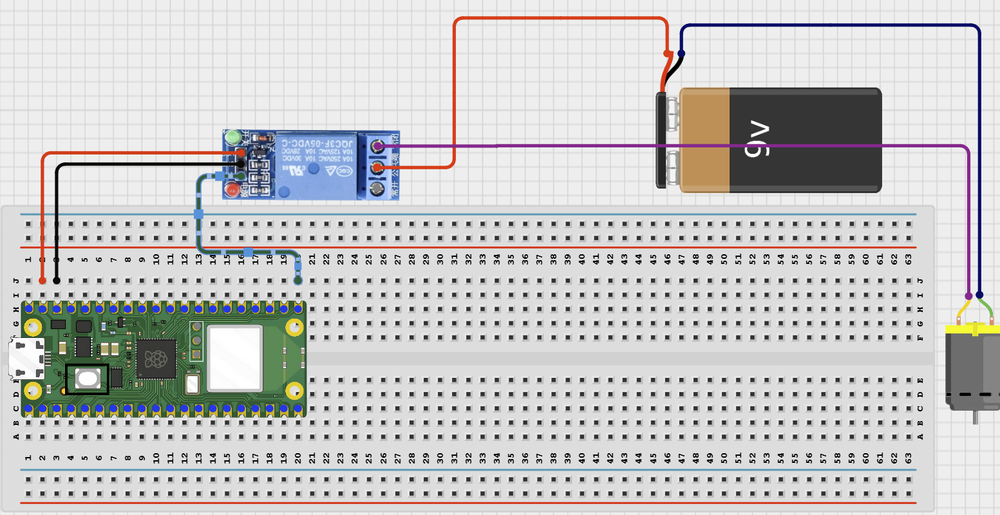

# Project 2.3.5: Bluetooth Remote Controlled Fan

**Intermediate Embedded Systems Project Using Raspberry Pi Pico 2 W and MicroPython**

---
## Overview

This project builds a BLE-controlled fan system using a relay or driver stage and a low-voltage external fan.
It demonstrates remote actuator control, timed runs, and simple status reporting.
The final system should let the phone turn the fan on, turn it off, or run it for a chosen time period.

## Required Components

|  |  |  |  |
| --- | --- | --- | --- |
| <br>1-channel relay module or suitable driver stage | <br>Phone with BLUETOOTH app | <br>Raspberry Pi Pico 2 W | <br>Low-voltage DC fan |
| <br>External fan power supply | <br>Breadboard and jumper wires |   |   |


## Circuit Connections


| Component terminal | Connect to | Pico physical pin | Notes |
|---|---|---|---|
| Relay IN | GPIO 16 | GPIO 16 / physical pin 21 | Control signal |
| Relay GND | Pico GND and external supply GND | Physical pin 38 | Shared ground unless the relay is fully isolated |
| Relay VCC | External module supply if required | Not a Pico GPIO | Follow the module requirement |
| External fan supply positive | Relay COM to NO path | Not a Pico GPIO | Fan positive should be switched by the relay |
| Fan negative | External fan supply negative | Not a Pico GPIO | Do not route fan current through the Pico |

---

## Wiring Diagram



```text
Raspberry Pi Pico 2 W
┌─────────────────────┐
│                     │
│  GPIO 16 ───────────┤──── Relay IN
│                     │
│  3.3V  ─────────────┤──── Pico power
│  GND   ─────────────┤──── Shared ground
│                     │
└─────────────────────┘

External fan supply
┌─────────────────────┐
│                     │
│  5V  ───────────────┤──── Relay VCC (if required)
│  GND ───────────────┤──── Relay GND and Pico GND
│                     │
└─────────────────────┘

Relay contacts
COM ─── NO ─── Fan +
Fan - ─── External supply GND
```

---

## Step-by-Step Assembly

### Step 1: Place the Raspberry Pi Pico 2W

Place the Raspberry Pi Pico 2W on the breadboard so it sits across the center gap. Keep the USB port facing outward so you can easily connect it to your computer.

### Step 2: Place the Relay Module

Place the relay module beside the breadboard where the control pins and screw terminals are easy to reach. Identify VCC, GND, IN, COM, NO, and NC before wiring.

### Step 3: Connect Relay IN

Connect relay IN to GPIO 16.

### Step 4: Connect Relay GND

Connect relay GND to Pico GND and to the external fan supply GND unless the relay module is fully isolated.

### Step 5: Connect Relay VCC

Connect relay VCC to the external supply voltage required by your relay module.

### Step 6: Wire the Fan Positive Path

Connect the external fan supply positive wire to relay COM. Connect relay NO to the fan positive wire.

### Step 7: Connect the Fan Negative Wire
Connect the fan negative wire directly to the external fan supply negative wire.

### Step 8: Check the Fan

Make sure the fan blades can spin freely and no wire can touch the blades. Test the relay before connecting the fan if your relay module has an indicator LED or a click you can observe.

---

## Wiring Check

- [x] Pico 2W is placed correctly across the breadboard center gap
- [x] Relay IN connects to GPIO 16
- [x] Relay VCC connects to the correct external relay supply
- [x] Relay GND, Pico GND, and external fan supply GND share a common reference where required
- [x] Fan positive path uses relay COM and NO
- [x] Fan negative connects to external fan supply negative
- [x] Fan can spin freely
- [x] No fan current is routed through the Pico
- [x] No loose jumper wires

> **Intermediate Note**
>
> This project uses BLE on the Raspberry Pi Pico 2W. Use a BLE app such as nRF Connect, LightBlue, or a BLE UART terminal to connect to `AIDER_FanControl` and send commands. The code treats the relay module as active-low, so the relay may turn on when its input is driven LOW.

> **Safety Note**
>
> Do not power the fan from the Pico. Use an external supply that matches the fan, keep fingers and wires away from moving blades, and use low-voltage DC only.

---

## Testing Individual Components

Before running the full project, test each part separately. This makes it easier to find wiring, library, or code problems.

### Hardware setup

- Build the control-side relay wiring first
- Keep the fan load wiring neat and away from the blades

### Test the output device

- Run a short relay click test or use a safe LED load first
- Only connect the real fan after the relay switching logic is confirmed

### Test timed control

- Upload the final code and use Shell prints to confirm the fan state changes
- Check that the timed run actually stops after the requested delay

### Test communication

- Connect to `AIDER_FanControl` from the BLE app
- Send `on`, `off`, `run 10`, and `status` to verify the command set

### Run the full system

- Run the fan manually for a short test
- Try a timed run and confirm the remaining time logic works
- Turn the fan off and make sure it stops immediately

### Save the project

- Save the working code and note the best run durations for your fan setup
- Power down before moving the fan or changing the load wiring

---

## Full Project Code

After completing and checking the circuit connections, open Thonny IDE. Copy and paste the code below into a new file, or upload the project file to the Raspberry Pi Pico 2 W, then run it from Thonny.

```python
from machine import Pin
import bluetooth
import time
from ble_uart import BLEUART

DEVICE_NAME = "AIDER_FanControl"
RELAY_ON = 0
RELAY_OFF = 1

relay = Pin(16, Pin.OUT)
ble = bluetooth.BLE()
ble.active(True)
uart = BLEUART(ble, name=DEVICE_NAME)

timed_run = False
run_deadline = 0
command_queue = []

def send_line(message):
	print(message)
	uart.write((message + "\n").encode())

def on_rx(data):
	command = data.decode("utf-8").strip().lower()
	if command:
		command_queue.append(command)

def fan_on():
	relay.value(RELAY_ON)

def fan_off():
	relay.value(RELAY_OFF)

def fan_state():
	return "ON" if relay.value() == RELAY_ON else "OFF"

uart.on_rx(on_rx)
fan_off()
send_line("Bluetooth fan controller ready")

while True:
	now = time.ticks_ms()
	if timed_run and time.ticks_diff(now, run_deadline) >= 0:
		timed_run = False
		fan_off()
		send_line("Timed run complete. Fan OFF")

	if command_queue:
		command = command_queue.pop(0)
		if command == "on":
			timed_run = False
			fan_on()
			send_line("Fan ON")
		elif command == "off":
			timed_run = False
			fan_off()
			send_line("Fan OFF")
		elif command.startswith("run "):
			seconds = int(command.split()[1])
			fan_on()
			timed_run = True
			run_deadline = time.ticks_add(now, seconds * 1000)
			send_line("Fan ON for {} seconds".format(seconds))
		elif command == "status":
			remaining = 0
			if timed_run:
				remaining = max(0, time.ticks_diff(run_deadline, now) // 1000)
			send_line("Fan:{} TimedRun:{} Remaining:{}s".format(fan_state(), timed_run, remaining))
		elif command == "help":
			send_line("Commands: on, off, run <seconds>, status, help")
		else:
			send_line("Unknown command. Send help.")

	time.sleep_ms(100)
```

---

## How the Code Works

| Code Section | What It Does | Why It Matters |
|--------------|--------------|----------------|
| Active-low relay logic | Matches the code to many common relay modules | A fan project often fails if the relay logic assumption is wrong |
| `timed_run` and `run_deadline` | Track whether the fan is in a timed cycle and when it should stop | Prevents the fan from running forever |
| `run <seconds>` command | Lets the user request a temporary airflow period | Adds practical control beyond simple on and off |
| status report | Shows fan state and any remaining time | Makes testing and troubleshooting easier |

---

## Expected Result

The phone can turn the fan on, turn it off, or run it for a chosen number of seconds. During a timed run, the fan stops automatically when the timer expires.

---

## Troubleshooting

| Problem | Possible cause | Solution |
|---------|----------------|----------|
| Fan does not spin | External power is missing or the load wiring is wrong | Check the external supply, relay contacts, and fan polarity. |
| Fan state is reversed | The relay logic constants do not match the module | Test the relay separately and update `RELAY_ON` / `RELAY_OFF` if needed. |
| Timed run never ends | The run command was not parsed correctly or the timer logic is wrong | Send `status` to inspect the remaining time and recheck the run command format. |
| Phone cannot find the BLE device | The Pico is not advertising or the BLE helper files are missing | Confirm `ble_uart.py` and `ble_advertising.py` are saved on the Pico, restart the board, and scan again from nRF Connect or LightBlue. |
| Commands do not change the system state | The phone is connected to the wrong service or the command text is different from the expected command | Reconnect to the BLE UART service and send the exact command shown in the test section. |

---
