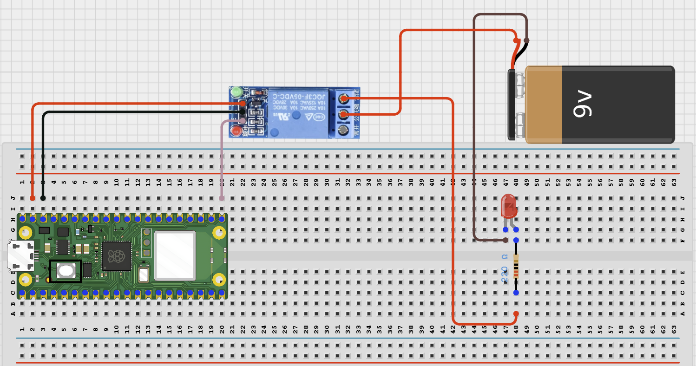

# Project 2.3.8: Bluetooth Smart Switch Panel

**Manual Section:**

---
## Overview

This project creates a single-channel BLE switch panel that lets a phone control one relay output.
It demonstrates multi-output command parsing, shared system power rules, and safe low-voltage relay wiring.
The final system should let the student connect from a BLE app, switch the relay independently, and request a clear status report.

**Project Story**

A real-world version could be used to switch irrigation valves, greenhouse lights, or one low-voltage load from one controller.

---

## Required Components

|  |  |  |  |
| --- | --- | --- | --- |
| <br>Raspberry Pi Pico 2 W | <br>1-channel relay module | <br>Low-voltage LED test load | <br>Regulated 5V power supply |
| <br>Breadboard or terminal block area | <br>Jumper wires |  |  |

---

## Circuit Connections

| Component terminal | Connect to | Pico physical pin | Notes |
|---|---|---|---|
| Relay VCC | Regulated supply specified on the relay module label | Not a Pico GPIO | Use a 3.3 V-compatible relay input or a suitable driver. |
| Relay GND | Relay-supply negative and Pico GND | Any Pico GND pin | A common ground is required unless the module is fully isolated. |
| Relay IN | GPIO 16 | GPIO 16 / physical pin 21 | Single relay-channel control. |
| Load-supply positive | Relay COM | Not a Pico GPIO | Use a safe low-voltage load only. |
| Relay NO | Load positive | Not a Pico GPIO | The load remains off while the relay is inactive. |
| Load negative | Load-supply negative | Not a Pico GPIO | Keep load power separate from Pico power. |

---

## Wiring Diagram



---

## Step-by-Step Assembly

**Step 1: Place the Raspberry Pi Pico 2W**

Place the Raspberry Pi Pico 2W on the breadboard so it sits across the center gap.
Keep the USB port facing outward so you can easily connect it to your computer.

**Step 2: Place the Relay Module**

Place the 1-channel relay module beside the breadboard where the control pins are easy to reach.
Identify VCC, GND, IN, IN, COM, NO, and NC before wiring.

**Step 3: Connect Relay VCC**

Connect relay module VCC to the external supply voltage required by the relay module.
Do not power relay coils or external loads from a Pico GPIO pin.

**Step 4: Connect Relay GND**

Connect relay module GND to the external supply GND.
Connect the same GND line to Pico GND unless the relay module is fully opto-isolated and wired for isolation.

**Step 5: Connect IN to GPIO 16**

Connect relay input IN to GPIO 16.

**Step 6: Connect IN to GPIO 17**

Connect relay input IN to GPIO 17.

**Step 7: Wire Load Through Relay**

Connect the external load supply positive wire to Relay COM.
Connect Relay NO to the positive side of Load.
Connect the negative side of Load back to the external supply negative wire.


**Step 8: Check the Load Paths**

Confirm that no load current path passes through the Raspberry Pi Pico 2W.
Use safe low-voltage DC loads only for this student project.

---

**Wiring Check**

- Pico 2W is placed correctly across the breadboard center gap
- Relay VCC connects to the correct external relay supply
- Relay GND connects to external supply GND and Pico GND where required
- Relay IN1 connects to GPIO 16
- Relay IN2 connects to GPIO 17
- Load 1 positive path uses Relay 1 COM and NO
- Load 2 positive path uses Relay 2 COM and NO
- No load current is routed through a Pico GPIO pin
- No loose jumper wires

**Intermediate Note**

This project uses BLE on the Raspberry Pi Pico 2W. Use a BLE app such as nRF Connect, LightBlue, or a BLE UART terminal to connect to `AIDER_SwitchPanel` and send commands. The code treats the relay module as active-low, so a relay may turn on when its input is driven LOW.

**Safety Note**

Use low-voltage DC loads only. Do not wire mains AC in this student project. Use a relay module that can be triggered by a 3.3V GPIO signal, or add a proper driver circuit.

---

## Testing Individual Components

Before running the full project, test each part separately. This makes it easier to find wiring, library, or code problems.

**Hardware setup**

- Build the relay control side first
- Keep the Pico control wires separate from the load wires so the circuit is easier to debug

**Test the output channels**

- Upload a short relay click test and confirm both channels respond
- If your module is active-low, verify that logic 0 turns a relay on and logic 1 turns it off

**Test the low-voltage loads**

- Use safe LED or lamp loads first
- Switch one relay at a time and confirm the correct load changes state

**Test communication**

- Connect to `AIDER_SwitchPanel` from the BLE app
- Send `status`, `on`, `off`, and `status` while watching the relay channels

**Run the full system**

- Operate the relay channel from the phone
- Confirm that changing Relay does not affect Relay and vice versa
- Use `all off` at the end of the test

**Save the project**

- Save the tested program on the computer
- Label the load wiring if you plan to reuse the panel in the next project

**Additional Testing and Calibration Checks**

- Calibration and tuning notes
- Check whether your relay module is active-low or active-high before trusting the final code
- If the relay behaviour is inverted, test the module with a short script and update `RELAY_ON` and `RELAY_OFF` accordingly
- Label each connected load so you can verify that the correct relay channel switches the correct output

**Quick testing checklist**

- ☐ Relay responds to `on` and `off`
- ☐ Relay responds to `on` and `off`
- ☐ Both loads stay independent
- ☐ `status` reports the correct state
- ☐ `all off` turns both channels off safely

---

## Full Project Code

After completing and checking the circuit connections, open Thonny IDE. Copy and paste the code below into a new file, or upload the project file to the Raspberry Pi Pico 2 W, then run it from Thonny.

```python
from machine import Pin
import bluetooth
import time
from ble_uart import BLEUART

DEVICE_NAME = "AIDER_SwitchPanel"
RELAY_ON = 0
RELAY_OFF = 1

relay = Pin(16, Pin.OUT)
ble = bluetooth.BLE()
ble.active(True)
uart = BLEUART(ble, name=DEVICE_NAME)
command_queue = []

def send_line(message):
    print(message)
    uart.write((message + "\n").encode())

def on_rx(data):
    command = data.decode("utf-8").strip().lower()
    if command:
        command_queue.append(command)

def set_relay(turn_on):
    relay.value(RELAY_ON if turn_on else RELAY_OFF)

def relay_text():
    return "ON" if relay.value() == RELAY_ON else "OFF"

uart.on_rx(on_rx)
set_relay(False)
send_line("Bluetooth single-channel switch ready")

while True:
    if command_queue:
        command = command_queue.pop(0)
        if command in ("on", "relay on", "load on"):
            set_relay(True)
            send_line("Relay ON")
        elif command in ("off", "relay off", "load off", "all off"):
            set_relay(False)
            send_line("Relay OFF")
        elif command == "status":
            send_line("Relay:{}".format(relay_text()))
        elif command == "help":
            send_line("Commands: on, off, status, help")
        else:
            send_line("Unknown command. Send help.")
    time.sleep_ms(100)
```

---

## How the Code Works

| Code element | What it does | Why it matters |
|---|---|---|
| `RELAY_ON` and `RELAY_OFF` | Define the logic levels that turn the relay on and off. | Many classroom relay modules use active-low inputs. |
| `set_relay()` | Sets the relay output in one place. | Keeps relay control consistent and easy to update. |
| Command parser | Matches BLE text commands to relay actions. | Lets one phone control the low-voltage load clearly. |
| `relay_text()` and `status` | Reports the relay's current state. | Confirms the system state after each command. |

---

## Expected Result

A connected BLE app can turn the relay on or off independently. Each relay switches only its own low-voltage test load, and the status command reports both channel states clearly.

---

## Troubleshooting

| Problem | Possible cause | Solution |
|---|---|---|
| Relay clicks but the load stays off | The load side is wired to the wrong relay contact. | Reconnect the load through COM and NO so the circuit closes when the relay turns on. |
| Relay state looks reversed | The module uses the opposite logic level. | Test the relay with a simple script and update `RELAY_ON` and `RELAY_OFF` to match the module. |
| Pico resets when a relay switches | Grounding or power wiring is incorrect. | Keep load power separate, recheck the shared GND wiring, and test with a smaller safe load first. |
| Phone cannot find the BLE device | The Pico is not advertising or the BLE helper files are missing. | Confirm `ble_uart.py` and `ble_advertising.py` are on the Pico, restart it, then scan from a BLE app. |
| Commands do not change the system state | The phone is connected to the wrong service or sends unexpected command text. | Reconnect to the BLE UART service and send the exact commands shown in the test section. |

---
