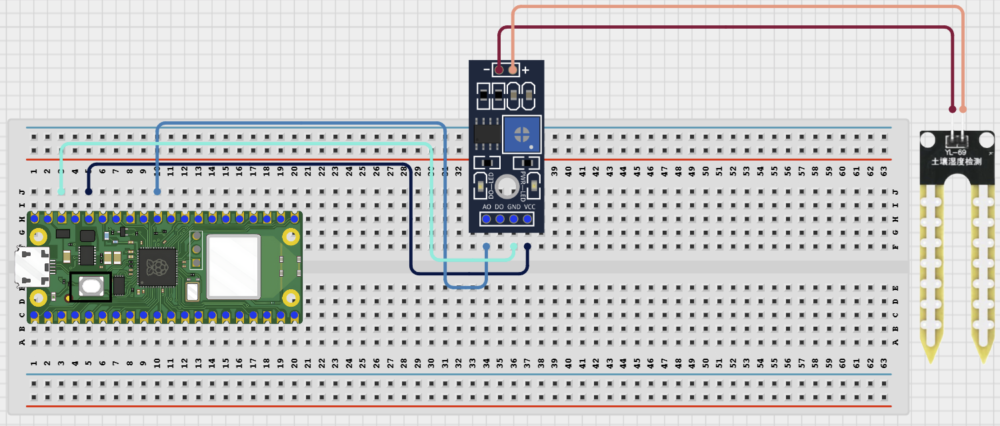

# Project 2.3.9: Bluetooth Soil Sensor Logger

**Manual Section:**

---
## Overview

This project builds a BLE soil-monitoring node that reads an analog moisture sensor and sends the data to a phone.
The real-world use case is a simple plant-monitoring system that helps decide when soil is dry enough to need watering.
The final system should stream moisture readings, let the student capture dry and wet calibration points, and report a moisture percentage plus a simple status label.

**Project Story**

Students learn that raw ADC values are not meaningful until the sensor is calibrated for dry and wet conditions.

---

## Learning Objectives

- Read analog sensor values with the Pico ADC
- Calibrate dry and wet reference points instead of guessing threshold values
- Convert raw data into a moisture percentage for clearer decision making
- Send live readings over BLE to a phone app
- Interpret sensor data as DRY, OK, or WET based on threshold logic

---

## Required Components

- **Raspberry Pi Pico 2 W** — Quantity: 1 — Main controller with BLE support — *Important Note: Use MicroPython*
- **Soil moisture sensor** — Quantity: 1 — Analog moisture input — *Important Note: A capacitive sensor is safer and more durable than a resistive probe*
- **Breadboard** — Quantity: 1 — Build area — *Important Note: Keep sensor wires firm so readings stay stable*
- **Jumper wires** — Quantity: 5 or more — Connections — *Important Note: Avoid loose ADC wiring*
- **Phone with BLE app** — Quantity: 1 — Wireless data viewer — *Important Note: Use nRF Connect, LightBlue, or a BLE UART terminal app*
- **Dry sample and wet sample** — Quantity: 1 each — Used for calibration — *Important Note: Use a dry surface and a moist soil sample for comparison*

---

## Before You Begin

Before starting this project, make sure you have completed the foundational sections at the beginning of the manual:

- Software Installation and Setup.
- Safety Guidelines.
- Breadboard Basics.
- Reading Circuit Diagrams.

**Project-Specific Setup Notes**

- These Bluetooth projects use the built-in bluetooth module plus two helper files: `ble_uart.py` and `ble_advertising.py`
- Save `ble_uart.py` to the Pico root folder as `ble_uart.py`
- Save `ble_advertising.py` to the Pico root folder as `ble_advertising.py`
- In Thonny Shell, run `import os; print(os.listdir())` and confirm both BLE helper files are visible on the Pico
- Communication Setup: install a BLE app such as nRF Connect, LightBlue, or another BLE UART terminal app on your phone
- Scan for the device name `AIDER_SoilLogger` after the Pico starts advertising
- Do not pair from the normal phone Bluetooth settings menu. Open the BLE app, scan, connect to the UART-style service, then send text commands from inside the app
- If Bluetooth does not work, restart the Pico and rescan from the BLE app before changing the wiring

**Project-Specific Safety Note**

Keep electronics away from water and dry your hands before touching the circuit.
Place sensors in water only after the Pico is stable and the wiring has been checked.
Do not let exposed jumper connections touch water.
Do not leave a resistive soil sensor powered continuously in wet soil for long periods because corrosion can affect the readings.

---

## Circuit Connections

- **Soil sensor VCC** — Connects To: 3.3V — Pico GPIO / Physical Pin Number: Physical pin 36 — *Notes: Use 3.3V for Pico-safe operation*
- **Soil sensor GND** — Connects To: GND — Pico GPIO / Physical Pin Number: Physical pin 38 — *Notes: Common ground*
- **Soil sensor AOUT** — Connects To: GPIO 26 — Pico GPIO / Physical Pin Number: GPIO 26 / physical pin 31 — *Notes: ADC0 input*

---

## Wiring Diagram

---

## Step-by-Step Assembly

**Step 1: Place the Raspberry Pi Pico 2W**

Place the Raspberry Pi Pico 2W on the breadboard so it sits across the center gap.
Keep the USB port facing outward so you can easily connect it to your computer.

**Step 2: Position the Soil Moisture Sensor**

Place the soil moisture probe so the sensing end can enter the soil sample.
Check the module labels and identify VCC, GND, and AOUT before wiring.

**Step 3: Connect Sensor VCC**

Connect the soil sensor VCC pin to 3.3V.

**Step 4: Connect Sensor GND**

Connect the soil sensor GND pin to GND.

**Step 5: Connect AOUT to GPIO 26**

Connect the soil sensor AOUT, AO, or Signal pin to GPIO 26 (ADC0).

**Step 6: Place the Probe in Soil**

Insert only the sensing probe into the soil sample.
Keep the sensor board, Pico, breadboard, and jumper wires out of the soil and away from water.

**Step 7: Stabilize the Cable**

Keep the sensor cable still so the ADC reading does not jump because of loose movement.



**Wiring Check**

- ✓ Pico 2W is placed correctly across the breadboard center gap
- ✓ Soil sensor VCC connects to 3.3V
- ✓ Soil sensor GND connects to GND
- ✓ Soil sensor AOUT / AO / Signal connects to GPIO 26
- ✓ Only the sensing probe enters the soil
- ✓ No loose jumper wires

**Intermediate Note**

This project uses BLE on the Raspberry Pi Pico 2W. Use a BLE app such as nRF Connect, LightBlue, or a BLE UART terminal to connect to `AIDER_SoilLogger` and send commands. Test the sensor in dry soil and wet soil before setting or trusting moisture thresholds.

**Safety Note**

Do not pour water onto the Pico, breadboard, USB cable, or jumper wires. Add water to the soil sample away from the electronics.

---

## Testing Individual Components

Before running the full project, test each part separately. This makes it easier to find wiring, library, or code problems.

**Hardware setup**

- Build the three-wire analog sensor circuit
- Check that AOUT, VCC, and GND are not mixed up before powering the Pico

**Test the input sensor**

- Run a short script that prints `adc.read_u16()` values every 0.5 seconds
- Record one reading in air or dry soil and one reading in wet soil
- Use these readings to understand whether your sensor value rises or falls with moisture

**Test the output data**

- Upload the final code and watch the Shell output first
- Confirm the raw value, percentage, and status text change when the sensor moves between dry and wet conditions

**Test communication**

- Open the BLE app and connect to `AIDER_SoilLogger`
- Send `status` and `read` to confirm command handling
- Send `dry` while the sensor is in the dry condition and `wet` while the sensor is in the wet condition to capture calibration points

**Run the full system**

- Enable streaming with `stream on`
- Move the sensor between dry and wet samples and watch the percentage update on the phone
- Check that the status changes between DRY, OK, and WET at sensible points

**Save the project**

- Save the tested file on your computer
- If needed, save the final version as `main.py` on the Pico after calibration is complete

**Additional Testing and Calibration Checks**

- Calibration and tuning notes
- Record the raw sensor value in a dry condition, then send `dry` to save that reference
- Record the raw sensor value in a wet condition, then send `wet` to save that reference
- If the percentage looks inverted, compare your dry and wet values and confirm the sensor is wired to AOUT rather than a digital output pin
- Test at least three conditions: dry, normal classroom moisture, and clearly wet soil

**Quick testing checklist**

- ☐ Sensor reading changes between dry and wet samples
- ☐ BLE app finds `AIDER_SoilLogger`
- ☐ `dry` and `wet` commands capture calibration points
- ☐ Moisture percentage updates correctly
- ☐ Status label changes between DRY, OK, and WET

---

## Full Project Code

After completing and checking the circuit connections, open Thonny IDE. Copy and paste the code below into a new file, or upload the project file to the Raspberry Pi Pico 2 W, then run it from Thonny.

```python
from machine import ADC
import bluetooth
import time
from ble_uart import BLEUART
DEVICE_NAME = "AIDER_SoilLogger"
SAMPLE_INTERVAL_MS = 2000
sensor = ADC(26)
ble = bluetooth.BLE()
ble.active(True)
uart = BLEUART(ble, name=DEVICE_NAME)
dry_reading = 52000
wet_reading = 22000
stream_enabled = True
last_sample_ms = time.ticks_ms()
command_queue = []
def send_line(message):
    print(message)
    uart.write((message + "\n").encode())
def on_rx(data):
    command = data.decode("utf-8").strip().lower()
    if command:
        command_queue.append(command)
def clamp(value, low, high):
    if value < low:
        return low
    if value > high:
        return high
    return value
def moisture_percent(raw_value):
    span = dry_reading - wet_reading
    if span == 0:
        return 0
    percent = int(((dry_reading - raw_value) * 100) / span)
    return clamp(percent, 0, 100)
def moisture_state(percent):
    if percent < 35:
        return "DRY"
    if percent < 70:
        return "OK"
    return "WET"
def current_report():
    raw_value = sensor.read_u16()
    percent = moisture_percent(raw_value)
    state = moisture_state(percent)
    return raw_value, percent, state
uart.on_rx(on_rx)
send_line("Bluetooth soil logger ready")
send_line("Commands: read, status, dry, wet, stream on, stream off, help")
while True:
    now = time.ticks_ms()
    if stream_enabled and time.ticks_diff(now, last_sample_ms) >= SAMPLE_INTERVAL_MS:
        raw_value, percent, state = current_report()
        send_line("Raw:{} Moisture:{}% State:{}".format(raw_value, percent, state))
        last_sample_ms = now
    if command_queue:
        command = command_queue.pop(0)
        raw_value, percent, state = current_report()
        if command in ("read", "status"):
            send_line("Raw:{} Moisture:{}% State:{}".format(raw_value, percent, state))
            send_line("Dry ref:{} Wet ref:{}".format(dry_reading, wet_reading))
        elif command == "dry":
            dry_reading = raw_value
            send_line("Dry reference captured: {}".format(dry_reading))
        elif command == "wet":
            wet_reading = raw_value
            send_line("Wet reference captured: {}".format(wet_reading))
        elif command == "stream on":
            stream_enabled = True
            send_line("Streaming enabled")
        elif command == "stream off":
            stream_enabled = False
            send_line("Streaming disabled")
        elif command == "help":
            send_line("Commands: read, status, dry, wet, stream on, stream off, help")
        else:
            send_line("Unknown command. Send help.")
    time.sleep_ms(100)
```

---

## How the Code Works

- **ADC sensor setup** — Reads the analog soil signal on GPIO 26 — *Why It Matters: The Pico needs raw data before it can calculate moisture*
- **dry_reading and wet_reading** — Store the calibration endpoints — *Why It Matters: A moisture percentage is only meaningful after calibration*
- **moisture_percent()** — Scales the raw reading into 0 to 100% — *Why It Matters: Makes the sensor output easier to interpret*
- **BLE commands** — Let the student capture calibration points and control streaming — *Why It Matters: Supports interactive testing from the phone*

---

## Expected Result

The phone receives live soil readings over BLE. After the student captures dry and wet reference points, the project reports a more realistic moisture percentage and changes the status label as the sample becomes drier or wetter.

---

## Troubleshooting

- **Reading stays near one value** — Possible cause: AOUT is not connected correctly or the sensor is not powered — *Solution: Check the VCC, GND, and GPIO 26 wiring.*
- **Percentage looks backward** — Possible cause: Dry and wet calibration points were captured in the wrong order — *Solution: Repeat calibration and capture dry in the drier condition and wet in the wetter condition.*
- **Readings jump randomly** — Possible cause: The sensor is loose or the sample is changing too quickly — *Solution: Stabilise the probe, hold the sample still, and test again.*
- **Phone cannot find the BLE device** — Possible cause: The Pico is not advertising or the BLE helper files are missing — *Solution: Confirm `ble_uart.py` and `ble_advertising.py` are saved on the Pico, restart the board, and scan again from nRF Connect or LightBlue.*
- **Commands do not change the system state** — Possible cause: The phone is connected to the wrong service or the command text is different from the expected command — *Solution: Reconnect to the BLE UART service and send the exact command shown in the test section.*

---

## Challenge Extensions

- **Engineering Challenge:** store the last 10 readings and send the average as a smoother moisture trend
- Add a relay output that turns on a warning LED when the soil stays dry for a long period
- Send comma-separated data so the phone app can copy it into a spreadsheet or graphing tool

---

## Reflection Questions

1. Why is calibration more useful than using the same raw threshold for every soil sensor?
2. What could make two plants in different pots show different raw values even if both look wet?
3. Why is it helpful to send both raw data and percentage data during development?
4. How would you improve this logger before installing it outdoors?

---

## Save Your Work

Save the file to your computer as:

```
project_102_bluetooth_soil_sensor_logger.py
```

If you want the program to run automatically when the Pico powers on, save the final version to the Pico as:

```
main.py
```

---

## Next Project

Project 103: Bluetooth Smart Switch Panel