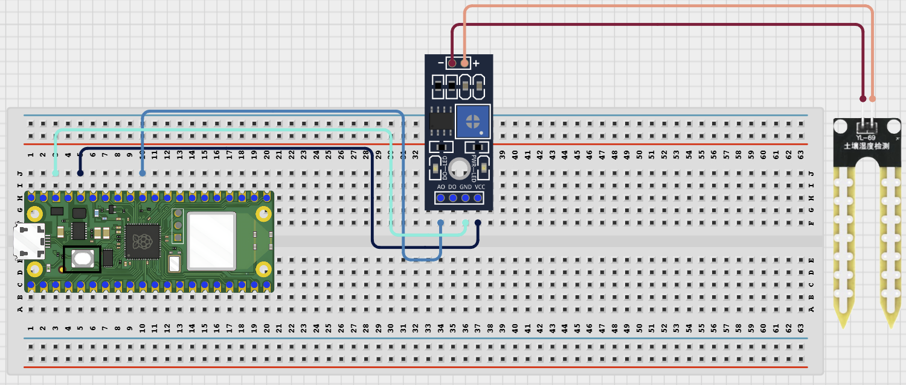

# Project 2.3.9: Bluetooth Soil Sensor Logger

**Manual Section:**

---
## Overview

This project builds a BLE soil-monitoring node that reads an analog moisture sensor and sends the data to a phone.
The real-world use case is a simple plant-monitoring system that helps decide when soil is dry enough to need watering.
The final system should stream moisture readings, let the student capture dry and wet calibration points, and report a moisture percentage plus a simple status label.

**Project Story**

Students learn that raw ADC values are not meaningful until the sensor is calibrated for dry and wet conditions.

---

## Required Components

|  |  |  |  |
| --- | --- | --- | --- |
| <br>Raspberry Pi Pico 2 W | <br>Soil moisture sensor | <br>Breadboard | <br>Jumper wires |
| Phone with BLUETOOTH app | Dry and wet soil samples |  |  |

---

## Circuit Connections

| Component terminal | Connect to | Pico physical pin | Notes |
|---|---|---|---|
| Soil sensor VCC | Pico 3V3(OUT) | Physical pin 36 | Use a 3.3 V-safe sensor output. |
| Soil sensor GND | Pico GND | Physical pin 38 or another GND pin | Common ground. |
| Soil sensor AOUT | GPIO 26 / ADC0 | GPIO 26 / physical pin 31 | Analogue soil-moisture input. |

---

## Wiring Diagram



---

## Step-by-Step Assembly

**Step 1: Place the Raspberry Pi Pico 2W**

Place the Raspberry Pi Pico 2W on the breadboard so it sits across the center gap.
Keep the USB port facing outward so you can easily connect it to your computer.

**Step 2: Position the Soil Moisture Sensor**

Place the soil moisture probe so the sensing end can enter the soil sample.
Check the module labels and identify VCC, GND, and AOUT before wiring.

**Step 3: Connect Sensor VCC**

Connect the soil sensor VCC pin to 3.3V.

**Step 4: Connect Sensor GND**

Connect the soil sensor GND pin to GND.

**Step 5: Connect AOUT to GPIO 26**

Connect the soil sensor AOUT, AO, or Signal pin to GPIO 26 (ADC0).

**Step 6: Place the Probe in Soil**

Insert only the sensing probe into the soil sample.
Keep the sensor board, Pico, breadboard, and jumper wires out of the soil and away from water.

**Step 7: Stabilize the Cable**

Keep the sensor cable still so the ADC reading does not jump because of loose movement.

**Wiring Check**

- ✓ Pico 2W is placed correctly across the breadboard center gap
- ✓ Soil sensor VCC connects to 3.3V
- ✓ Soil sensor GND connects to GND
- ✓ Soil sensor AOUT / AO / Signal connects to GPIO 26
- ✓ Only the sensing probe enters the soil
- ✓ No loose jumper wires

**Intermediate Note**

This project uses BLE on the Raspberry Pi Pico 2W. Use a BLE app such as nRF Connect, LightBlue, or a BLE UART terminal to connect to `AIDER_SoilLogger` and send commands. Test the sensor in dry soil and wet soil before setting or trusting moisture thresholds.

**Safety Note**

Do not pour water onto the Pico, breadboard, USB cable, or jumper wires. Add water to the soil sample away from the electronics.

---

## Testing Individual Components

Before running the full project, test each part separately. This makes it easier to find wiring, library, or code problems.

**Hardware setup**

- Build the three-wire analog sensor circuit
- Check that AOUT, VCC, and GND are not mixed up before powering the Pico

**Test the input sensor**

- Run a short script that prints `adc.read_u16()` values every 0.5 seconds
- Record one reading in air or dry soil and one reading in wet soil
- Use these readings to understand whether your sensor value rises or falls with moisture

**Test the output data**

- Upload the final code and watch the Shell output first
- Confirm the raw value, percentage, and status text change when the sensor moves between dry and wet conditions

**Test communication**

- Open the BLE app and connect to `AIDER_SoilLogger`
- Send `status` and `read` to confirm command handling
- Send `dry` while the sensor is in the dry condition and `wet` while the sensor is in the wet condition to capture calibration points

**Run the full system**

- Enable streaming with `stream on`
- Move the sensor between dry and wet samples and watch the percentage update on the phone
- Check that the status changes between DRY, OK, and WET at sensible points

**Save the project**

- Save the tested file on your computer
- If needed, save the final version as `main.py` on the Pico after calibration is complete

**Additional Testing and Calibration Checks**

- Calibration and tuning notes
- Record the raw sensor value in a dry condition, then send `dry` to save that reference
- Record the raw sensor value in a wet condition, then send `wet` to save that reference
- If the percentage looks inverted, compare your dry and wet values and confirm the sensor is wired to AOUT rather than a digital output pin
- Test at least three conditions: dry, normal classroom moisture, and clearly wet soil

**Quick testing checklist**

- ☐ Sensor reading changes between dry and wet samples
- ☐ BLE app finds `AIDER_SoilLogger`
- ☐ `dry` and `wet` commands capture calibration points
- ☐ Moisture percentage updates correctly
- ☐ Status label changes between DRY, OK, and WET

---

## Full Project Code

After completing and checking the circuit connections, open Thonny IDE. Copy and paste the code below into a new file, or upload the project file to the Raspberry Pi Pico 2 W, then run it from Thonny.

```python
from machine import ADC
import bluetooth
import time
from ble_uart import BLEUART
DEVICE_NAME = "AIDER_SoilLogger"
SAMPLE_INTERVAL_MS = 2000
sensor = ADC(26)
ble = bluetooth.BLE()
ble.active(True)
uart = BLEUART(ble, name=DEVICE_NAME)
dry_reading = 52000
wet_reading = 22000
stream_enabled = True
last_sample_ms = time.ticks_ms()
command_queue = []
def send_line(message):
    print(message)
    uart.write((message + "\n").encode())
def on_rx(data):
    command = data.decode("utf-8").strip().lower()
    if command:
        command_queue.append(command)
def clamp(value, low, high):
    if value < low:
        return low
    if value > high:
        return high
    return value
def moisture_percent(raw_value):
    span = dry_reading - wet_reading
    if span == 0:
        return 0
    percent = int(((dry_reading - raw_value) * 100) / span)
    return clamp(percent, 0, 100)
def moisture_state(percent):
    if percent < 35:
        return "DRY"
    if percent < 70:
        return "OK"
    return "WET"
def current_report():
    raw_value = sensor.read_u16()
    percent = moisture_percent(raw_value)
    state = moisture_state(percent)
    return raw_value, percent, state
uart.on_rx(on_rx)
send_line("Bluetooth soil logger ready")
send_line("Commands: read, status, dry, wet, stream on, stream off, help")
while True:
    now = time.ticks_ms()
    if stream_enabled and time.ticks_diff(now, last_sample_ms) >= SAMPLE_INTERVAL_MS:
        raw_value, percent, state = current_report()
        send_line("Raw:{} Moisture:{}% State:{}".format(raw_value, percent, state))
        last_sample_ms = now
    if command_queue:
        command = command_queue.pop(0)
        raw_value, percent, state = current_report()
        if command in ("read", "status"):
            send_line("Raw:{} Moisture:{}% State:{}".format(raw_value, percent, state))
            send_line("Dry ref:{} Wet ref:{}".format(dry_reading, wet_reading))
        elif command == "dry":
            dry_reading = raw_value
            send_line("Dry reference captured: {}".format(dry_reading))
        elif command == "wet":
            wet_reading = raw_value
            send_line("Wet reference captured: {}".format(wet_reading))
        elif command == "stream on":
            stream_enabled = True
            send_line("Streaming enabled")
        elif command == "stream off":
            stream_enabled = False
            send_line("Streaming disabled")
        elif command == "help":
            send_line("Commands: read, status, dry, wet, stream on, stream off, help")
        else:
            send_line("Unknown command. Send help.")
    time.sleep_ms(100)
```

---

## How the Code Works

| Code element | What it does | Why it matters |
|---|---|---|
| ADC sensor setup | Reads the analog soil signal on GPIO 26. | The Pico needs raw data before it can calculate moisture. |
| `dry_reading` and `wet_reading` | Store the calibration endpoints. | A moisture percentage is meaningful only after calibration. |
| `moisture_percent()` | Scales the raw reading into a value from 0 to 100%. | Makes the sensor output easier to interpret. |
| BLE commands | Capture calibration points and control streaming. | Supports interactive testing from the phone. |

---

## Expected Result

The phone receives live soil readings over BLE. After the student captures dry and wet reference points, the project reports a more realistic moisture percentage and changes the status label as the sample becomes drier or wetter.

---

## Troubleshooting

| Problem | Possible cause | Solution |
|---|---|---|
| Reading stays near one value | AOUT is not connected correctly or the sensor is not powered. | Check the VCC, GND, and GPIO 26 wiring. |
| Percentage looks backward | Dry and wet calibration points were captured in the wrong order. | Repeat calibration: capture dry in the drier condition and wet in the wetter condition. |
| Readings jump randomly | The sensor is loose or the sample is changing too quickly. | Stabilise the probe, hold the sample still, and test again. |
| Phone cannot find the BLE device | The Pico is not advertising or the BLE helper files are missing. | Confirm `ble_uart.py` and `ble_advertising.py` are on the Pico, restart it, then scan from a BLE app. |
| Commands do not change the system state | The phone is connected to the wrong service or sends unexpected command text. | Reconnect to the BLE UART service and send the exact commands shown in the test section. |

---
