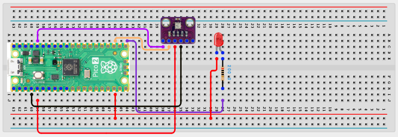

# Project 2.4.2: Greenhouse Humidity Monitor

**Intermediate Embedded Systems Project Using Raspberry Pi Pico 2 W and MicroPython**

---
## Overview

This project builds a greenhouse humidity monitor that uses a status LED to indicate when the air is too dry.

Students will use a BME280 sensor to measure humidity, compare it with a threshold, and show the result with an LED.

The final system should monitor humidity continuously and clearly report when humidity is below the selected threshold.

## Required Components

|  |  |  |  |
| --- | --- | --- | --- |
| <br>BME280 sensor module | <br>LED and 220 Ω resistor | <br>Raspberry Pi Pico 2 W  | | <br>Breadboard and jumper wires |   |


## Circuit Connections


| Component terminal | Connect to | Pico physical pin | Notes |
|---|---|---|---|
| BME280 VCC | 3.3V | Physical pin 36 | Sensor power |
| BME280 GND | GND | Any GND pin | Common ground |
| BME280 SDA | GPIO 2 | GPIO 2 / physical pin 4 | I2C data |
| BME280 SCL | GPIO 3 | GPIO 3 / physical pin 5 | I2C clock |
| Status LED anode | GPIO 16 through 220 ? resistor | GPIO 16 / physical pin 21 | Low-humidity indicator |
| Status LED cathode | GND | Any GND pin | LED return |

---

## Step-by-Step Assembly

### Step 1: Place the Raspberry Pi Pico 2W
Place the Raspberry Pi Pico 2W on the breadboard so it sits across the center gap. Keep the USB port facing outward so you can easily connect it to your computer.

### Step 2: Place the BME280 Sensor Module
Place the BME280 module where it can sense the greenhouse air without getting wet. Identify VCC, GND, SDA, and SCL before wiring.

### Step 3: Connect the BME280 Sensor Module
Connect BME280 VCC to **3.3V**. Connect BME280 GND to **GND**. Connect BME280 SDA to **GPIO 2** and BME280 SCL to **GPIO 3**.

### Step 4: Place the Status LED
Place the status LED on the breadboard. Connect its long leg through a 220? resistor to **GPIO 16**. Connect its short leg to **GND**.

### Wiring Check



- [x] Pico 2W is placed correctly across the breadboard center gap
- [x] BME280 VCC connects to 3.3V
- [x] BME280 GND connects to GND
- [x] BME280 SDA connects to GPIO 2
- [x] BME280 SCL connects to GPIO 3
- [x] Status LED long leg connects through a 220Ω resistor to GPIO 16
- [x] Status LED short leg connects to GND
- [x] No loose jumper wires

> **Intermediate Note**
> The BME280 needs a short delay between readings. If humidity readings fail, wait a moment, check the SDA and SCL wires, and confirm whether your sensor module needs a pull-up resistor.

---

## Testing Individual Components

Before running the full project, test each part separately. This makes it easier to find wiring, library, or code problems.

### Hardware Setup

- Build the BME280 and status LED wiring before powering the Pico.
- Keep the BME280 in a dry location with good airflow.

### Test the Input Sensor

- Run a short BME280 test script and confirm that humidity readings appear.
- Wait at least two seconds between BME280 temperature, humidity, and pressure measurements during debugging.

### Test the Status LED

- Test the LED with a simple on/off program.
- Confirm that the LED turns on when the humidity is below the selected threshold.

### Run the Full System

- Upload the final code and temporarily raise the humidity threshold if you need a quick classroom demonstration.
- Confirm that the Shell reports the humidity and whether it is LOW or NORMAL.

### Save the Project

- Save the final code and record the humidity threshold used in your test.

### Additional Testing and Calibration Checks

**Calibration and tuning notes**

- For quick testing, temporarily raise the low threshold so the LED indicates low humidity sooner.
- If the BME280 sensor gives occasional read errors, keep the read interval slow and the wiring short.

**Quick testing checklist**

- [ ] Humidity readings appear in the Shell
- [ ] The status LED turns on below the low-humidity threshold
- [ ] The Shell reports LOW or NORMAL humidity status

---

## Full Project Code

After completing and checking the circuit connections, open Thonny IDE. Copy and paste the code below into a new file, or upload the project file to the Raspberry Pi Pico 2 W, then run it from Thonny.

```python
from machine import I2C, Pin
import bme280
import time

i2c_bme = I2C(1, sda=Pin(2), scl=Pin(3), freq=400000)
bme = bme280.BME280(i2c=i2c_bme)
status_led = Pin(16, Pin.OUT)

humidity_low = 45


def number_from_bme(text_value):
    cleaned = ''.join(ch for ch in str(text_value) if ch.isdigit() or ch in '.-')
    return float(cleaned)


def read_humidity():
    _, _, humidity_text = bme.values
    return number_from_bme(humidity_text)


print('Greenhouse humidity monitor ready')
time.sleep(2)

while True:
    try:
        humidity = read_humidity()
    except Exception as error:
        status_led.off()
        print('Sensor error:', error)
        time.sleep(2)
        continue

    if humidity <= humidity_low:
        status_led.on()
        status = 'LOW'
    else:
        status_led.off()
        status = 'NORMAL'

    print('Humidity: {}% - {}'.format(humidity, status))
    time.sleep(3)
```

---

## How the Code Works

| Code Section | What It Does | Why It Matters |
|--------------|--------------|----------------|
| `humidity_low` | Defines the low-humidity threshold | Sets the point at which the status LED turns on |
| `read_humidity()` | Reads and converts the BME280 humidity value | Produces a number that can be compared with the threshold |
| Status LED control | Turns the LED on or off based on humidity | Gives an immediate visual humidity status |
| Exception handling around `read_humidity()` | Catches sensor read errors gracefully | BME280 sensors can be noisy and should fail safely |

---

## Expected Result

The system should report live humidity values. When the humidity falls below the low threshold, the status LED should light and the Shell should show LOW. When humidity rises above the threshold, the LED should turn off and the Shell should show NORMAL.

---

## Troubleshooting

| Problem | Possible cause | Solution |
|---------|----------------|----------|
| Humidity always reads the same | Wrong I2C wiring or inadequate delay between reads | Recheck SDA/SCL wiring and keep at least a two-second gap between reads |
| Status LED never turns on | The threshold is too low or LED wiring is incorrect | Raise the low threshold for testing and check the LED polarity and GPIO 16 connection |
| Status LED stays on | The humidity remains below the threshold | Check the BME280 reading and lower the threshold after testing |

---
