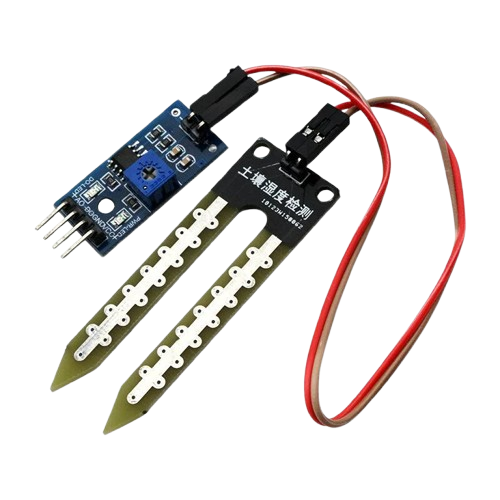

# Project 2.2.18
## PRECISION IRRIGATION DEMO SYSTEM

**Intermediate Embedded Systems Project Using Raspberry Pi Pico 2 W and MicroPython**

| Field | Value |
|-------|-------|
| Manual Section | Intermediate Projects |
| Project Level | Intermediate |
| Board | Raspberry Pi Pico 2 W |
| Programming Language | MicroPython |
| Version | 1.0 |
| Date | May 2026 |
| Prepared for | STEMAIDE Africa |

---

## Contents

- [Overview](#overview)
- [Learning Objectives](#learning-objectives)
- [Required Components](#required-components)
- [Before You Begin](#before-you-begin)
- [Circuit Connections](#circuit-connections)
- [Wiring Diagram](#wiring-diagram)
- [Step-by-Step Assembly](#step-by-step-assembly)
- [Testing Individual Components](#testing-individual-components)
- [Full Project Code](#full-project-code)
- [How the Code Works](#how-the-code-works)
- [Expected Result](#expected-result)
- [Troubleshooting](#troubleshooting)
- [Challenge Extensions](#challenge-extensions)
- [Reflection Questions](#reflection-questions)
- [Save Your Work](#save-your-work)

---

## Overview

This project builds an irrigation demo that applies measured watering doses and checks the soil after each dose instead of using one long pump run.

Students will calibrate the soil sensor, trigger an evaluation cycle, apply short measured doses, and watch how the moisture changes after each soak period.

The final system should decide whether 1, 2, or 3 short doses are needed, stop early if the target moisture is reached, and print the total watering time used.

### Project Story

The real-world use case is a small irrigation training setup where students need to understand how exact watering amounts can be tuned for different soil conditions.

---

## Learning Objectives

- Translate soil readings into dose-based irrigation decisions
- Use soak time to let the soil settle before checking again
- Track watering duration as a simple measure of output amount
- Test a relay-controlled pump safely with short timed pulses
- Explain why measured doses can be more precise than one long run
- Tune a target moisture level for a specific plant setup

---

## Required Components


|  |  |  |  |
| --- | --- | --- | --- |
| <br>Soil moisture sensor (analog output)](../../../assets/aider/components/Soil_Moisture_Sensor.png)<br><br>Soil moisture sensor (analog output) | <br>Breadboard and jumper wires](../../../assets/aider/components/Breadboard.png)<br><br>Breadboard and jumper wires | <br> | <br> |


---

## Before You Begin

Before starting this project, make sure you have completed the foundational sections at the beginning of the manual:

- **Software Installation and Setup**
- **Safety Guidelines**
- **Breadboard Basics**
- **Reading Circuit Diagrams**

### Project-Specific Setup Notes

- No external library is required. This project uses only built-in MicroPython modules
- Run `import os` and `print(os.listdir())` in the Thonny Shell to confirm the Pico file system is responding before you save the code

### Project-Specific Safety Note

Keep electronics away from water and wet surfaces.

Do not power motors, pumps, or relays directly from the Pico GPIO pins.

Use an external power supply for pumps, valves, and other high-current loads.

If the relay module is controlled by the Pico, make sure the Pico GND and external power supply GND are connected together unless the relay module is fully opto-isolated and wired correctly.

Keep the first pump test short and be ready to disconnect external power if the relay wiring is wrong.

Never leave the pump running unattended while you are tuning dose lengths.

---

## Circuit Connections


|  |  |  |  |
| --- | --- | --- | --- |
| <br>Soil moisture sensor (analog output)](../../../assets/aider/components/Soil_Moisture_Sensor.png)<br><br>Soil moisture sensor (analog output) | <br>Breadboard and jumper wires](../../../assets/aider/components/Breadboard.png)<br><br>Breadboard and jumper wires | <br> | <br> |

| --- | --- | --- | --- |
<br>Raspberry Pi Pico 2 W | <br>Soil moisture sensor (analog output) | <br>Relay module or transistor relay driver | <br>Push button
<br>Status LED and 220 Ω resistor | <br>Breadboard and jumper wires | <br> | <br>

|---------------|-------------|---------------------------------|-------|
| Soil sensor VCC | 3.3V | Physical pin 36 | Sensor power |
| Soil sensor GND | GND | Any GND pin | Common ground |
| Soil sensor AOUT | GPIO 26 | GPIO 26 / physical pin 31 | Analog soil input |
| Start button one side | GPIO 5 | GPIO 5 / physical pin 7 | Uses internal pull-up |
| Start button other side | GND | Any GND pin | Pressing pulls the input low |
| Relay IN | GPIO 15 | GPIO 15 / physical pin 20 | Irrigation relay control |
| Status LED anode | GPIO 16 through 220 Ω resistor | GPIO 16 / physical pin 21 | Active watering indicator |
| Status LED cathode | GND | Any GND pin | Return path |

---

## Wiring Diagram

```
  Raspberry Pi Pico 2 W
  ┌─────────────────────┐
  │                     │
  │  GPIO 26 ───────────┤──── Soil Sensor AOUT
  │                     │
  │  GPIO 5  ───────────┤──── Start Button ──── GND
  │                     │
  │  GPIO 15 ───────────┤──── Relay IN
  │  GPIO 16 ────220Ω───┤──── Status LED (+)
  │                     │
  │  3.3V    ───────────┤──── Soil Sensor VCC
  │                     │
  │  GND     ───────────┤──── Soil Sensor GND
  │  GND     ───────────┤──── Status LED (-)
  │  GND     ───────────┤──── Relay GND
  │  GND     ───────────┤──── Start Button GND
  │                     │
  └─────────────────────┘

  Relay Module            External Supply
  ┌──────────┐            ┌────────────┐
  │  COM ────┼────────────┤ (+)        │
  │  NO  ────┼──┐         │            │
  └──────────┘  │         └────────────┘
                │              │
                │         Pump (+)
                │
                └────────────── Pump (-) ──── External Supply (-)
```

---

## Step-by-Step Assembly

### Step 1: Place the Raspberry Pi Pico 2W
Place the Raspberry Pi Pico 2W on the breadboard so it sits across the center gap. Keep the USB port facing outward so you can easily connect it to your computer.

### Step 2: Position and Connect the Soil Sensor
Place the soil moisture probe so the sensing end can enter the soil sample. Connect soil sensor VCC to 3.3V. Connect soil sensor GND to GND. Connect soil sensor AOUT, AO, or Signal to GPIO 26.

### Step 3: Place the Start Button
Place the start push button across the breadboard center gap. Connect one side of the start button to GPIO 5. Connect the opposite side of the start button to GND.

### Step 4: Place and Wire the Relay Module
Identify relay VCC, GND, IN, COM, NO, and NC before wiring. Connect relay IN to GPIO 15. Power the relay module according to its label. Connect relay GND to Pico GND and to the external pump or valve supply GND where shared grounding is required.

### Step 5: Place and Connect the Status LED
Place the status LED on the breadboard. Identify the long leg as the anode (+) and the short leg as the cathode (-). Connect the status LED long leg through a 220Ω resistor to GPIO 16. Connect the status LED short leg to GND.

### Step 6: Keep the External Pump Disconnected First
Run the relay click and status LED test before connecting the pump. If you connect a pump, route the external pump supply positive wire through relay COM and NO. Connect the pump negative lead to the external pump supply negative wire.

### Wiring Check

- [x] Pico 2W is placed correctly across the breadboard center gap
- [x] Soil sensor AOUT / AO / Signal connects to GPIO 26
- [x] Start button connects between GPIO 5 and GND
- [x] Relay IN connects to GPIO 15
- [x] Status LED long leg connects through a 220Ω resistor to GPIO 16
- [x] Status LED short leg connects to GND
- [x] Pump positive path uses relay COM and NO only after the relay test passes
- [x] No loose jumper wires

> **Intermediate Note**
> The start button uses the Pico internal pull-up, so it reads LOW when pressed. Tune dose lengths with short supervised runs.

> **Safety Note**
> Do not power the pump from the Pico. Use external load power, keep electronics away from water, and never leave the pump running unattended while tuning dose lengths.

---

## Testing Individual Components

Before running the full project, test each part separately. This makes it easier to find wiring, library, or code problems.

### Hardware Setup

- Build the sensor, button, and LED wiring before adding external load power to the relay contacts
- Use a dry work area so the soil probe is the only part placed near moist soil

### Test the Input Sensor

- Record dry and wet sensor values and update SOIL_DRY and SOIL_WET before judging the dose logic
- Press the start button and confirm the serial output shows that an evaluation cycle has been requested

### Test the Output Device

- Run a relay click test with no pump connected and confirm the status LED turns on during each dose
- If the relay logic is reversed, change RELAY_ON and RELAY_OFF before continuing

### Test Communication

- Watch the serial monitor and confirm it prints the number of requested doses and the updated moisture after each soak period
- Use the printed values to decide whether the target moisture is realistic

### Run the Full System

- Place the probe in dry soil, start an evaluation cycle, and observe whether the system uses 1, 2, or 3 doses based on the starting moisture
- Check whether the system stops early when the target moisture is reached

### Save the Project

- Save the final code and record the dose length, soak time, and target moisture used in your demonstration
- Write down which soil condition needed the most doses and why

### Additional Testing and Calibration Checks

- **Dry/wet reading test**: measure the raw sensor output in dry soil and wet soil before setting the calibration values
- **Normal condition test**: confirm the system reports that no watering is needed when the soil is already above the dry threshold
- **Threshold condition test**: test slightly dry and very dry samples to confirm the number of requested doses changes as expected
- **Output response test**: check that the relay and status LED are active only during each dose
- **Relay click test**: keep the real pump disconnected for the first output test
- **Pump safety test**: use a supervised short run when you connect a real pump or valve

---

## Full Project Code

After completing and checking the circuit connections, open Thonny IDE. Copy and paste the code below into a new file, or upload the project file to the Raspberry Pi Pico 2 W, then run it from Thonny.

```python
from machine import ADC, Pin
import time

soil_sensor = ADC(26)
start_button = Pin(5, Pin.IN, Pin.PULL_UP)
relay = Pin(15, Pin.OUT)
status_led = Pin(16, Pin.OUT)

RELAY_ON = 1
RELAY_OFF = 0
SOIL_DRY = 52000
SOIL_WET = 22000
VERY_DRY_THRESHOLD = 20
DRY_THRESHOLD = 35
TARGET_MOISTURE = 55
DOSE_SECONDS = 2
SOAK_SECONDS = 8
MAX_DOSES = 3
CHECK_INTERVAL = 60
DEBOUNCE_MS = 250

last_check = time.time() - CHECK_INTERVAL
last_button_ms = 0
total_water_seconds = 0
watering_events = 0


def clamp(value, low, high):
    if value < low:
        return low
    if value > high:
        return high
    return value


def soil_percent():
    raw = soil_sensor.read_u16()
    span = SOIL_DRY - SOIL_WET
    if span <= 0:
        return 0
    percent = int(((SOIL_DRY - raw) * 100) / span)
    return clamp(percent, 0, 100)


def button_pressed():
    global last_button_ms
    now_ms = time.ticks_ms()
    if start_button.value() == 0 and time.ticks_diff(now_ms, last_button_ms) > DEBOUNCE_MS:
        while start_button.value() == 0:
            time.sleep(0.02)
        last_button_ms = now_ms
        return True
    return False


def relay_on():
    relay.value(RELAY_ON)
    status_led.value(1)


def relay_off():
    relay.value(RELAY_OFF)
    status_led.value(0)


def required_doses(moisture):
    if moisture <= VERY_DRY_THRESHOLD:
        return 3
    if moisture <= (DRY_THRESHOLD - 5):
        return 2
    if moisture <= DRY_THRESHOLD:
        return 1
    return 0


def run_precision_session(reason):
    global total_water_seconds, watering_events
    moisture = soil_percent()
    doses = required_doses(moisture)

    print(reason)
    print('Starting moisture: {}% | Requested doses: {}'.format(moisture, doses))

    if doses == 0:
        print('Soil is already above the dry threshold. No watering needed.')
        return

    watering_events += 1

    for dose_number in range(1, min(doses, MAX_DOSES) + 1):
        relay_on()
        print('Dose {} running for {} seconds.'.format(dose_number, DOSE_SECONDS))
        time.sleep(DOSE_SECONDS)
        relay_off()
        total_water_seconds += DOSE_SECONDS

        print('Soaking for {} seconds before re-checking.'.format(SOAK_SECONDS))
        time.sleep(SOAK_SECONDS)
        moisture = soil_percent()
        print('Moisture after dose {}: {}%'.format(dose_number, moisture))

        if moisture >= TARGET_MOISTURE:
            print('Target moisture reached early. Session stopped after {} dose(s).'.format(dose_number))
            break

    print('Total watered so far: {} seconds across {} session(s).'.format(
        total_water_seconds, watering_events
    ))


print('=== Precision Irrigation Demo System ===')
print('Press the button for an immediate evaluation cycle.\n')

while True:
    if time.time() - last_check >= CHECK_INTERVAL:
        last_check = time.time()
        run_precision_session('Scheduled precision evaluation cycle.')

    if button_pressed():
        last_check = time.time()
        run_precision_session('Manual precision evaluation cycle requested.')

    print('Idle | Soil: {}% | Total watered: {} seconds'.format(
        soil_percent(), total_water_seconds
    ))
    time.sleep(2)
```

---

## How the Code Works

| Code Section | What It Does | Why It Matters |
|--------------|--------------|----------------|
| required_doses() | Maps the starting soil condition to 1, 2, or 3 short doses | This is the precision decision rule in the project |
| DOSE_SECONDS and SOAK_SECONDS | Define how long water is applied and how long the soil rests before checking again | These values control the quality of the precision demo |
| run_precision_session() | Runs the requested doses and stops early if the target moisture is reached | Students can see how measured outputs affect the soil state |
| Watering totals | Track total watering time across repeated sessions | This helps compare different tuning choices over time |

---

## Expected Result

When the soil is only slightly dry, the system should use one short dose and then stop if the moisture recovers enough.

When the soil is much drier, the system should request more doses and re-check the soil after each soak period.

The serial monitor should show the number of requested doses, the moisture after each dose, and the total watering time used so far.

---

## Troubleshooting

| Problem | Possible cause | Solution |
|---------|----------------|----------|
| The system always uses the maximum number of doses | The target moisture is too high or the soak time is too short | Lower TARGET_MOISTURE slightly or increase SOAK_SECONDS so the soil reading can settle |
| The button does not start a session | The GPIO 5 button wiring is wrong or debounce timing is not being reached | Recheck the button wiring and press the button once firmly instead of holding it |
| The relay stays off even in dry soil | The sensor is not calibrated correctly or the relay logic is reversed | Measure real dry readings again and verify the relay click test |
| The soil percentage changes very little after a dose | The probe position is poor or water is not reaching the sensing area | Move the probe closer to the root zone and check the water path |

---

## Challenge Extensions

- Choose better dose and soak values for a small pot versus a larger container, then explain how the soil volume changes the best settings
- Design a method for comparing two pump sizes while still delivering the same total water amount in the demo
- Add an OLED display that shows the requested doses and total watered time
- Add a second button to change the target moisture without editing the code
- Add a low-water safety switch so the session refuses to start when the reservoir is empty
- Add a data logging feature so students can compare several dose strategies over a full day

---

## Reflection Questions

1. Why is a measured multi-dose approach easier to study than one long watering run?
2. Why should the controller wait before checking the soil again after a dose?
3. How would the best target moisture change for seedlings compared with mature plants?
4. What would make the watering result look precise in time but still be poor in real plant care?

---

## Save Your Work

Save the file to your computer as:

```
project_172_precision_irrigation_demo_system.py
```

If you want the program to run automatically when the Pico powers on, save the final version to the Pico as:

```
main.py
```

---
