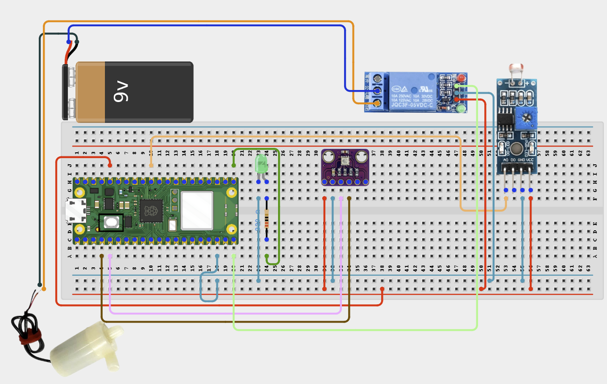

# Project 2.6.11: Smart Greenhouse Lighting

**Intermediate Embedded Systems Project Using Raspberry Pi Pico 2 W and MicroPython**

---
## Overview

This project builds a greenhouse light-level monitor that uses a status LED to indicate when natural light is too low.

Students will use an LDR sensor and a status LED to measure light levels and show a clear low-light warning.

The final system should turn the status LED on in low light and off when brightness recovers.

## Required Components

|  |  |  |  |
| --- | --- | --- | --- |
| <br>LDR module with analog output | <br>LED and 220 resistor | <br>Raspberry Pi Pico 2 W | <br>Breadboard |
| <br>Jumper wires |  |  |  |


## Circuit Connections

| Component terminal | Connect to | Pico physical pin | Notes |
|---|---|---|---|
| LDR module VCC | 3.3V | Physical pin 36 | Sensor power |
| LDR module GND | GND | Any GND pin | Common ground |
| LDR module AOUT | GPIO 26 | GPIO 26 / physical pin 31 | ADC light input |
| Status LED anode | GPIO 16 through 220 resistor | GPIO 16 / physical pin 21 | Low-light indicator |
| Status LED cathode | GND | Any GND pin | LED return |

---



## Step-by-Step Assembly

### Step 1: Place the Raspberry Pi Pico 2W
Place the Raspberry Pi Pico 2W on the breadboard so it sits across the center gap. Keep the USB port facing outward so you can easily connect it to your computer.

### Step 2: Connect the LDR Module
Place the LDR module where it can sense the light level. Connect LDR module VCC to **3.3V**. Connect LDR module AOUT to **GPIO 26**. Connect LDR module GND to **GND**.

### Step 3: Place and Connect the Status LED
Place the status LED on the breadboard. Identify the long leg as the anode (+) and the short leg as the cathode (-). Connect the status LED long leg through a 220? resistor to **GPIO 16**. Connect the status LED short leg to **GND**.

### Wiring Check

- [x] Pico 2W is placed correctly across the breadboard center gap
- [x] LDR module VCC connects to 3.3V
- [x] LDR module GND connects to GND
- [x] LDR module AOUT connects to GPIO 26
- [x] Status LED long leg connects through a 220? resistor to GPIO 16
- [x] Status LED short leg connects to GND
- [x] No loose jumper wires

> **Intermediate Note**
> Test the LDR in bright light and shade before setting the lighting threshold. Stable lighting behavior is more useful than rapid switching near one threshold.

---

## Testing Individual Components

Before running the full project, test each part separately. This makes it easier to find wiring, library, or code problems.

### Hardware Setup

- Build the LDR module and status LED wiring before powering the Pico.
- Place the LDR where it can sense the ambient light without being covered by wires.

### Test the Input Sensor

- Cover and uncover the LDR to verify that the light percentage changes clearly.
- Choose thresholds that make sense for a greenhouse or indoor grow area, not just a bright classroom ceiling light.

### Test the Status LED

- Test the status LED with a simple on/off program.
- Confirm that it does not flicker when brightness hovers near the threshold.

### Run the Full System

- Dim the sensor to turn the status LED on, then increase the brightness to turn it off.
- Observe the light percentage and LOW or NORMAL status in the Shell.

### Save the Project

- Save the final code and record the ON and OFF thresholds that worked best.

### Additional Testing and Calibration Checks

**Calibration and tuning notes**

- If the status LED flickers, widen the gap between the ON and OFF thresholds.
- Compare the light percentage in a bright window area and a shaded area before finalising the thresholds.

**Quick testing checklist**

- [ ] LDR percentage changes between bright and dark conditions
- [ ] Status LED turns on when ambient light is low
- [ ] Status LED turns off when brightness recovers
- [ ] Shell reports the current light percentage and status

---

## Full Project Code

After completing and checking the circuit connections, open Thonny IDE. Copy and paste the code below into a new file, or upload the project file to the Raspberry Pi Pico 2 W, then run it from Thonny.

```python
from machine import ADC, Pin
import time

ldr = ADC(26)
status_led = Pin(16, Pin.OUT)

light_on_threshold = 35
light_off_threshold = 50
low_light = False


def light_percent():
    raw = ldr.read_u16()
    return int((raw / 65535) * 100)


print('Smart greenhouse light monitor ready')

while True:
    level = light_percent()

    if not low_light and level <= light_on_threshold:
        low_light = True
        status_led.on()
        print('Low-light warning ON')
    elif low_light and level >= light_off_threshold:
        low_light = False
        status_led.off()
        print('Low-light warning OFF')

    status = 'LOW' if low_light else 'NORMAL'
    print('Light: {}% Status: {}'.format(level, status))
    time.sleep(3)
```

---

## How the Code Works

| Code Section | What It Does | Why It Matters |
|--------------|--------------|----------------|
| Light thresholds | Decide when the low-light warning turns on and off | Separate thresholds prevent flicker near one light level |
| `light_percent()` | Converts the LDR ADC value into a percentage | Makes light readings easier to understand |
| `low_light` | Stores the current warning state | Keeps the LED stable between readings |
| Status LED | Indicates low ambient light | Gives immediate visual feedback without external lighting hardware |

---

## Expected Result

When ambient light falls below the ON threshold, the status LED should turn on and the Shell should show LOW. When the light level rises above the OFF threshold, the status LED should turn off and the Shell should show NORMAL.

---

## Troubleshooting

| Problem | Possible cause | Solution |
|---------|----------------|----------|
| Status LED is always on | The ON threshold is too high or the LDR module is miswired | Recheck the LDR wiring and lower the ON threshold after testing |
| Status LED never turns on | The ADC reading never reaches the low-light threshold | Cover the LDR fully and check the value printed in the Shell |
| Status LED flickers | The ON and OFF thresholds are too close | Widen the gap between the thresholds |
| Light percentage never changes | LDR AOUT is not connected to GPIO 26 | Check the sensor VCC, GND, and AOUT connections |

---
