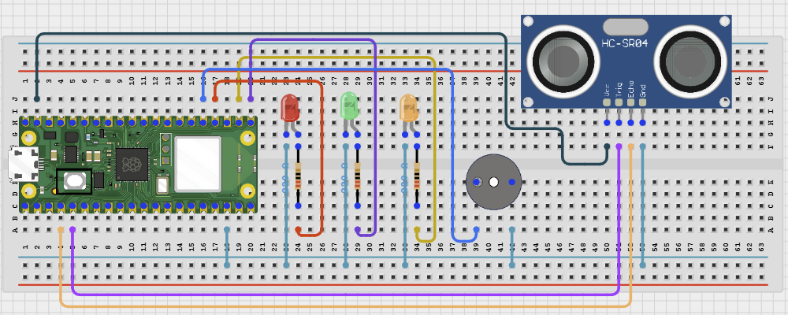

# Project 2.6.3: Smart Drainage Blockage Detector

**Intermediate Embedded Systems Project Using Raspberry Pi Pico 2 W and MicroPython**

---
## Overview

This project builds a blockage detector that watches water level behaviour in a drain or channel instead of only checking one instant reading.

Students will use an ultrasonic sensor, convert distance into water-height percentage, store a short history, and detect when the level stays high without enough movement.

The final system should report NORMAL, WATCH, or BLOCKED, sound an alert when water remains high and stagnant, and help students understand why trend matters in drainage monitoring.

### Project Story

The real-world use case is a gutter, drainage pit, or public sanitation channel where rising water that does not fall back down may indicate a blockage.

---

## Learning Objectives

- Use an ultrasonic sensor to monitor water height safely from above
- Compare short-term history instead of relying on one reading only
- Detect a blockage using both level threshold and lack-of-movement logic
- Use LEDs and a buzzer to signal different maintenance states
- Calibrate empty and high-water distances for a specific drain shape
- Think about why drainage problems depend on trend as well as absolute level

---

## Required Components

|  |  |  |  |
| --- | --- | --- | --- |
| <br>Ultrasonic distance sensor | <br>Active buzzer | <br>Raspberry Pi Pico 2 W | <br>Green LED and 220Ω resistor |
| <br>Yellow LED and 220Ω resistor | <br>Red LED and 220Ω resistor | <br>Breadboard and jumper wires |   |


## Before You Begin

Before starting this project, make sure you have completed the foundational sections at the beginning of the manual:

- Software Installation and Setup
- Safety Guidelines
- Breadboard Basics
- Reading Circuit Diagrams

### Project-Specific Setup Notes

- No external library is required. This project uses only built-in MicroPython modules
- Run `import os` and `print(os.listdir())` in the Thonny Shell to confirm the Pico file system is responding before you save the code
- Measure the empty distance from the sensor to the normal drain bottom or water surface before finalising `EMPTY_DISTANCE_CM`
- Measure the distance that represents a dangerously high water level before finalising `HIGH_WATER_DISTANCE_CM`

### Project-Specific Safety Note

Keep electronics away from water and wet surfaces.
Only the sensor head should be near the drainage area. Keep the Pico and breadboard away from dirty water.
If the ultrasonic sensor echo is 5V, do not connect it directly to the Pico GPIO pin.

---

## Circuit Connections


|---|---|---|---|
| Ultrasonic VCC | Module dependent | Follow module label | Use only a safe supply arrangement for your sensor |
| Ultrasonic GND | GND | Any GND pin | Common ground |
| Ultrasonic TRIG | GPIO 3 | GPIO 3 / physical pin 5 | Trigger output |
| Ultrasonic ECHO | GPIO 2 | GPIO 2 / physical pin 4 | Use a voltage divider if echo is 5V |
| Green LED anode | GPIO 16 through 220Ω resistor | GPIO 16 / physical pin 21 | Normal indicator |
| Yellow LED anode | GPIO 17 through 220Ω resistor | GPIO 17 / physical pin 22 | Watch indicator |
| Red LED anode | GPIO 18 through 220Ω resistor | GPIO 18 / physical pin 24 | Blocked indicator |
| Buzzer positive | GPIO 19 | GPIO 19 / physical pin 25 | Blocked alarm |
| LED cathodes and buzzer negative | GND | Any GND pin | Return path |

---

## Wiring Diagram



```text
Raspberry Pi Pico 2 W
┌─────────────────────┐
│                     │
│  GPIO 3  ───────────┼──── Ultrasonic TRIG
│  GPIO 2  ───────────┼──── Ultrasonic ECHO (via 3.3V-safe interface)
│  GPIO 16 ───────────┼──── Resistor (220Ω) ── Green LED anode (+)
│  GPIO 17 ───────────┼──── Resistor (220Ω) ── Yellow LED anode (+)
│  GPIO 18 ───────────┼──── Resistor (220Ω) ── Red LED anode (+)
│  GPIO 19 ───────────┼──── Buzzer positive (+)
│  GND     ───────────┼──── All LED cathodes (-) / Buzzer negative (-)
│                     │
└─────────────────────┘

Ultrasonic Sensor
VCC  ─────────────── Safe module supply
GND  ─────────────── GND
TRIG ─────────────── GPIO 3
ECHO ─────────────── GPIO 2 (via voltage divider if 5V)

Green LED (Normal)
Anode (+) ──[220Ω]── GPIO 16
Cathode (-) ───────── GND

Yellow LED (Watch)
Anode (+) ──[220Ω]── GPIO 17
Cathode (-) ───────── GND

Red LED (Blocked)
Anode (+) ──[220Ω]── GPIO 18
Cathode (-) ───────── GND

Buzzer
Positive (+) ─────────── GPIO 19
Negative (-) ─────────── GND
```

---

## Step-by-Step Assembly

### Step 1: Place the Raspberry Pi Pico 2W

Place the Raspberry Pi Pico 2W on the breadboard so it sits across the center gap. Keep the USB port facing outward so you can easily connect it to your computer.

### Step 2: Position the Ultrasonic Sensor

Mount the ultrasonic sensor above the drainage point so it looks straight down at the water surface. Identify VCC, GND, TRIG, and ECHO before wiring.

### Step 3: Connect the Ultrasonic Sensor

Connect ultrasonic VCC to the safe supply required by your specific module. Connect ultrasonic GND to GND. Connect ultrasonic TRIG to GPIO 3. Connect ultrasonic ECHO to GPIO 2 through a voltage divider if the ECHO signal is 5V.

### Step 4: Place the Three Drainage LEDs

Place the green, yellow, and red LEDs on the breadboard. For each LED, identify the long leg as the anode (+) and the short leg as the cathode (-).

### Step 5: Connect the Drainage LEDs

Connect the green LED long leg through a 220Ω resistor to GPIO 16. Connect the yellow LED long leg through a 220Ω resistor to GPIO 17. Connect the red LED long leg through a 220Ω resistor to GPIO 18. Connect all LED short legs to GND.

### Step 6: Place and Connect the Buzzer

Place the buzzer on the breadboard and identify its positive (+) and negative (-) pins. Connect the buzzer positive pin to GPIO 19. Connect the buzzer negative pin to GND.

---

## Wiring Check

- [x] Pico 2W is placed correctly across the breadboard center gap
- [x] Ultrasonic TRIG connects to GPIO 3
- [x] Ultrasonic ECHO connects to GPIO 2
- [x] ECHO is voltage-divided or confirmed 3.3V-safe before connecting to the Pico
- [x] Green LED long leg connects through a 220Ω resistor to GPIO 16
- [x] Yellow LED long leg connects through a 220Ω resistor to GPIO 17
- [x] Red LED long leg connects through a 220Ω resistor to GPIO 18
- [x] Buzzer positive pin connects to GPIO 19
- [x] Buzzer negative pin connects to GND
- [x] No loose jumper wires

> **Intermediate Note**
>
> Measure the empty drainage distance and the high-water distance before tuning `EMPTY_DISTANCE_CM` and `HIGH_WATER_DISTANCE_CM`.

> **Safety Note**
>
> Many HC-SR04 ultrasonic modules output 5V on Echo. Raspberry Pi Pico GPIO pins are 3.3V only, so use a voltage divider on Echo or use a 3.3V-safe ultrasonic sensor. Keep the Pico and breadboard away from dirty water.

---

## Testing Individual Components

Before running the full project, test each part separately. This makes it easier to find wiring, library, or code problems.

### Hardware setup

- Mount the ultrasonic sensor securely above the water path before wiring the indicators
- Keep all electronics away from dirty water and splash risk

### Test the input sensor

- Measure stable distances at a normal low level and at a raised water level
- Confirm the sensor does not report false echoes from channel walls

### Test the output device

- Force the NORMAL, WATCH, and BLOCKED states briefly and confirm the LEDs and buzzer respond correctly
- Make sure the buzzer only sounds in the final blocked condition

### Test communication

- Watch the serial output and confirm it prints the current level and the recent movement amount
- Use the movement value to tune how much drop counts as normal drainage

### Run the full system

- Create a temporary high-water state that then falls again and confirm the system only enters WATCH
- Then create a high-water state that stays nearly unchanged and confirm the system enters BLOCKED

### Save the project

- Save the final code and record the high-water threshold and movement threshold values
- Write down what extra sensing would improve blockage confidence in a real drainage system

### Quick testing checklist

- ☐ Ultrasonic readings are stable at both low and high water levels
- ☐ Green LED shows NORMAL state
- ☐ Yellow LED shows WATCH state
- ☐ Red LED and buzzer show BLOCKED state
- ☐ Blocked state only appears when water stays high and movement is minimal

---

## Full Project Code

After completing and checking the circuit connections, open Thonny IDE. Copy and paste the code below into a new file, or upload the project file to the Raspberry Pi Pico 2 W, then run it from Thonny.

```python
from machine import Pin, time_pulse_us
import time

trig = Pin(3, Pin.OUT)
echo = Pin(2, Pin.IN)

green_led = Pin(16, Pin.OUT)
yellow_led = Pin(17, Pin.OUT)
red_led = Pin(18, Pin.OUT)
buzzer = Pin(19, Pin.OUT)

EMPTY_DISTANCE_CM = 30
HIGH_WATER_DISTANCE_CM = 8

WATCH_LEVEL = 60
BLOCK_LEVEL = 80

HISTORY_SIZE = 6
MIN_MOVEMENT = 4

history = []


def clamp(value, low, high):
    if value < low:
        return low
    if value > high:
        return high
    return value


def distance_cm():
    trig.value(0)
    time.sleep_us(2)
    trig.value(1)
    time.sleep_us(10)
    trig.value(0)
    pulse = time_pulse_us(echo, 1, 30000)
    if pulse < 0:
        return None
    return (pulse * 0.0343) / 2


def level_percent(distance):
    if distance is None:
        return None
    span = EMPTY_DISTANCE_CM - HIGH_WATER_DISTANCE_CM
    if span <= 0:
        return 0
    percent = int(((EMPTY_DISTANCE_CM - distance) * 100) / span)
    return clamp(percent, 0, 100)


def movement_amount():
    if len(history) < HISTORY_SIZE:
        return None
    return max(history) - min(history)


def beep():
    for _ in range(2):
        buzzer.value(1)
        time.sleep(0.1)
        buzzer.value(0)
        time.sleep(0.1)


print('=== Smart Drainage Blockage Detector ===')
print('The system looks for high water that does not move enough over time.\n')

while True:
    distance = distance_cm()
    level = level_percent(distance)

    if level is None:
        green_led.value(0)
        yellow_led.value(0)
        red_led.value(1)
        print('Sensor read failed. Check the ultrasonic wiring and alignment.')
        time.sleep(2)
        continue

    history.append(level)
    if len(history) > HISTORY_SIZE:
        history.pop(0)

    movement = movement_amount()

    if level >= BLOCK_LEVEL and movement is not None and movement < MIN_MOVEMENT:
        state = 'BLOCKED'
        green_led.value(0)
        yellow_led.value(0)
        red_led.value(1)
        beep()
    elif level >= WATCH_LEVEL:
        state = 'WATCH'
        green_led.value(0)
        yellow_led.value(1)
        red_led.value(0)
        buzzer.value(0)
    else:
        state = 'NORMAL'
        green_led.value(1)
        yellow_led.value(0)
        red_led.value(0)
        buzzer.value(0)

    print('Distance: {:.1f} cm | Level: {}% | Movement: {} | State: {}'.format(
        distance,
        level,
        movement,
        state
    ))
    time.sleep(2)
```

---

## How the Code Works

| Code Section | What It Does | Why It Matters |
|---|---|---|
| Distance-to-level conversion | Turns the ultrasonic distance into a water-height percentage | This lets the same sensor be adapted to different drain shapes |
| History list | Stores several recent level values | Blockage detection depends on behaviour over time, not just one reading |
| Movement check | Measures how much the level changed over the recent window | High water with too little movement is a useful blockage signal |
| Three-state output | Separates normal drainage, high-but-moving water, and blocked water | Students can compare simple level monitoring with trend-based logic |

---

## Expected Result

At normal low water level, the green LED should stay on and the system should report NORMAL. When the water is high but still changing enough, the yellow LED should turn on and the system should report WATCH. When the water stays high and the recent movement is too small, the red LED and buzzer should indicate BLOCKED.

---

## Troubleshooting

| Problem | Possible cause | Solution |
|---|---|---|
| The system always says BLOCKED | The movement threshold is too large or the high-level threshold is too low | Reduce MIN_MOVEMENT or increase BLOCK_LEVEL after reviewing real readings. |
| The level reading is unstable | The sensor sees side walls or splash reflections | Reposition the ultrasonic sensor so it points at a cleaner target area. |
| The buzzer never sounds | The blocked condition is never truly reached or the buzzer wiring is wrong | Check GPIO 19 and verify the recent movement stays below the threshold. |
| The level percentage seems backwards | The empty and high-water distances were recorded incorrectly | Measure EMPTY_DISTANCE_CM and HIGH_WATER_DISTANCE_CM again. |

---

## Challenge Extensions

- Decide how large the recent-history window should be for a fast storm drain compared with a slow drainage pit and justify the difference
- Explain what second sensor you would add if you needed stronger proof that a real blockage exists
- Add a relay output for an external warning beacon
- Add Wi-Fi reporting so maintenance staff can view blockage state remotely
- Add data logging to compare blockage events over several days
- Add a rain sensor so the detector can compare drainage behaviour during and after rainfall

---

## Reflection Questions

1. Why is a high water level by itself not enough to prove a blockage?
2. Why does recent movement help distinguish a temporary surge from a real blockage?
3. How could debris or sensor fouling create false blockage alerts?
4. What would you improve before putting this detector in a real drain?

---

## Save Your Work

Save the file to your computer as:

```
project_186_smart_drainage_blockage_detector.py
```

If you want the program to run automatically when the Pico powers on, save the final version to the Pico as:

```
main.py
```

---

## Next Project

Project 187: Environmental Pollution Alert
