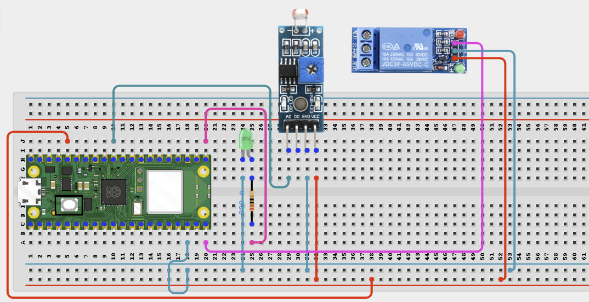

# Project 2.6.6: Smart Farm Lighting System

**Intermediate Embedded Systems Project Using Raspberry Pi Pico 2 W and MicroPython**

---
## Overview

This project builds an automatic lighting controller that switches a low-voltage farm light when ambient light falls below a set threshold.

Students will use an LDR analog input to measure brightness, apply hysteresis with separate ON/OFF thresholds, and control a relay to switch the light.

## Required Components

|  |  |  |  |
| --- | --- | --- | --- |
| <br>LDR module with analog output | <br>LED and 220 Ω resistor | <br>Raspberry Pi Pico 2 W | <br>1-channel relay module |
| <br>Low-voltage lamp or LED strip | <br>External power supply | <br>Breadboard and jumper wires |   |


## Circuit Connections


| Component terminal | Connect to | Pico physical pin | Notes |
|---|---|---|---|
| LDR module AOUT | GPIO 26 | GPIO 26 / physical pin 31 | ADC light input |
| Relay IN | GPIO 15 | GPIO 15 / physical pin 20 | Light control |
| Status LED anode | GPIO 16 through 220 Ω resistor | GPIO 16 / physical pin 21 | Lighting state indicator |
| Status LED cathode | GND | Any GND pin | LED return |
| Light power path | Relay COM to NO contacts | Not a Pico GPIO | Use external low-voltage supply |

---

## Wiring Diagram



---

## Step-by-Step Assembly

### Step 1: Place the Raspberry Pi Pico 2W

Place the Raspberry Pi Pico 2W on the breadboard so it sits across the center gap.

### Step 2: Connect the LDR Module

Connect LDR VCC to 3.3V, AOUT to GPIO 26, and GND to GND.

### Step 3: Wire the Relay Module

Connect Relay IN to GPIO 15 and power the relay module from the required supply. Connect relay COM/NO to the lamp supply as appropriate.

### Step 4: Connect Status LED

Connect an LED (through 220 Ω) to GPIO 16 and GND for a visual indicator.

---

## Wiring Check

- [x] Pico 2W placed correctly across the breadboard center gap
- [x] LDR AOUT connected to GPIO 26
- [x] Relay IN connected to GPIO 15
- [x] Status LED connected through 220 Ω to GPIO 16
- [x] Light power path uses relay COM and NO and external supply

---

## Testing Individual Components

- Test the LDR readings in bright and dark conditions
- Test the relay switching with the LED before connecting the real light
- Tune ON and OFF thresholds to avoid chatter

---

## Full Project Code

```python
from machine import ADC, Pin
import time

ldr = ADC(26)
relay = Pin(15, Pin.OUT)
status_led = Pin(16, Pin.OUT)

light_on_threshold = 30
light_off_threshold = 45
min_switch_gap_s = 20
lights_on = False
last_switch = time.time() - min_switch_gap_s

relay.off()
status_led.off()

def light_percent():
    raw = ldr.read_u16()
    return int((raw / 65535) * 100)

print("Smart farm lighting system ready")
while True:
    level = light_percent()
    now = time.time()
    if (not lights_on) and level <= light_on_threshold and (now - last_switch) >= min_switch_gap_s:
        relay.on()
        status_led.on()
        lights_on = True
        last_switch = now
        print("Farm lights ON: ambient light below threshold")
    elif lights_on and level >= light_off_threshold and (now - last_switch) >= min_switch_gap_s:
        relay.off()
        status_led.off()
        lights_on = False
        last_switch = now
        print("Farm lights OFF: ambient light recovered")
    else:
        print("Light:{}% Lights:{}".format(level, "ON" if lights_on else "OFF"))
    time.sleep(3)
```

---

## How the Code Works

- `light_on_threshold` and `light_off_threshold`: define hysteresis levels
- `min_switch_gap_s`: prevents rapid relay cycling
- `light_percent()`: converts ADC values to percentage for easier tuning

---

## Expected Result

The relay should close and the status LED should light when ambient light falls below the ON threshold, and the output should remain on until the OFF threshold is reached.

---

## Troubleshooting

| Problem | Possible cause | Solution |
|---------|----------------|----------|
| Light always on | Threshold too high or miswired divider | Lower ON threshold and verify wiring |
| Light never turns on | ADC reading not reaching dark threshold or relay polarity reversed | Cover LDR, verify ADC readings and relay logic |
| Relay chatters | ON/OFF thresholds too close | Increase hysteresis or min switch gap |

---
