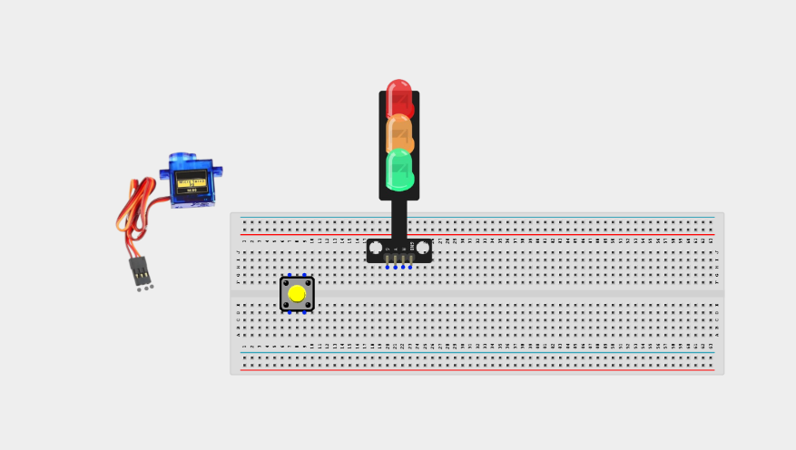
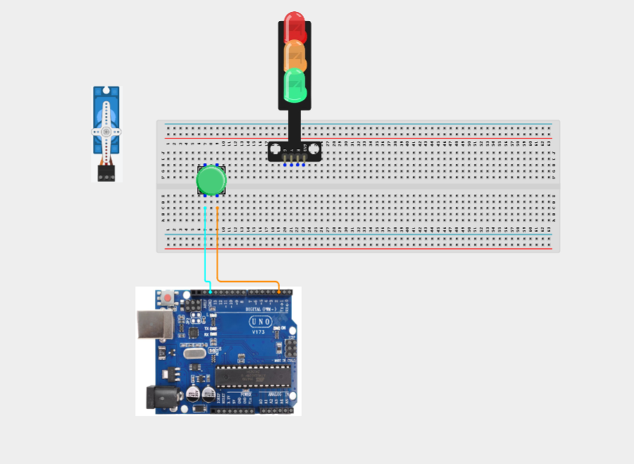
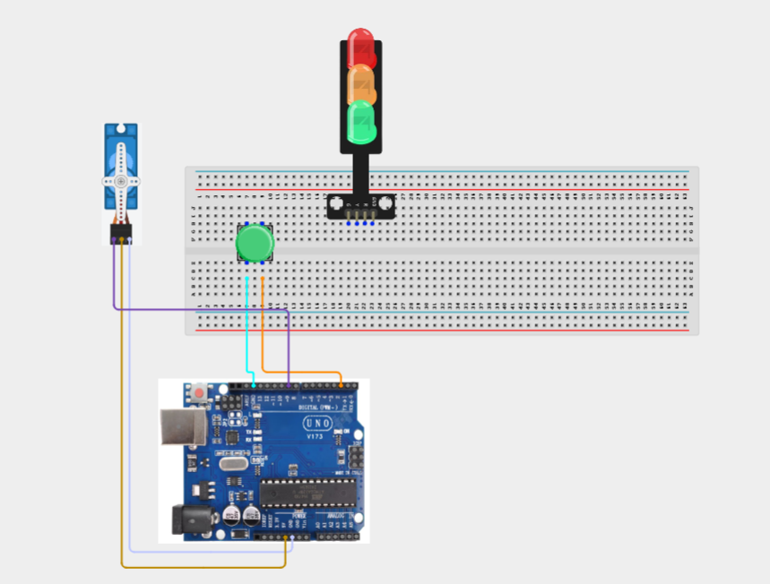
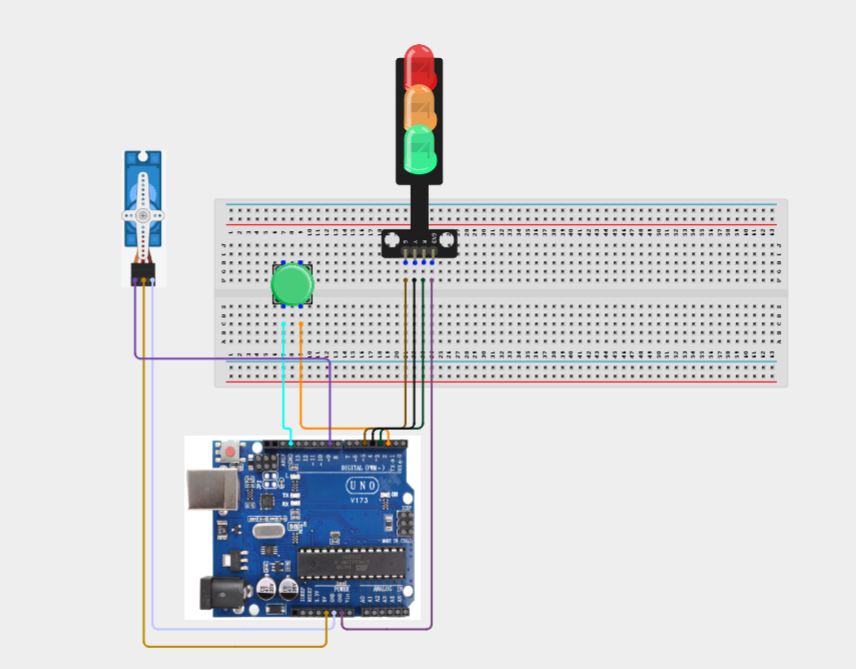
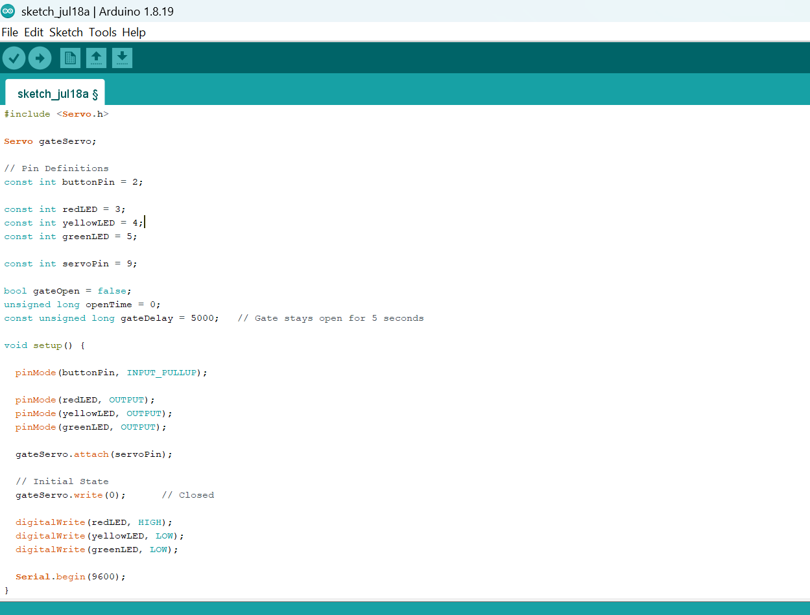
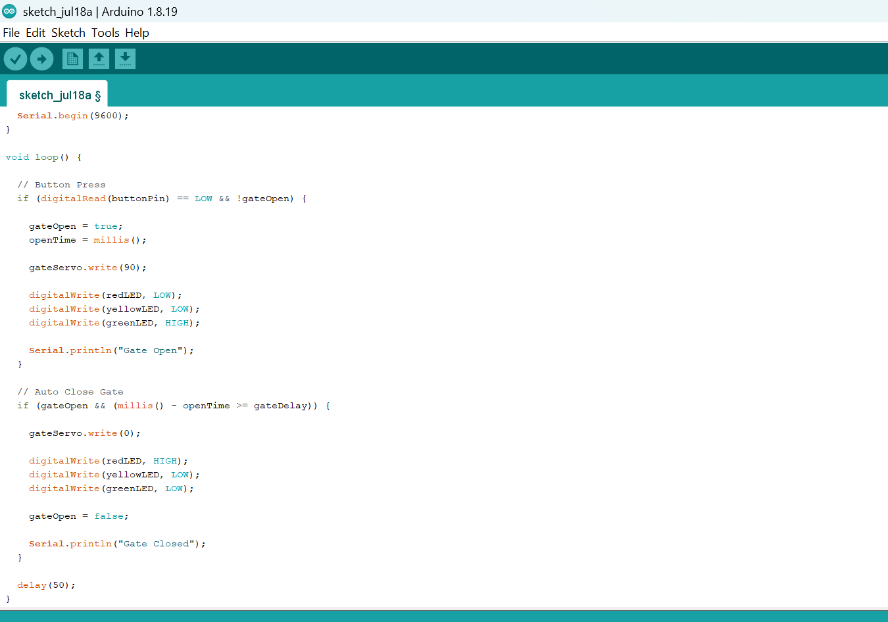

# Project 3.10.1: Interactive Toll Gate Barrier

| **Description** | Learn how to build an automated toll gate barrier using a push button, servo motor, and traffic light module. Pressing the button opens the gate and changes the traffic light to green. After a short delay, the gate automatically closes and the light returns to red. |
|------------------|----------------------------------------------------------------|
| **Use case**     | This project can be used in automated toll booths, parking entrances, gated communities, industrial access control systems, and security checkpoints. |

## Components (Things You will need)

|  |  |  |  |  |  |  |
| --------------------------------------------------- | ------------------------------------------------------ | ----------------------------------------------------------- | --------------------------------------------------------- | ------------------------------------------------------ | ------------------------------------------------------ | ------------------------------------------------------ |

## Building the circuit

Things Needed:

- Arduino Uno = 1
- Arduino USB cable = 1
- Push button = 1
- Servo motor = 1
- Traffic light module = 1
- Jumper Wires


## Mounting the component on the breadboard

**Step 1:** arefully mount the Push Button, Servo Motor, and Traffic Light Module on the breadboard, arranging them neatly with enough spacing to reduce wire crossings and make wiring and troubleshooting easier.



_**NB:** For complex circuits, plan your component placement to minimize wire crossing and ensure clean connections._

## WIRING THE CIRCUIT

**Step 2:**Connect the Push Button to the Arduino Uno by connecting one terminal of the button to Digital Pin 2 and the opposite terminal to GND. 



**Step 3:**Connect the Servo Motor to the Arduino Uno by connecting the Brown/Black (GND) wire to GND, the Red (VCC) wire to 5V, and the Orange/Yellow (Signal) wire to Digital Pin 9.



**Step 4:** Connect the Traffic Light Module to the Arduino Uno by connecting the Red signal pin to Digital Pin 3, the Yellow signal pin to Digital Pin 4, the Green signal pin to Digital Pin 5, and the GND pin to GND.



## PROGRAMMING

**Step 1:** Open your Arduino IDE. See how to set up here: [Getting Started](../../Getting Started/Arduino_IDE_Setup.md).

**Step 2:** Write the complete program implementing the system logic with appropriate pin definitions, setup configuration, and the main control loop.

```cpp
#include <Servo.h>

Servo gateServo;

// Pin Definitions
const int buttonPin = 2;

const int redLED = 3;
const int yellowLED = 4;
const int greenLED = 5;

const int servoPin = 9;

bool gateOpen = false;
unsigned long openTime = 0;
const unsigned long gateDelay = 5000;   // Gate stays open for 5 seconds

void setup() {

  pinMode(buttonPin, INPUT_PULLUP);

  pinMode(redLED, OUTPUT);
  pinMode(yellowLED, OUTPUT);
  pinMode(greenLED, OUTPUT);

  gateServo.attach(servoPin);

  // Initial State
  gateServo.write(0);      // Closed

  digitalWrite(redLED, HIGH);
  digitalWrite(yellowLED, LOW);
  digitalWrite(greenLED, LOW);

  Serial.begin(9600);
}

void loop() {

  // Button Press
  if (digitalRead(buttonPin) == LOW && !gateOpen) {

    gateOpen = true;
    openTime = millis();

    gateServo.write(90);

    digitalWrite(redLED, LOW);
    digitalWrite(yellowLED, LOW);
    digitalWrite(greenLED, HIGH);

    Serial.println("Gate Open");
  }

  // Auto Close Gate
  if (gateOpen && (millis() - openTime >= gateDelay)) {

    gateServo.write(0);

    digitalWrite(redLED, HIGH);
    digitalWrite(yellowLED, LOW);
    digitalWrite(greenLED, LOW);

    gateOpen = false;

    Serial.println("Gate Closed");
  }

  delay(50);
}
```




**Step 3:** Save your code. _See the [Getting Started](../../Getting Started/Arduino_IDE_Setup.md) section_

**Step 4:** Select the arduino board and port _See the [Getting Started](../../Getting Started/Arduino_IDE_Setup.md) section:Selecting Arduino Board Type and Uploading your code_.

**Step 5:** Upload your code. _See the [Getting Started](../../Getting Started/Arduino_IDE_Setup.md) section:Selecting Arduino Board Type and Uploading your code_

## CONCLUSION

This project demonstrates how input devices, servo motors, and visual indicators can be integrated to create an automated barrier control system. It reinforces concepts such as digital input handling, servo motor control, timing with Arduino, and real-world automation used in access management system
