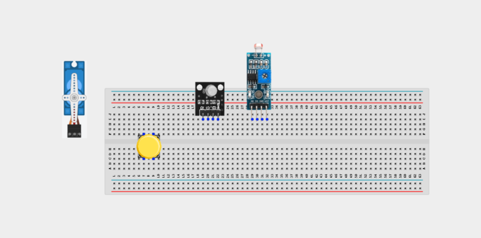
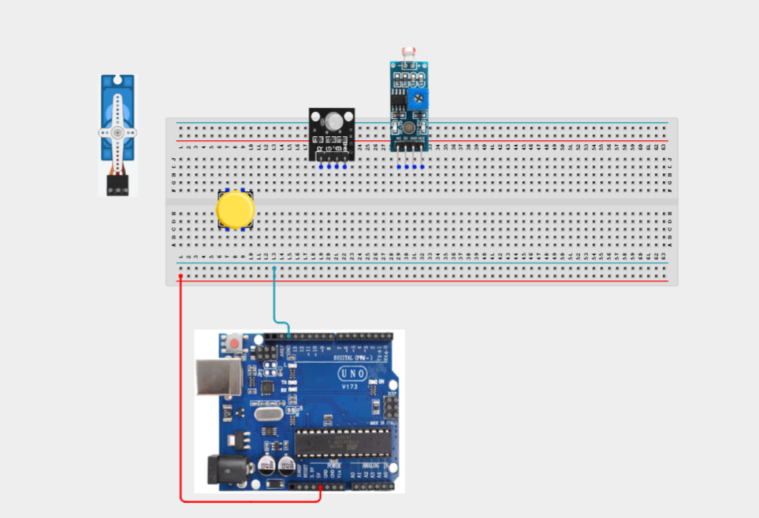
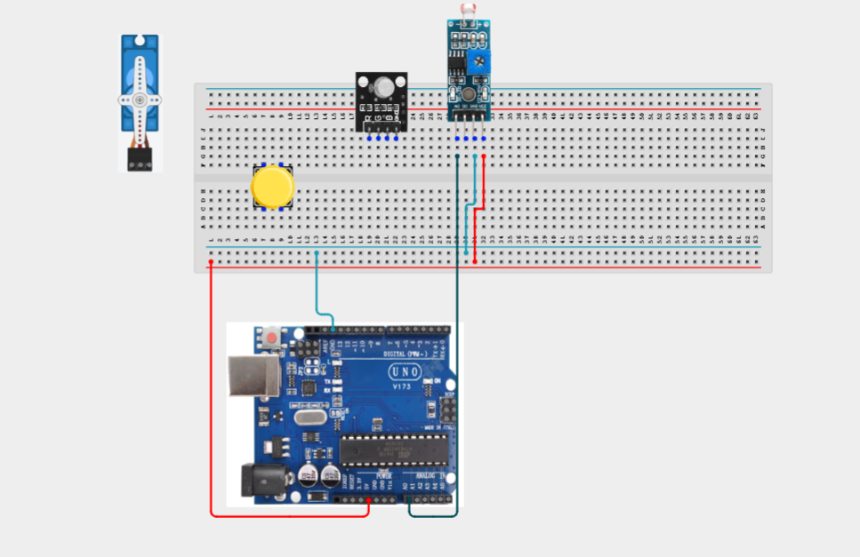
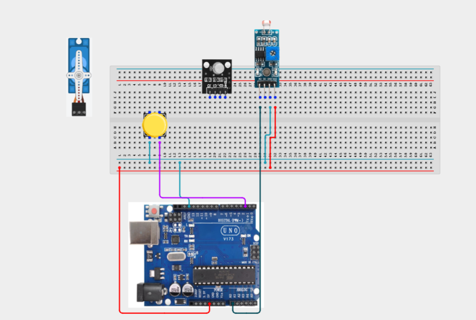
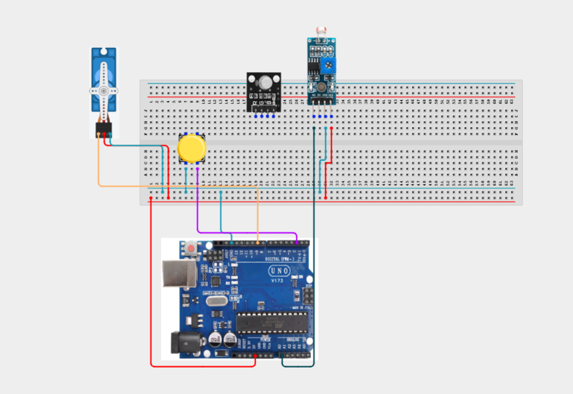
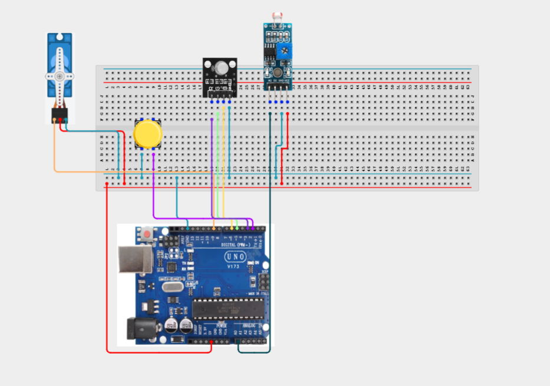
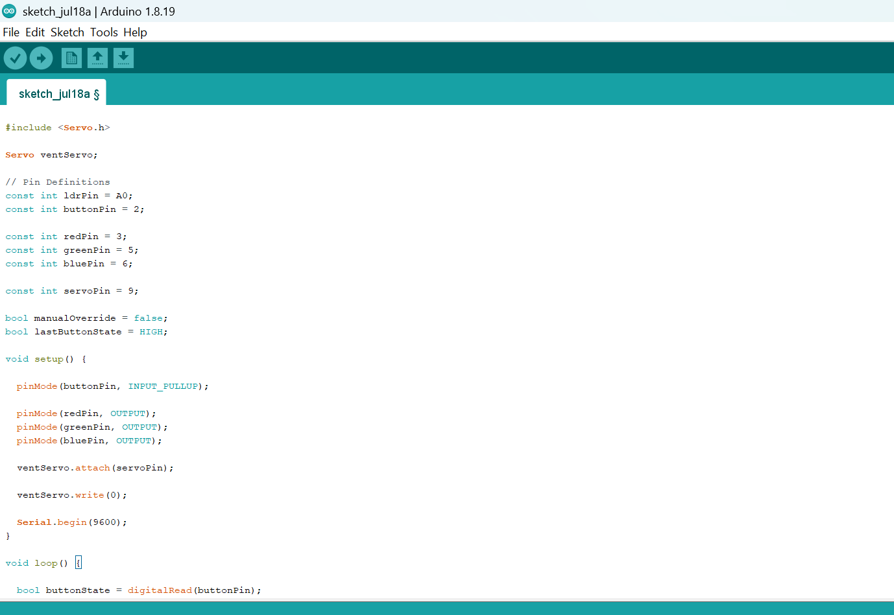
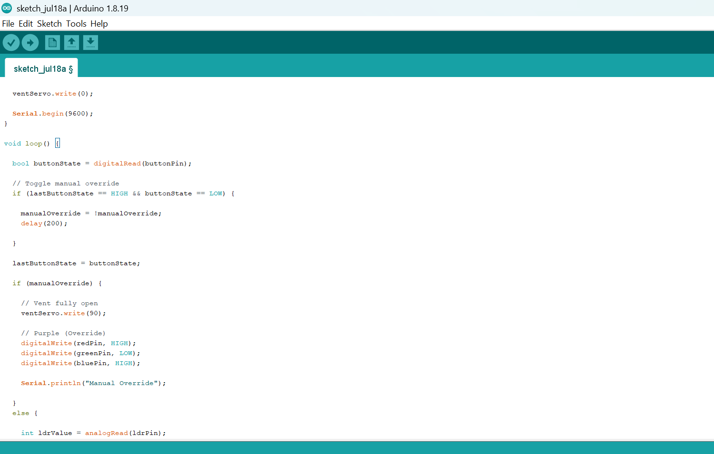
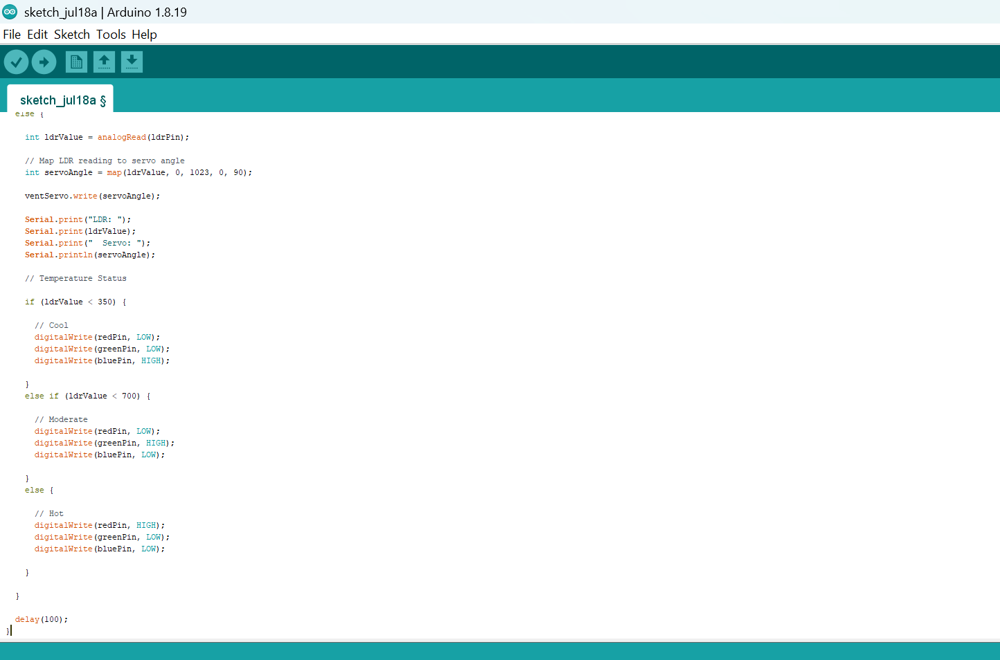

# Project 3.11.1: Smart Thermostat Simulator

| **Description** | Learn how to simulate a smart thermostat using an LDR module, servo motor, RGB LED, and push button. The LDR estimates a heat index based on light intensity, automatically controlling a ventilation flap while the push button provides manual override. |
|------------------|----------------------------------------------------------------|
| **Use case**     | This project can be applied in smart home ventilation systems, automated greenhouse climate control, HVAC demonstrations, classroom simulations, and intelligent environmental monitoring. |

## Components (Things You will need)

|  |  |  |  |  |  |  |  |
| --------------------------------------------------- | ------------------------------------------------------ | ----------------------------------------------------------- | --------------------------------------------------------- | ------------------------------------------------------ | ------------------------------------------------------ | ------------------------------------------------------ |------------------------------------------------------ |

## Building the circuit

Things Needed:

- Arduino Uno = 1
- Arduino USB cable = 1
- LDR module = 1
- Push button = 1
- Servo motor = 1
- RGB LED module = 1
- Jumper Wires

## Mounting the component on the breadboard

**Step 1:**Carefully mount the LDR Module, Push Button, Servo Motor, RGB LED, and 220 Ω resistors (for the RGB LED) on the breadboard, ensuring the components are spaced appropriately to allow for neat wiring and easier troubleshooting.



_**NB:** For complex circuits, plan your component placement to minimize wire crossing and ensure clean connections._

## WIRING THE CIRCUIT

**Step 2:**onnect the 5V pin on the Arduino Uno to the positive (+) power rail on the breadboard and the GND pin to the negative (-) power rail. This provides a common power supply for all the components connected to the breadboard.



**Step 3:** Connect the LDR Module to the Arduino Uno by connecting the VCC pin to the positive (+) power rail on the breadboard, the GND pin to the negative (-) power rail, and the OUT pin to Analog Pin A0 on the Arduino.



**Step 4:** Connect the Push Button to the Arduino Uno by connecting one terminal of the button to Digital Pin 2 and the opposite terminal to the GND rail on the breadboard.



**Step 5:**Connect the Servo Motor to the Arduino Uno by connecting the Red (VCC) wire to the positive (+) power rail on the breadboard, the Brown/Black (GND) wire to the negative (-) power rail, and the Orange/Yellow (Signal) wire to Digital Pin 9 on the Arduino

_Note: If the servo behaves erratically, use an external regulated 5V power supply and connect its ground to the Arduino GND._



**Step 6:** Connect the RGB LED Module to the Arduino Uno by connecting the GND pin to the negative (-) power rail on the breadboard, the Red signal pin to Digital Pin 3, the Green signal pin to Digital Pin 5, and the Blue signal pin to Digital Pin 6.



_Make sure to connect the Arduino USB cable to the Arduino board._

## PROGRAMMING

**Step 1:** Open your Arduino IDE. See how to set up here: [Getting Started](../../Getting Started/Arduino_IDE_Setup.md).

**Step 2:** Write the complete program implementing the system logic with appropriate pin definitions, setup configuration, and the main control loop.

```cpp

#include <Servo.h>

Servo ventServo;

// Pin Definitions
const int ldrPin = A0;
const int buttonPin = 2;

const int redPin = 3;
const int greenPin = 5;
const int bluePin = 6;

const int servoPin = 9;

bool manualOverride = false;
bool lastButtonState = HIGH;

void setup() {

  pinMode(buttonPin, INPUT_PULLUP);

  pinMode(redPin, OUTPUT);
  pinMode(greenPin, OUTPUT);
  pinMode(bluePin, OUTPUT);

  ventServo.attach(servoPin);

  ventServo.write(0);

  Serial.begin(9600);
}

void loop() {

  bool buttonState = digitalRead(buttonPin);

  // Toggle manual override
  if (lastButtonState == HIGH && buttonState == LOW) {

    manualOverride = !manualOverride;
    delay(200);

  }

  lastButtonState = buttonState;

  if (manualOverride) {

    // Vent fully open
    ventServo.write(90);

    // Purple (Override)
    digitalWrite(redPin, HIGH);
    digitalWrite(greenPin, LOW);
    digitalWrite(bluePin, HIGH);

    Serial.println("Manual Override");

  }
  else {

    int ldrValue = analogRead(ldrPin);

    // Map LDR reading to servo angle
    int servoAngle = map(ldrValue, 0, 1023, 0, 90);

    ventServo.write(servoAngle);

    Serial.print("LDR: ");
    Serial.print(ldrValue);
    Serial.print("  Servo: ");
    Serial.println(servoAngle);

    // Temperature Status

    if (ldrValue < 350) {

      // Cool
      digitalWrite(redPin, LOW);
      digitalWrite(greenPin, LOW);
      digitalWrite(bluePin, HIGH);

    }
    else if (ldrValue < 700) {

      // Moderate
      digitalWrite(redPin, LOW);
      digitalWrite(greenPin, HIGH);
      digitalWrite(bluePin, LOW);

    }
    else {

      // Hot
      digitalWrite(redPin, HIGH);
      digitalWrite(greenPin, LOW);
      digitalWrite(bluePin, LOW);

    }

  }

  delay(100);
}
```






**Step 7:** Save your code. _See the [Getting Started](../../Getting Started/Arduino_IDE_Setup.md) section_

**Step 8:** Select the arduino board and port _See the [Getting Started](../../Getting Started/Arduino_IDE_Setup.md) section:Selecting Arduino Board Type and Uploading your code_.

**Step 9:** Upload your code. _See the [Getting Started](../../Getting Started/Arduino_IDE_Setup.md) section:Selecting Arduino Board Type and Uploading your code_

## CONCLUSION

This project demonstrates how sensor inputs, actuator control, and manual user interaction can be combined to create a simple smart thermostat simulator. It reinforces concepts such as analog sensing, servo motor control, digital inputs, conditional programming, and automation commonly used in intelligent climate control systems.

