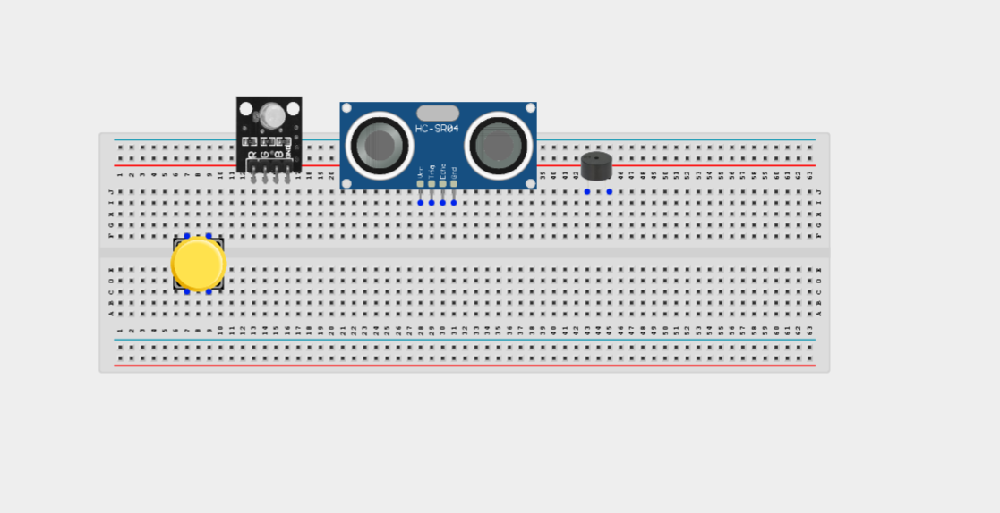
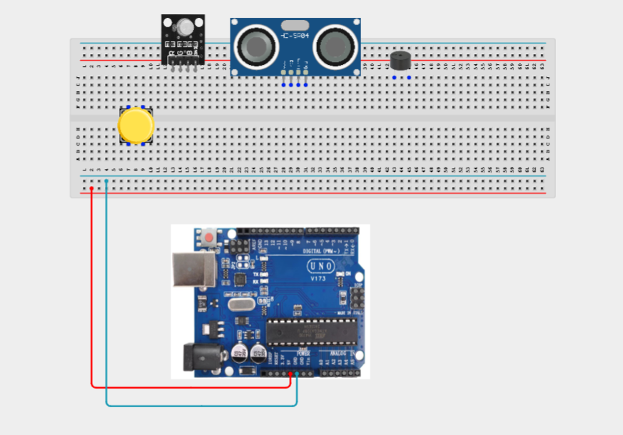
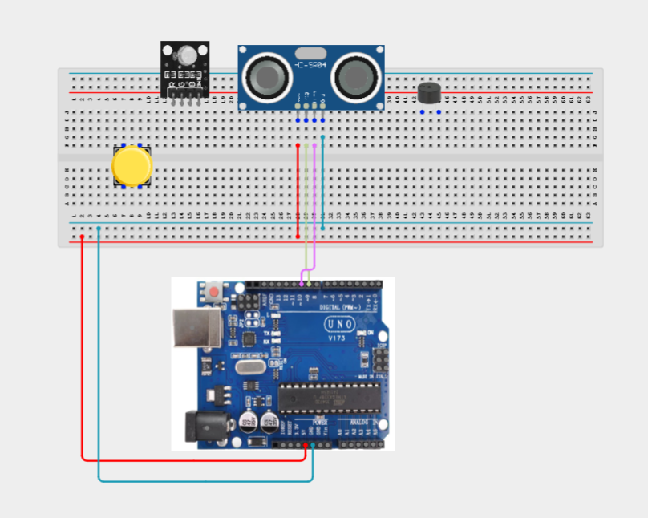
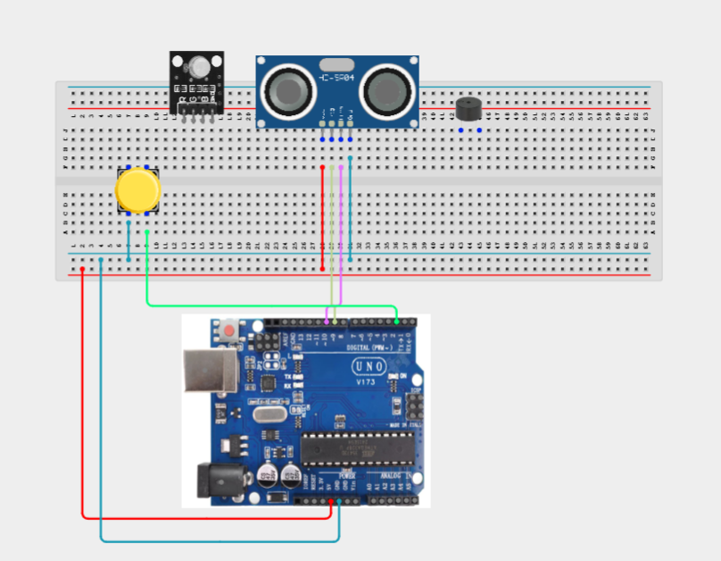
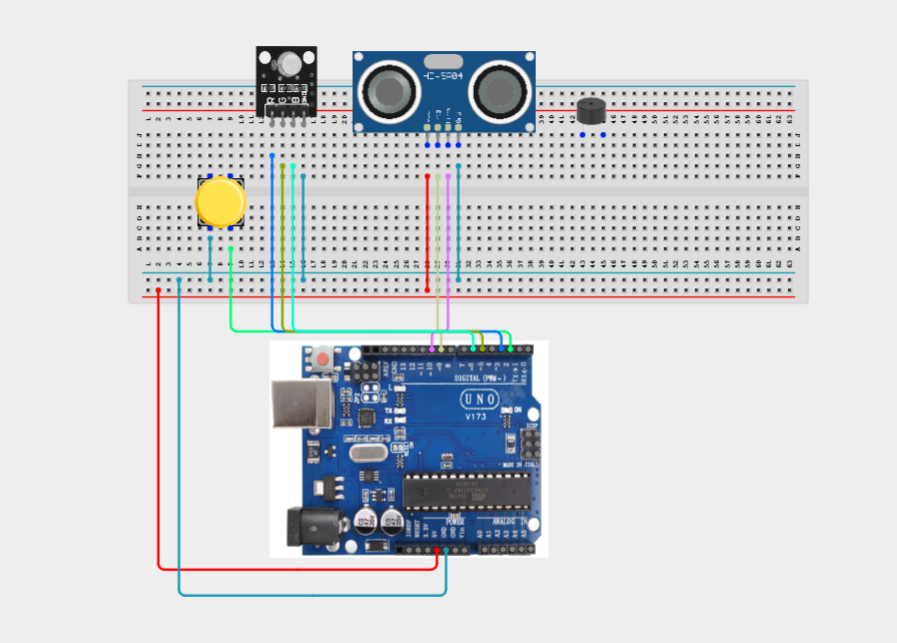
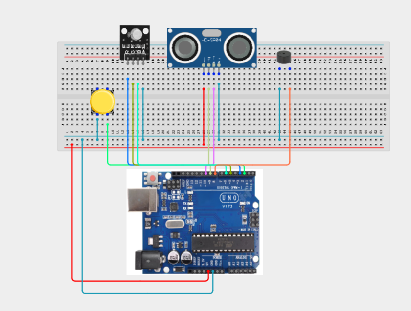
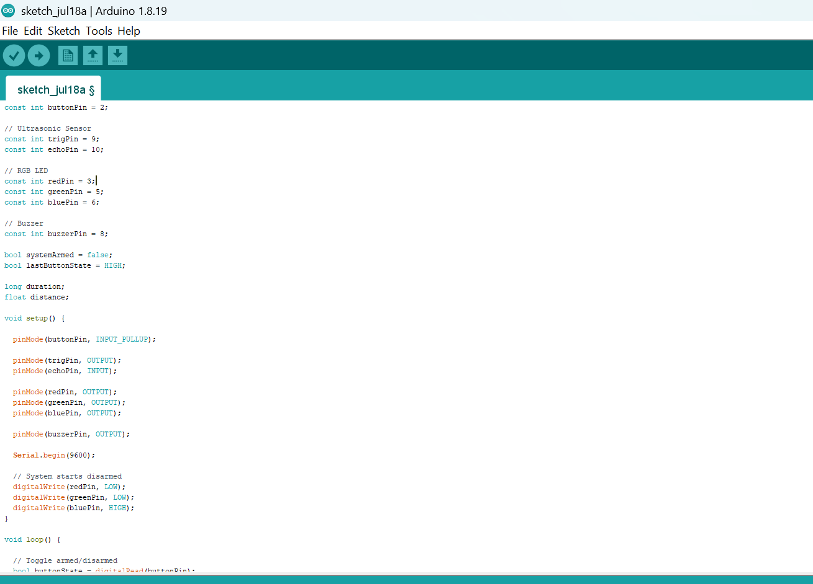
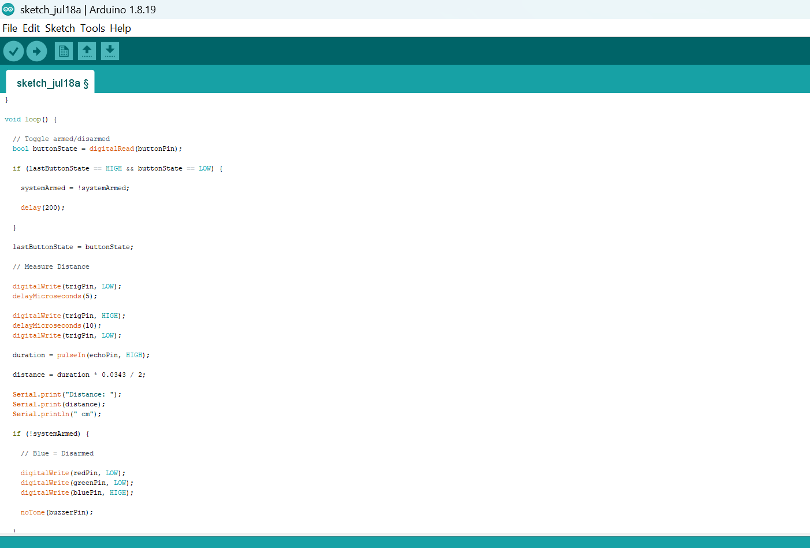
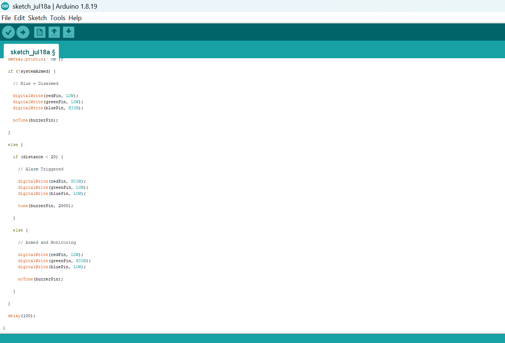

# Project 3.12.1: Armed Intruder Alarm

| **Description** | Button arms/disarms, USS detects intruder, RGB+BZR alarm |
|------------------|----------------------------------------------------------------|
| **Use case**     | This project can be used in advanced automation systems, smart environment control, and integrated sensor-actuator applications. |

## Components (Things You will need)

|  |  |  |  |  |  |  | |
| --------------------------------------------------- | ------------------------------------------------------ | ----------------------------------------------------------- | --------------------------------------------------------- | ------------------------------------------------------ | ------------------------------------------------------ | ------------------------------------------------------ |------------------------------------------------------ |

## Building the circuit

Things Needed:

- Arduino Uno = 1
- Arduino USB cable = 1
- Push button = 1
- Ultrasonic sensor = 1
- RGB LED module = 1
- Buzzer = 1
- Jumper Wires
- 220Ω resistor


## Mounting the component on the breadboard

**Step 1:**Carefully mount the Ultrasonic Sensor (HC-SR04), Push Button, RGB LED Module, and Buzzer on the breadboard, ensuring the components are arranged neatly with enough space between them for easy wiring, proper connections, and troubleshooting.



_**NB:** For complex circuits, plan your component placement to minimize wire crossing and ensure clean connections._

## WIRING THE CIRCUIT

**Step 2:**Connect the 5V pin of the Arduino Uno to the positive (+) power rail of the breadboard and connect the GND pin to the negative (-) power rail. These power rails will provide a common power supply connection for the components.

Connect all powered components to these rails instead of directly to the Arduino.



**Step 3:** Connect the Ultrasonic Sensor (HC-SR04) to the Arduino Uno by connecting the VCC pin to the positive (+) power rail on the breadboard, the GND pin to the negative (-) power rail, the TRIG pin to Digital Pin 9, and the ECHO pin to Digital Pin 10.


**Step 4:** Connect the Push Button to the Arduino Uno by connecting one terminal of the button to Digital Pin 2 and the opposite terminal to the negative (-) power rail on the breadboard.



**Step 5:** Connect the RGB LED Module to the Arduino Uno by connecting the GND pin to the negative (-) power rail on the breadboard, the Red pin to Digital Pin 3, the Green pin to Digital Pin 5, and the Blue pin to Digital Pin 6.



**Step 6:** Connect the Buzzer to the Arduino Uno by connecting the Positive (+) pin of the buzzer to Digital Pin 8 and the Negative (–) pin to the negative (-) power rail on the breadboard.



_Make sure to connect the Arduino USB cable to the Arduino board._

## PROGRAMMING

**Step 1:** Open your Arduino IDE. See how to set up here: [Getting Started](../../Getting Started/Arduino_IDE_Setup.md).

**Step 2:** Write the complete program implementing the system logic with appropriate pin definitions, setup configuration, and the main control loop.

```cpp
const int buttonPin = 2;

// Ultrasonic Sensor
const int trigPin = 9;
const int echoPin = 10;

// RGB LED
const int redPin = 3;
const int greenPin = 5;
const int bluePin = 6;

// Buzzer
const int buzzerPin = 8;

bool systemArmed = false;
bool lastButtonState = HIGH;

long duration;
float distance;

void setup() {

  pinMode(buttonPin, INPUT_PULLUP);

  pinMode(trigPin, OUTPUT);
  pinMode(echoPin, INPUT);

  pinMode(redPin, OUTPUT);
  pinMode(greenPin, OUTPUT);
  pinMode(bluePin, OUTPUT);

  pinMode(buzzerPin, OUTPUT);

  Serial.begin(9600);

  // System starts disarmed
  digitalWrite(redPin, LOW);
  digitalWrite(greenPin, LOW);
  digitalWrite(bluePin, HIGH);
}

void loop() {

  // Toggle armed/disarmed
  bool buttonState = digitalRead(buttonPin);

  if (lastButtonState == HIGH && buttonState == LOW) {

    systemArmed = !systemArmed;

    delay(200);

  }

  lastButtonState = buttonState;

  // Measure Distance

  digitalWrite(trigPin, LOW);
  delayMicroseconds(5);

  digitalWrite(trigPin, HIGH);
  delayMicroseconds(10);
  digitalWrite(trigPin, LOW);

  duration = pulseIn(echoPin, HIGH);

  distance = duration * 0.0343 / 2;

  Serial.print("Distance: ");
  Serial.print(distance);
  Serial.println(" cm");

  if (!systemArmed) {

    // Blue = Disarmed

    digitalWrite(redPin, LOW);
    digitalWrite(greenPin, LOW);
    digitalWrite(bluePin, HIGH);

    noTone(buzzerPin);

  }

  else {

    if (distance < 20) {

      // Alarm Triggered

      digitalWrite(redPin, HIGH);
      digitalWrite(greenPin, LOW);
      digitalWrite(bluePin, LOW);

      tone(buzzerPin, 2000);

    }

    else {

      // Armed and Monitoring

      digitalWrite(redPin, LOW);
      digitalWrite(greenPin, HIGH);
      digitalWrite(bluePin, LOW);

      noTone(buzzerPin);

    }

  }

  delay(100);

}
```







**Step 7:** Save your code. _See the [Getting Started](../../Getting Started/Arduino_IDE_Setup.md) section_

**Step 8:** Select the arduino board and port _See the [Getting Started](../../Getting Started/Arduino_IDE_Setup.md) section:Selecting Arduino Board Type and Uploading your code_.

**Step 9:** Upload your code. _See the [Getting Started](../../Getting Started/Arduino_IDE_Setup.md) section:Selecting Arduino Board Type and Uploading your code_


## CONCLUSION

This project demonstrates how multiple input and output devices can be integrated to create a simple security system. It reinforces concepts such as distance sensing, digital input handling, system state management, conditional programming, and alarm control, which are widely used in modern security and automation systems.

