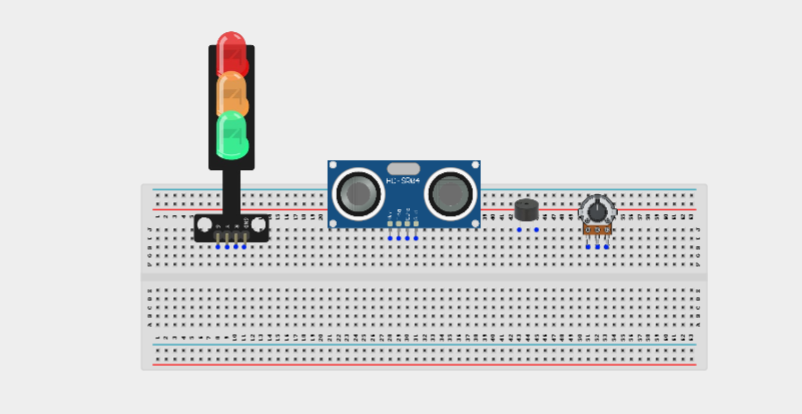
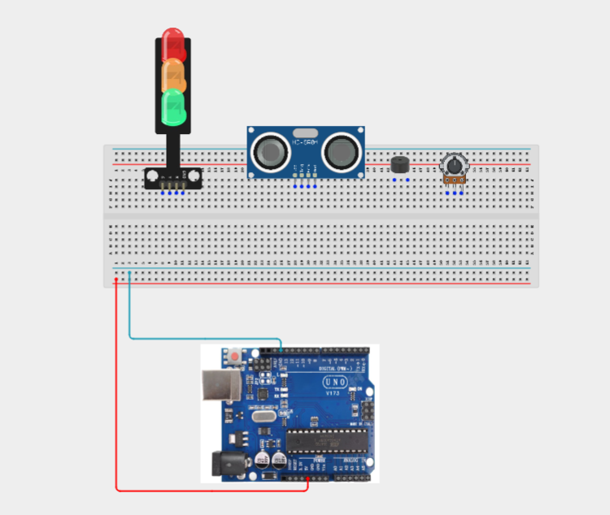
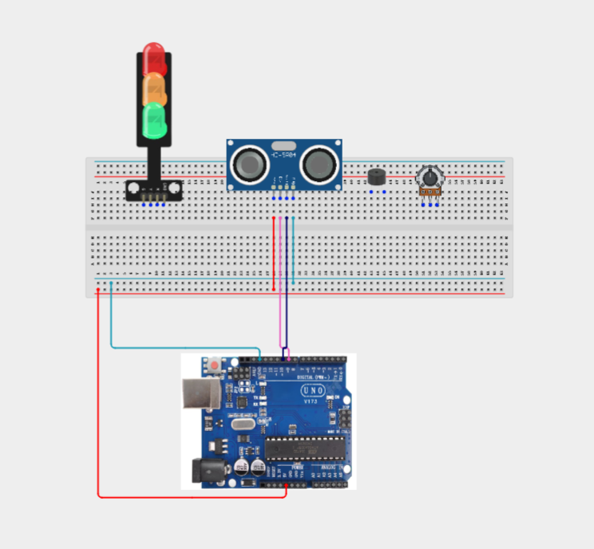
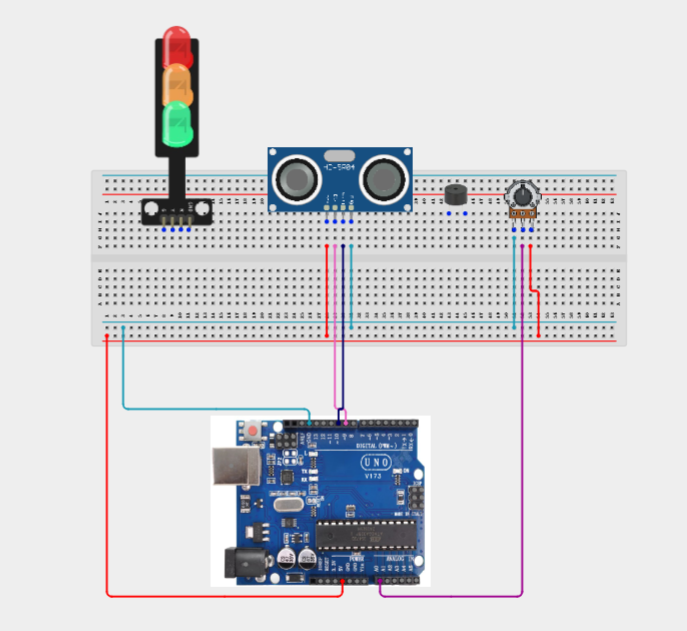
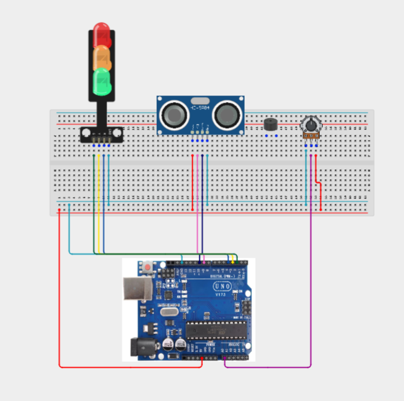
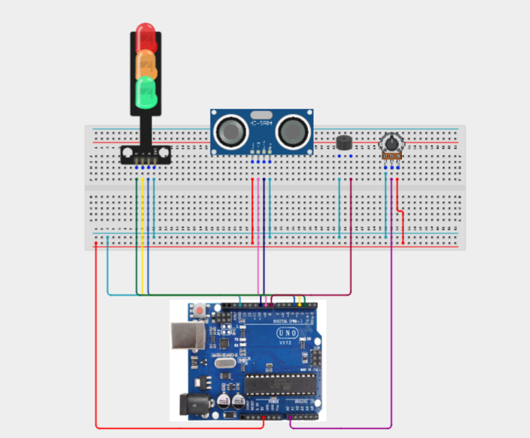
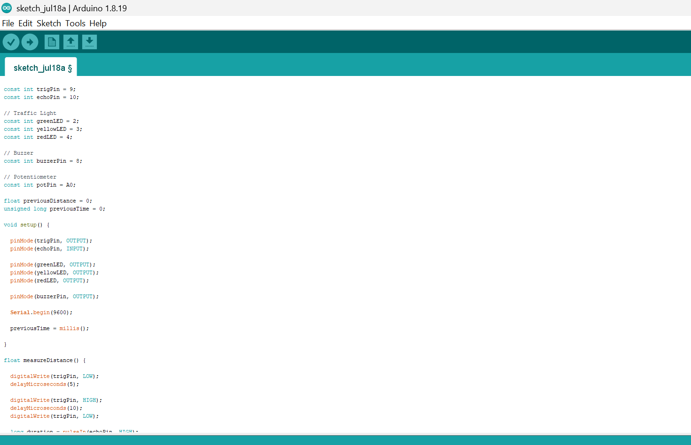
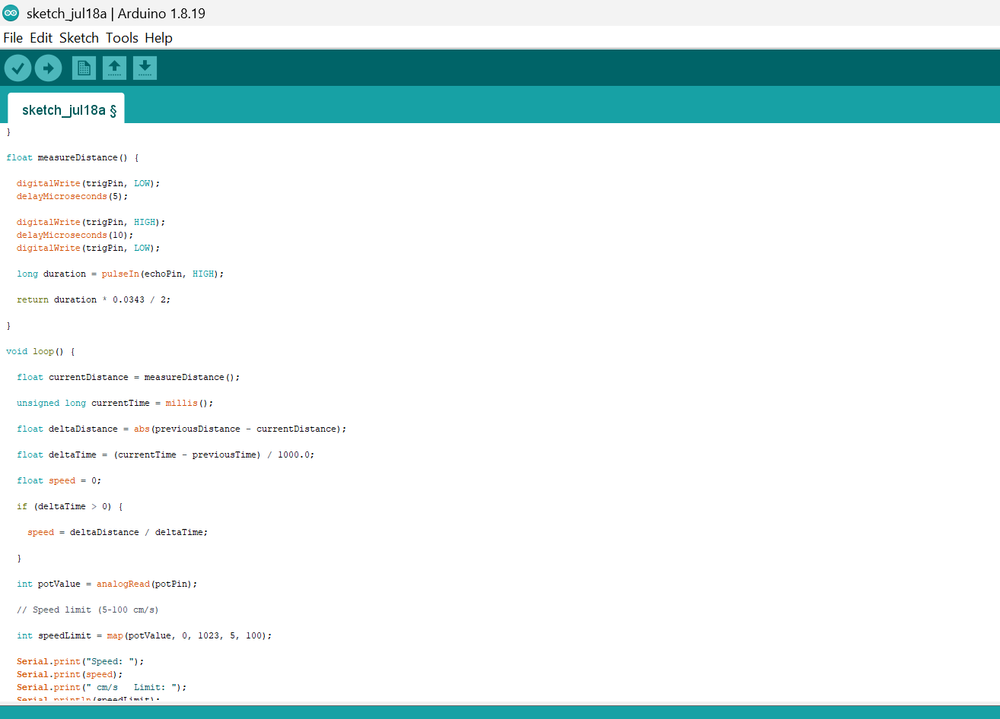
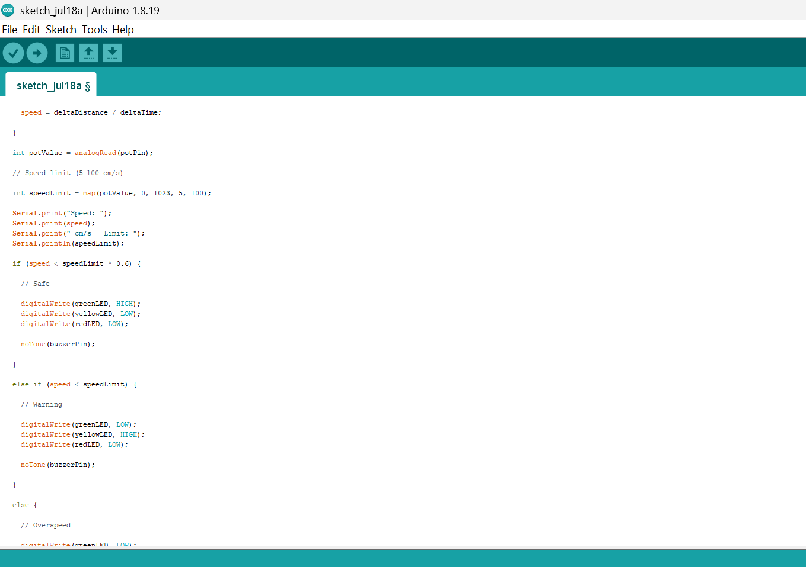
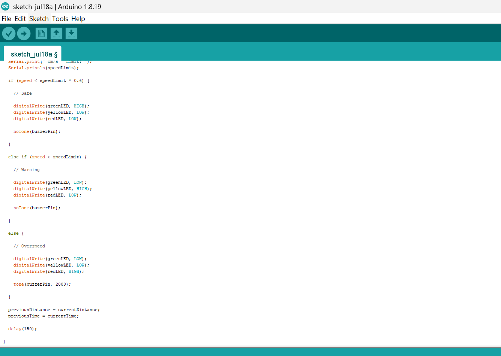

# Project 3.13.1: Speed Trapping Radar Warning

| **Description** | Learn how to build a speed monitoring simulator using an ultrasonic sensor, potentiometer, traffic light module, and buzzer. The ultrasonic sensor estimates the speed of a moving object by measuring changes in distance over time. The potentiometer sets the allowable speed limit, while the traffic light module and buzzer provide visual and audible warnings when the limit is exceeded. |
|------------------|----------------------------------------------------------------|
| **Use case**     | This project demonstrates the principles of speed monitoring systems used in school zones, industrial facilities, warehouses, parking areas, and traffic management applications. It introduces learners to the concept of estimating speed using distance measurements and real-time data processing. |

## Components (Things You will need)

|  |  |  |  |  |  |  |  |
| --------------------------------------------------- | ------------------------------------------------------ | ----------------------------------------------------------- | --------------------------------------------------------- | ------------------------------------------------------ | ------------------------------------------------------ | ------------------------------------------------------ |------------------------------------------------------ |

## Building the circuit

Things Needed:

- Arduino Uno = 1
- Arduino USB cable = 1
- Ultrasonic sensor = 1
- Potentiometer = 1
- Traffic light module = 1
- Buzzer = 1
- Jumper Wires


## Mounting the component on the breadboard

**Step 1:** Carefully mount the Ultrasonic Sensor (HC-SR04), Potentiometer, Traffic Light Module, and Buzzer on the breadboard, ensuring the components are arranged neatly with enough spacing to simplify wiring, reduce wire crossings, and make troubleshooting easier.



_**NB:** For complex circuits, plan your component placement to minimize wire crossing and ensure clean connections._

## WIRING THE CIRCUIT

**Step 2:** Connect the 5V pin of the Arduino Uno to the positive (+) power rail of the breadboard and connect the GND pin to the negative (–) power rail. Connect all components that require power to these rails to provide a common and stable power supply throughout the circuit.



**Step 3:** Connect the Ultrasonic Sensor (HC-SR04) to the Arduino Uno by connecting the VCC pin to the positive (+) power rail on the breadboard, the GND pin to the negative (–) power rail, the TRIG pin to Digital Pin 9, and the ECHO pin to Digital Pin 10.




**Step 4:** Connect the Potentiometer to the Arduino Uno by connecting the left pin to the negative (–) power rail on the breadboard, the middle pin (wiper) to Analog Pin A0, and the right pin to the positive (+) power rail.



**Step 5:**  Connect the Traffic Light Module to the Arduino Uno by connecting the Red signal pin to Digital Pin 4, the Yellow signal pin to Digital Pin 3, the Green signal pin to Digital Pin 2, the GND pin to the negative (–) power rail on the breadboard, and the VCC pin (if required by the module) to the positive (+) power rail.



**Step 6:** Connect the Buzzer to the Arduino Uno by connecting the Positive (+) pin of the buzzer to Digital Pin 8 and the Negative (–) pin to the negative (–) power rail on the breadboard.



_Make sure to connect the Arduino USB cable to the Arduino board._

## PROGRAMMING

**Step 1:** Open your Arduino IDE. See how to set up here: [Getting Started](../../Getting Started/Arduino_IDE_Setup.md).

**Step 2:** Write the complete program implementing the system logic with appropriate pin definitions, setup configuration, and the main control loop.

```cpp

const int trigPin = 9;
const int echoPin = 10;

// Traffic Light
const int greenLED = 2;
const int yellowLED = 3;
const int redLED = 4;

// Buzzer
const int buzzerPin = 8;

// Potentiometer
const int potPin = A0;

float previousDistance = 0;
unsigned long previousTime = 0;

void setup() {

  pinMode(trigPin, OUTPUT);
  pinMode(echoPin, INPUT);

  pinMode(greenLED, OUTPUT);
  pinMode(yellowLED, OUTPUT);
  pinMode(redLED, OUTPUT);

  pinMode(buzzerPin, OUTPUT);

  Serial.begin(9600);

  previousTime = millis();

}

float measureDistance() {

  digitalWrite(trigPin, LOW);
  delayMicroseconds(5);

  digitalWrite(trigPin, HIGH);
  delayMicroseconds(10);
  digitalWrite(trigPin, LOW);

  long duration = pulseIn(echoPin, HIGH);

  return duration * 0.0343 / 2;

}

void loop() {

  float currentDistance = measureDistance();

  unsigned long currentTime = millis();

  float deltaDistance = abs(previousDistance - currentDistance);

  float deltaTime = (currentTime - previousTime) / 1000.0;

  float speed = 0;

  if (deltaTime > 0) {

    speed = deltaDistance / deltaTime;

  }

  int potValue = analogRead(potPin);

  // Speed limit (5–100 cm/s)

  int speedLimit = map(potValue, 0, 1023, 5, 100);

  Serial.print("Speed: ");
  Serial.print(speed);
  Serial.print(" cm/s   Limit: ");
  Serial.println(speedLimit);

  if (speed < speedLimit * 0.6) {

    // Safe

    digitalWrite(greenLED, HIGH);
    digitalWrite(yellowLED, LOW);
    digitalWrite(redLED, LOW);

    noTone(buzzerPin);

  }

  else if (speed < speedLimit) {

    // Warning

    digitalWrite(greenLED, LOW);
    digitalWrite(yellowLED, HIGH);
    digitalWrite(redLED, LOW);

    noTone(buzzerPin);

  }

  else {

    // Overspeed

    digitalWrite(greenLED, LOW);
    digitalWrite(yellowLED, LOW);
    digitalWrite(redLED, HIGH);

    tone(buzzerPin, 2000);

  }

  previousDistance = currentDistance;
  previousTime = currentTime;

  delay(150);

}
```








**Step 3:** Save your code. _See the [Getting Started](../../Getting Started/Arduino_IDE_Setup.md) section_

**Step 4:** Select the arduino board and port _See the [Getting Started](../../Getting Started/Arduino_IDE_Setup.md) section:Selecting Arduino Board Type and Uploading your code_.

**Step 5:** Upload your code. _See the [Getting Started](../../Getting Started/Arduino_IDE_Setup.md) section:Selecting Arduino Board Type and Uploading your code_

## CONCLUSION

This project demonstrates how sensor measurements, analog calibration, visual indicators, and audible alerts can be combined to simulate a speed monitoring system. It reinforces concepts such as distance measurement, analog input, mathematical calculations, conditional programming, and real-time decision-making, providing a practical introduction to intelligent traffic monitoring systems.
