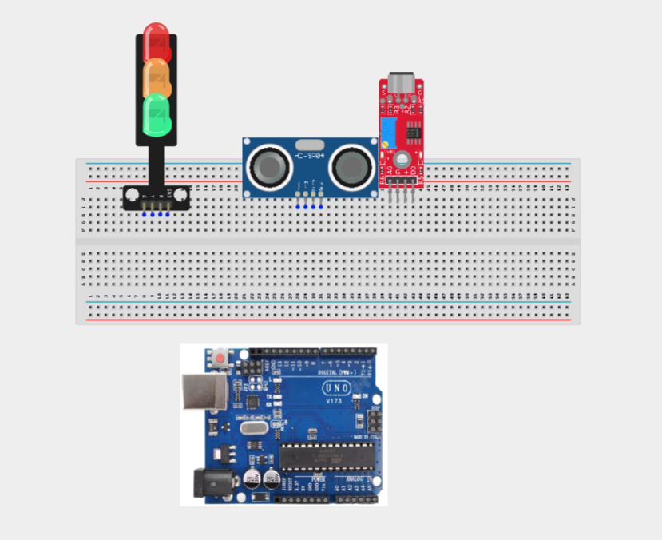
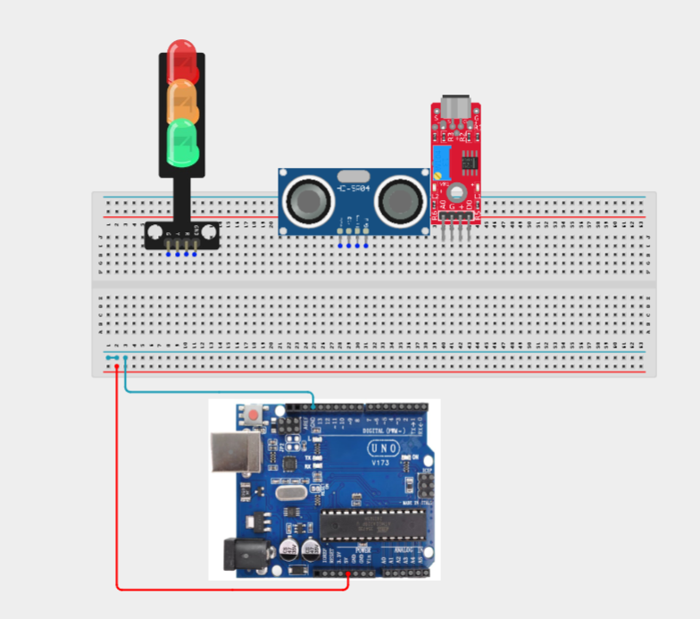
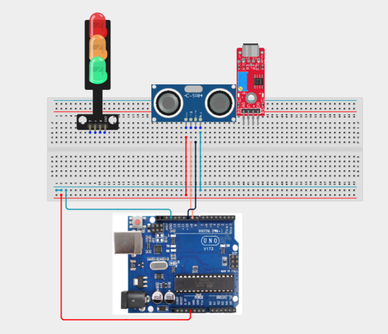
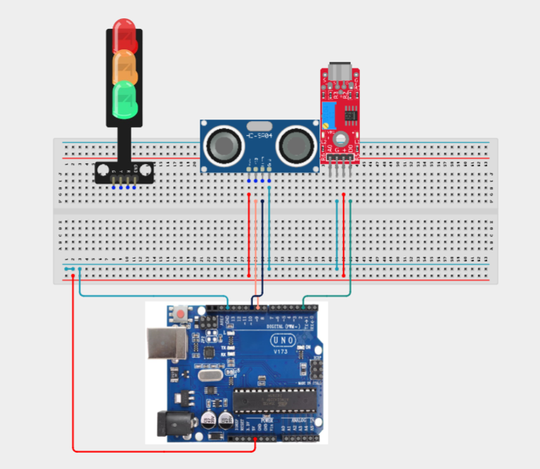
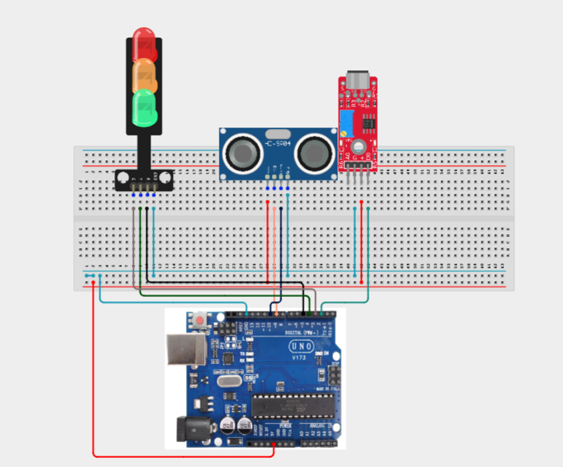
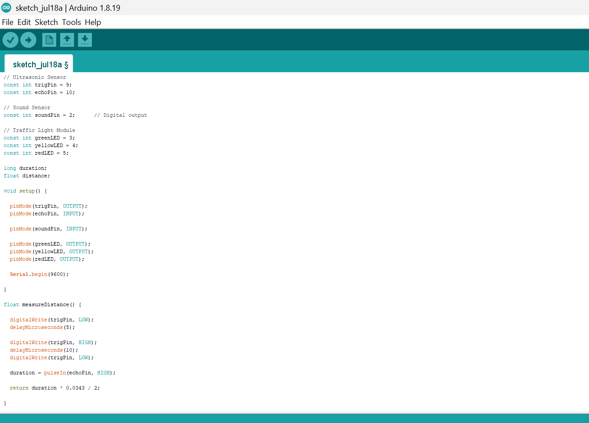
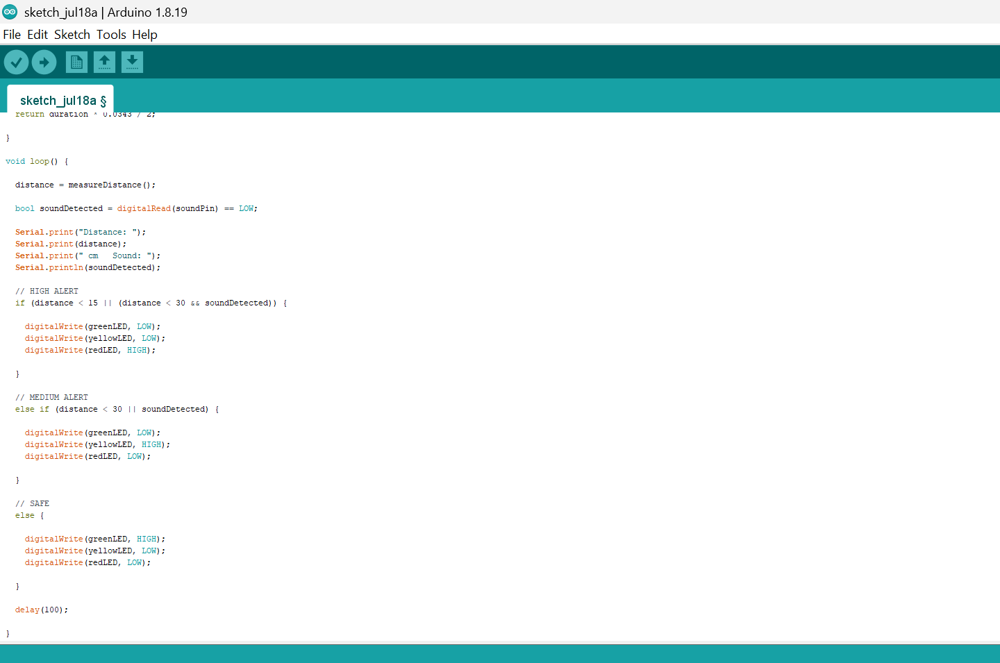

# Project 3.14.1: Sound & Distance Alarm

| **Description** | Learn how to build a multi-sensor alarm system using an ultrasonic sensor, sound sensor, and traffic light module. The system monitors both object proximity and sound levels, escalating the alert status from green to yellow to red based on the detected conditions. |
|------------------|----------------------------------------------------------------|
| **Use case**     | This project can be used for basic security monitoring, warehouse safety, restricted-area surveillance, smart home alert systems, and industrial monitoring, where multiple sensor inputs are combined to improve event detection and response. |

## Components (Things You will need)

|  |  |  |  |  |  | |
| --------------------------------------------------- | ------------------------------------------------------ | ----------------------------------------------------------- | --------------------------------------------------------- | ------------------------------------------------------ | ------------------------------------------------------ | ------------------------------------------------------ |

## Building the circuit

Things Needed:

- Arduino Uno = 1
- Arduino USB cable = 1
- Sound sensor module = 1
- Ultrasonic sensor = 1
- Traffic light module = 1
- Jumper Wires


## Mounting the component on the breadboard

**Step 1:** Carefully mount the Ultrasonic Sensor (HC-SR04), Sound Sensor Module, and Traffic Light Module on the breadboard, ensuring the components are arranged neatly with enough space between them for easy wiring, reduced wire crossings, and simpler troubleshooting.



_**NB:** For complex circuits, plan your component placement to minimize wire crossing and ensure clean connections._

## WIRING THE CIRCUIT

**Step 2:**Connect the 5V pin of the Arduino Uno to the positive (+) power rail of the breadboard and connect the GND pin to the negative (–) power rail. Connect the Ultrasonic Sensor and Sound Sensor Module power pins to these rails to provide a shared power supply for the components.



**Step 3:**Connect the Ultrasonic Sensor (HC-SR04) to the Arduino Uno by connecting the VCC pin to the positive (+) power rail on the breadboard, the GND pin to the negative (–) power rail, the TRIG pin to Digital Pin 9, and the ECHO pin to Digital Pin 10.



**Step 4:** Connect the Sound Sensor Module to the Arduino Uno by connecting the VCC pin to the positive (+) power rail on the breadboard, the GND pin to the negative (–) power rail, and the DO (Digital Output) pin to Digital Pin 2 on the Arduino.



**Step 5:** Connect the Traffic Light Module to the Arduino Uno by connecting the Red signal pin to Digital Pin 5, the Yellow signal pin to Digital Pin 4, the Green signal pin to Digital Pin 3, and the GND pin to the negative (–) power rail on the breadboard.



_Make sure to connect the Arduino USB cable to the Arduino board._

## PROGRAMMING

**Step 1:** Open your Arduino IDE. See how to set up here: [Getting Started](../../Getting Started/Arduino_IDE_Setup.md).

**Step 2:** Write the complete program implementing the system logic with appropriate pin definitions, setup configuration, and the main control loop.

```cpp
// Ultrasonic Sensor
const int trigPin = 9;
const int echoPin = 10;

// Sound Sensor
const int soundPin = 2;      // Digital output

// Traffic Light Module
const int greenLED = 3;
const int yellowLED = 4;
const int redLED = 5;

long duration;
float distance;

void setup() {

  pinMode(trigPin, OUTPUT);
  pinMode(echoPin, INPUT);

  pinMode(soundPin, INPUT);

  pinMode(greenLED, OUTPUT);
  pinMode(yellowLED, OUTPUT);
  pinMode(redLED, OUTPUT);

  Serial.begin(9600);

}

float measureDistance() {

  digitalWrite(trigPin, LOW);
  delayMicroseconds(5);

  digitalWrite(trigPin, HIGH);
  delayMicroseconds(10);
  digitalWrite(trigPin, LOW);

  duration = pulseIn(echoPin, HIGH);

  return duration * 0.0343 / 2;

}

void loop() {

  distance = measureDistance();

  bool soundDetected = digitalRead(soundPin) == LOW;

  Serial.print("Distance: ");
  Serial.print(distance);
  Serial.print(" cm   Sound: ");
  Serial.println(soundDetected);

  // HIGH ALERT
  if (distance < 15 || (distance < 30 && soundDetected)) {

    digitalWrite(greenLED, LOW);
    digitalWrite(yellowLED, LOW);
    digitalWrite(redLED, HIGH);

  }

  // MEDIUM ALERT
  else if (distance < 30 || soundDetected) {

    digitalWrite(greenLED, LOW);
    digitalWrite(yellowLED, HIGH);
    digitalWrite(redLED, LOW);

  }

  // SAFE
  else {

    digitalWrite(greenLED, HIGH);
    digitalWrite(yellowLED, LOW);
    digitalWrite(redLED, LOW);

  }

  delay(100);

}
```





**Step 3:** Save your code. _See the [Getting Started](../../Getting Started/Arduino_IDE_Setup.md) section_

**Step 4:** Select the arduino board and port _See the [Getting Started](../../Getting Started/Arduino_IDE_Setup.md) section:Selecting Arduino Board Type and Uploading your code_.

**Step 5:** Upload your code. _See the [Getting Started](../../Getting Started/Arduino_IDE_Setup.md) section:Selecting Arduino Board Type and Uploading your code_

## CONCLUSION

This project demonstrates how multiple sensors can be integrated to create a more intelligent alarm system. It reinforces concepts such as digital sensing, distance measurement, logical operators, conditional programming, and multi-sensor decision-making, which are widely used in modern security and automation systems.
