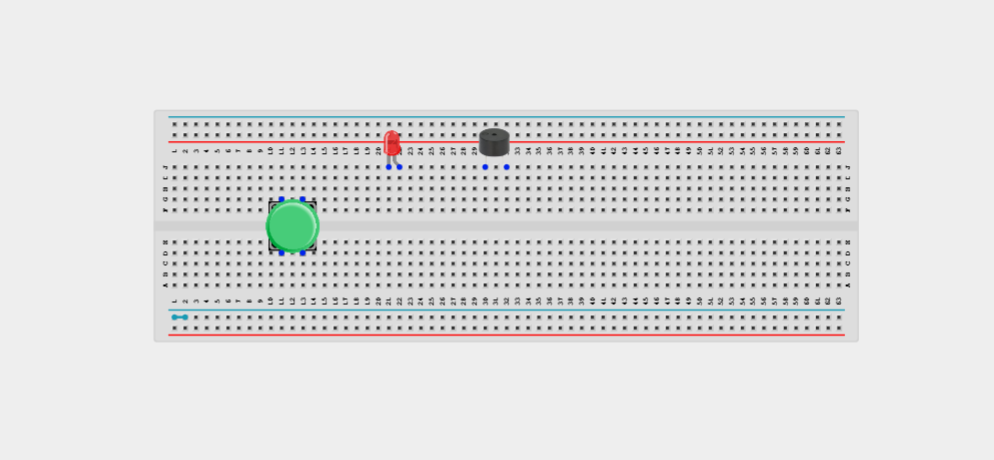
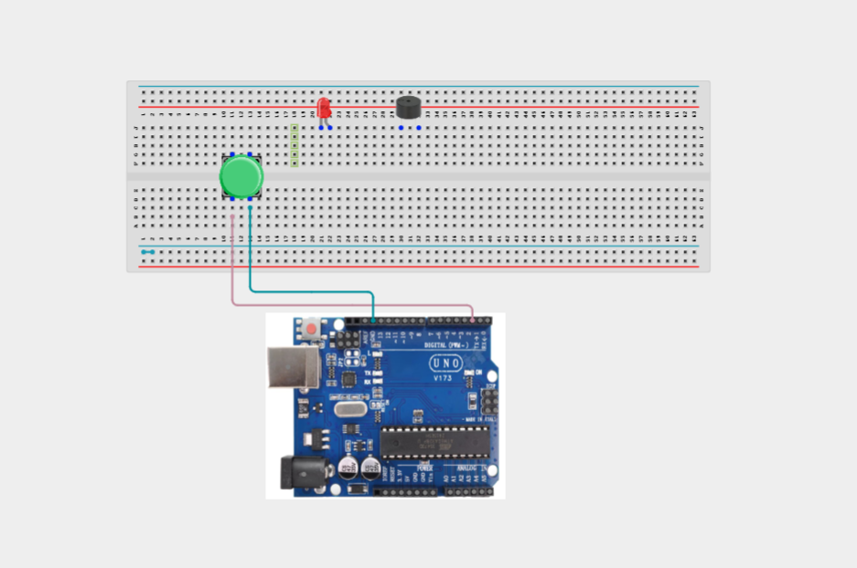
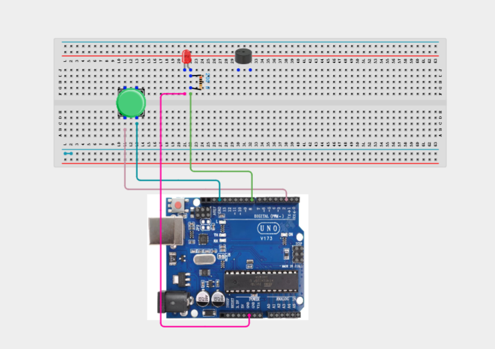
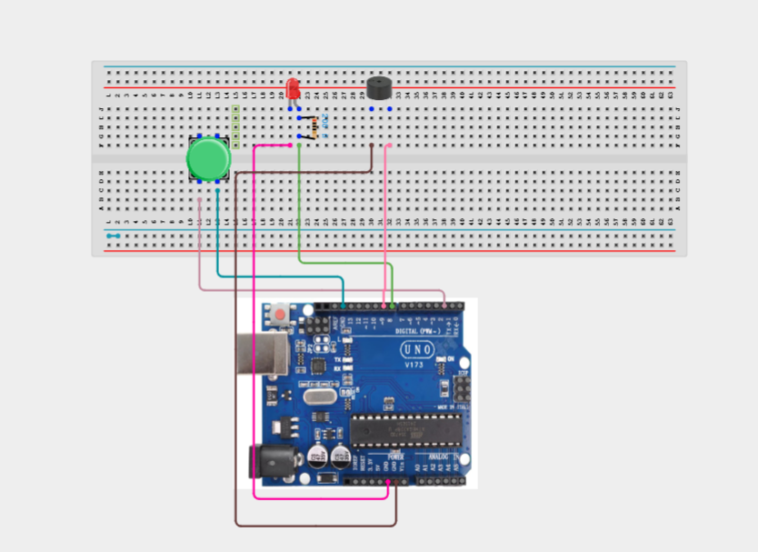
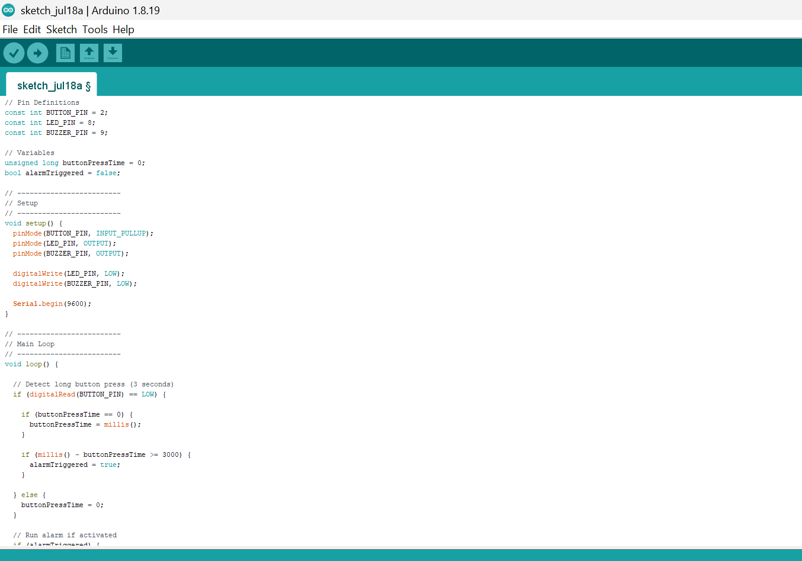
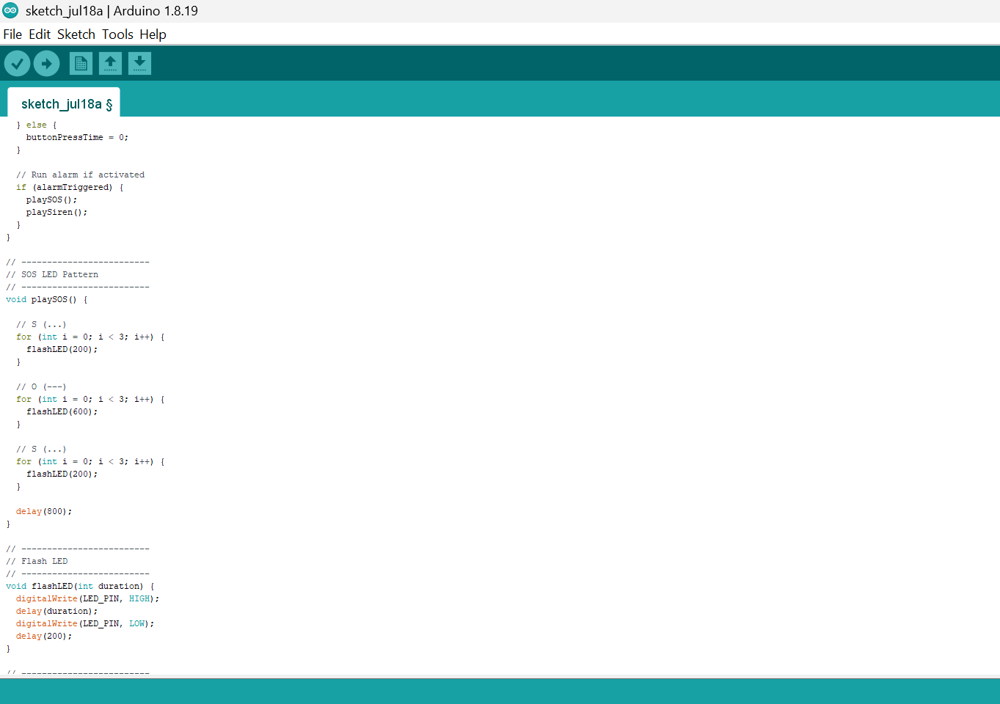
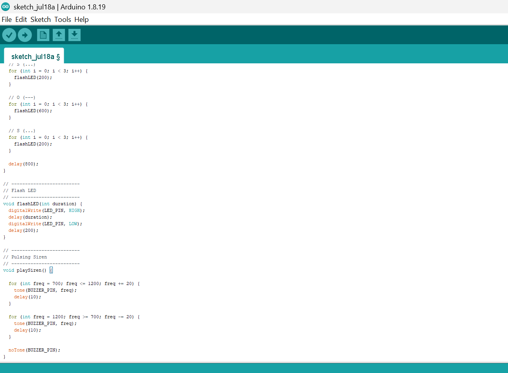

# Project 3.15.1: Emergency Panic Station

| **Description** | Press and hold the push button for 3 seconds to activate an emergency alert. The LED flashes in an SOS pattern while the buzzer emits a pulsing siren to simulate an emergency panic station. |
|------------------|----------------------------------------------------------------|
| **Use case**     | This project can be used as a prototype for emergency alert systems, panic buttons, home security systems, elderly assistance devices, and personal safety alarms. |

## Components (Things You will need)

|  |  |  |  |  |  | |
| --------------------------------------------------- | ------------------------------------------------------ | ----------------------------------------------------------- | --------------------------------------------------------- | ------------------------------------------------------ | ------------------------------------------------------ | ------------------------------------------------------ |

## Building the circuit

Things Needed:

- Arduino Uno = 1
- Arduino USB cable = 1
- Push button = 1
- LED = 1
- Buzzer = 1
- Jumpr Wires
- 220Ω resistor


## Mounting the component on the breadboard

**Step 1:**  Carefully mount the push button, LED and buzzer on the breadboard, ensuring proper orientation and enough spacing for easy wiring.



_**NB:** Ensure the LED polarity is correct and place the push button across the centre gap of the breadboard before wiring._

## WIRING THE CIRCUIT

**Step 2:** Connect one terminal of the push button to digital pin 2 on the Arduino Uno. Connect the opposite terminal of the push button to GND.



**Step 2:** Connect the LED anode (long leg) to digital pin 8 through the 220 Ω resistor. Connect the LED cathode (short leg) to GND.



**Step 2:** Connect the positive (+) terminal of the buzzer to digital pin 9. Connect the negative (-) terminal of the buzzer to GND.



_Make sure to connect the Arduino USB cable to the Arduino board._

## PROGRAMMING

**Step 1:** Open your Arduino IDE. See how to set up here: [Getting Started](../../Getting Started/Arduino_IDE_Setup.md).

**Step 2:** Write the complete program implementing the system logic with appropriate pin definitions, setup configuration, and the main control loop.

```cpp
// Pin Definitions
const int BUTTON_PIN = 2;
const int LED_PIN = 8;
const int BUZZER_PIN = 9;

// Variables
unsigned long buttonPressTime = 0;
bool alarmTriggered = false;

// -------------------------
// Setup
// -------------------------
void setup() {
  pinMode(BUTTON_PIN, INPUT_PULLUP);
  pinMode(LED_PIN, OUTPUT);
  pinMode(BUZZER_PIN, OUTPUT);

  digitalWrite(LED_PIN, LOW);
  digitalWrite(BUZZER_PIN, LOW);

  Serial.begin(9600);
}

// -------------------------
// Main Loop
// -------------------------
void loop() {

  // Detect long button press (3 seconds)
  if (digitalRead(BUTTON_PIN) == LOW) {

    if (buttonPressTime == 0) {
      buttonPressTime = millis();
    }

    if (millis() - buttonPressTime >= 3000) {
      alarmTriggered = true;
    }

  } else {
    buttonPressTime = 0;
  }

  // Run alarm if activated
  if (alarmTriggered) {
    playSOS();
    playSiren();
  }
}

// -------------------------
// SOS LED Pattern
// -------------------------
void playSOS() {

  // S (...)
  for (int i = 0; i < 3; i++) {
    flashLED(200);
  }

  // O (---)
  for (int i = 0; i < 3; i++) {
    flashLED(600);
  }

  // S (...)
  for (int i = 0; i < 3; i++) {
    flashLED(200);
  }

  delay(800);
}

// -------------------------
// Flash LED
// -------------------------
void flashLED(int duration) {
  digitalWrite(LED_PIN, HIGH);
  delay(duration);
  digitalWrite(LED_PIN, LOW);
  delay(200);
}

// -------------------------
// Pulsing Siren
// -------------------------
void playSiren() {

  for (int freq = 700; freq <= 1200; freq += 20) {
    tone(BUZZER_PIN, freq);
    delay(10);
  }

  for (int freq = 1200; freq >= 700; freq -= 20) {
    tone(BUZZER_PIN, freq);
    delay(10);
  }

  noTone(BUZZER_PIN);
}
```







**Step 7:** Save your code. _See the [Getting Started](../../Getting Started/Arduino_IDE_Setup.md) section_

**Step 8:** Select the arduino board and port _See the [Getting Started](../../Getting Started/Arduino_IDE_Setup.md) section:Selecting Arduino Board Type and Uploading your code_.

**Step 9:** Upload your code. _See the [Getting Started](../../Getting Started/Arduino_IDE_Setup.md) section:Selecting Arduino Board Type and Uploading your code_

## CONCLUSION

Congratulations! You have successfully built an Emergency Panic Station using a push button, LED, buzzer, and Arduino Uno. In this project, you learned how to detect a sustained button press, introduce timing into a program, and coordinate multiple output devices to create an emergency alert system. This project demonstrates important concepts used in real-world security systems, emergency response devices, and personal safety equipment. Continue experimenting by adding additional indicators, wireless communication, or sensors to create even more advanced emergency notification systems.

