# Project 3.16.1: Greenhouse Climate Monitor

| **Description** | This project demonstrates how to build a simple greenhouse climate monitoring system using an LDR (Light Dependent Resistor) module, a traffic light module, and a servo motor. The Arduino continuously monitors the ambient light level and automatically adjusts the servo motor to simulate opening or closing a greenhouse ventilation window. At the same time, the traffic light module provides a visual indication of the current lighting condition, allowing users to easily monitor the greenhouse environment. This project introduces sensor-based automation, servo motor control, and multi-device integration. |
|------------------|----------------------------------------------------------------|
| **Use case**     | This project can be used in automated greenhouse systems, smart farming applications, environmental monitoring systems, automated ventilation systems, agricultural research, and other smart climate control applications. |

## Components (Things You will need)


|  |  |  |  |  |  | |
| --------------------------------------------------- | ------------------------------------------------------ | ----------------------------------------------------------- | --------------------------------------------------------- | ------------------------------------------------------ | ------------------------------------------------------ | ------------------------------------------------------ |
## Building the circuit

Things Needed:

- Arduino Uno = 1
- Arduino USB cable = 1
- LDR module = 1
- Traffic light module = 1
- Servo motor = 1
- Jumper Wires 


## Mounting the component on the breadboard

**Step 1:** Take the LDR module and traffic light alongside sero motor and insert it into the horizontal connectors on the breadboard.

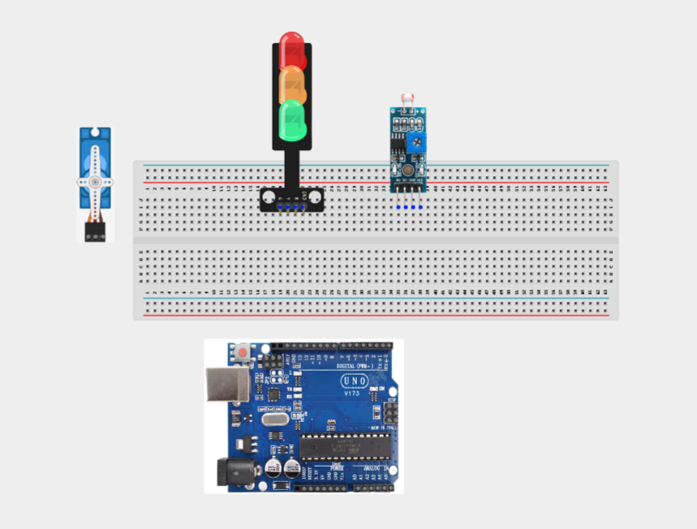

_**NB:** For complex circuits, plan your component placement to minimize wire crossing and ensure clean connections._

## WIRING THE CIRCUIT

**Step 2:**Connect 5V on the Arduino uno to the positive section on the breadboard and Connect one end of a jumper wire to the VCC pin of the LDR module and the other end to the 5V pin on the Arduino Uno.

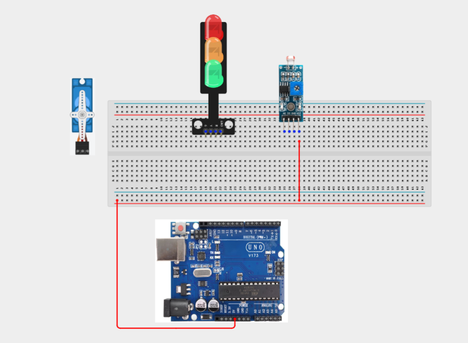


**Step 2:** Connect one end of a jumper wire to the GND pin of the LDR module and the other end to a GND pin on the Arduino Uno.

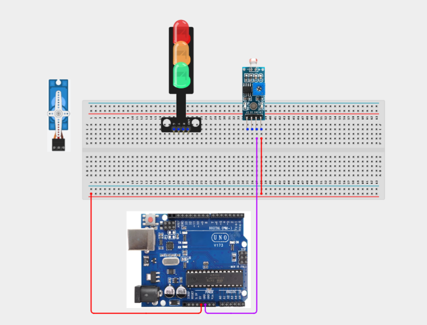


**Step 2:** Connect one end of a jumper wire to the AO (Analog Output) pin of the LDR module and the other end to A0 on the Arduino Uno.

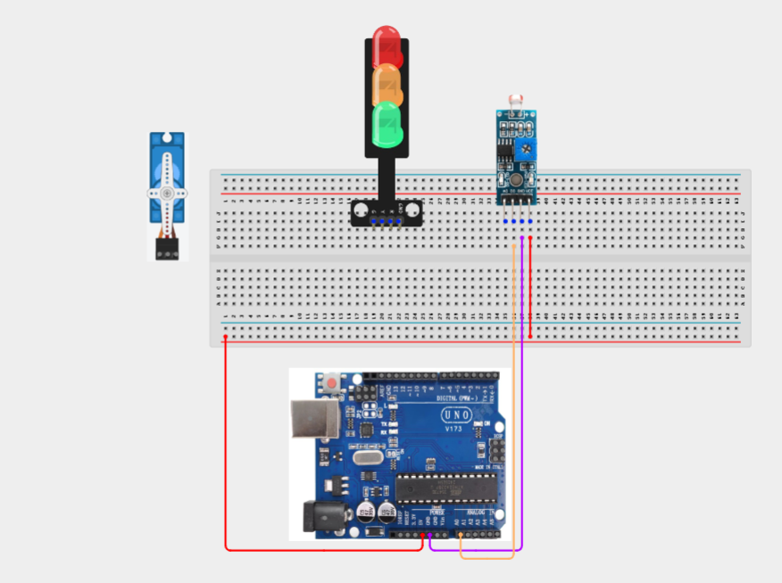

**Step 2:** Connect the Red (R) pin of the traffic light module to digital pin 5 on the Arduino Uno.

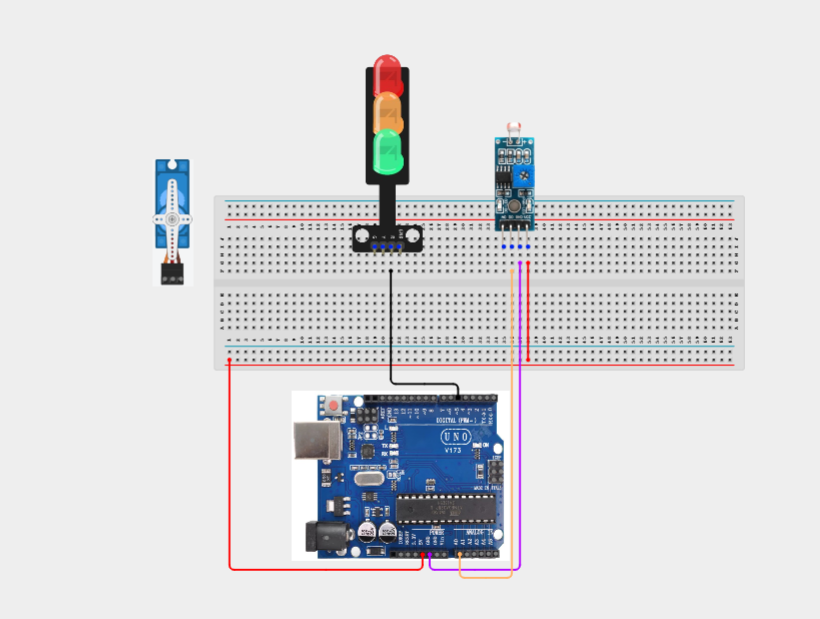

**Step 2:** Connect the Yellow (Y) pin of the traffic light module to digital pin 6 on the Arduino Uno.

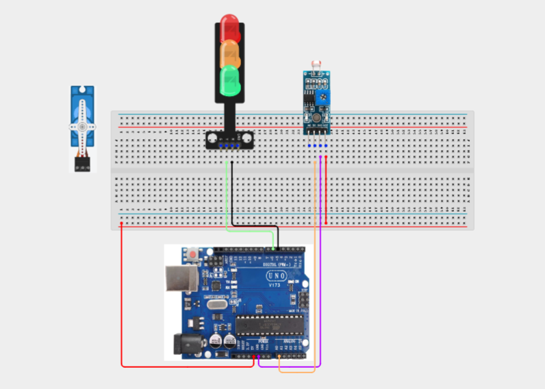

**Step 2:** Connect the Green (G) pin of the traffic light module to digital pin 7 on the Arduino Uno.

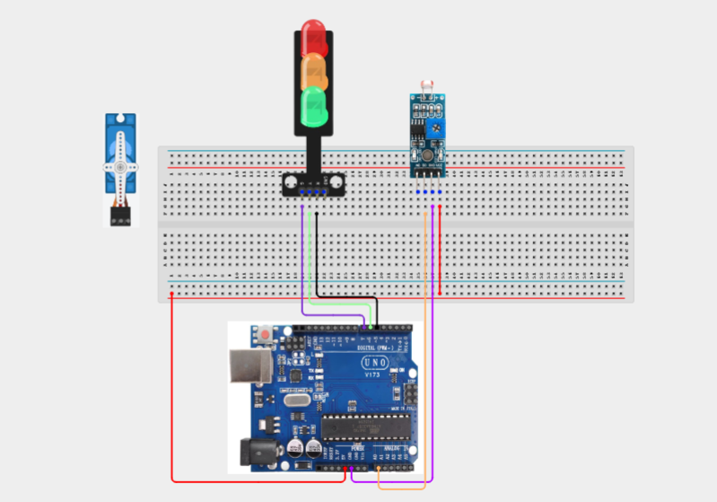

**Step 2:** Connect the GND pin of the traffic light module to a GND pin on the Arduino Uno.

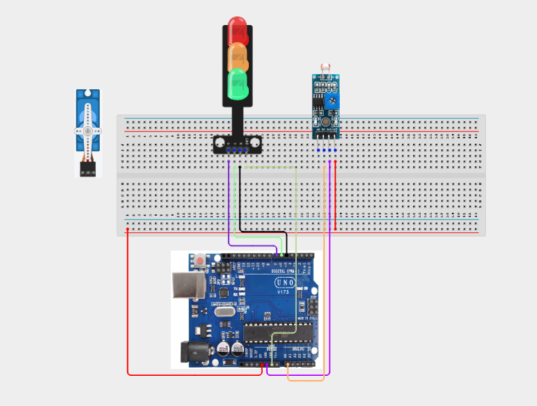

**Step 2:** Connect the red (VCC) wire of the servo motor to the 5V pin on the breadboard.

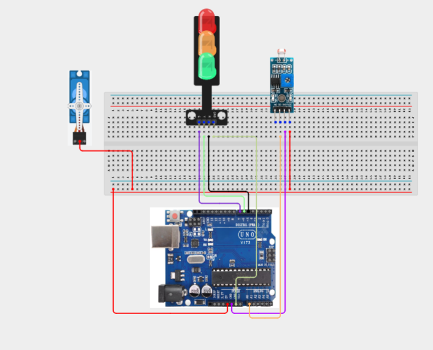

**Step 2:** Connect the brown or black (GND) wire of the servo motor to a GND pin on the Arduino Uno.

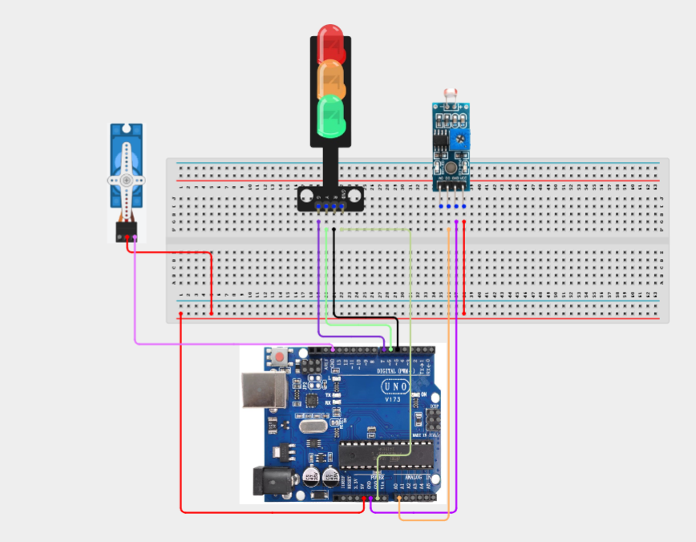

**Step 2:** Connect the orange or yellow (Signal) wire of the servo motor to digital pin 9 on the Arduino Uno.

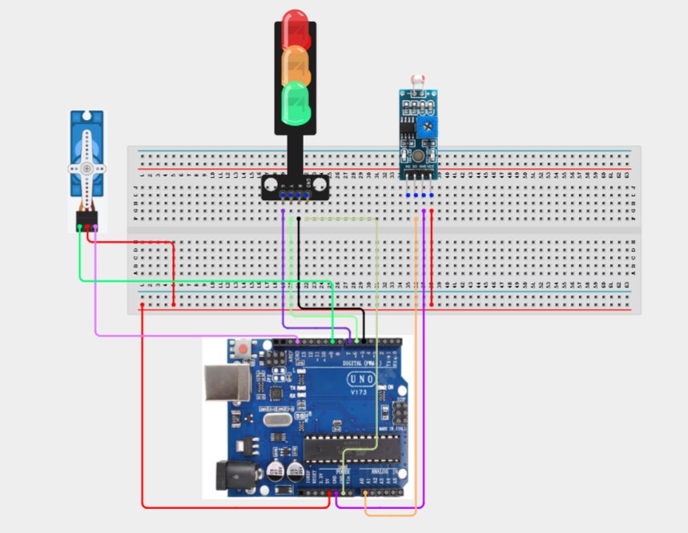

_Make sure to connect the Arduino USB cable to the Arduino board._

## PROGRAMMING

**Step 1:** Open your Arduino IDE. See how to set up here: [Getting Started](../../Getting Started/Arduino_IDE_Setup.md).

**Step 2:** Write the complete program implementing the system logic with appropriate pin definitions, setup configuration, and the main control loop.

```cpp
#include <Servo.h>

// Pin Definitions
const int LDR_PIN = A0;

const int RED_LED = 5;
const int YELLOW_LED = 6;
const int GREEN_LED = 7;

const int SERVO_PIN = 9;

Servo ventServo;

int lightValue;

void setup() {

  pinMode(RED_LED, OUTPUT);
  pinMode(YELLOW_LED, OUTPUT);
  pinMode(GREEN_LED, OUTPUT);

  ventServo.attach(SERVO_PIN);

  Serial.begin(9600);
}

void loop() {

  lightValue = analogRead(LDR_PIN);

  Serial.print("Light Level: ");
  Serial.println(lightValue);

  if (lightValue < 300) {

    // Dark environment
    digitalWrite(RED_LED, HIGH);
    digitalWrite(YELLOW_LED, LOW);
    digitalWrite(GREEN_LED, LOW);

    ventServo.write(0);

  }
  else if (lightValue < 700) {

    // Moderate light
    digitalWrite(RED_LED, LOW);
    digitalWrite(YELLOW_LED, HIGH);
    digitalWrite(GREEN_LED, LOW);

    ventServo.write(90);

  }
  else {

    // Bright environment
    digitalWrite(RED_LED, LOW);
    digitalWrite(YELLOW_LED, LOW);
    digitalWrite(GREEN_LED, HIGH);

    ventServo.write(180);

  }

  delay(200);
}
```

**Step 7:** Save your code. _See the [Getting Started](../../Getting Started/Arduino_IDE_Setup.md) section_

**Step 8:** Select the arduino board and port _See the [Getting Started](../../Getting Started/Arduino_IDE_Setup.md) section:Selecting Arduino Board Type and Uploading your code_.

**Step 9:** Upload your code. _See the [Getting Started](../../Getting Started/Arduino_IDE_Setup.md) section:Selecting Arduino Board Type and Uploading your code_

## CONCLUSION
Congratulations! You have successfully built a Greenhouse Climate Monitor. In this project, you learned how to use an LDR module to monitor ambient light, control a servo motor to simulate an automated ventilation system, and provide visual feedback using a traffic light module. This project demonstrates how sensors and actuators work together to automate environmental control systems and introduces key concepts used in smart agriculture, greenhouse automation, and intelligent monitoring systems. Continue experimenting by adjusting the light thresholds or adding temperature and humidity sensors to create a more advanced greenhouse control system.

