# Project 3.17.1: Sound-Reactive Servo Display

| **Description** |This project demonstrates how to create a sound-reactive display using a sound sensor, an RGB LED module, and a servo motor. The Arduino continuously monitors the surrounding sound level and converts it into physical movement and colourful visual feedback. As the sound intensity increases, the servo motor rotates to a larger angle while the RGB LED changes colour and brightness, creating a physical volume (VU) meter effect. This project introduces the concepts of analog sensor reading, PWM output, servo motor control, and sensor-actuator integration. |
|------------------|----------------------------------------------------------------|
| **Use case**     | This project can be used as a sound level indicator, music visualizer, interactive art display, noise monitoring system, classroom demonstration tool, or smart automation system that responds to changes in environmental sound. |

## Components (Things You will need)

|  |  |  |  |  |  | |
| --------------------------------------------------- | ------------------------------------------------------ | ----------------------------------------------------------- | --------------------------------------------------------- | ------------------------------------------------------ | ------------------------------------------------------ | ------------------------------------------------------ |

## Building the circuit

Things Needed:

- Arduino Uno = 1
- Arduino USB cable = 1
- Sound sensor module = 1
- RGB LED module = 1
- Servo motor = 1
- Jumper Wires
- 220Ω resistor


## Mounting the component on the breadboard

**Step 1:** Take the sound sensor module, RGB LED module, servo motor, and breadboard. Insert the sound sensor module and RGB LED module into the breadboard, ensuring there is enough space between them for wiring. Place the servo motor beside the breadboard where its wires can easily reach the Arduino Uno.

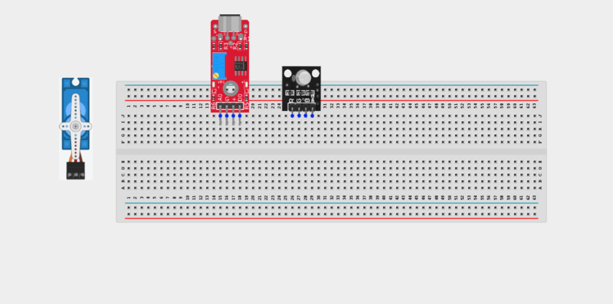

## WIRING THE CIRCUIT

**Step 2:** Connect one end of a jumper wire to the (+) of the sound sensor and the other end to the 5V pin on the Arduino Uno.

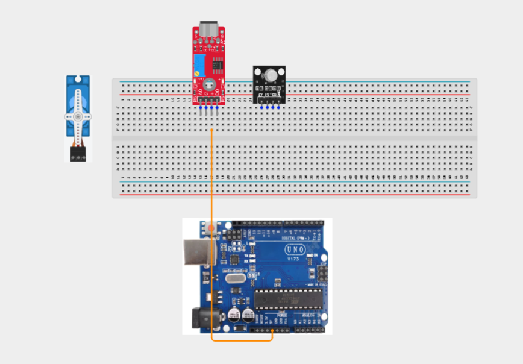

**Step 3:** Connect one end of a jumper wire to the GND pin of the sound sensor and the other end to a GND pin on the Arduino Uno.

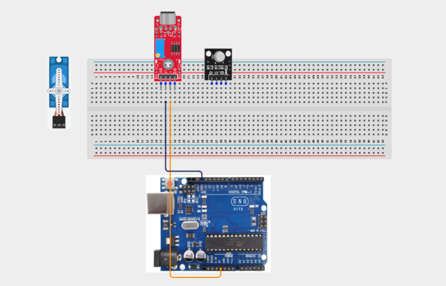

**Step 2:**Connect one end of a jumper wire to the AO (Analog Output) pin of the sound sensor and the other end to A0 on the Arduino Uno.

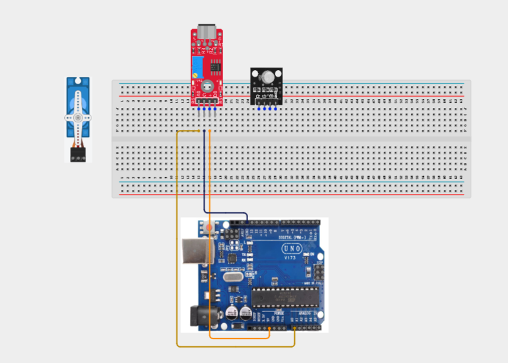

**Step 2:** Connect one end of a jumper wire to the R (Red) pin of the RGB LED module and the other end to digital pin 5 on the Arduino Uno.

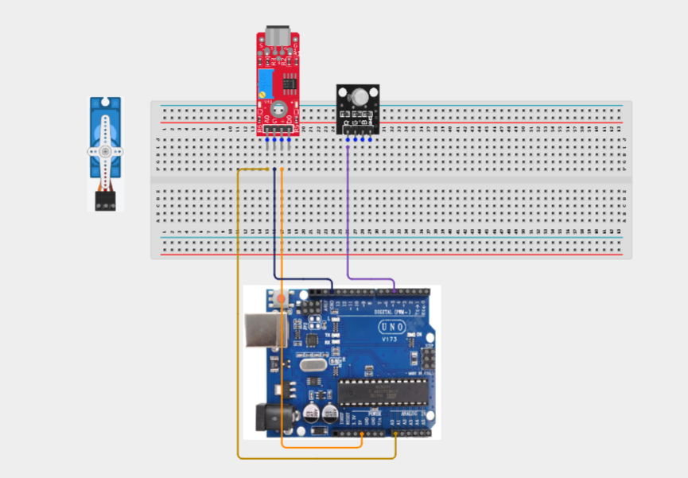

**Step 2:** Connect one end of a jumper wire to the G (Green) pin of the RGB LED module and the other end to digital pin 6 on the Arduino Uno.

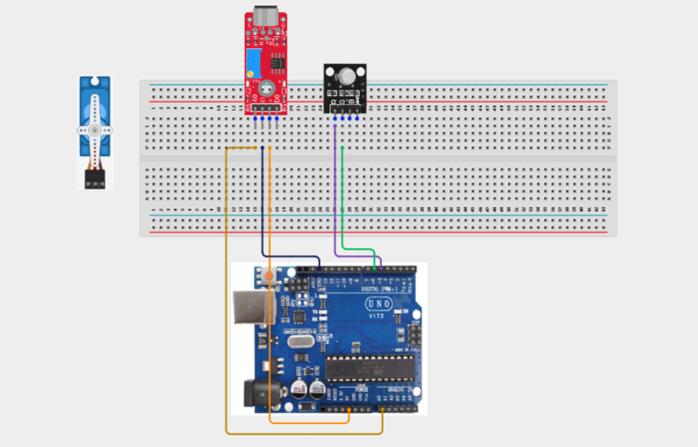

**Step 2:** Connect one end of a jumper wire to the B (Blue) pin of the RGB LED module and the other end to digital pin 9 on the Arduino Uno.

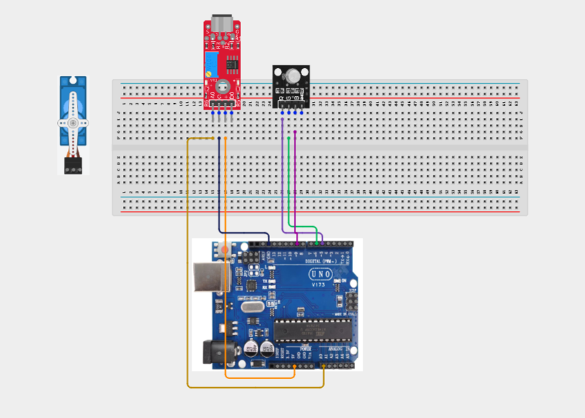

**Step 2:**Connect one end of a jumper wire to the GND (-) pin of the RGB LED module and the other end to a GND pin on the Arduino Uno.

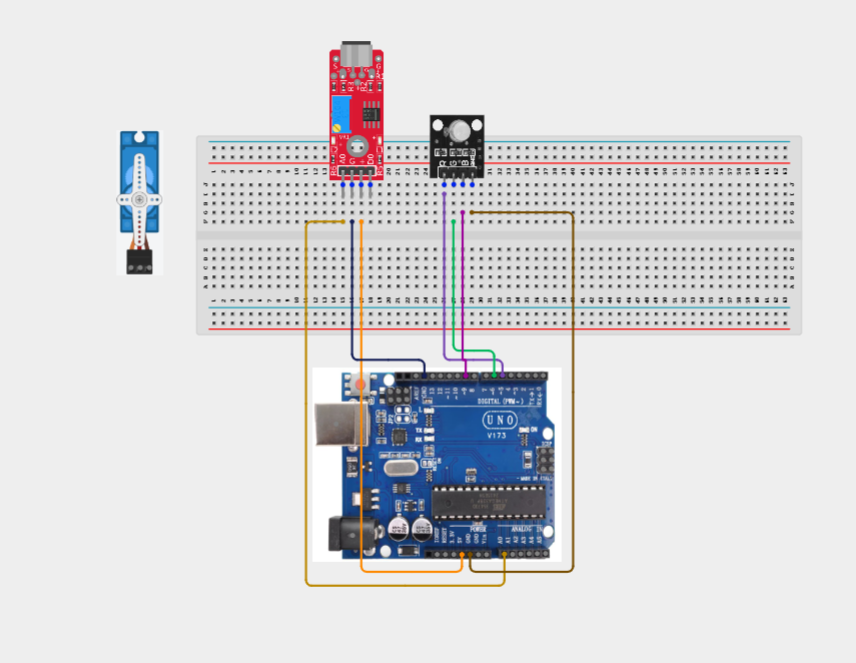

**Step 2:** Reconnect the 5V connected to (+) to the positive section on the breadboard and connect the (+) to the positive section of the breadboard. Connect the red (VCC) wire of the servo motor to the 5V pin on the Arduino Uno.

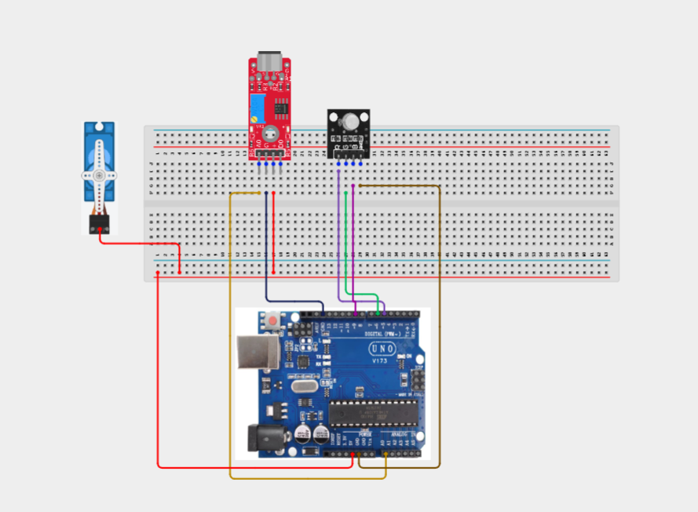

**Step 2:** Connect the brown or black (GND) wire of the servo motor to a GND pin on the Arduino Uno.

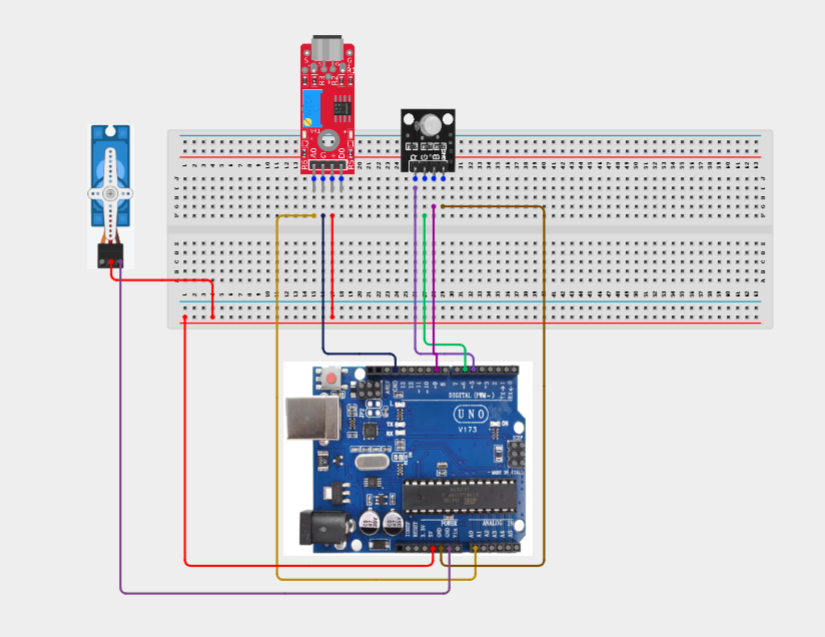


**Step 2:** Connect the orange or yellow (Signal) wire of the servo motor to digital pin 10 on the Arduino Uno.

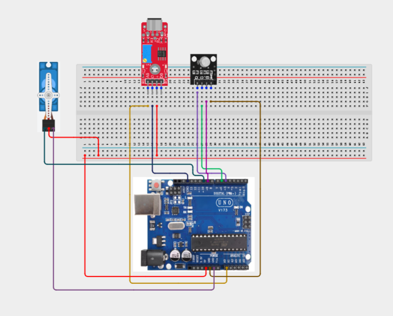

_Make sure to connect the Arduino USB cable to the Arduino board._

## PROGRAMMING

**Step 1:** Open your Arduino IDE. See how to set up here: [Getting Started](../../Getting Started/Arduino_IDE_Setup.md).

**Step 2:** Write the complete program implementing the system logic with appropriate pin definitions, setup configuration, and the main control loop.

```cpp
#include <Servo.h>

// Pin Definitions
const int SOUND_PIN = A0;
const int RED_PIN = 5;
const int GREEN_PIN = 6;
const int BLUE_PIN = 9;
const int SERVO_PIN = 10;

Servo myServo;

int soundValue;
int servoAngle;
int brightness;

void setup() {

  pinMode(RED_PIN, OUTPUT);
  pinMode(GREEN_PIN, OUTPUT);
  pinMode(BLUE_PIN, OUTPUT);

  myServo.attach(SERVO_PIN);

  Serial.begin(9600);
}

void loop() {

  // Read sound sensor
  soundValue = analogRead(SOUND_PIN);

  // Display value on Serial Monitor
  Serial.print("Sound Level: ");
  Serial.println(soundValue);

  // Convert sound value to servo angle
  servoAngle = map(soundValue, 0, 1023, 0, 180);
  myServo.write(servoAngle);

  // Convert sound value to LED brightness
  brightness = map(soundValue, 0, 1023, 0, 255);

  // RGB colour transitions
  analogWrite(RED_PIN, brightness);
  analogWrite(GREEN_PIN, 255 - brightness);
  analogWrite(BLUE_PIN, brightness / 2);

  delay(50);
}
```

**Step 7:** Save your code. _See the [Getting Started](../../Getting Started/Arduino_IDE_Setup.md) section_

**Step 8:** Select the arduino board and port _See the [Getting Started](../../Getting Started/Arduino_IDE_Setup.md) section:Selecting Arduino Board Type and Uploading your code_.

**Step 9:** Upload your code. _See the [Getting Started](../../Getting Started/Arduino_IDE_Setup.md) section:Selecting Arduino Board Type and Uploading your code_

## EXPLANATION

This advanced project integrates multiple components (SND + RGB + SRV) to create a sophisticated system. The Arduino coordinates sensor inputs and actuator outputs through programmed logic, demonstrating key concepts in multi-sensor fusion, state machine design, and feedback control systems.

## CONCLUSION

This project demonstrates how to build complex interactive systems by combining multiple sensors and actuators with Arduino. It reinforces advanced programming concepts and system integration skills.

