# Project 3.18.1: Noise Pollution Monitor

| **Description** | This project demonstrates how to build a noise pollution monitoring system using a sound sensor, a traffic light module, and a buzzer. The Arduino continuously measures the surrounding sound level and classifies it into low, moderate, or high noise levels. The traffic light module provides a visual indication of the detected noise level, while the buzzer emits a warning sound whenever excessive noise is detected. This project introduces analog sensor reading, threshold-based decision making, and the integration of multiple output devices for real-time environmental monitoring. |
|------------------|----------------------------------------------------------------|
| **Use case**     | This project can be used in classrooms, libraries, hospitals, offices, factories, construction sites, and smart buildings to monitor environmental noise levels and alert users when noise exceeds acceptable limits. |

## Components (Things You will need)

|  |  |  | | | ||
|-------------------------|-------------------------|-------------------------|-------------------------|-------------------------|--------------------------|--------------------------|

## Building the circuit

Things Needed:

- Arduino Uno = 1
- Arduino USB cable = 1
- Sound sensor module = 1
- Traffic light module = 1
- Buzzer = 1
- Jumper Wires


## Mounting the component on the breadboard

**Step 1:** Take the sound sensor module, traffic light module, buzzer and insert it into the horizontal connectors on the breadboard.

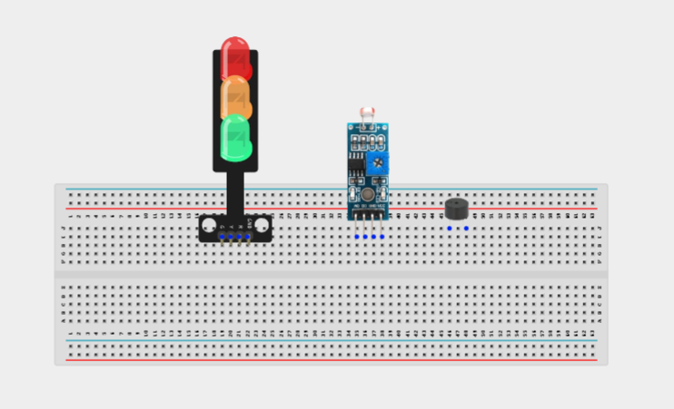

_**NB:** For complex circuits, plan your component placement to minimize wire crossing and ensure clean connections._

## WIRING THE CIRCUIT

**Step 2:** Connect 5V on the Arduino uno to the postive section on the breadboard. Connect the VCC pin of the sound sensor to the 5V pin on the breadboard.

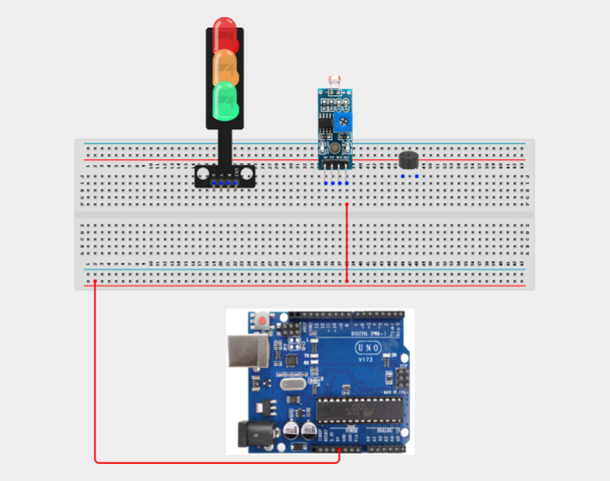

**Step 2:** Connect the GND pin of the sound sensor to a GND pin on the Arduino Uno.

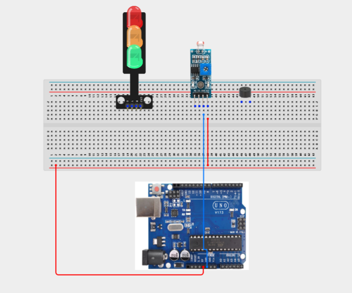

**Step 2:** Connect the AO (Analog Output) pin of the sound sensor to A0 on the Arduino Uno.

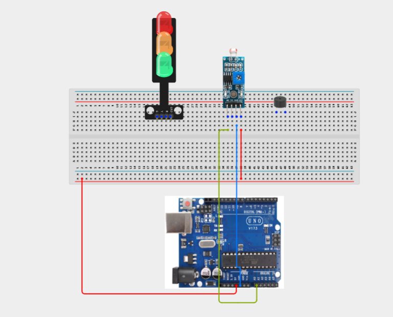

**Step 2:** Connect the GND pin of the traffic light module to a GND pin on the Arduino Uno.

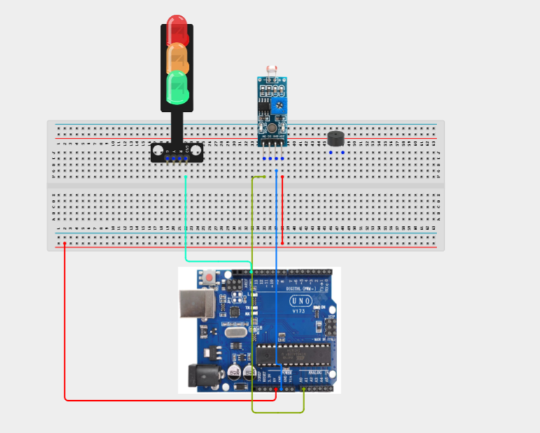

**Step 2:** Connect the Red (R) pin of the traffic light module to digital pin 5 on the Arduino Uno.

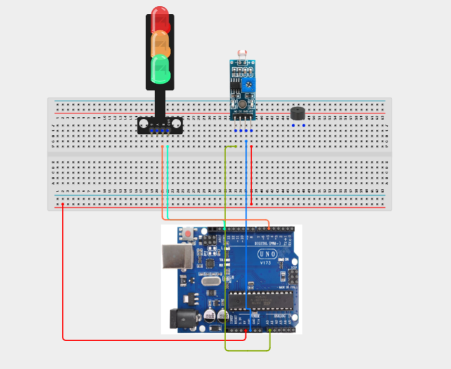

**Step 2:** Connect the Yellow (Y) pin of the traffic light module to digital pin 6 on the Arduino Uno.

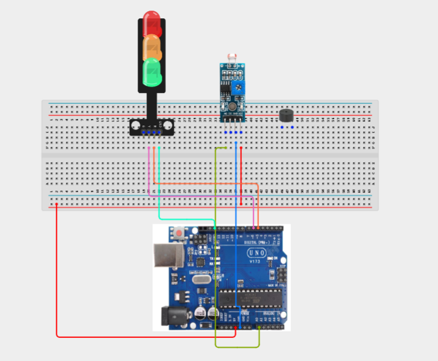

**Step 2:** Connect the Green (G) pin of the traffic light module to digital pin 7 on the Arduino Un

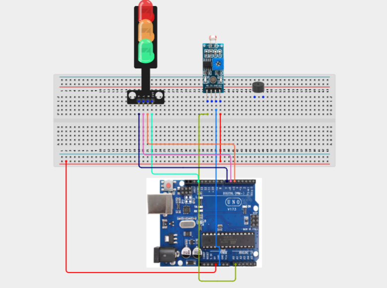

**Step 2:** Connect the positive (+) pin of the buzzer to digital pin 9 on the Arduino Uno.

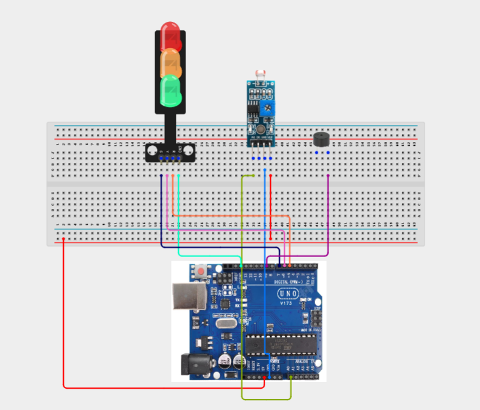

**Step 2:** Connect the negative (-) pin of the buzzer to a GND pin on the Arduino Uno.

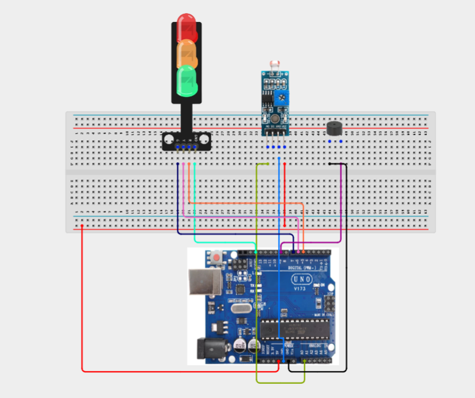

_Make sure to connect the Arduino USB cable to the Arduino board._

## PROGRAMMING

**Step 1:** Open your Arduino IDE. See how to set up here: [Getting Started](../../Getting Started/Arduino_IDE_Setup.md).

**Step 2:** Write the complete program implementing the system logic with appropriate pin definitions, setup configuration, and the main control loop.

```cpp
// Noise Pollution Monitor

const int SOUND_PIN = A0;

const int RED_LED = 5;
const int YELLOW_LED = 6;
const int GREEN_LED = 7;

const int BUZZER = 9;

int soundValue;

void setup() {

  pinMode(RED_LED, OUTPUT);
  pinMode(YELLOW_LED, OUTPUT);
  pinMode(GREEN_LED, OUTPUT);
  pinMode(BUZZER, OUTPUT);

  Serial.begin(9600);
}

void loop() {

  soundValue = analogRead(SOUND_PIN);

  Serial.print("Sound Level: ");
  Serial.println(soundValue);

  // Quiet environment
  if (soundValue < 300) {

    digitalWrite(GREEN_LED, HIGH);
    digitalWrite(YELLOW_LED, LOW);
    digitalWrite(RED_LED, LOW);

    noTone(BUZZER);

  }

  // Moderate noise
  else if (soundValue < 700) {

    digitalWrite(GREEN_LED, LOW);
    digitalWrite(YELLOW_LED, HIGH);
    digitalWrite(RED_LED, LOW);

    noTone(BUZZER);

  }

  // High noise level
  else {

    digitalWrite(GREEN_LED, LOW);
    digitalWrite(YELLOW_LED, LOW);
    digitalWrite(RED_LED, HIGH);

    tone(BUZZER, 1000);
    delay(200);
    noTone(BUZZER);
    delay(200);
  }

  delay(100);
}
```

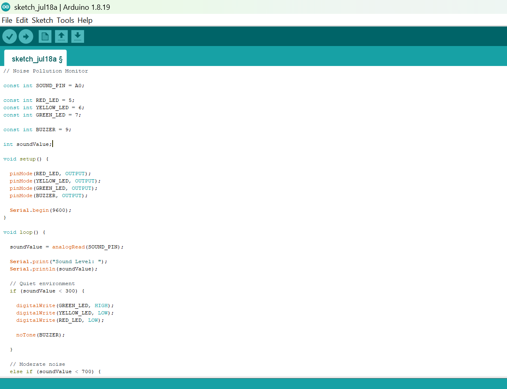

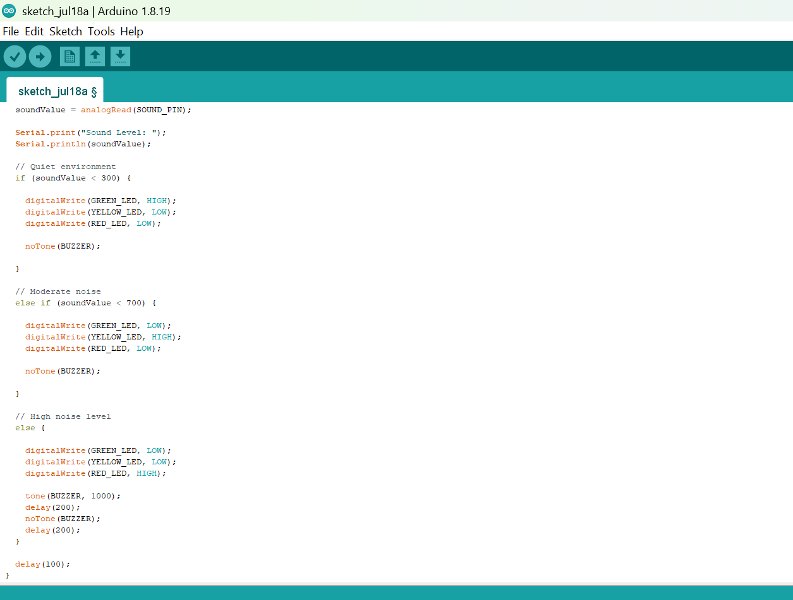


**Step 7:** Save your code. _See the [Getting Started](../../Getting Started/Arduino_IDE_Setup.md) section_

**Step 8:** Select the arduino board and port _See the [Getting Started](../../Getting Started/Arduino_IDE_Setup.md) section:Selecting Arduino Board Type and Uploading your code_.

**Step 9:** Upload your code. _See the [Getting Started](../../Getting Started/Arduino_IDE_Setup.md) section:Selecting Arduino Board Type and Uploading your code_

## CONCLUSION

Congratulations! You have successfully built a Noise Pollution Monitor. In this project, you learned how to use a sound sensor to measure environmental noise, classify different sound levels using programmed thresholds, display the results with a traffic light module, and generate audible warnings using a buzzer. This project introduces important concepts such as analog sensor reading, threshold-based decision making, and multi-device integration, providing a solid foundation for developing smart monitoring and safety systems used in schools, workplaces, public spaces, and industrial environments.

