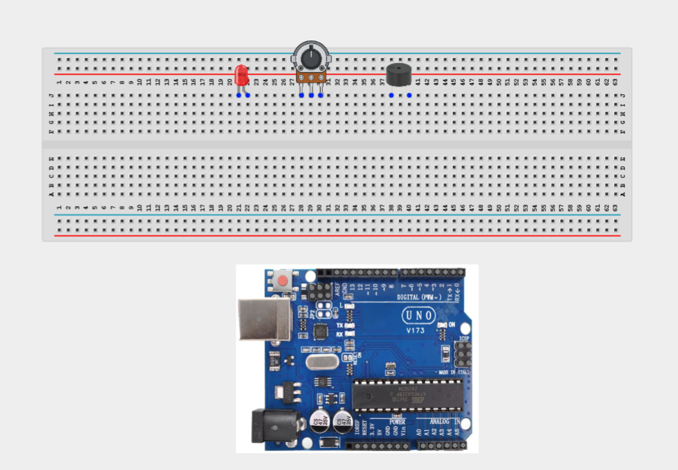
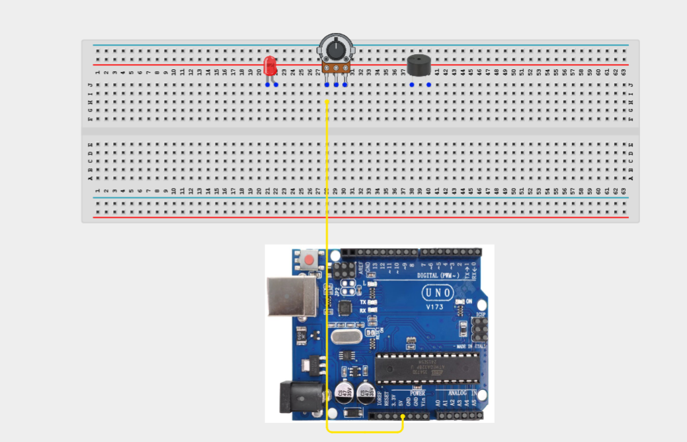
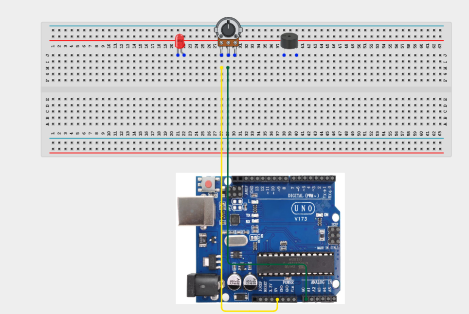
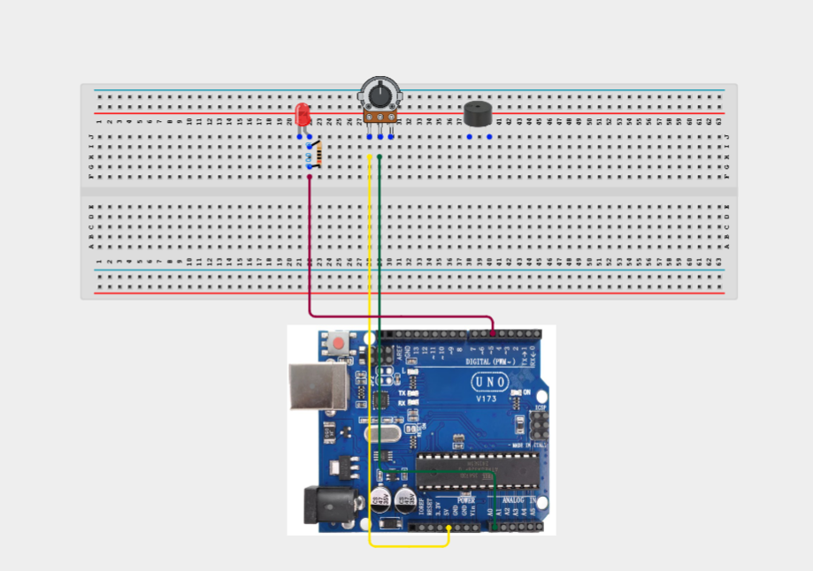
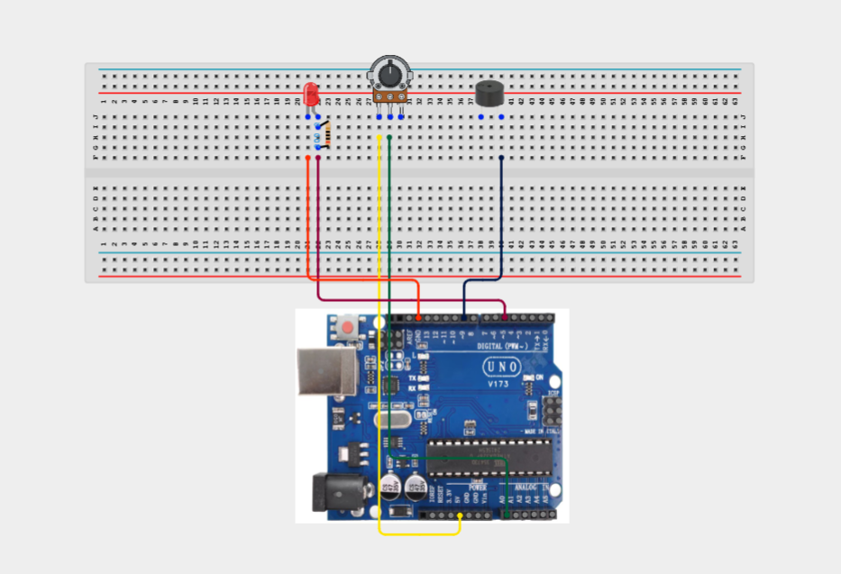
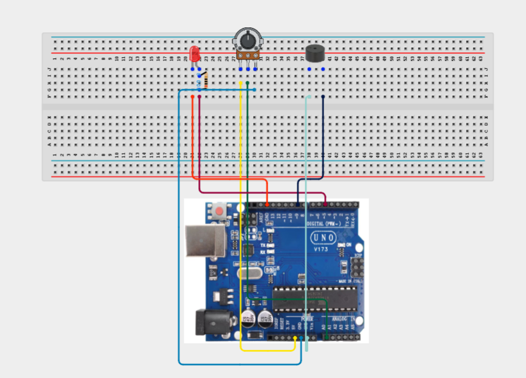
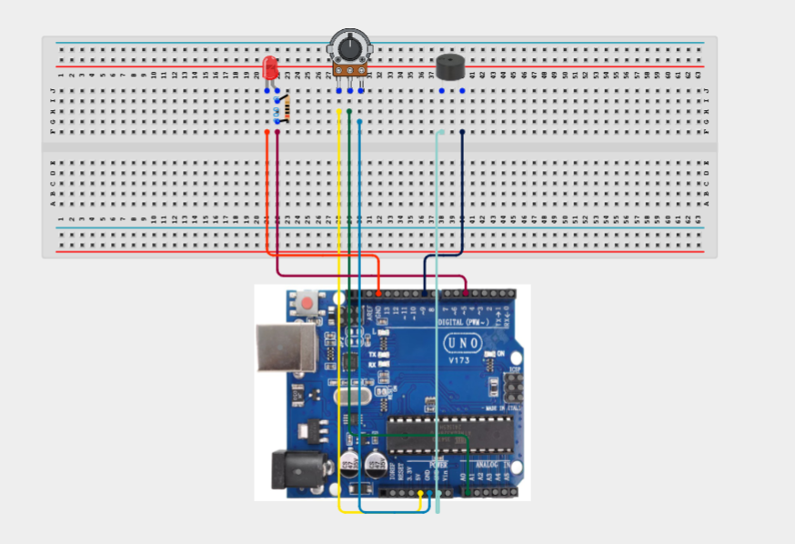
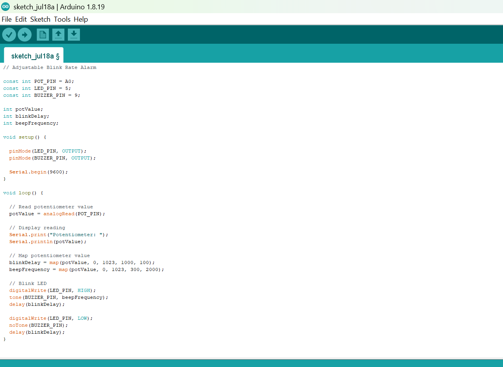

# Project 3.19.1: Adjustable Blink Rate Alarm

| **Description** | This project demonstrates how to build an adjustable alarm system using a potentiometer, an LED, and a buzzer. The Arduino continuously reads the position of the potentiometer and uses it to control both the LED's blinking speed and the buzzer's beep frequency. Rotating the potentiometer changes the alarm behaviour in real time, allowing users to increase or decrease the blinking rate and the pitch of the buzzer. This project introduces analog input processing, PWM concepts, variable timing, and interactive sensor-controlled outputs. |
|------------------|----------------------------------------------------------------|
| **Use case**     | This project can be used in adjustable warning systems, customizable alarms, educational demonstrations, interactive control panels, smart notification systems, and electronic learning projects where users need to control alarm behaviour manually. |

## Components (Things You will need)

| | | | | | ||
|-------------------------|-------------------------|-------------------------|-------------------------|-------------------------|--------------------------|--------------------------|

## Building the circuit

Things Needed:

- Arduino Uno = 1
- Arduino USB cable = 1
- Potentiometer = 1
- LED = 1
- Buzzer = 1
- Jumper Wires
- 220Ω resistor


## Mounting the component on the breadboard

**Step 1:** Take the potentiometer, LED, buzzer and insert it into the horizontal connectors on the breadboard.



_**NB:** For complex circuits, plan your component placement to minimize wire crossing and ensure clean connections._

## WIRING THE CIRCUIT

**Step 2:** Connect one outer pin of the potentiometer to the 5V pin on the Arduino Uno.




**Step 3:** Connect the centre (signal) pin of the potentiometer to the A0 pin on the Arduino Uno.



**Step 4:** Connect the long leg (anode) of the LED to digital pin 5 on the Arduino Uno through a 220 Ω resistor.


**Step 5:** Connect the short leg (cathode) of the LED to a GND pin on the Arduino Uno.



**Step 6:** Connect the positive (+) terminal of the buzzer to digital pin 9 on the Arduino Uno.



**Step 7:** Connect the negative (-) terminal of the buzzer to a GND pin on the Arduino Uno.



**Step 8:** Connect the opposite outer pin of the potentiometer to a GND pin on the Arduino Uno.



_Make sure to connect the Arduino USB cable to the Arduino board._

## PROGRAMMING

**Step 1:** Open your Arduino IDE. See how to set up here: [Getting Started](../../Getting Started/Arduino_IDE_Setup.md).

**Step 2:** Write the complete program implementing the system logic with appropriate pin definitions, setup configuration, and the main control loop.

```cpp
// Adjustable Blink Rate Alarm

const int POT_PIN = A0;
const int LED_PIN = 5;
const int BUZZER_PIN = 9;

int potValue;
int blinkDelay;
int beepFrequency;

void setup() {

  pinMode(LED_PIN, OUTPUT);
  pinMode(BUZZER_PIN, OUTPUT);

  Serial.begin(9600);
}

void loop() {

  // Read potentiometer value
  potValue = analogRead(POT_PIN);

  // Display reading
  Serial.print("Potentiometer: ");
  Serial.println(potValue);

  // Map potentiometer value
  blinkDelay = map(potValue, 0, 1023, 1000, 100);
  beepFrequency = map(potValue, 0, 1023, 300, 2000);

  // Blink LED
  digitalWrite(LED_PIN, HIGH);
  tone(BUZZER_PIN, beepFrequency);
  delay(blinkDelay);

  digitalWrite(LED_PIN, LOW);
  noTone(BUZZER_PIN);
  delay(blinkDelay);
}
```


**Step 3:** Save your code. _See the [Getting Started](../../Getting Started/Arduino_IDE_Setup.md) section_

**Step 4:** Select the arduino board and port _See the [Getting Started](../../Getting Started/Arduino_IDE_Setup.md) section:Selecting Arduino Board Type and Uploading your code_.

**Step 5:** Upload your code. _See the [Getting Started](../../Getting Started/Arduino_IDE_Setup.md) section:Selecting Arduino Board Type and Uploading your code_

## CONCLUSION

Congratulations! You have successfully built an Adjustable Blink Rate Alarm. In this project, you learned how to use a potentiometer as an analog input device to control both the blinking speed of an LED and the pitch of a buzzer. This project demonstrates important concepts such as analog input processing, value mapping, variable timing, tone generation, and multi-output control. These techniques form the foundation of many interactive electronic systems, including adjustable alarms, user-controlled devices, and smart control panels. Continue experimenting by changing the timing ranges, adding additional LEDs, or incorporating more sensors to create even more advanced interactive projects.

