# Project 3.1.1: AUTOMATIC CURTAIN CONTROLLER 

| **Description** | This project automatically opens and closes curtains based on ambient light levels. An LDR detects the surrounding brightness, while a potentiometer allows the user to adjust the light sensitivity threshold. A pushbutton provides manual override, and an RGB LED indicates the current system status.  |
|------------------|----------------------------------------------------------------|
| **Use case**     | Smart homes, automated curtains, energy-saving systems, daylight management. |

## Components (Things You will need)

|  |  |  |  || | | | |
|-------------------------|-------------------------|-------------------------|-------------------------|-------------------------|-------------------------|-------------------------|-------------------------|-------------------------|

## Building the circuit

Things Needed:

-	Arduino Uno
-	Ultrasonic sensor 
-	RGB module
-	Servo motor
-	Breadboard
-	Jumper wires

## Mounting the component on the breadboard

**Step 1:** Connect one jumper wire from the 5V pin on the Arduino Uno to the positive rail of the breadboard and connect another jumper wire from the GND pin on the Arduino Uno to the negative rail of the breadboard

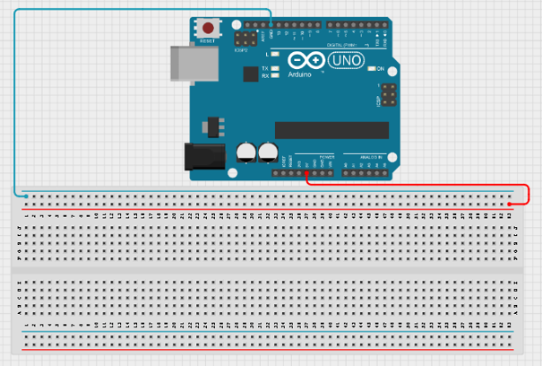.

## WIRING THE CIRCUIT

**Step 2:** Place the LDR Module on the breadboard
Connect the LDR Module:
•	VCC → 5V 
•	GND → GND 
•	AO → A0 
Use the AO (Analog Output) pin because the project requires continuous light-level readings.

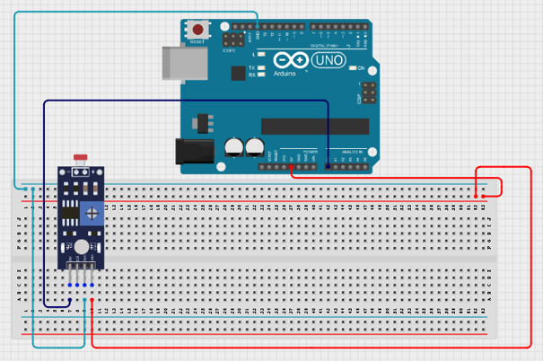.

**Step 3:** Place the potentiometer on the breadboard
Connect the potentiometer:
•	Left pin → 5V 
•	Right pin → GND 
•	Middle pin → A1 

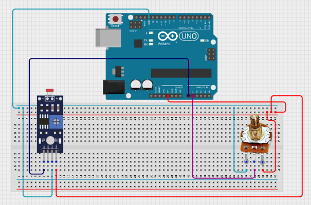.

**Step 4:** Connect the servo motor:
•	Signal (Yellow) → Pin 9 
•	VCC → 5V 
•	GND → GND 
 

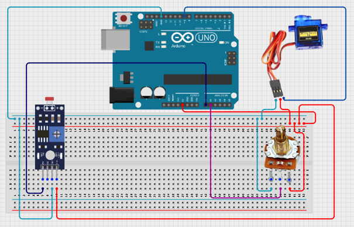.

**Step 5:** Place the pushbutton on the breadboard
Connect the pushbutton:
•	One leg → Pin 7 
•	Other leg → GND 
The code uses INPUT_PULLUP, so no external resistor is required.
 

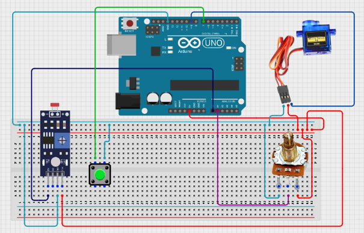.

**Step 6:** Place the RGB Light on the breadboard
Connect the RGB Light:
•	Red pin → Pin 3 
•	Green pin → Pin 5 
•	Blue pin → Pin 6 
•	Common Cathode (-) → GND 

 
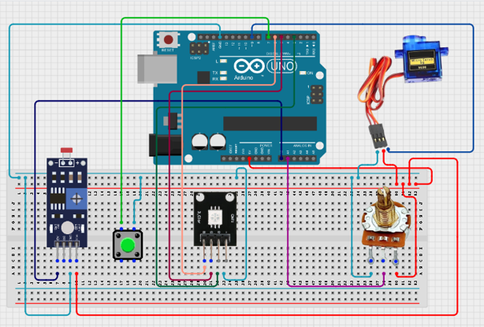.

<!-- ### Things Needed:

-	Red male-to-male jumper wire: 2
-	Black male-to-male jumper wire: 2
-	White male-to-male jumper wire: 1
-	Blue male-to-male jumper wire: 2
-	Green Jumper Wire: 1

**Step 1:** Connect one end of the white male-to-male jumper wire to the VCC pin of the Ultrasonic sensor and the other end to the 5V pin on the Arduino Uno board as shown in the picture below.

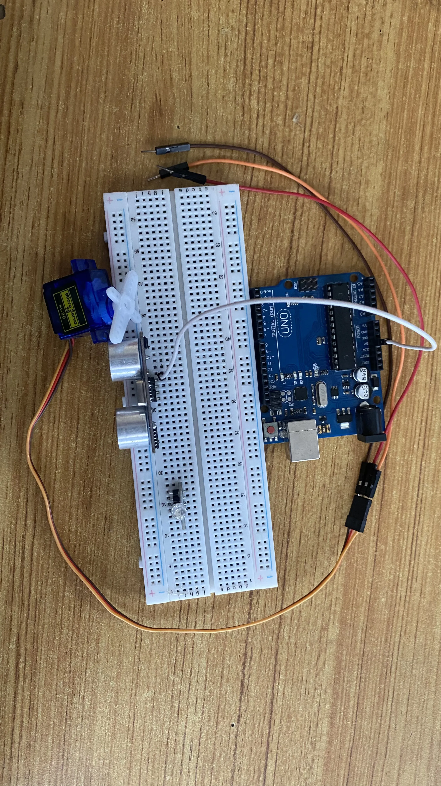

**Step 2:** Connect one end of the yellow male-to-male jumper wire to the Trig pin of the Ultrasonic sensor and the other end to digital pin 6 on the Arduino Uno board as shown in the picture below.

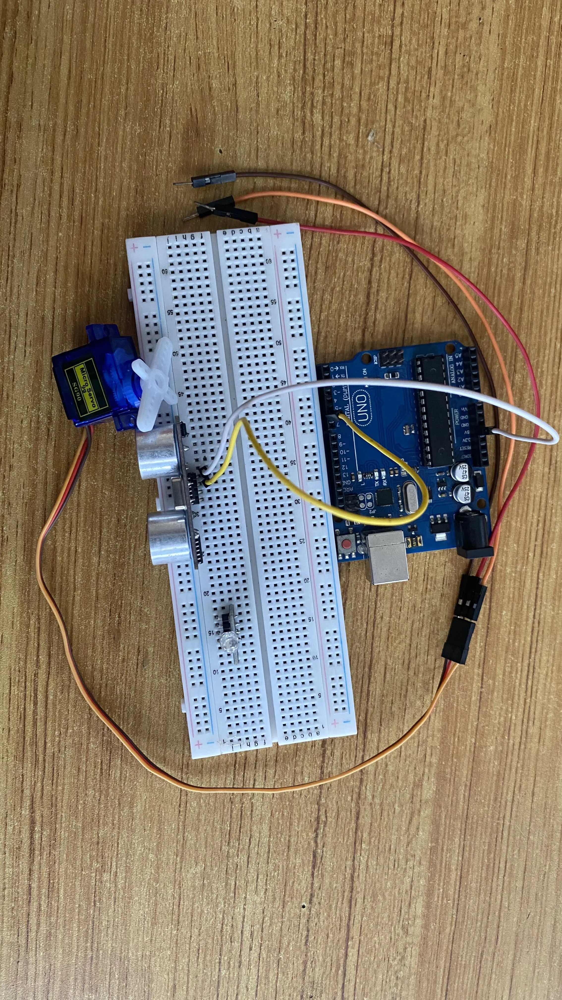.

**Step 3:** Connect one end of the blue male-to-male jumper wire to the Echo pin of the Ultrasonic sensor and the other end to digital pin 7 on the Arduino Uno board as shown in the picture below.

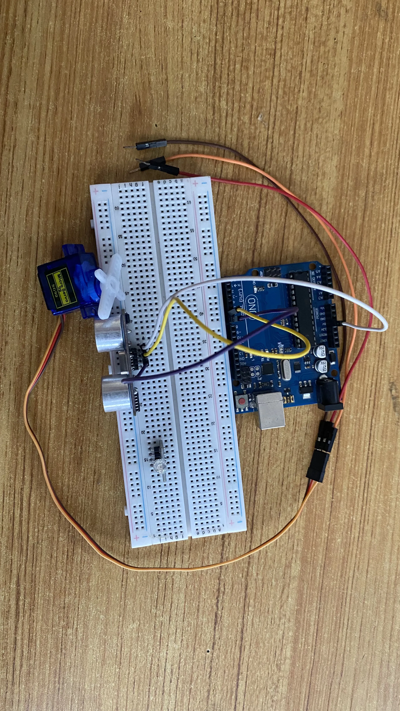.

**Step 4:** Connect one end of the black male-to-male jumper wire to the GND pin of the Ultrasonic sensor and the other end to the GND pin on the Arduino Uno board as shown in the picture below.

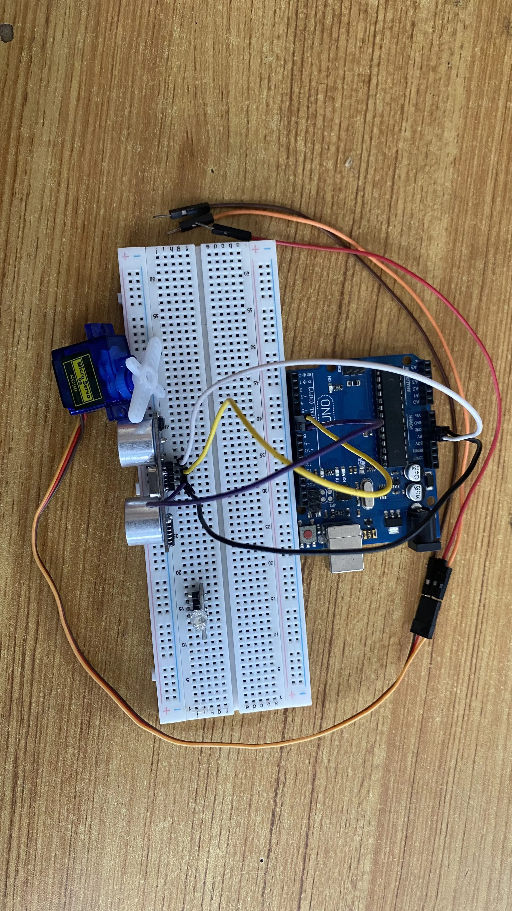.

**Step 5:** Connect the other end of the orange male-to-male jumper wire from the servo motor to digital pin 8 on the Arduino Uno board as shown in the picture below.

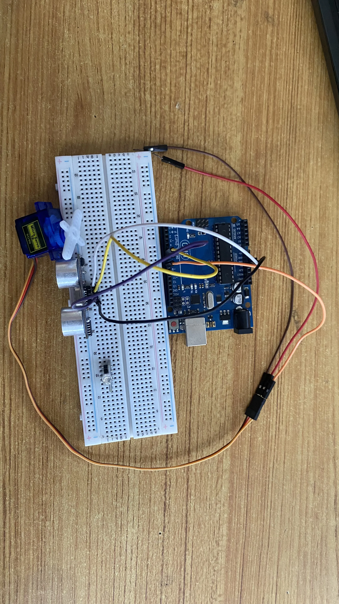.

**Step 6:** Connect the other end of the brown male-to-male jumper wire from the servo motor to the GND pin on the Arduino Uno board as shown in the picture below. Then, connect the other end of the red male-to-male jumper wire from the servo motor to the an empty pin on the breadboard where the white male-to-male jumper wire was connected to the VCC pin of the ultrasonic sensor as shown in the picture below.

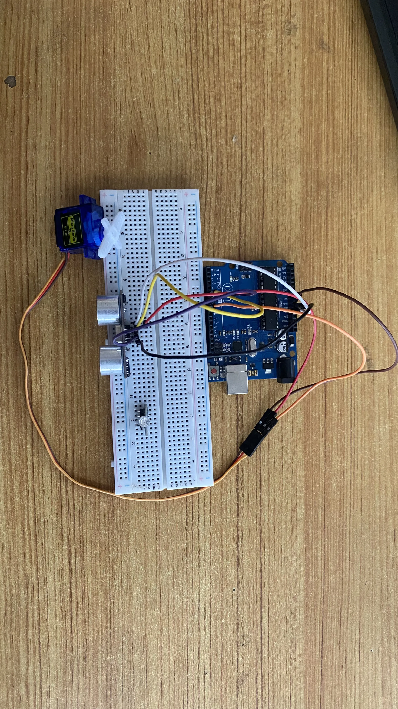.

**Step 7:** Connect one end of a red male-to-male jumper wire to the R pin of the RGB module on the breadboard and the other end to digital pin 9 on the arduino board as shown in the picture below.

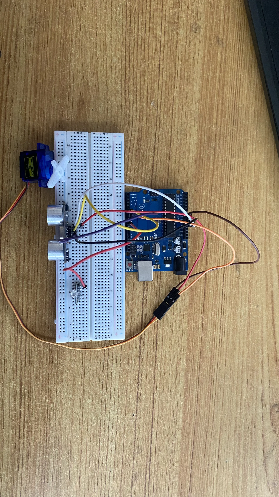.

**Step 8:** Connect one end of a green male-to-male jumper wire to the G pin of the RGB module on the breadboard and the other end to digital pin 10 on the arduino board as shown in the picture below.

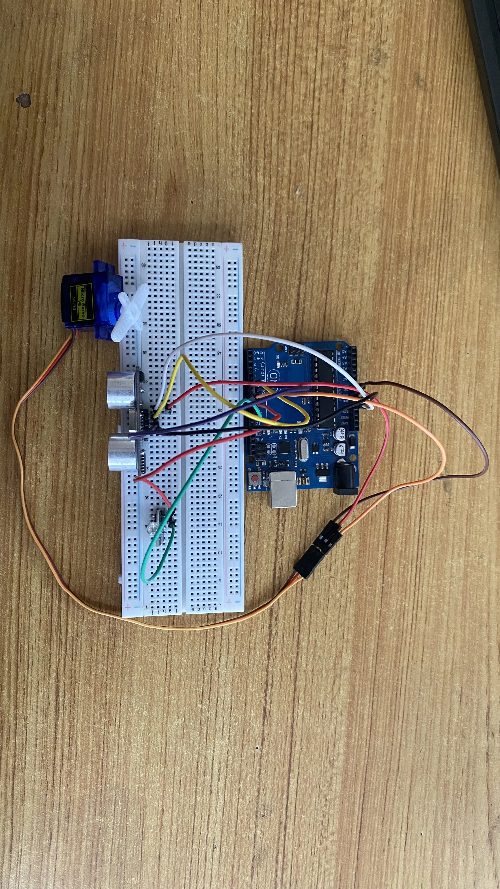.

**Step 9:** Connect one end of a blue male-to-male jumper wire to the B pin of the RGB module on the breadboard and the other end to digital pin 11 on the arduino board as shown in the picture below.

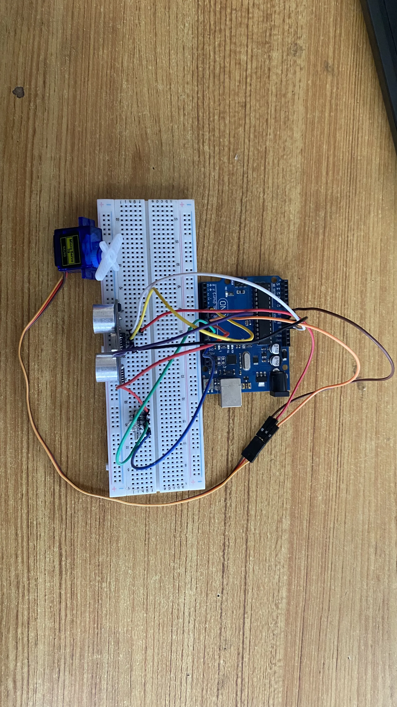.

**Step 10:** Connect one end of a black male-to-male jumper wire to the B pin of the RGB module on the breadboard and the other end to GND on the arduino board as shown in the picture below.

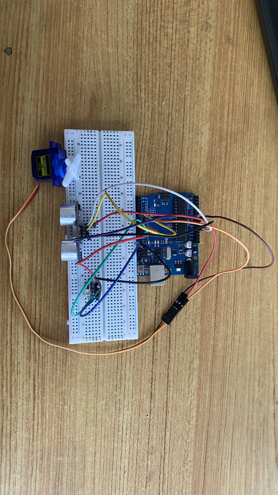. -->

## PROGRAMMING

**Step 1:** Open your Arduino IDE. See how to set up here: [Getting Started](../../Getting Started/Arduino_IDE_Setup.md).

**Step 2:** Type the following code in your arduino IDE at the top of "void setup() { }" function as shown in the picture below.

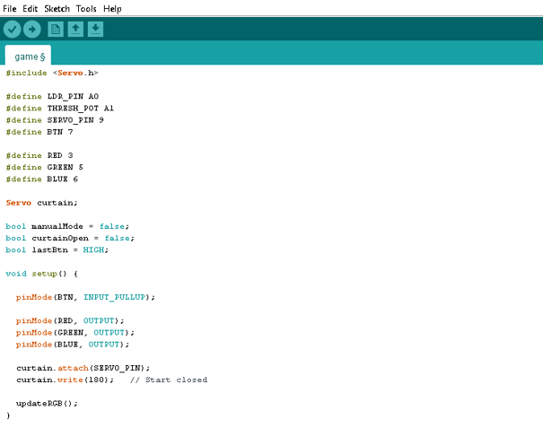

**Step 7:** Save your code. _See the [Getting Started](../../Getting Started/Arduino_IDE_Setup.md) section_

**Step 8:** Select the arduino board and port _See the [Getting Started](../../Getting Started/Arduino_IDE_Setup.md) section:Selecting Arduino Board Type and Uploading your code_.

**Step 9:** Upload your code. _See the [Getting Started](../../Getting Started/Arduino_IDE_Setup.md) section:Selecting Arduino Board Type and Uploading your code_

## OBSERVATION
•	Curtains open automatically when light levels increase beyond the selected threshold. 
•	Curtains close automatically when light levels drop below the selected threshold. 
•	The potentiometer changes the sensitivity of the system. 
•	The RGB LED provides visual status feedback: 
o	Green = Curtain Open 
o	Red = Curtain Closed 
o	Blue = Manual Override Mode 
•	Pressing the pushbutton toggles manual override mode. 

## CONCLUSION
This project demonstrates automation using light sensing, adjustable threshold control, servo motor actuation, RGB LED status indication, and manual override functionality. It introduces key smart-home concepts including environmental sensing, user calibration, visual feedback, and automatic control systems.

