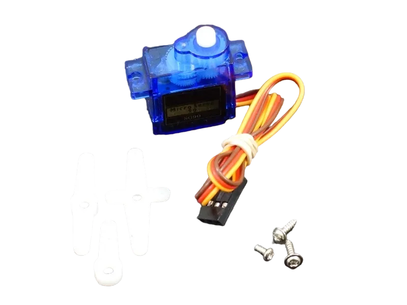
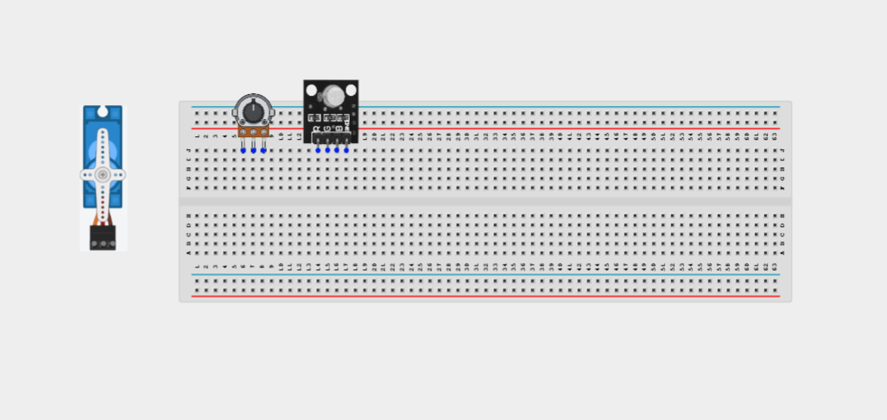
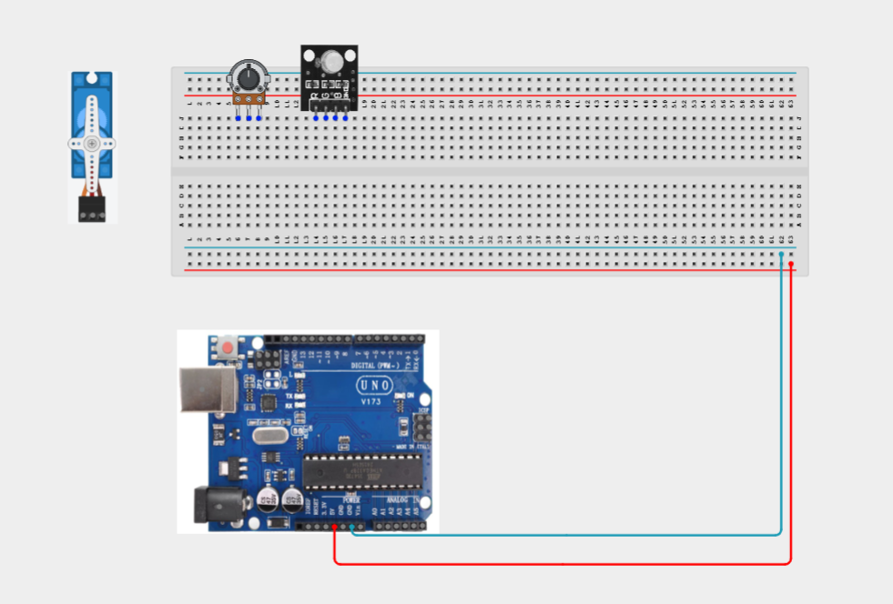
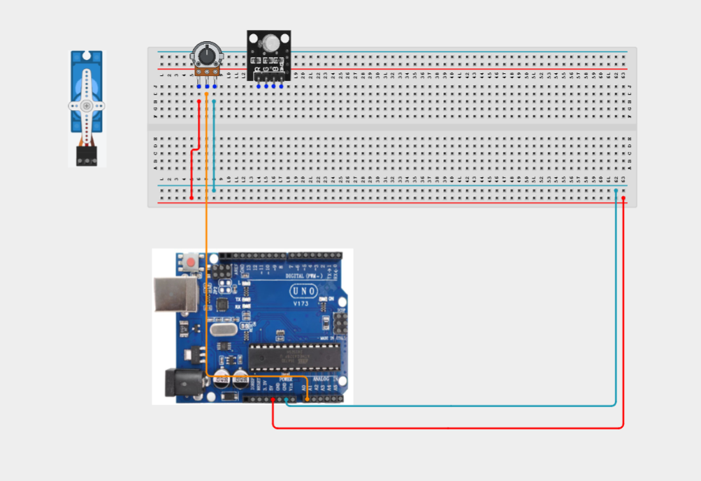
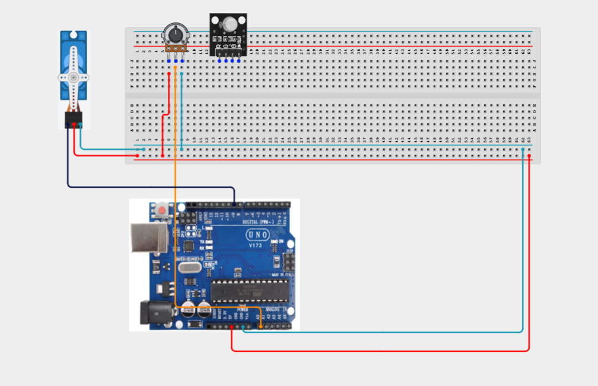
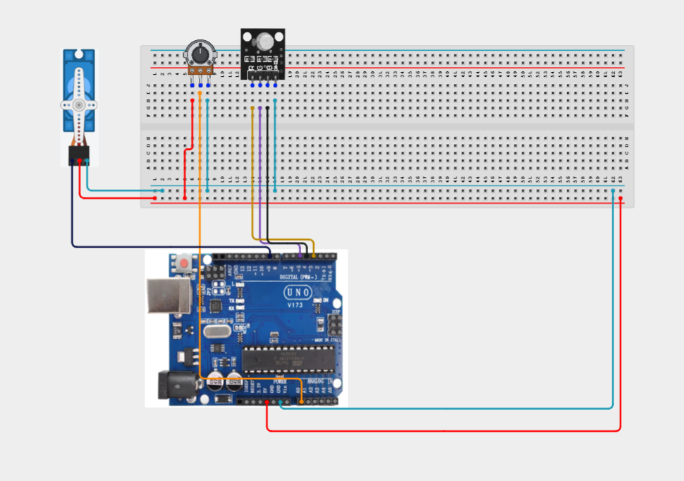

# Project 3.20.1: Color-Coded Servo Positioner

| **Description** | POT controls servo angle, RGB shows position zone by color |
|------------------|----------------------------------------------------------------|
| **Use case**     | This project can be used in advanced automation systems, smart environment control, and integrated sensor-actuator applications. |

## Components (Things You will need)

|  |  |  | | | |||
|-------------------------|-------------------------|-------------------------|-------------------------|-------------------------|--------------------------|-------------------------|--------------------------|

## Building the circuit

Things Needed:

- Arduino Uno = 1
- Arduino USB cable = 1
- Potentiometer = 1
- RGB LED module = 1
- Servo motor = 1
- Jumper Wires


## Mounting the component on the breadboard

**Step 1:** Mount the potentiometer, RGB LED module, servo motor onto the breadboard. Arrange the components neatly to reduce wire crossing and leave enough space for connections.



_**NB:** For complex circuits, plan your component placement to minimize wire crossing and ensure clean connections._

## WIRING THE CIRCUIT

**Step 2:** Connect the 5V pin on the Arduino Uno to the positive (+) power rail on the breadboard.Connect the GND pin on the Arduino Uno to the negative (-) power rail on the breadboard.



**Step 2:** Connect the potentiometer.
Connect the left pin to the 5V rail.
Connect the right pin to the GND rail.
Connect the middle (wiper) pin to Analog Pin A0 on the Arduino.



**Step 2:** Connect the servo motor.
Connect the red (VCC) wire to the 5V rail.
Connect the brown/black (GND) wire to the GND rail.
Connect the orange/yellow (signal) wire to Digital Pin 9 on the Arduino.



**Step 2:** Connect the RGB LED module.
Connect the GND pin to the GND rail.
Connect the Red (R) signal pin to Digital Pin 3.
Connect the Green (G) signal pin to Digital Pin 5.
Connect the Blue (B) signal pin to Digital Pin 6.



_Make sure to connect the Arduino USB cable to the Arduino board._

## PROGRAMMING

**Step 1:** Open your Arduino IDE. See how to set up here: [Getting Started](../../Getting Started/Arduino_IDE_Setup.md).

**Step 2:** Write the complete program implementing the system logic with appropriate pin definitions, setup configuration, and the main control loop.

```cpp
#include <Servo.h>

// Pin Definitions
const int potPin = A0;
const int servoPin = 9;

const int redPin = 3;
const int greenPin = 5;
const int bluePin = 6;

// Create Servo Object
Servo myServo;

void setup()
{
  // Initialize RGB LED pins
  pinMode(redPin, OUTPUT);
  pinMode(greenPin, OUTPUT);
  pinMode(bluePin, OUTPUT);

  // Attach servo to its control pin
  myServo.attach(servoPin);

  // Start Serial Monitor (optional)
  Serial.begin(9600);
}

void loop()
{
  // Read the potentiometer value (0–1023)
  int potValue = analogRead(potPin);

  // Convert the potentiometer value to a servo angle (0–180°)
  int angle = map(potValue, 0, 1023, 0, 180);

  // Move the servo
  myServo.write(angle);

  // Display the angle in the Serial Monitor
  Serial.print("Servo Angle: ");
  Serial.println(angle);

  // Change RGB LED color based on servo position

  // 0°–59° → Green
  if (angle < 60)
  {
    digitalWrite(redPin, LOW);
    digitalWrite(greenPin, HIGH);
    digitalWrite(bluePin, LOW);
  }
  // 60°–119° → Blue
  else if (angle < 120)
  {
    digitalWrite(redPin, LOW);
    digitalWrite(greenPin, LOW);
    digitalWrite(bluePin, HIGH);
  }
  // 120°–180° → Red
  else
  {
    digitalWrite(redPin, HIGH);
    digitalWrite(greenPin, LOW);
    digitalWrite(bluePin, LOW);
  }

  delay(20);
}
```

**Step 3:** Save your code. _See the [Getting Started](../../Getting Started/Arduino_IDE_Setup.md) section_

**Step 4:** Select the Arduino board and port. _See the [Getting Started](../../Getting Started/Arduino_IDE_Setup.md) section_

**Step 5:** Upload your code.

## CONCLUSION

In this project, you learned how to use a potentiometer to control the position of a servo motor while using an RGB LED to provide visual feedback based on the servo's angle. This demonstrates how Arduino can read analog inputs, control actuators, and display system status using color indicators. By completing this project, you have strengthened your understanding of analog input processing, PWM output, servo motor control, and integrating multiple components into a single interactive system.

