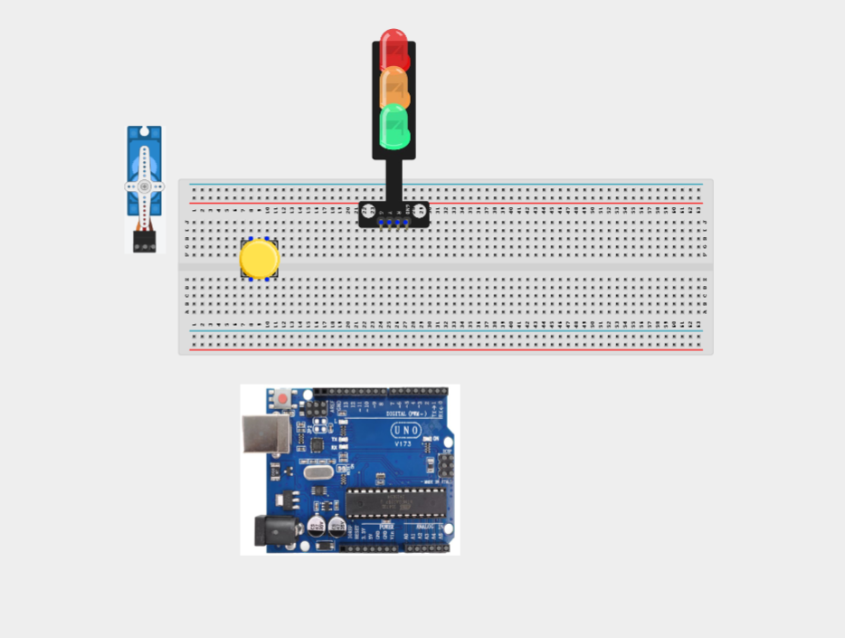
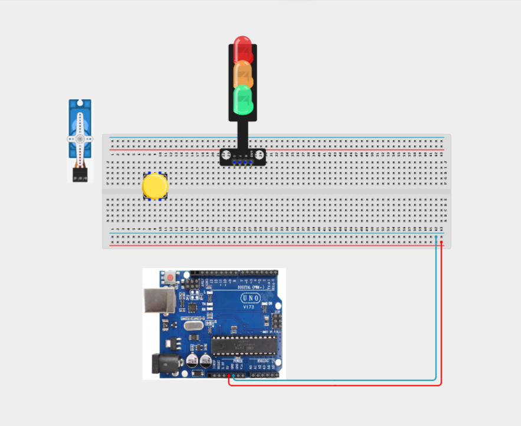
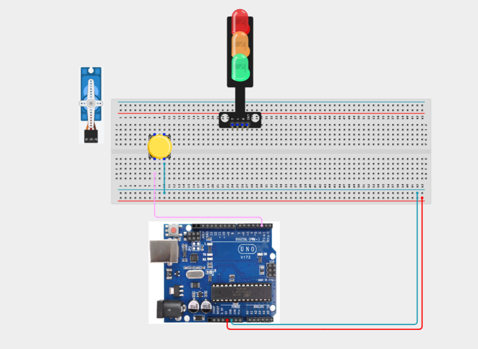
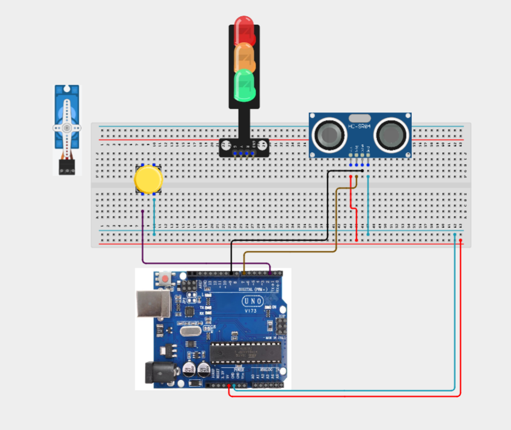
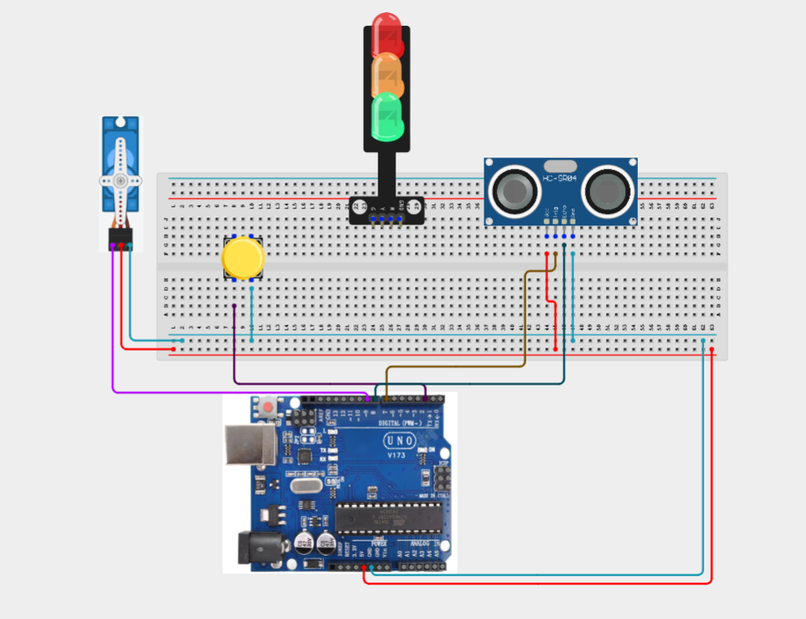

# Project 3.21.1: Multi-Modal Security Gate

| **Description** | The ultrasonic sensor automatically detects approaching objects to open the gate, while a push button provides manual control. A servo motor operates the gate, and a traffic light module indicates the gate's status and safety conditions. |
|------------------|----------------------------------------------------------------|
| **Use case**     | This project can be used in automated parking systems, residential and commercial security gates, warehouse access control, industrial automation, and smart building entrance systems where both automatic and manual gate operation with obstacle detection are required. |

## Components (Things You will need)

|  |  |  | | | |||
|-------------------------|-------------------------|-------------------------|-------------------------|-------------------------|--------------------------|-------------------------|--------------------------|

## Building the circuit

Things Needed:

- Arduino Uno = 1
- Arduino USB cable = 1
- Push button = 1
- Ultrasonic sensor = 1
- Servo motor = 1
- Traffic light module = 1
- Jumper Wires


## Mounting the component on the breadboard

**Step 1:** Carefully mount the push button, ultrasonic sensor, traffic light module, and all necessary jumper wires on the breadboard. Position the components neatly to allow sufficient space for wiring and easy troubleshooting.



_**NB:** For complex circuits, plan your component placement to minimize wire crossing and ensure clean connections._

## WIRING THE CIRCUIT

**Step 2:** Connect the 5V pin on the Arduino Uno to the positive (+) power rail on the breadboard.Connect the GND pin on the Arduino Uno to the negative (-) power rail on the breadboard.



**Step 2:** Connect one terminal of the push button to Digital Pin 2 on the Arduino.Connect the opposite terminal to the GND rail.




**Step 2:**: Connect the ultrasonic sensor (HC-SR04).Connect the VCC pin to the 5V rail.Connect the GND pin to the GND rail.Connect the TRIG pin to Digital Pin 7.Connect the ECHO pin to Digital Pin 8.




**Step 2:** Connect the red (VCC) wire to the 5V rail.
Connect the brown/black (GND) wire to the GND rail.
Connect the orange/yellow (signal) wire to Digital Pin 9.



**Step 2:**Connect the traffic light module.Connect the Red LED signal pin to Digital Pin 3.
Connect the Yellow LED signal pin to Digital Pin 4.
Connect the Green LED signal pin to Digital Pin 5.
Connect the GND pin of the module to the GND rail.


**Step 2:**Connect the 5V pin on the Arduino Uno to the positive (+) power rail on the breadboard.Connect the GND pin on the Arduino Uno to the negative (-) power rail on the breadboard.


**Step 2:**Connect the 5V pin on the Arduino Uno to the positive (+) power rail on the breadboard.Connect the GND pin on the Arduino Uno to the negative (-) power rail on the breadboard.


_Make sure to connect the Arduino USB cable to the Arduino board._

## PROGRAMMING

**Step 1:** Open your Arduino IDE. See how to set up here: [Getting Started](../../Getting Started/Arduino_IDE_Setup.md).

**Step 2:** Write the complete program implementing the system logic with appropriate pin definitions, setup configuration, and the main control loop.

```cpp
#include <Servo.h>

// Pin Definitions
const int buttonPin = 2;

const int redLED = 3;
const int yellowLED = 4;
const int greenLED = 5;

const int trigPin = 7;
const int echoPin = 8;

const int servoPin = 9;

Servo gateServo;

bool gateOpen = false;

long getDistance()
{
  digitalWrite(trigPin, LOW);
  delayMicroseconds(2);

  digitalWrite(trigPin, HIGH);
  delayMicroseconds(10);

  digitalWrite(trigPin, LOW);

  long duration = pulseIn(echoPin, HIGH);
  long distance = duration * 0.034 / 2;

  return distance;
}

void setup()
{
  pinMode(buttonPin, INPUT_PULLUP);

  pinMode(redLED, OUTPUT);
  pinMode(yellowLED, OUTPUT);
  pinMode(greenLED, OUTPUT);

  pinMode(trigPin, OUTPUT);
  pinMode(echoPin, INPUT);

  gateServo.attach(servoPin);

  gateServo.write(0);

  Serial.begin(9600);
}

void loop()
{
  long distance = getDistance();

  Serial.print("Distance: ");
  Serial.print(distance);
  Serial.println(" cm");

  // Automatic Mode
  if (distance > 0 && distance < 15)
  {
    gateOpen = true;
  }

  // Manual Button Mode
  if (digitalRead(buttonPin) == LOW)
  {
    gateOpen = !gateOpen;
    delay(300);
  }

  // Safety Obstacle Interlock
  if (gateOpen && distance > 0 && distance < 5)
  {
    gateServo.write(90);

    digitalWrite(redLED, LOW);
    digitalWrite(yellowLED, HIGH);
    digitalWrite(greenLED, LOW);
  }
  else if (gateOpen)
  {
    gateServo.write(90);

    digitalWrite(redLED, LOW);
    digitalWrite(yellowLED, LOW);
    digitalWrite(greenLED, HIGH);
  }
  else
  {
    gateServo.write(0);

    digitalWrite(redLED, HIGH);
    digitalWrite(yellowLED, LOW);
    digitalWrite(greenLED, LOW);
  }

  delay(100);
}
```

**Step 3:** Save your code. _See the [Getting Started](../../Getting Started/Arduino_IDE_Setup.md) section_

**Step 4:** Select the Arduino board and port. _See the [Getting Started](../../Getting Started/Arduino_IDE_Setup.md) section_

**Step 5:** Upload your code.

## CONCLUSION

In this project, you learned how to build a multi-modal security gate system using an Arduino, an ultrasonic sensor, a push button, a servo motor, and a traffic light module. The project demonstrates how automatic sensing and manual user control can work together while incorporating safety features to prevent collisions. By completing this project, you have strengthened your understanding of distance sensing, servo motor control, conditional programming, safety interlocks, and integrating multiple electronic components into a practical automation system.

