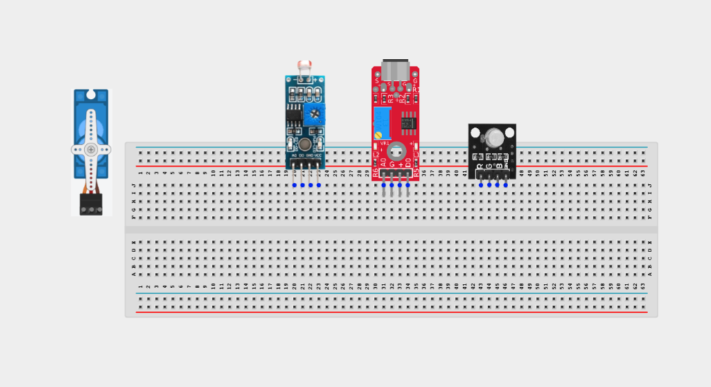
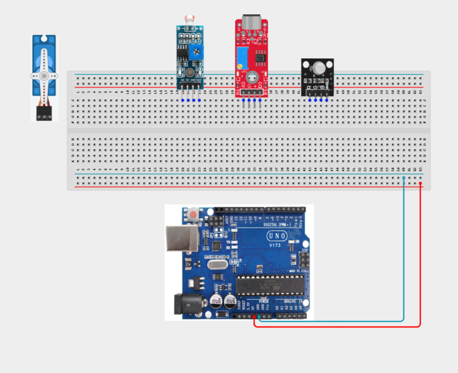
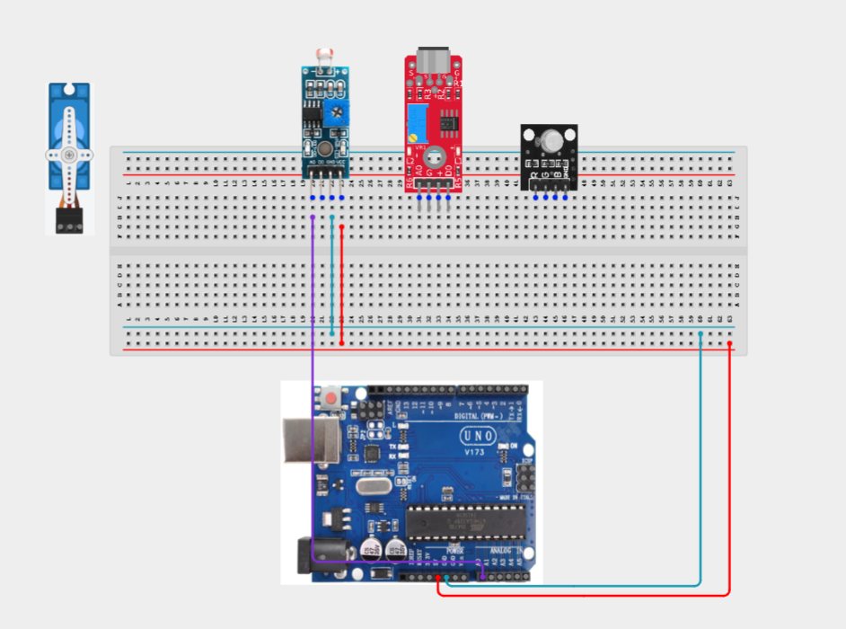
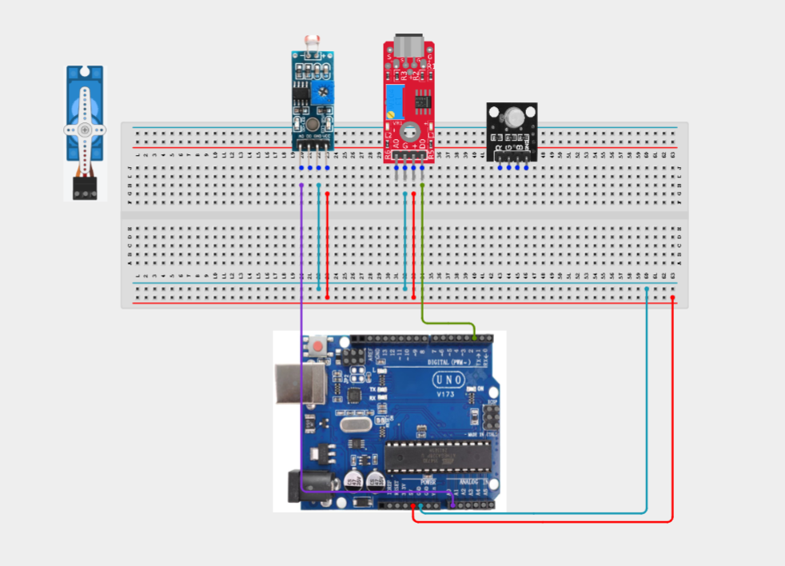
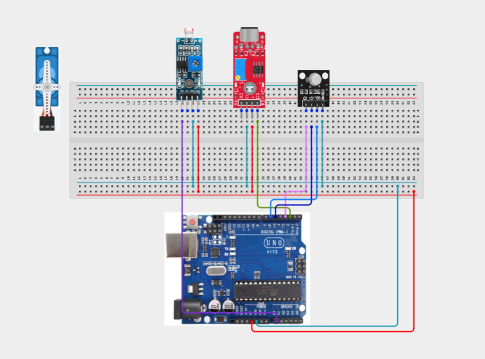
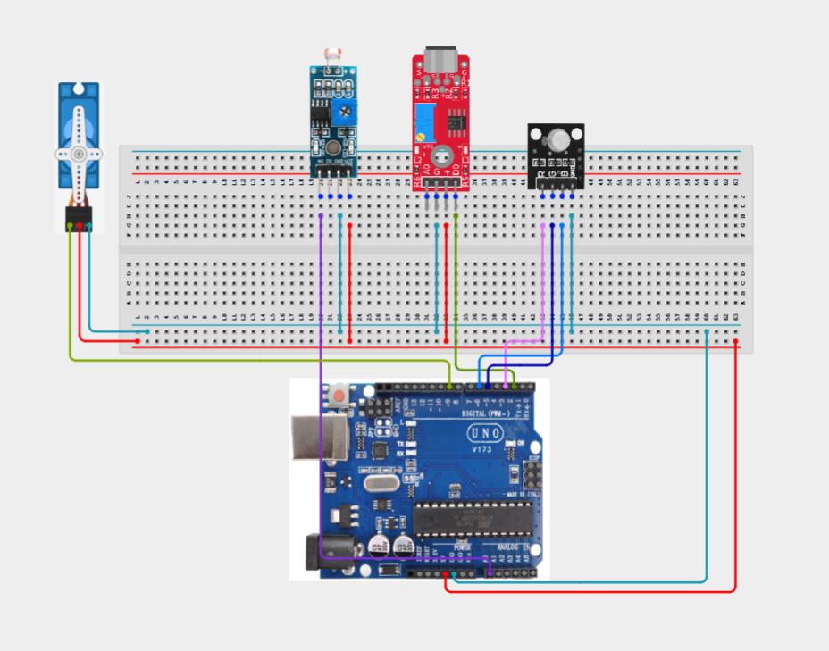
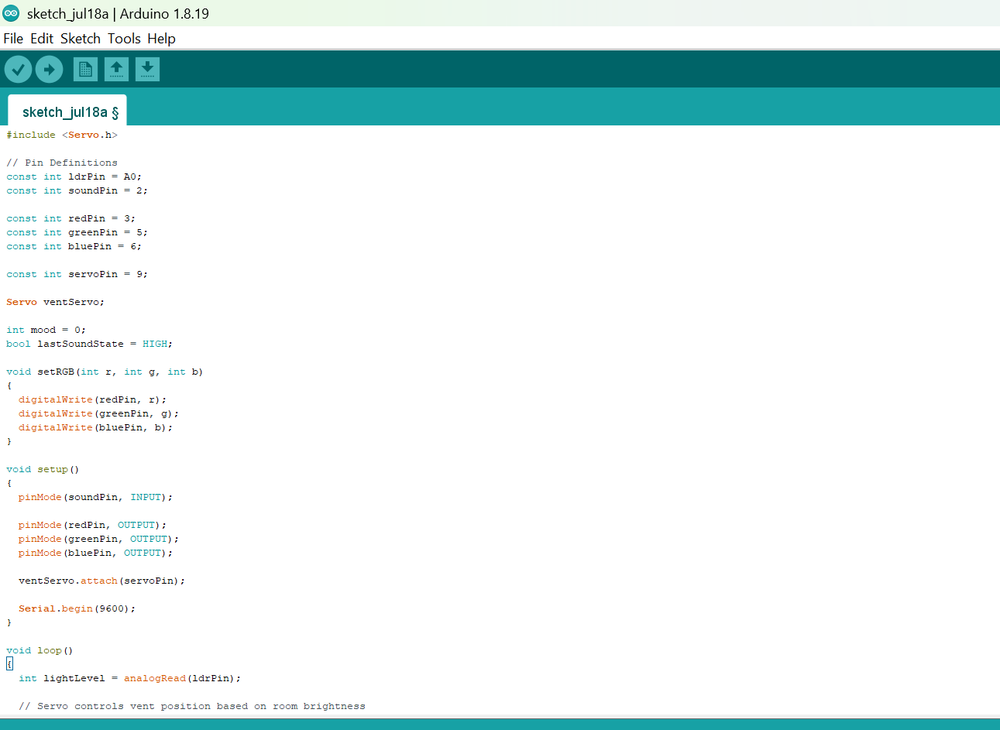
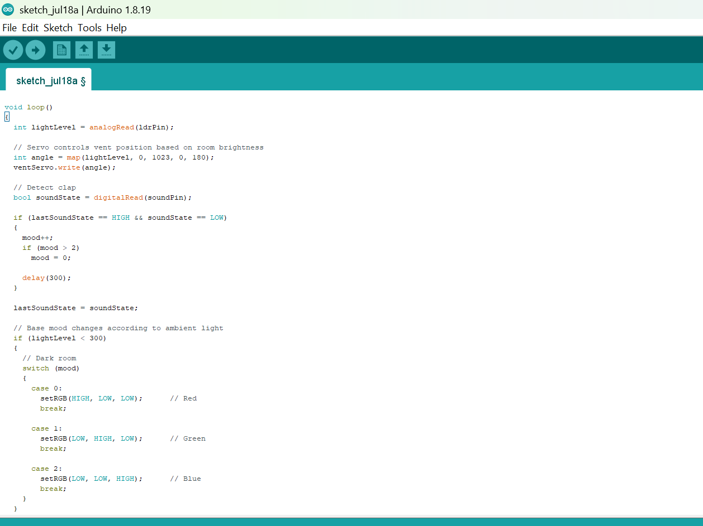

# Project 3.22.1: Smart Mood Room Controller

| **Description** |The LDR automatically adjusts room lighting based on ambient light, claps cycle through mood lighting presets, and a servo motor controls the position of a fan vent. |
|------------------|----------------------------------------------------------------|
| **Use case**     |This project can be used in smart homes, automated room lighting systems, energy-efficient buildings, and intelligent environmental control systems where lighting and ventilation adapt to user interaction and surrounding conditions. |

## Components (Things You will need)

|  |  |  | | | |  ||
|-------------------------|-------------------------|-------------------------|-------------------------|-------------------------|--------------------------|-------------------------|--------------------------|

## Building the circuit

Things Needed:

- Arduino Uno = 1
- Arduino USB cable = 1
- LDR module = 1
- Sound sensor module = 1
- RGB LED module = 1
- Servo motor = 1
- Jumper Wires


## Mounting the component on the breadboard

**Step 1:** Carefully mount the LDR module, sound sensor module, RGB LED module, servo motor  on the breadboard. Arrange the components neatly to allow sufficient space for wiring and easy troubleshooting.



_**NB:** For complex circuits, plan your component placement to minimize wire crossing and ensure clean connections._

## WIRING THE CIRCUIT

**Step 2:** Connect the 5V pin on the Arduino Uno to the positive (+) power rail on the breadboard.Connect the GND pin on the Arduino Uno to the negative (-) power rail on the breadboard.



**Step 3:** Connect the LDR module.Connect the VCC pin to the 5V rail.
Connect the GND pin to the GND rail.
Connect the AO (Analog Output) pin to Analog Pin A0 on the Arduino.



**Step 4:** Connect the sound sensor module.Connect the VCC pin to the 5V rail.
Connect the GND pin to the GND rail.
Connect the DO (Digital Output) pin to Digital Pin 2.



**Step 5:** Connect the RGB LED module.Connect the GND pin to the GND rail.
Connect the Red (R) pin to Digital Pin 3.
Connect the Green (G) pin to Digital Pin 5.
Connect the Blue (B) pin to Digital Pin 6.



**Step 6:** Connect the servo motor.
Connect the red (VCC) wire to the 5V rail.
Connect the brown/black (GND) wire to the GND rail.
Connect the orange/yellow (signal) wire to Digital Pin 9.



_Make sure to connect the Arduino USB cable to the Arduino board._

## PROGRAMMING

**Step 1:** Open your Arduino IDE. See how to set up here: [Getting Started](../../Getting Started/Arduino_IDE_Setup.md).

**Step 2:** Write the complete program implementing the system logic with appropriate pin definitions, setup configuration, and the main control loop.

```cpp
#include <Servo.h>

// Pin Definitions
const int ldrPin = A0;
const int soundPin = 2;

const int redPin = 3;
const int greenPin = 5;
const int bluePin = 6;

const int servoPin = 9;

Servo ventServo;

int mood = 0;
bool lastSoundState = HIGH;

void setRGB(int r, int g, int b)
{
  digitalWrite(redPin, r);
  digitalWrite(greenPin, g);
  digitalWrite(bluePin, b);
}

void setup()
{
  pinMode(soundPin, INPUT);

  pinMode(redPin, OUTPUT);
  pinMode(greenPin, OUTPUT);
  pinMode(bluePin, OUTPUT);

  ventServo.attach(servoPin);

  Serial.begin(9600);
}

void loop()
{
  int lightLevel = analogRead(ldrPin);

  // Servo controls vent position based on room brightness
  int angle = map(lightLevel, 0, 1023, 0, 180);
  ventServo.write(angle);

  // Detect clap
  bool soundState = digitalRead(soundPin);

  if (lastSoundState == HIGH && soundState == LOW)
  {
    mood++;
    if (mood > 2)
      mood = 0;

    delay(300);
  }

  lastSoundState = soundState;

  // Base mood changes according to ambient light
  if (lightLevel < 300)
  {
    // Dark room
    switch (mood)
    {
      case 0:
        setRGB(HIGH, LOW, LOW);      // Red
        break;

      case 1:
        setRGB(LOW, HIGH, LOW);      // Green
        break;

      case 2:
        setRGB(LOW, LOW, HIGH);      // Blue
        break;
    }
  }
  else
  {
    // Bright room
    switch (mood)
    {
      case 0:
        setRGB(HIGH, HIGH, LOW);     // Yellow
        break;

      case 1:
        setRGB(LOW, HIGH, HIGH);     // Cyan
        break;

      case 2:
        setRGB(HIGH, LOW, HIGH);     // Purple
        break;
    }
  }

  Serial.print("Light: ");
  Serial.print(lightLevel);

  Serial.print(" | Mood: ");
  Serial.print(mood);

  Serial.print(" | Servo: ");
  Serial.println(angle);

  delay(100);
}
```





**Step 3:** Save your code. _See the [Getting Started](../../Getting Started/Arduino_IDE_Setup.md) section_

**Step 4:** Select the arduino board and port _See the [Getting Started](../../Getting Started/Arduino_IDE_Setup.md) section:Selecting Arduino Board Type and Uploading your code_.

**Step 5:** Upload your code. _See the [Getting Started](../../Getting Started/Arduino_IDE_Setup.md) section:Selecting Arduino Board Type and Uploading your code_

## CONCLUSION

In this project, you learned how to build a smart mood room controller using an Arduino, an LDR module, a sound sensor, an RGB LED module, and a servo motor. The system automatically responds to changes in ambient light while allowing users to change lighting moods through simple clap detection. By completing this project, you strengthened your understanding of analog sensing, digital input handling, servo motor control, event-driven programming, and integrating multiple electronic components into a practical smart home automation application.

