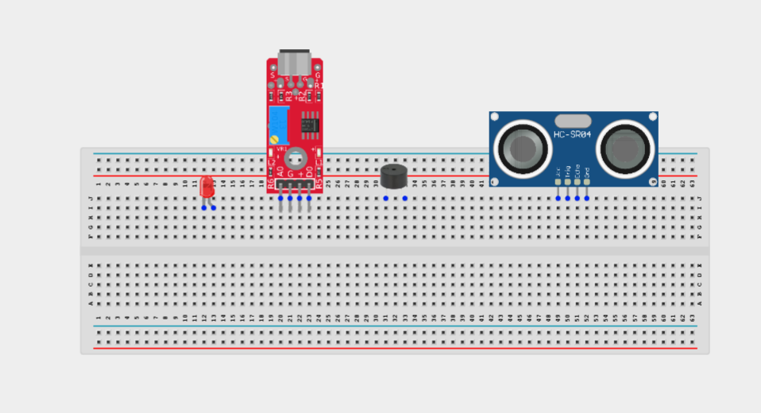
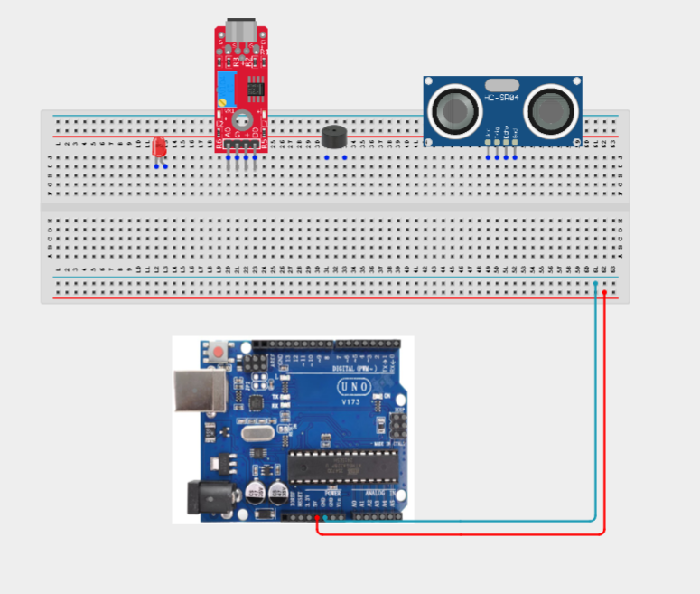
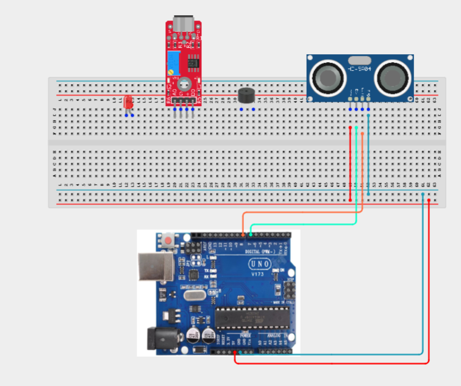
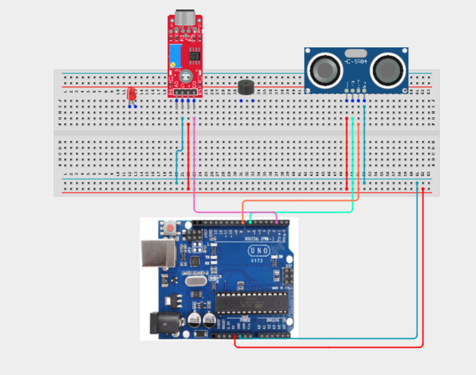
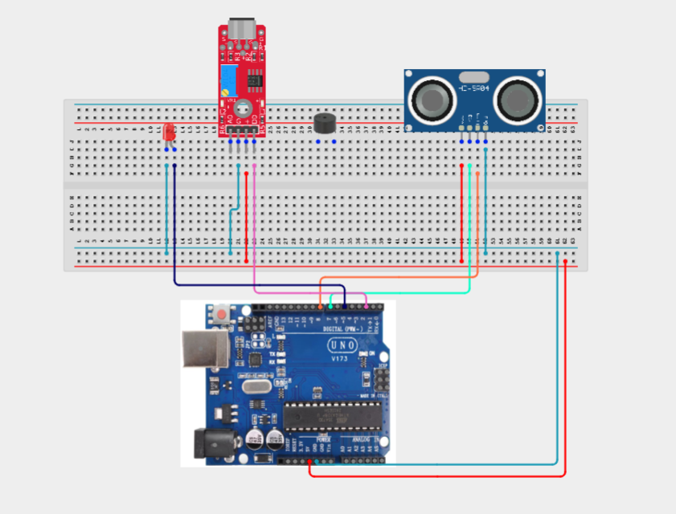
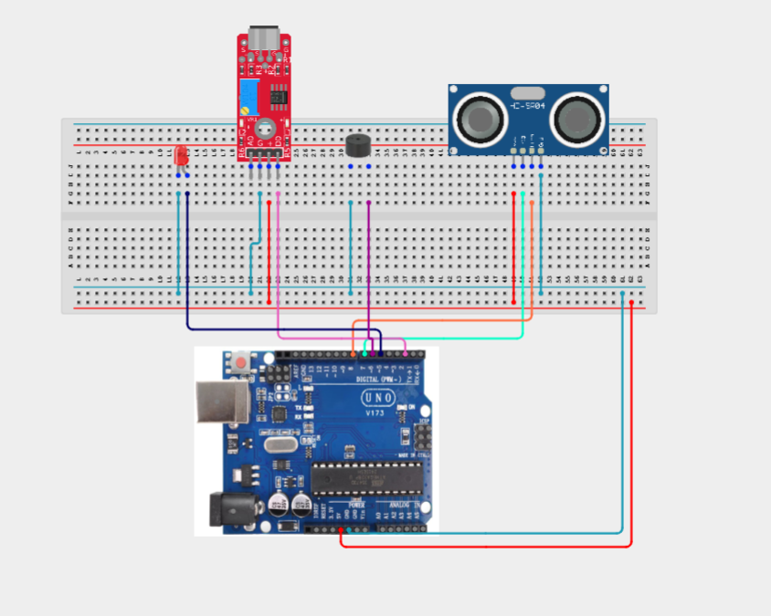
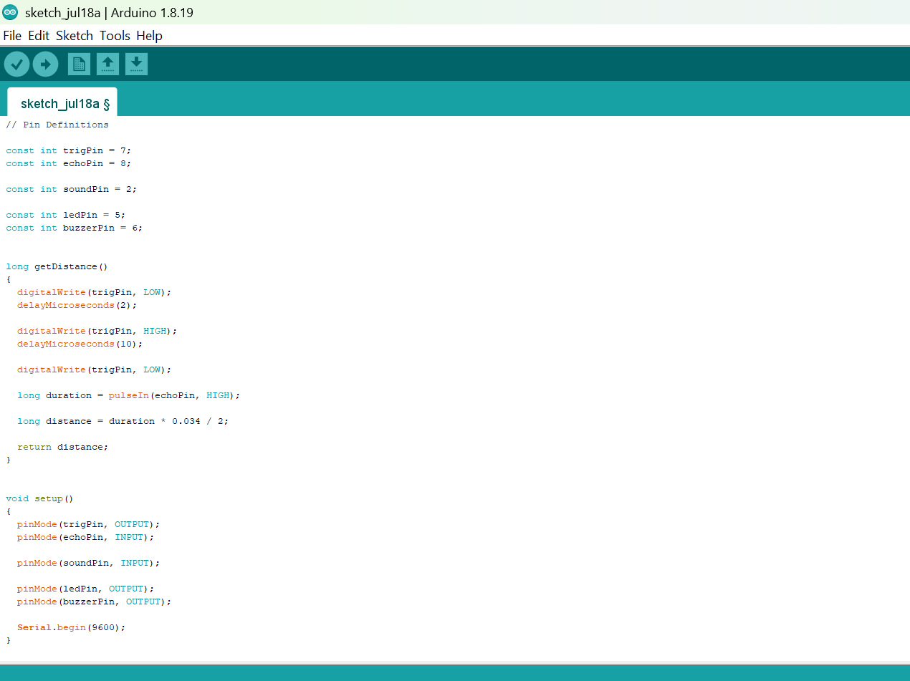
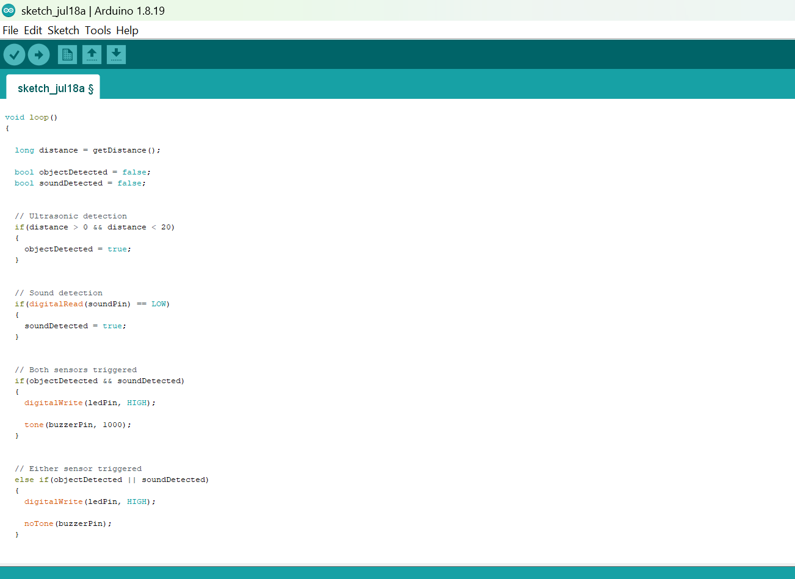
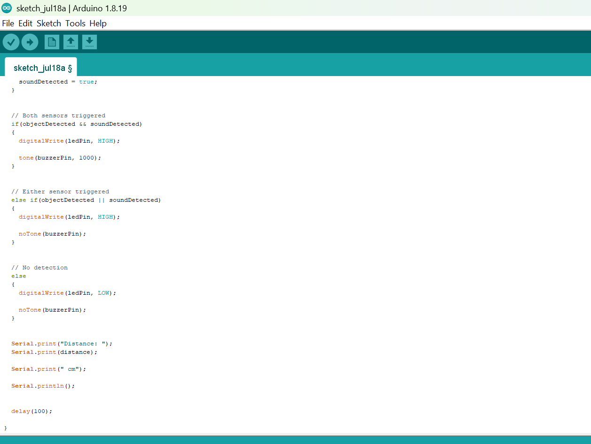

# Project 3.23.1: Dual-Sensor Perimeter Alarm

| **Description** | An ultrasonic sensor or sound sensor detects possible intrusion and activates an LED warning, while simultaneous detection from both sensors triggers a full buzzer alarm. |
|------------------|----------------------------------------------------------------|
| **Use case**     | This project can be used in smart security systems, restricted area monitoring, automated warning systems, and perimeter protection applications where multiple sensors are combined for improved threat detection. |

## Components (Things You will need)

|  |  |  | | | |||
|-------------------------|-------------------------|-------------------------|-------------------------|-------------------------|--------------------------|-------------------------|--------------------------|


## Building the circuit

Things Needed:

- Arduino Uno = 1
- Arduino USB cable = 1
- Ultrasonic sensor = 1
- Sound sensor module = 1
- LED = 1
- Buzzer = 1
- Jumper Wires

## Mounting the component on the breadboard

**Step 1:** Carefully place the ultrasonic sensor, sound sensor module, LED, buzzer on the breadboard. Ensure proper spacing between components to make wiring easier and prevent short circuits.



_**NB:** For complex circuits, plan your component placement to minimize wire crossing and ensure clean connections._

## WIRING THE CIRCUIT

**Step 2:** Connect the 5V pin on the Arduino Uno to the positive (+) power rail on the breadboard.Connect the GND pin on the Arduino Uno to the negative (-) power rail on the breadboard.



**Step 2:** Connect the ultrasonic sensor (HC-SR04). Connect VCC to the 5V rail.
Connect GND to the GND rail.
Connect TRIG pin to Digital Pin 7.
Connect ECHO pin to Digital Pin 8.



**Step 2:** Connect the sound sensor module. Connect VCC to the 5V rail.
Connect GND to the GND rail.
Connect DO (Digital Output) pin to Digital Pin 2.



**Step 2:** Connect the other side of the led to Digital Pin 5.
Connect the LED's short leg (negative/cathode) to the GND rail.



**Step 2:** Connect the buzzer.Connect the positive (+) pin of the buzzer to Digital Pin 6.
Connect the negative (-) pin to the GND rail.



_Make sure to connect the Arduino USB cable to the Arduino board._

## PROGRAMMING

**Step 1:** Open your Arduino IDE. See how to set up here: [Getting Started](../../Getting Started/Arduino_IDE_Setup.md).

**Step 2:** Write the complete program implementing the system logic with appropriate pin definitions, setup configuration, and the main control loop.

```cpp
// Pin Definitions

const int trigPin = 7;
const int echoPin = 8;

const int soundPin = 2;

const int ledPin = 5;
const int buzzerPin = 6;


long getDistance()
{
  digitalWrite(trigPin, LOW);
  delayMicroseconds(2);

  digitalWrite(trigPin, HIGH);
  delayMicroseconds(10);

  digitalWrite(trigPin, LOW);

  long duration = pulseIn(echoPin, HIGH);

  long distance = duration * 0.034 / 2;

  return distance;
}


void setup()
{
  pinMode(trigPin, OUTPUT);
  pinMode(echoPin, INPUT);

  pinMode(soundPin, INPUT);

  pinMode(ledPin, OUTPUT);
  pinMode(buzzerPin, OUTPUT);

  Serial.begin(9600);
}


void loop()
{

  long distance = getDistance();

  bool objectDetected = false;
  bool soundDetected = false;


  // Ultrasonic detection
  if(distance > 0 && distance < 20)
  {
    objectDetected = true;
  }


  // Sound detection
  if(digitalRead(soundPin) == LOW)
  {
    soundDetected = true;
  }


  // Both sensors triggered
  if(objectDetected && soundDetected)
  {
    digitalWrite(ledPin, HIGH);

    tone(buzzerPin, 1000);
  }


  // Either sensor triggered
  else if(objectDetected || soundDetected)
  {
    digitalWrite(ledPin, HIGH);

    noTone(buzzerPin);
  }


  // No detection
  else
  {
    digitalWrite(ledPin, LOW);

    noTone(buzzerPin);
  }


  Serial.print("Distance: ");
  Serial.print(distance);

  Serial.print(" cm");

  Serial.println();


  delay(100);

}
```







**Step 3:** Save your code. _See the [Getting Started](../../Getting Started/Arduino_IDE_Setup.md) section_

**Step 4:** Select the arduino board and port _See the [Getting Started](../../Getting Started/Arduino_IDE_Setup.md) section:Selecting Arduino Board Type and Uploading your code_.

**Step 5:** Upload your code. _See the [Getting Started](../../Getting Started/Arduino_IDE_Setup.md) section:Selecting Arduino Board Type and Uploading your code_


## CONCLUSION

In this project, you learned how to create a dual-sensor perimeter alarm system using an Arduino, ultrasonic sensor, sound sensor, LED, and buzzer. The system demonstrates how combining multiple sensors can improve accuracy and provide different levels of alerts depending on the detected condition.

By completing this project, you strengthened your understanding of sensor integration, digital input handling, alarm systems, conditional programming, and designing practical security applications using Arduino.
