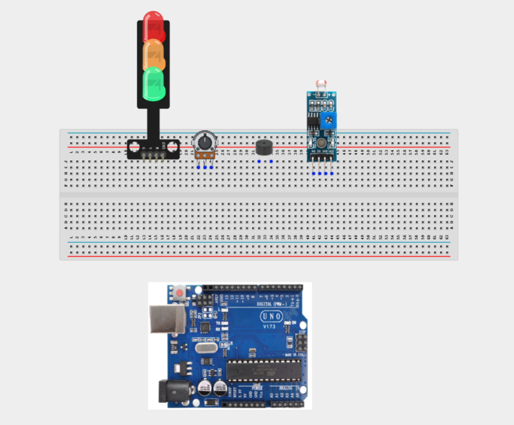
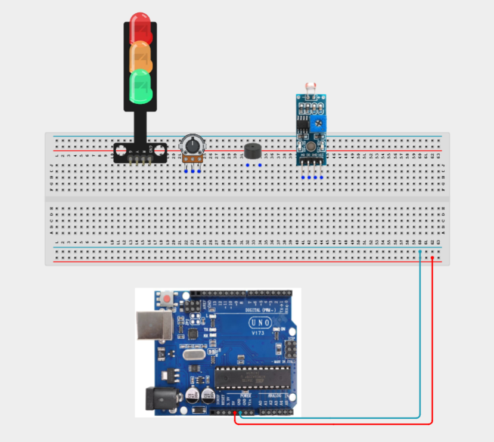
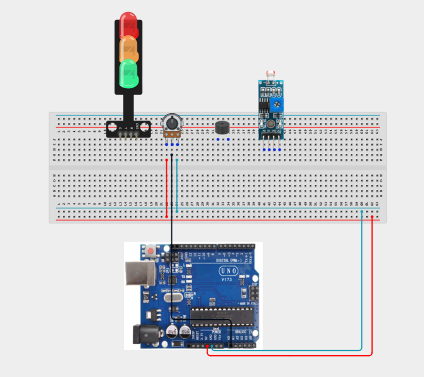
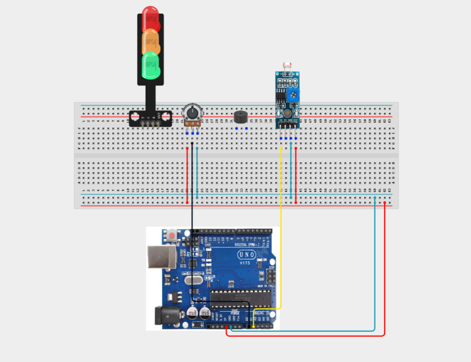
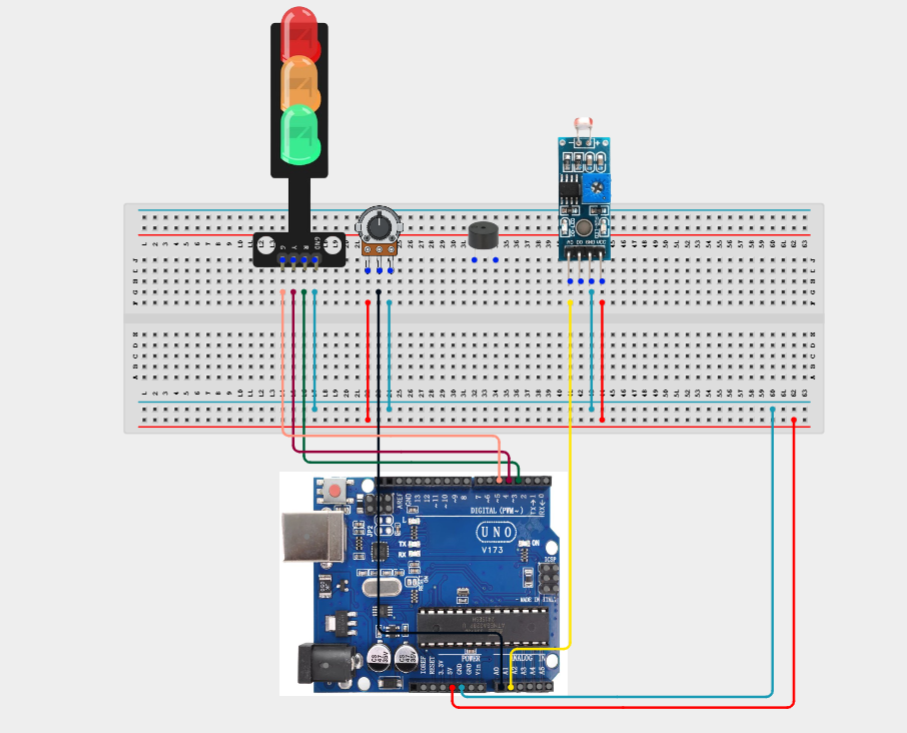
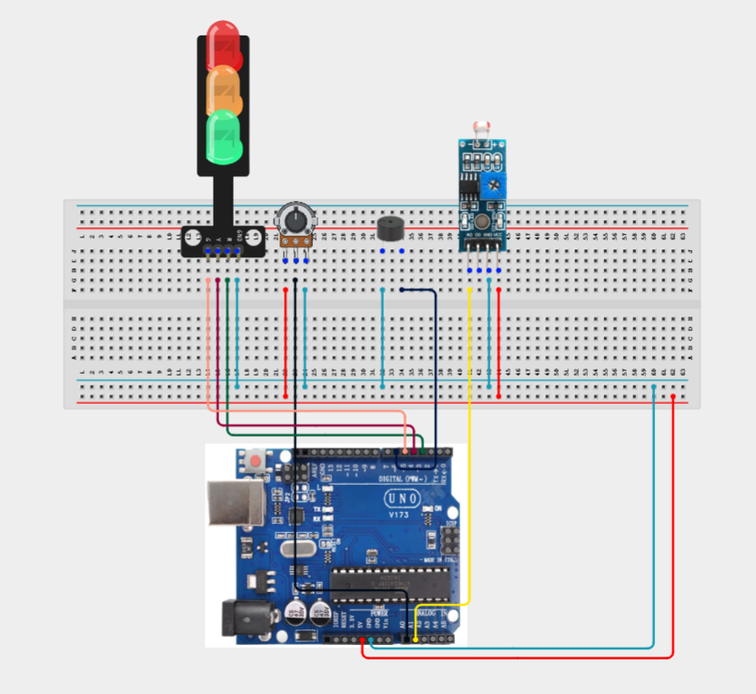
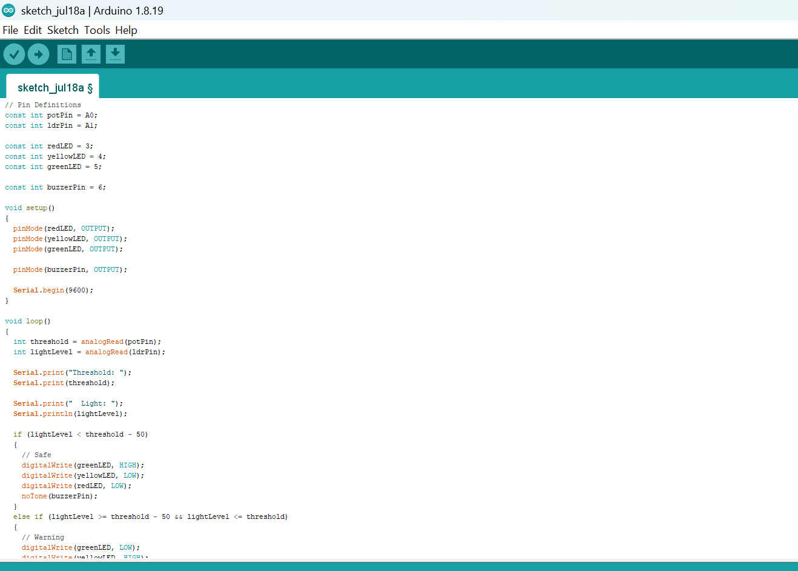
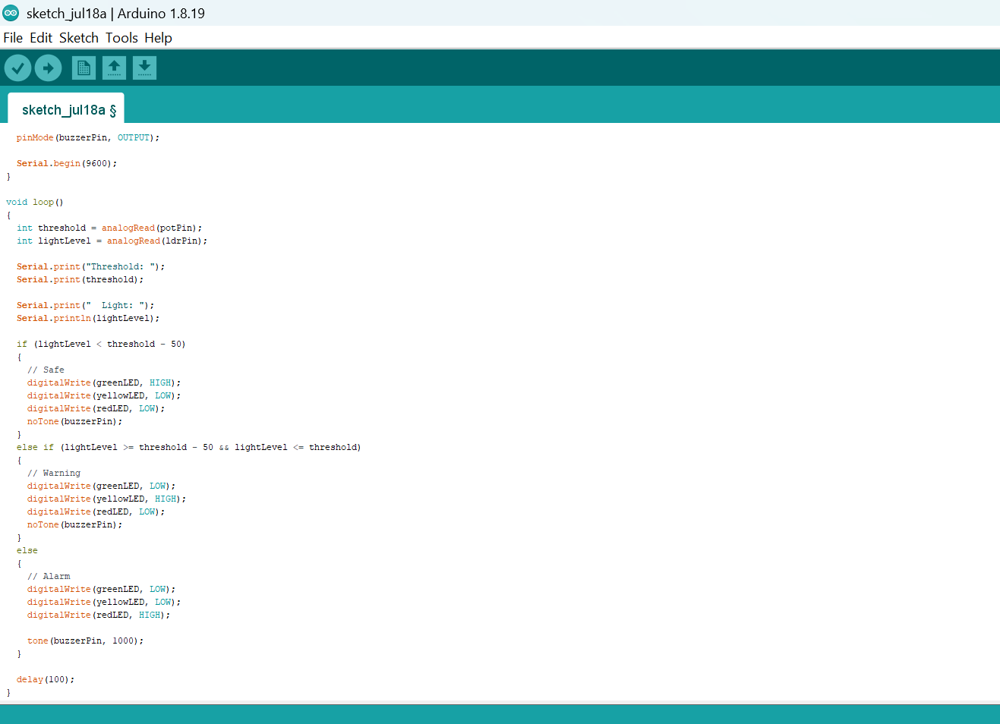

# Project 3.24.1: Calibrated Light Alarm Gauge

| **Description** | A potentiometer sets the light intensity threshold, an LDR monitors ambient light, and a traffic light module with a buzzer provides visual and audible alerts when the threshold is exceeded. |
|------------------|----------------------------------------------------------------|
| **Use case**     | This project can be used in automatic light monitoring systems, greenhouse lighting control, museum exhibit protection, laboratory environments, and smart building automation where light intensity must be monitored against a user-defined threshold.. |

## Components (Things You will need)

|  |  |  | | | |||
|-------------------------|-------------------------|-------------------------|-------------------------|-------------------------|--------------------------|-------------------------|--------------------------|

## Building the circuit

Things Needed:

- Arduino Uno = 1
- Arduino USB cable = 1
- Potentiometer = 1
- LDR module = 1
- Buzzer = 1
- Traffic light module = 1
- Jumper Wires


## Mounting the component on the breadboard

**Step 1:** Carefully mount the potentiometer, LDR module, traffic light module, buzzer on the breadboard. Arrange the components neatly to allow sufficient space for wiring and easy troubleshooting.



_**NB:** For complex circuits, plan your component placement to minimize wire crossing and ensure clean connections._

## WIRING THE CIRCUIT

**Step 2:** Connect the 5V pin on the Arduino Uno to the positive (+) power rail on the breadboard.Connect the GND pin on the Arduino Uno to the negative (-) power rail on the breadboard.



**Step 2:** Connecting the potentiometer. Connect the left pin to the 5V rail.
Connect the right pin to the GND rail.
Connect the middle (wiper) pin to Analog Pin A0.



**Step 2:** Connecting the LDR module. Connect VCC to the 5V rail.
Connect GND to the GND rail.
Connect AO (Analog Output) to Analog Pin A1.



**Step 2:** Connecting the Traffic light. Connect the Red LED signal pin to Digital Pin 3.
Connect the Yellow LED signal pin to Digital Pin 4.
Connect the Green LED signal pin to Digital Pin 5.
Connect the module GND pin to the GND rail.



**Step 2:** Connecting the buzzer. Connect the positive (+) pin of the buzzer to Digital Pin 6.
Connect the negative (-) pin to the GND rail.



_Make sure to connect the Arduino USB cable to the Arduino board._

## PROGRAMMING

**Step 1:** Open your Arduino IDE. See how to set up here: [Getting Started](../../Getting Started/Arduino_IDE_Setup.md).

**Step 2:** Write the complete program implementing the system logic with appropriate pin definitions, setup configuration, and the main control loop.

```cpp
// Pin Definitions
const int potPin = A0;
const int ldrPin = A1;

const int redLED = 3;
const int yellowLED = 4;
const int greenLED = 5;

const int buzzerPin = 6;

void setup()
{
  pinMode(redLED, OUTPUT);
  pinMode(yellowLED, OUTPUT);
  pinMode(greenLED, OUTPUT);

  pinMode(buzzerPin, OUTPUT);

  Serial.begin(9600);
}

void loop()
{
  int threshold = analogRead(potPin);
  int lightLevel = analogRead(ldrPin);

  Serial.print("Threshold: ");
  Serial.print(threshold);

  Serial.print("  Light: ");
  Serial.println(lightLevel);

  if (lightLevel < threshold - 50)
  {
    // Safe
    digitalWrite(greenLED, HIGH);
    digitalWrite(yellowLED, LOW);
    digitalWrite(redLED, LOW);
    noTone(buzzerPin);
  }
  else if (lightLevel >= threshold - 50 && lightLevel <= threshold)
  {
    // Warning
    digitalWrite(greenLED, LOW);
    digitalWrite(yellowLED, HIGH);
    digitalWrite(redLED, LOW);
    noTone(buzzerPin);
  }
  else
  {
    // Alarm
    digitalWrite(greenLED, LOW);
    digitalWrite(yellowLED, LOW);
    digitalWrite(redLED, HIGH);

    tone(buzzerPin, 1000);
  }

  delay(100);
}
```






**Step 3:** Save your code. _See the [Getting Started](../../Getting Started/Arduino_IDE_Setup.md) section_

**Step 4:** Select the arduino board and port _See the [Getting Started](../../Getting Started/Arduino_IDE_Setup.md) section:Selecting Arduino Board Type and Uploading your code_.

**Step 5:** Upload your code. _See the [Getting Started](../../Getting Started/Arduino_IDE_Setup.md) section:Selecting Arduino Board Type and Uploading your code_


## CONCLUSION

In this project, you learned how to build a calibrated light alarm system using an Arduino, a potentiometer, an LDR module, a traffic light module, and a buzzer. The system allows users to set a custom light threshold and continuously monitors ambient light levels to provide appropriate visual and audible alerts. By completing this project, you strengthened your understanding of analog sensing, calibration techniques, threshold-based decision-making, alarm systems, and integrating multiple electronic components into a practical environmental monitoring application.

