# Project 3.25.1: Integrated Smart Home Security Console

| **Description** |A smart home security system that operates in three modes—Standby, Night, and Alarm—using a push button to arm or disarm the system, an LDR and sound sensor to detect intrusions, an RGB LED to display system status, a servo motor to control a door latch, and a buzzer to signal security breaches. |
|------------------|----------------------------------------------------------------|
| **Use case**     | This project can be used in smart home security systems, automated access control, intelligent building monitoring, residential alarm systems, and embedded IoT security applications where multiple sensors and actuators work together to provide real-time protection. |

## Components (Things You will need)

|  |  |  | | | |||||
|-------------------------|-------------------------|-------------------------|-------------------------|-------------------------|--------------------------|-------------------------|--------------------------|--------------------------|--------------------------|


## Building the circuit

Things Needed:

- Arduino Uno = 1
- Arduino USB cable = 1
- Push button = 1
- LDR module = 1
- Sound sensor module = 1
- RGB LED module = 1
- Servo motor = 1
- Buzzer = 1
- Jumper Wires

## Mounting the component on the breadboard

**Step 1:** Carefully mount the push button, LDR module, sound sensor module, RGB LED module, servo motor, buzzer on the breadboard. Arrange the components neatly to allow sufficient space for wiring and simplify troubleshooting.

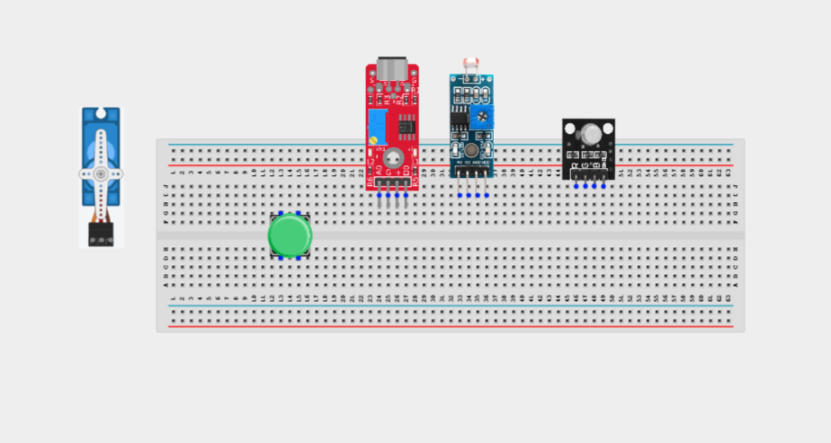

_**NB:** For complex circuits, plan your component placement to minimize wire crossing and ensure clean connections._

## WIRING THE CIRCUIT

**Step 2:** Connect the 5V pin on the Arduino Uno to the positive (+) power rail on the breadboard.Connect the GND pin on the Arduino Uno to the negative (-) power rail on the breadboard.

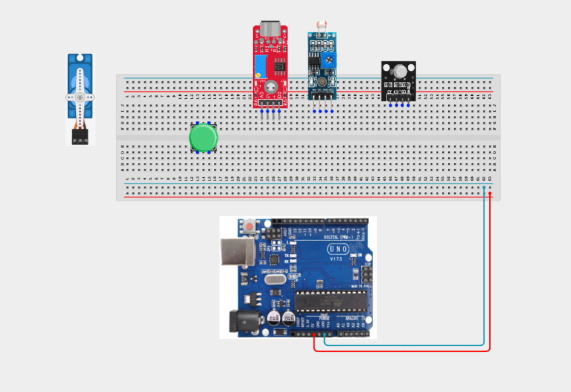

**Step 3:** Connecting the push button. Connect one terminal of the push button to Digital Pin 2.
Connect the opposite terminal to GND.

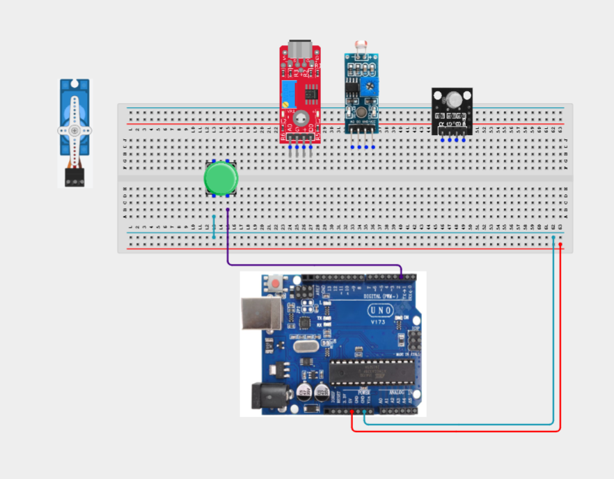

**Step 4:** Connecting the LDR module.Connect VCC to 5V.
Connect GND to GND.
Connect AO to Analog Pin A0.

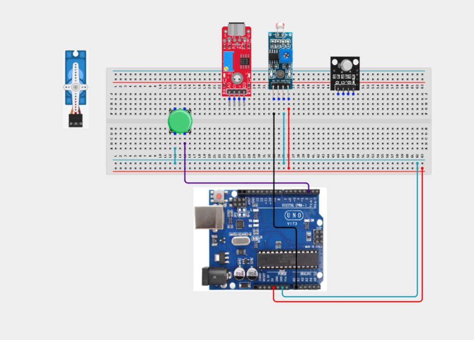

**Step 5:** Connecting the sound sensor. Connect VCC to 5V.
Connect GND to GND.
Connect DO to Digital Pin 7.

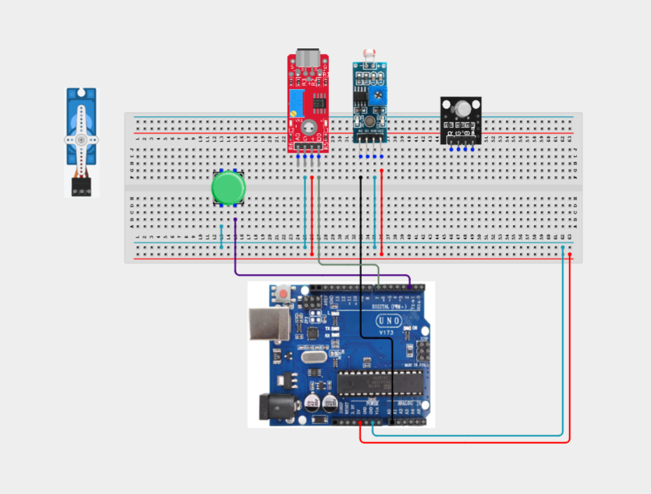

**Step 6:** Connecting the RGB Module. Connect Red to Digital Pin 3.
Connect Green to Digital Pin 5.
Connect Blue to Digital Pin 6.
Connect GND to GND.

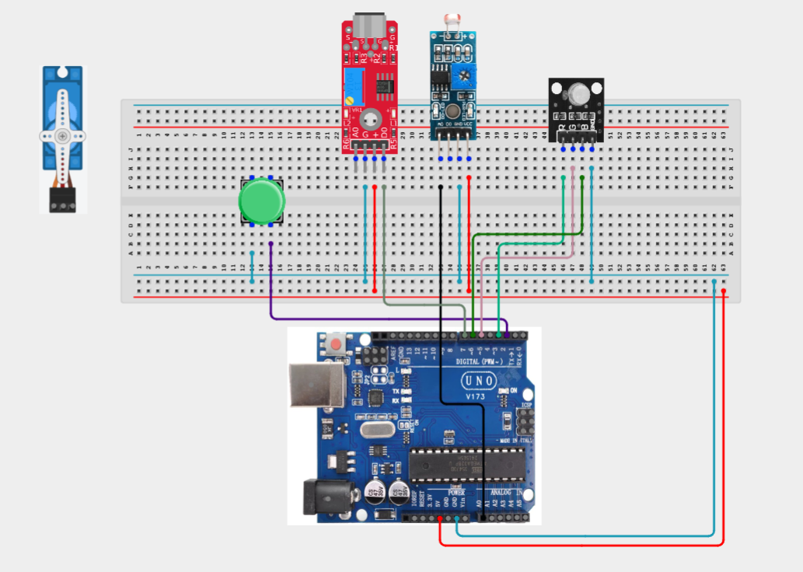

**Step 7:** Connecting the Servo motor. Connect the red wire to 5V.
Connect the brown/black wire to GND.
Connect the orange/yellow signal wire to Digital Pin 9.

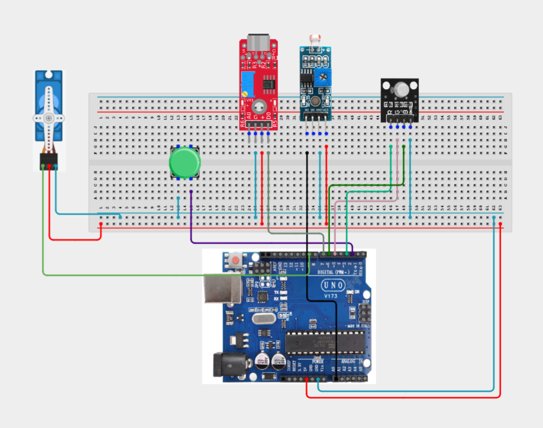

**Step 8:** Connect your Buzzer. Connect the positive (+) pin to Digital Pin 10.
Connect the negative (-) pin to GND.

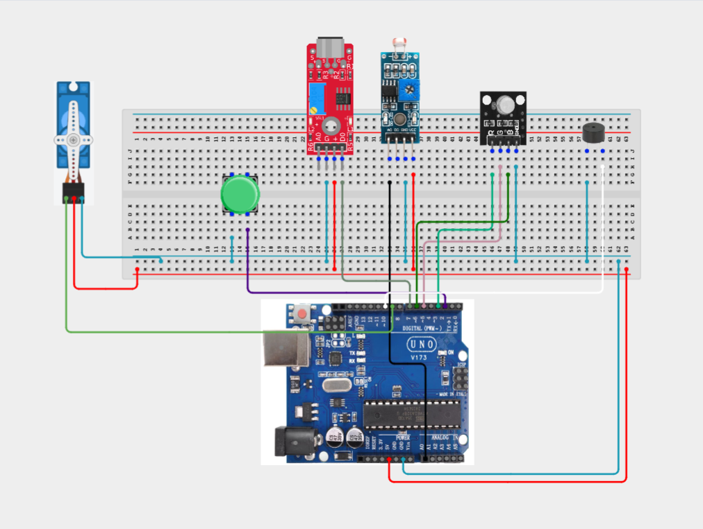

_Make sure to connect the Arduino USB cable to the Arduino board._

## PROGRAMMING

**Step 1:** Open your Arduino IDE. See how to set up here: [Getting Started](../../Getting Started/Arduino_IDE_Setup.md).

**Step 2:** Write the complete program implementing the system logic with appropriate pin definitions, setup configuration, and the main control loop.

```cpp
#include <Servo.h>

// Pin Definitions
const int buttonPin = 2;
const int redPin = 3;
const int greenPin = 5;
const int bluePin = 6;
const int soundPin = 7;
const int servoPin = 9;
const int buzzerPin = 10;
const int ldrPin = A0;

Servo doorLatch;

// Finite State Machine
enum State
{
  STANDBY,
  NIGHT,
  ALARM
};

State currentState = STANDBY;

bool lastButtonState = HIGH;

void setRGB(bool r, bool g, bool b)
{
  digitalWrite(redPin, r);
  digitalWrite(greenPin, g);
  digitalWrite(bluePin, b);
}

void setup()
{
  pinMode(buttonPin, INPUT_PULLUP);
  pinMode(soundPin, INPUT);

  pinMode(redPin, OUTPUT);
  pinMode(greenPin, OUTPUT);
  pinMode(bluePin, OUTPUT);

  pinMode(buzzerPin, OUTPUT);

  doorLatch.attach(servoPin);
  doorLatch.write(0);

  Serial.begin(9600);
}

void loop()
{
  bool buttonState = digitalRead(buttonPin);

  // Toggle between Standby and Night Mode
  if (lastButtonState == HIGH && buttonState == LOW)
  {
    if (currentState == STANDBY)
      currentState = NIGHT;
    else if (currentState == NIGHT)
      currentState = STANDBY;

    delay(250);
  }

  lastButtonState = buttonState;

  int lightLevel = analogRead(ldrPin);
  bool soundDetected = digitalRead(soundPin) == LOW;

  if (currentState == NIGHT)
  {
    if (lightLevel > 700 || soundDetected)
    {
      currentState = ALARM;
    }
  }

  switch (currentState)
  {
    case STANDBY:
      setRGB(LOW, HIGH, LOW);      // Green
      noTone(buzzerPin);
      doorLatch.write(0);
      break;

    case NIGHT:
      setRGB(LOW, LOW, HIGH);      // Blue
      noTone(buzzerPin);
      doorLatch.write(90);
      break;

    case ALARM:
      setRGB(HIGH, LOW, LOW);      // Red
      tone(buzzerPin, 1000);
      doorLatch.write(90);

      // Press button to reset alarm
      if (buttonState == LOW)
      {
        currentState = STANDBY;
        delay(300);
      }
      break;
  }

  Serial.print("Light: ");
  Serial.print(lightLevel);

  Serial.print(" | Sound: ");
  Serial.print(soundDetected);

  Serial.print(" | State: ");
  Serial.println(currentState);

  delay(100);
}
```

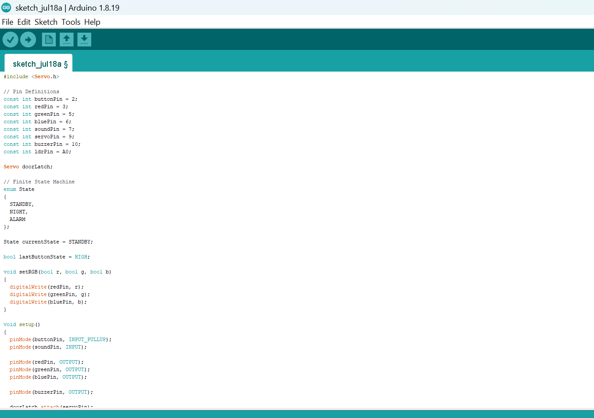

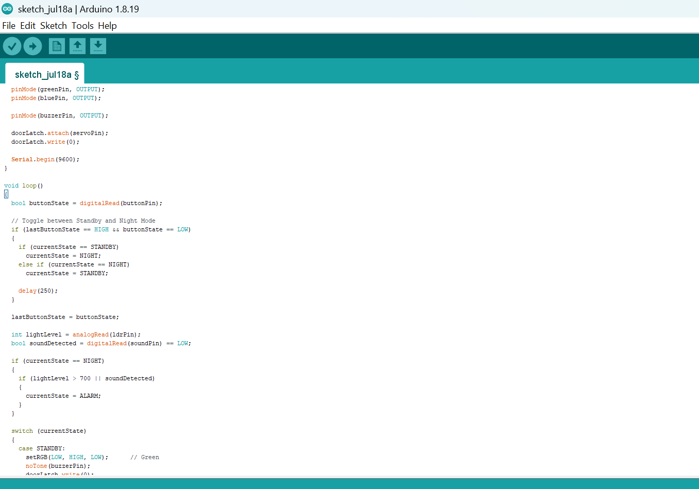

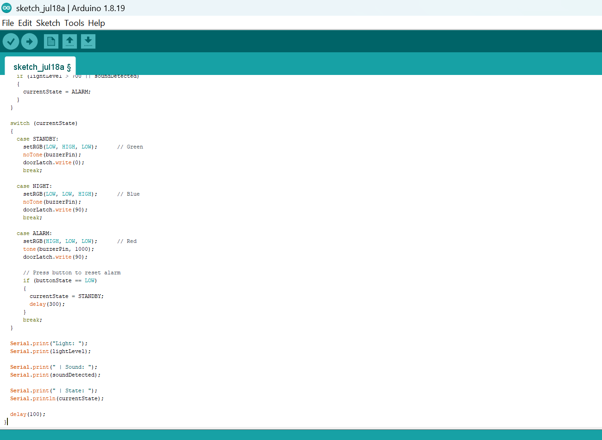


**Step 3:** Save your code. _See the [Getting Started](../../Getting Started/Arduino_IDE_Setup.md) section_

**Step 4:** Select the arduino board and port _See the [Getting Started](../../Getting Started/Arduino_IDE_Setup.md) section:Selecting Arduino Board Type and Uploading your code_.

**Step 5:** Upload your code. _See the [Getting Started](../../Getting Started/Arduino_IDE_Setup.md) section:Selecting Arduino Board Type and Uploading your code_


## CONCLUSION

In this project, you learned how to build an integrated smart home security console using an Arduino, a push button, an LDR module, a sound sensor, an RGB LED module, a servo motor, and a buzzer. By implementing a three-state finite state machine, the system can intelligently switch between Standby, Night, and Alarm modes while monitoring environmental conditions and controlling multiple output devices.

By completing this project, you strengthened your understanding of finite state machine design, sensor integration, analog and digital input processing, servo motor control, alarm systems, and developing intelligent embedded applications using Arduino.
