# Project 3.26.1: Autonomous Parking Garage System

| **Description** | A smart parking garage system that detects approaching vehicles, simulates ticket issuance using a push button, controls an automated entry barrier with a servo motor, monitors safe vehicle passage using an ultrasonic sensor, and provides visual and audible status indicators through a traffic light module and buzzer. |
|------------------|----------------------------------------------------------------|
| **Use case**     | This project can be used in automated parking facilities, toll gate systems, access control barriers, smart transportation systems, and embedded automation applications where safe vehicle entry and exit are required. |

## Components (Things You will need)

|  |  |  | | | ||| ||
|-------------------------|-------------------------|-------------------------|-------------------------|-------------------------|--------------------------|-------------------------|--------------------------|--------------------------|--------------------------|

## Building the circuit

Things Needed:

- Arduino Uno = 1
- Arduino USB cable = 1
- Push button = 1
- Ultrasonic sensor = 1
- Potentiometer = 1
- Traffic light module = 1
- Servo motor = 1
- Buzzer = 1
- Jumper Wires

## Mounting the component on the breadboard

**Step 1:**Carefully mount the push button, ultrasonic sensor, potentiometer, traffic light module, servo motor, buzzer  on the breadboard. Arrange the components neatly to provide enough space for wiring and simplify troubleshooting.

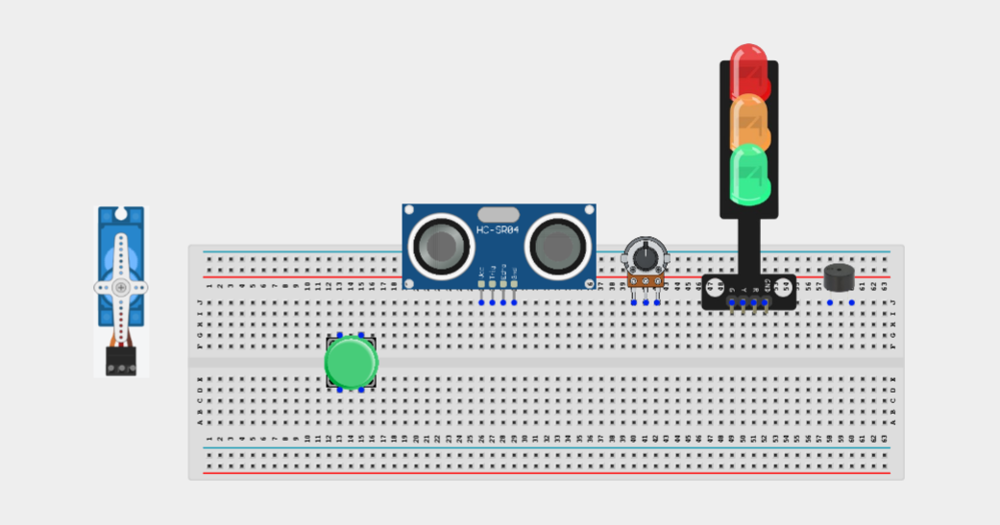

_**NB:** For complex circuits, plan your component placement to minimize wire crossing and ensure clean connections._

## WIRING THE CIRCUIT

**Step 2:** Connect the 5V pin on the Arduino Uno to the positive (+) power rail on the breadboard.Connect the GND pin on the Arduino Uno to the negative (-) power rail on the breadboard.

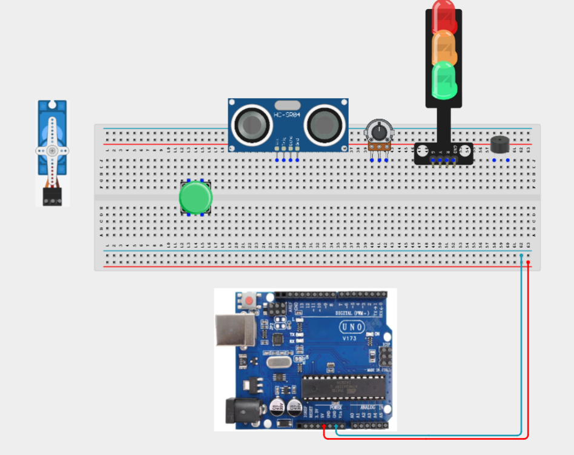

**Step 2:** Connecting the Push button. Connect one terminal of the push button to Digital Pin 2.
Connect the opposite terminal to GND.

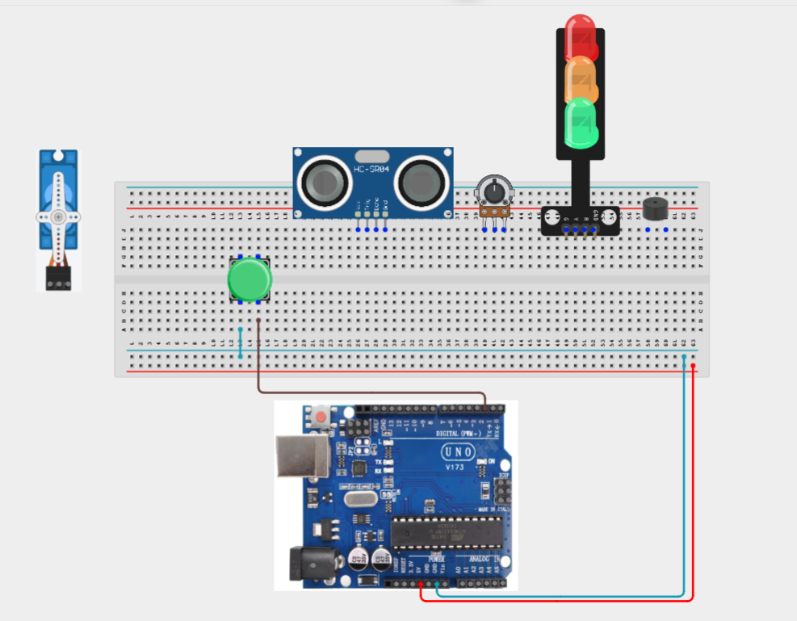

**Step 2:** Connecting the traffic light module. Connect the Red LED signal pin to Digital Pin 3.
Connect the Yellow LED signal pin to Digital Pin 4.
Connect the Green LED signal pin to Digital Pin 5.
Connect the module GND pin to the GND rail.

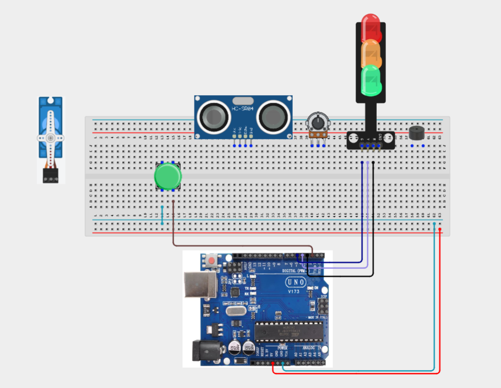

**Step 2:** Connecting the buzzer. Connect the positive (+) pin to Digital Pin 6.
Connect the negative (-) pin to GND.

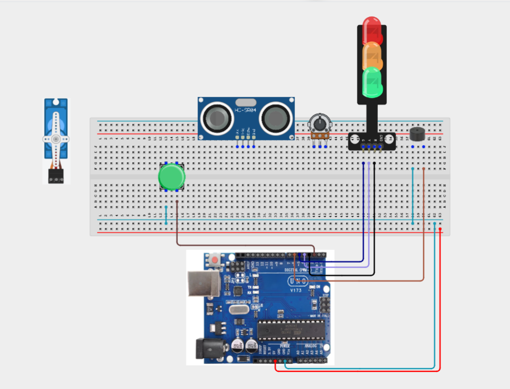

**Step 2:** Connecting ultrasonic Sensor. Connect VCC to 5V.
Connect GND to GND.
Connect TRIG to Digital Pin 7.
Connect ECHO to Digital Pin 8.

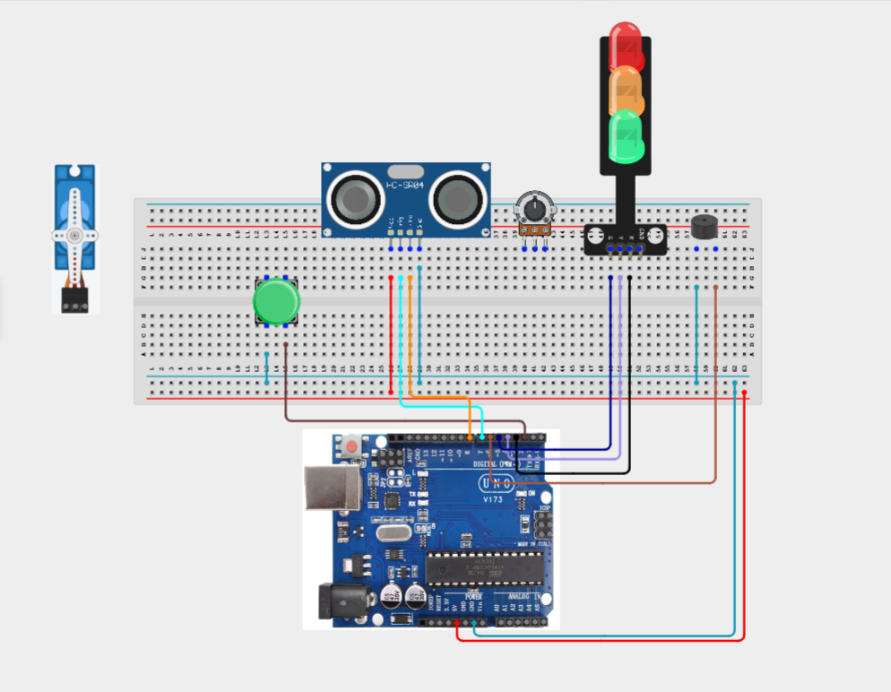

**Step 2:** Connecting the servo motor. Connect the red wire to 5V.
Connect the brown/black wire to GND.
Connect the orange/yellow signal wire to Digital Pin 9.

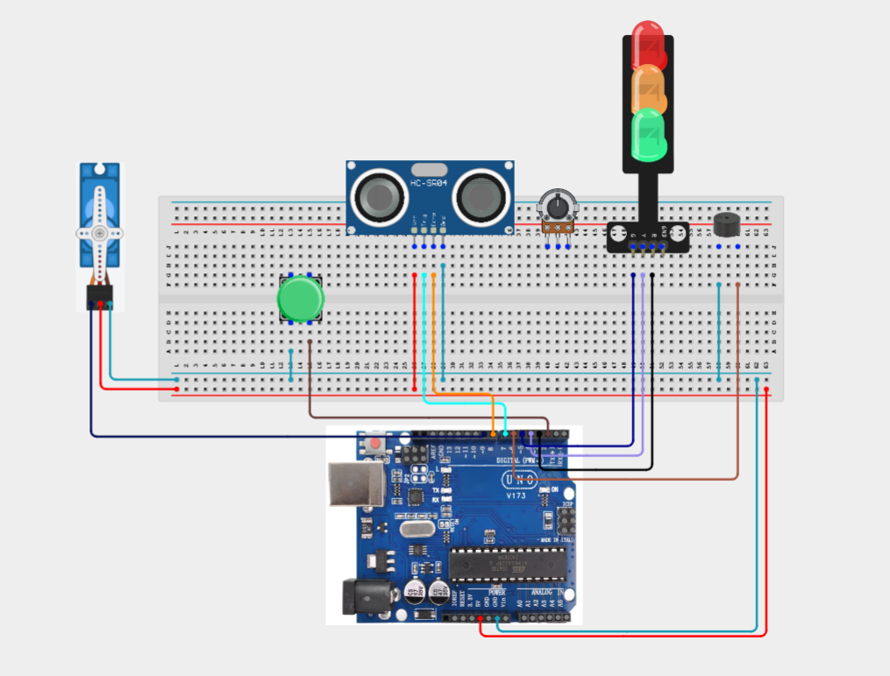

**Step 2:** Connecting the potentiometer. Connect the left pin to 5V.
Connect the right pin to GND.
Connect the middle (wiper) pin to Analog Pin A0.

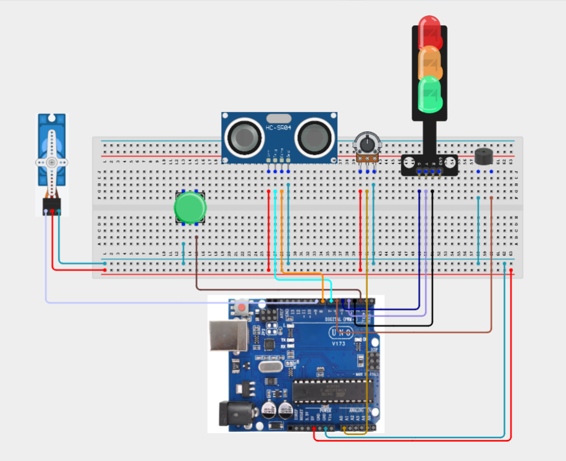

_Make sure to connect the Arduino USB cable to the Arduino board._

## PROGRAMMING

**Step 1:** Open your Arduino IDE. See how to set up here: [Getting Started](../../Getting Started/Arduino_IDE_Setup.md).

**Step 2:** Write the complete program implementing the system logic with appropriate pin definitions, setup configuration, and the main control loop.

```cpp
#include <Servo.h>

// Pin Definitions
const int buttonPin = 2;

const int redLED = 3;
const int yellowLED = 4;
const int greenLED = 5;

const int buzzerPin = 6;

const int trigPin = 7;
const int echoPin = 8;

const int servoPin = 9;

const int potPin = A0;

Servo barrier;

bool gateOpen = false;

long getDistance()
{
  digitalWrite(trigPin, LOW);
  delayMicroseconds(2);

  digitalWrite(trigPin, HIGH);
  delayMicroseconds(10);

  digitalWrite(trigPin, LOW);

  long duration = pulseIn(echoPin, HIGH);

  return duration * 0.034 / 2;
}

void setup()
{
  pinMode(buttonPin, INPUT_PULLUP);

  pinMode(redLED, OUTPUT);
  pinMode(yellowLED, OUTPUT);
  pinMode(greenLED, OUTPUT);

  pinMode(buzzerPin, OUTPUT);

  pinMode(trigPin, OUTPUT);
  pinMode(echoPin, INPUT);

  barrier.attach(servoPin);
  barrier.write(0);

  Serial.begin(9600);
}

void loop()
{
  long distance = getDistance();

  int threshold = map(analogRead(potPin), 0, 1023, 10, 50);

  // Vehicle detected near entrance
  if (distance > 0 && distance < threshold)
  {
    digitalWrite(redLED, LOW);
    digitalWrite(yellowLED, HIGH);
    digitalWrite(greenLED, LOW);

    // Ticket button pressed
    if (digitalRead(buttonPin) == LOW)
    {
      gateOpen = true;
      delay(300);
    }
  }

  if (gateOpen)
  {
    barrier.write(90);

    digitalWrite(redLED, LOW);
    digitalWrite(yellowLED, LOW);
    digitalWrite(greenLED, HIGH);

    noTone(buzzerPin);

    // Close barrier after vehicle passes
    if (distance > threshold + 20)
    {
      gateOpen = false;
    }
  }
  else
  {
    barrier.write(0);

    digitalWrite(redLED, HIGH);
    digitalWrite(yellowLED, LOW);
    digitalWrite(greenLED, LOW);

    noTone(buzzerPin);
  }

  // Safety warning
  if (gateOpen && distance < 5)
  {
    tone(buzzerPin, 1200);
  }

  Serial.print("Distance: ");
  Serial.print(distance);
  Serial.print(" cm | Threshold: ");
  Serial.println(threshold);

  delay(100);
}

```
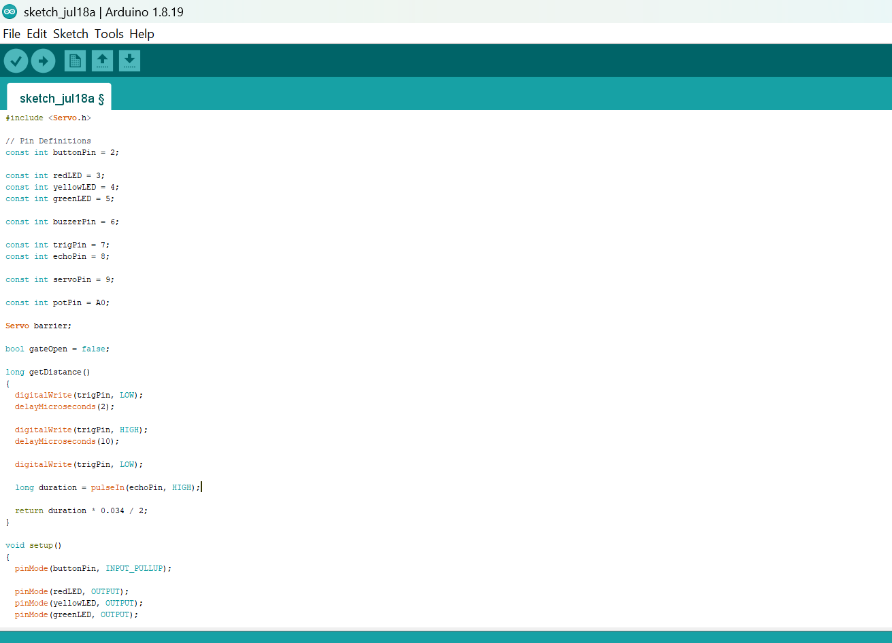

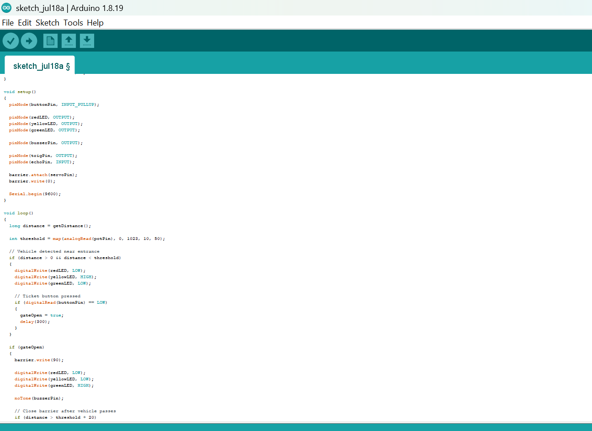

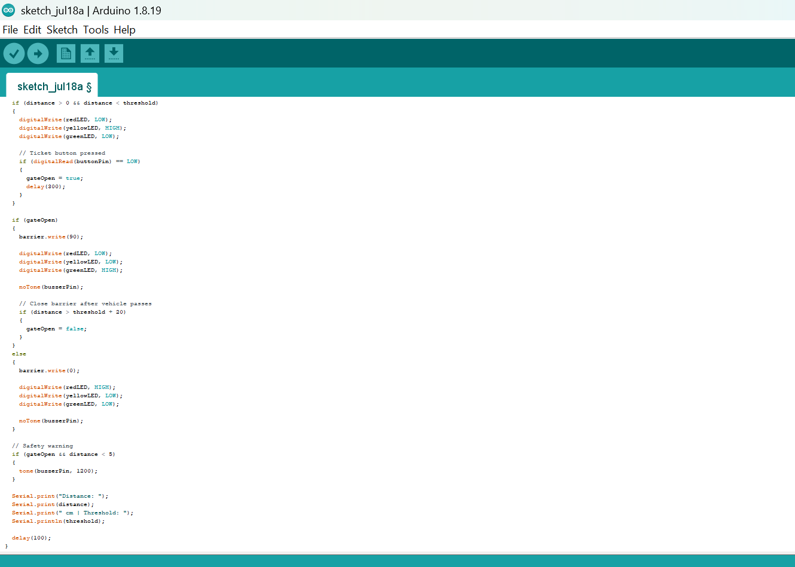

**Step 3:** Save your code. _See the [Getting Started](../../Getting Started/Arduino_IDE_Setup.md) section_

**Step 4:** Select the arduino board and port _See the [Getting Started](../../Getting Started/Arduino_IDE_Setup.md) section:Selecting Arduino Board Type and Uploading your code_.

**Step 5:** Upload your code. _See the [Getting Started](../../Getting Started/Arduino_IDE_Setup.md) section:Selecting Arduino Board Type and Uploading your code_

## CONCLUSION

In this project, you learned how to build an autonomous parking garage system using an Arduino, ultrasonic sensor, potentiometer, push button, servo motor, traffic light module, and buzzer. The system demonstrates how multiple sensors and actuators can work together to automate vehicle access while maintaining safety through obstacle detection and visual and audible alerts.

By completing this project, you strengthened your understanding of distance measurement, threshold calibration, digital input processing, servo motor control, traffic signalling, safety interlocks, and designing complete embedded automation systems using Arduino.

