# Project 3.27.1: Auditory Reaction Timer Game

| **Description** | An interactive reaction timer game where a clap starts the game, a countdown prepares the player, a push button measures reaction time, and RGB LEDs, a traffic light module, and a buzzer provide visual and audible feedback. |
|------------------|----------------------------------------------------------------|
| **Use case**     | This project can be used in reaction time training, educational STEM activities, interactive learning games, cognitive skill development, and embedded systems demonstrations where user response speed is measured. |

## Components (Things You will need)

|  |  |  | | | | | | ||
|-------------------------|-------------------------|-------------------------|-------------------------|-------------------------|--------------------------|-------------------------|--------------------------|--------------------------|--------------------------|

## Building the circuit

Things Needed:

- Arduino Uno = 1
- Arduino USB cable = 1
- Push button = 1
- Potentiometer = 1
- Sound sensor module = 1
- Traffic light module = 1
- RGB LED module = 1
- Buzzer = 1
- Jumper Wires

## Mounting the component on the breadboard

**Step 1:** Carefully mount the push button, potentiometer, sound sensor module, traffic light module, RGB LED module on the breadboard. Arrange the components neatly to provide sufficient space for wiring and make troubleshooting easier.

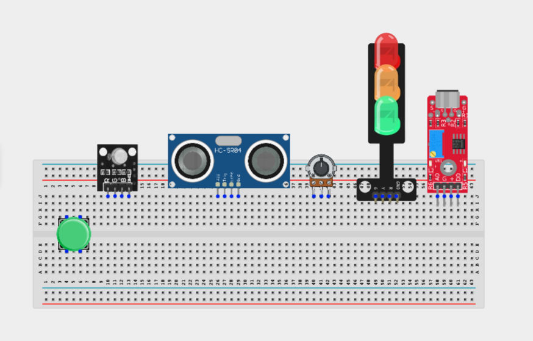

_**NB:** For complex circuits, plan your component placement to minimize wire crossing and ensure clean connections._

## WIRING THE CIRCUIT

**Step 2:** Connect the 5V pin on the Arduino Uno to the positive (+) power rail on the breadboard.Connect the GND pin on the Arduino Uno to the negative (-) power rail on the breadboard.

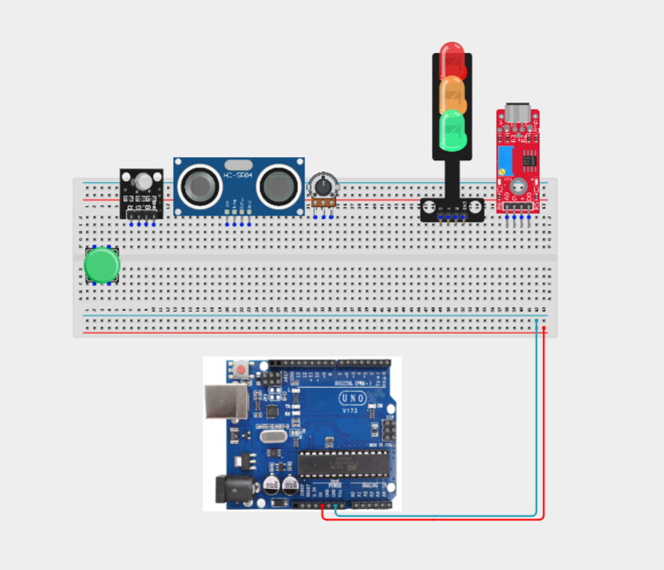

**Step 2:** Connecting the push button. Connect one terminal of the push button to Digital Pin 2.
Connect the opposite terminal to GND.

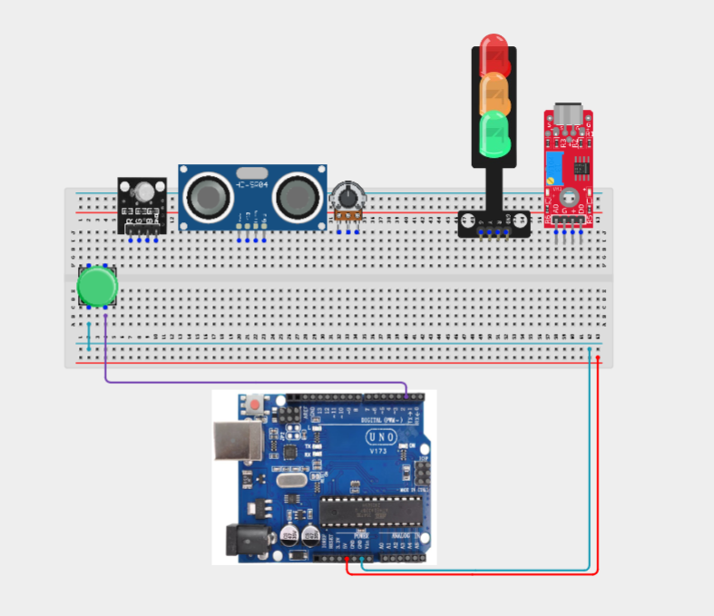

**Step 2:** Connecting Traffic Light Module. Connect the Red LED signal pin to Digital Pin 3.
Connect the Yellow LED signal pin to Digital Pin 4.
Connect the Green LED signal pin to Digital Pin 5.
Connect the module GND pin to the GND rail.

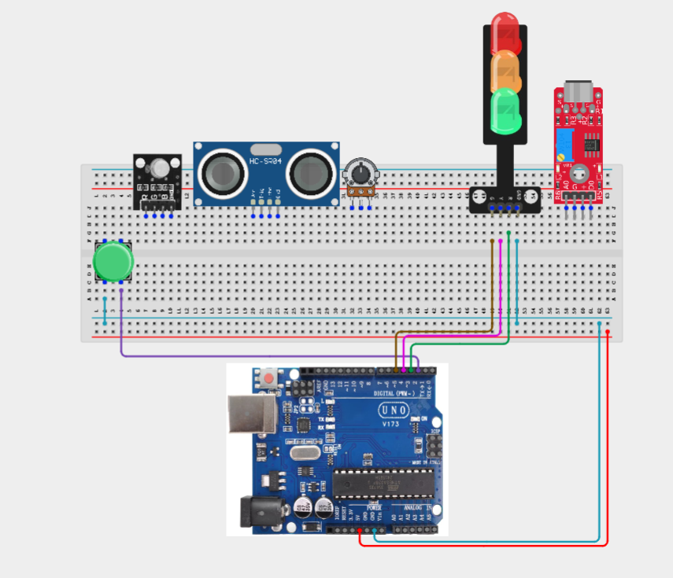

**Step 2:** Connecting the RGB Module. Connect the Red signal pin to Digital Pin 6.
Connect the Green signal pin to Digital Pin 9.
Connect the Blue signal pin to Digital Pin 10.
Connect the module GND pin to the GND rail.
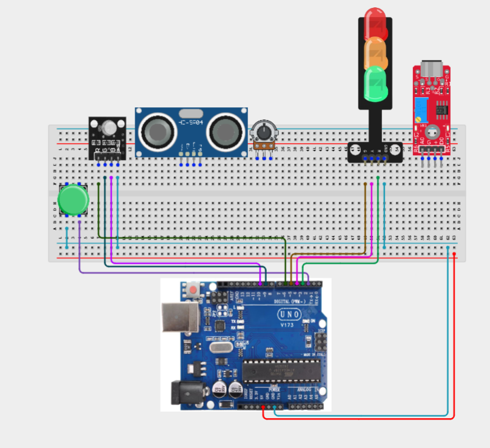

**Step 2:** Connect the buzzer. Connect the positive (+) pin to Digital Pin 11.
Connect the negative (-) pin to GND.

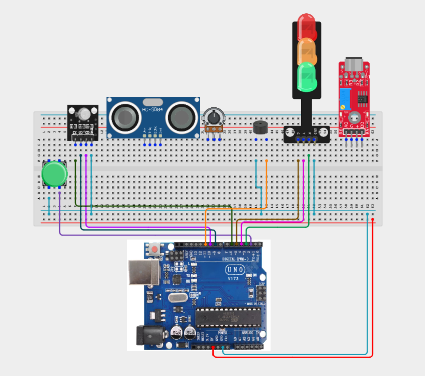

**Step 2:** Connecting the Sound Sensor. Connect VCC to 5V.
Connect GND to GND.
Connect DO to Digital Pin 7.

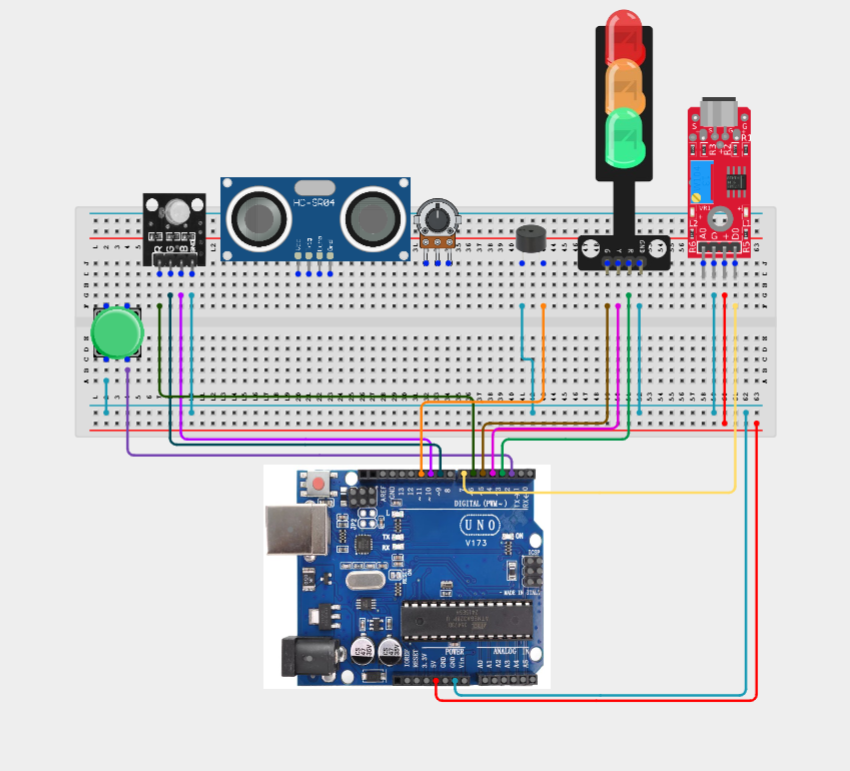

**Step 2:** Connecting the potentiometer. Connect the left pin to 5V.
Connect the right pin to GND.
Connect the middle (wiper) pin to Analog Pin A0.

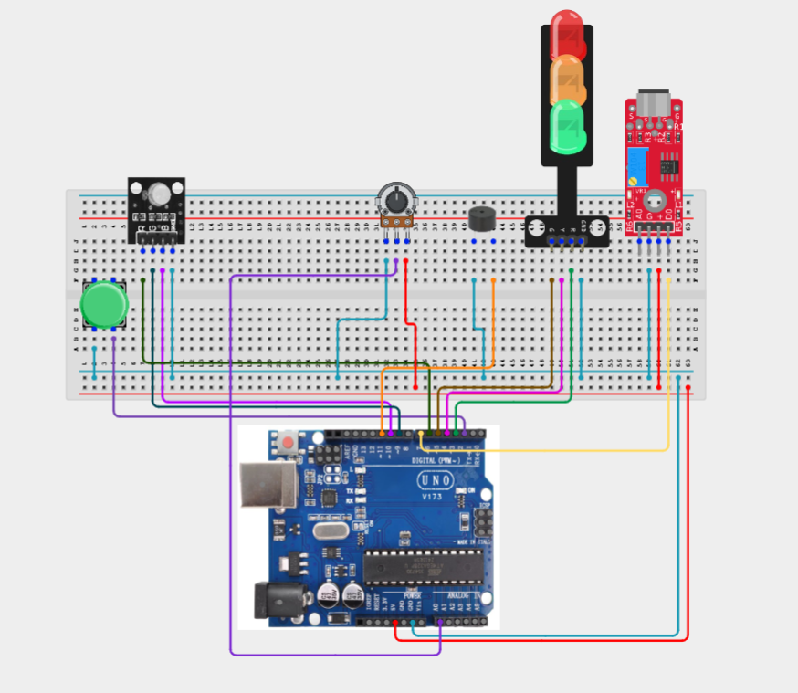

_Make sure to connect the Arduino USB cable to the Arduino board._

## PROGRAMMING

**Step 1:** Open your Arduino IDE. See how to set up here: [Getting Started](../../Getting Started/Arduino_IDE_Setup.md).

**Step 2:** Write the complete program implementing the system logic with appropriate pin definitions, setup configuration, and the main control loop.

```cpp
// Pin Definitions
const int buttonPin = 2;

const int redTL = 3;
const int yellowTL = 4;
const int greenTL = 5;

const int rgbRed = 6;
const int soundPin = 7;

const int rgbGreen = 9;
const int rgbBlue = 10;

const int buzzerPin = 11;

const int potPin = A0;

bool gameStarted = false;
bool waitingForPress = false;

unsigned long startTime;

void setup()
{
  pinMode(buttonPin, INPUT_PULLUP);
  pinMode(soundPin, INPUT);

  pinMode(redTL, OUTPUT);
  pinMode(yellowTL, OUTPUT);
  pinMode(greenTL, OUTPUT);

  pinMode(rgbRed, OUTPUT);
  pinMode(rgbGreen, OUTPUT);
  pinMode(rgbBlue, OUTPUT);

  pinMode(buzzerPin, OUTPUT);

  Serial.begin(9600);
}

void loop()
{
  int delayTime = map(analogRead(potPin),0,1023,1000,5000);

  // Wait for clap
  if(!gameStarted)
  {
    digitalWrite(redTL,HIGH);

    if(digitalRead(soundPin)==LOW)
    {
      gameStarted=true;

      digitalWrite(redTL,LOW);

      digitalWrite(yellowTL,HIGH);

      delay(delayTime);

      digitalWrite(yellowTL,LOW);

      digitalWrite(greenTL,HIGH);

      tone(buzzerPin,1000,200);

      startTime=millis();

      waitingForPress=true;
    }
  }

  // Player reaction
  if(waitingForPress)
  {
    if(digitalRead(buttonPin)==LOW)
    {
      unsigned long reaction=millis()-startTime;

      waitingForPress=false;

      digitalWrite(greenTL,LOW);

      if(reaction<300)
      {
        digitalWrite(rgbGreen,HIGH);
      }
      else if(reaction<600)
      {
        digitalWrite(rgbBlue,HIGH);
      }
      else
      {
        digitalWrite(rgbRed,HIGH);
      }

      Serial.print("Reaction Time: ");
      Serial.print(reaction);
      Serial.println(" ms");

      delay(3000);

      digitalWrite(rgbRed,LOW);
      digitalWrite(rgbGreen,LOW);
      digitalWrite(rgbBlue,LOW);

      gameStarted=false;
    }
  }
}
```

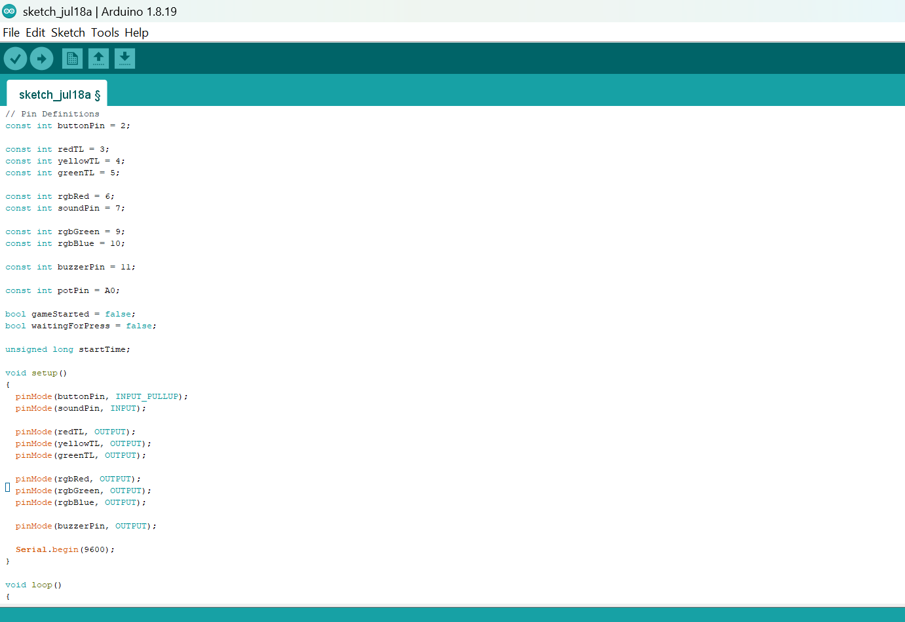

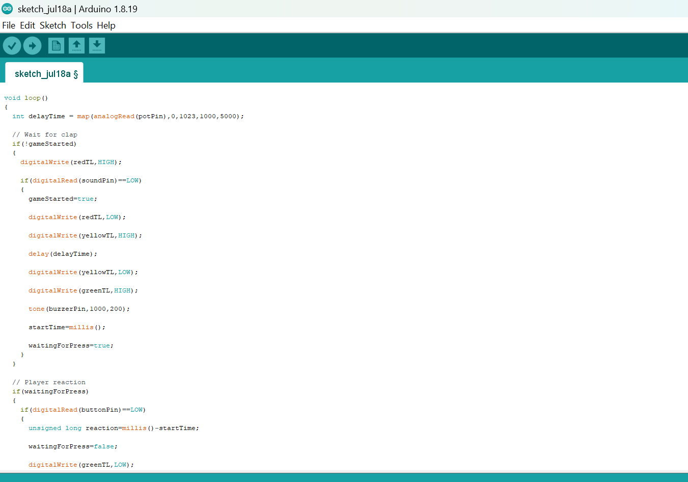

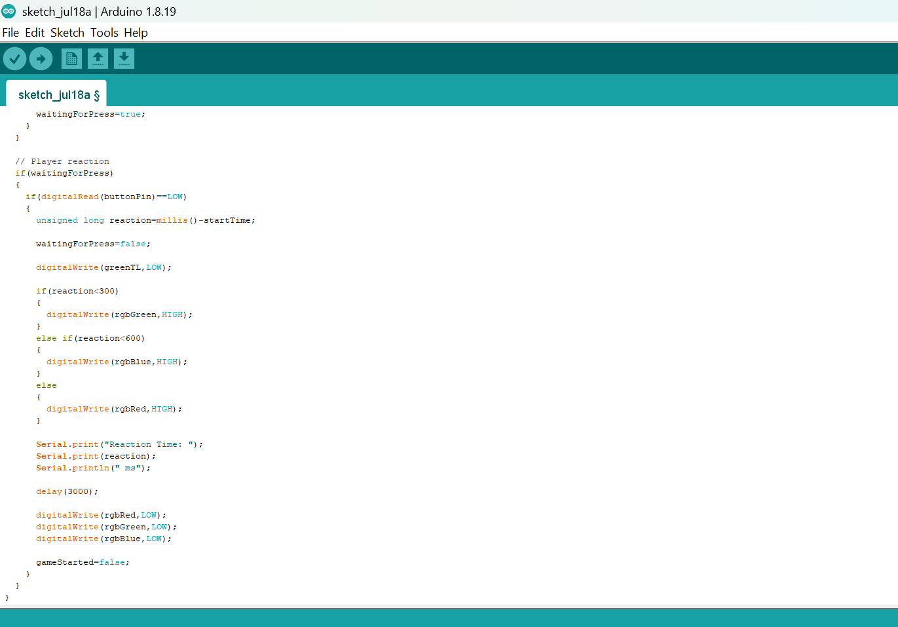


**Step 3:** Save your code. _See the [Getting Started](../../Getting Started/Arduino_IDE_Setup.md) section_

**Step 4:** Select the arduino board and port _See the [Getting Started](../../Getting Started/Arduino_IDE_Setup.md) section:Selecting Arduino Board Type and Uploading your code_.

**Step 5:** Upload your code. _See the [Getting Started](../../Getting Started/Arduino_IDE_Setup.md) section:Selecting Arduino Board Type and Uploading your code_

## CONCLUSION

In this project, you learned how to build an auditory reaction timer game using an Arduino, a sound sensor, a push button, a potentiometer, a traffic light module, an RGB LED module, and a buzzer. The system combines sound detection, adjustable countdown timing, reaction measurement, and visual feedback to create an engaging interactive game.

By completing this project, you strengthened your understanding of timing functions, analog and digital input processing, event-driven programming, user interaction, performance measurement, and integrating multiple electronic components into a complete embedded system application.

