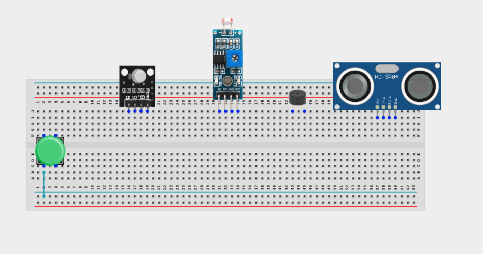
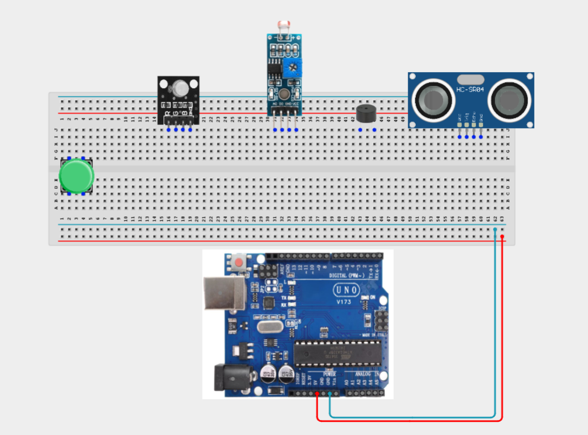
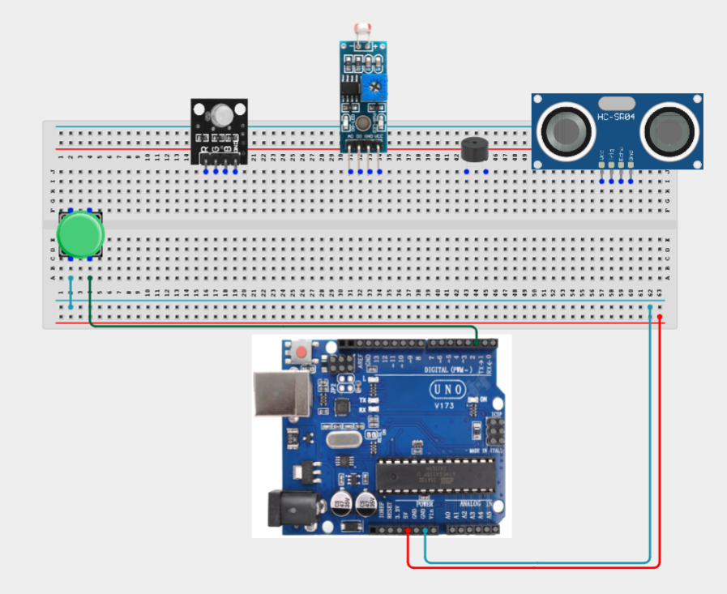
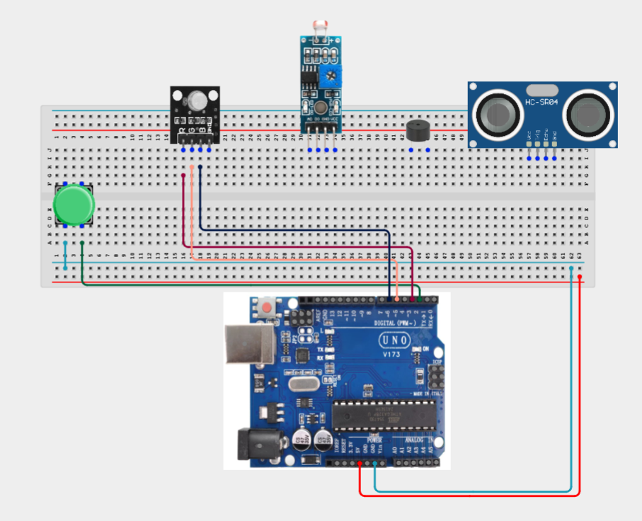
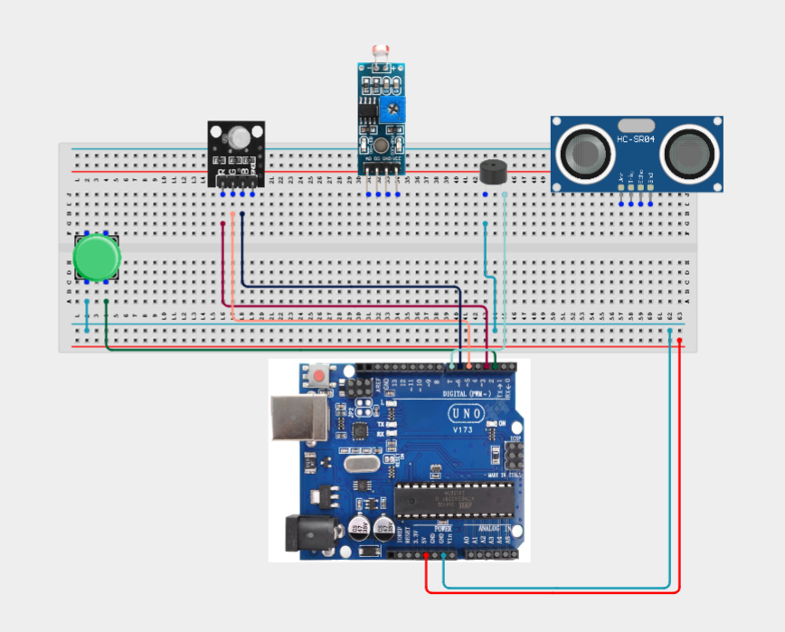
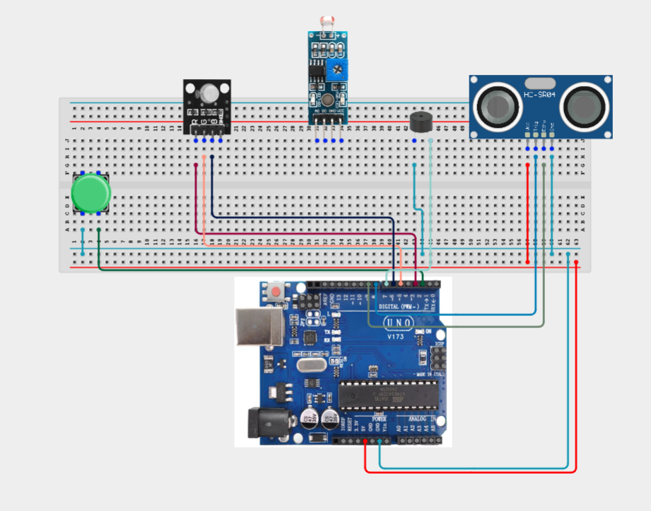
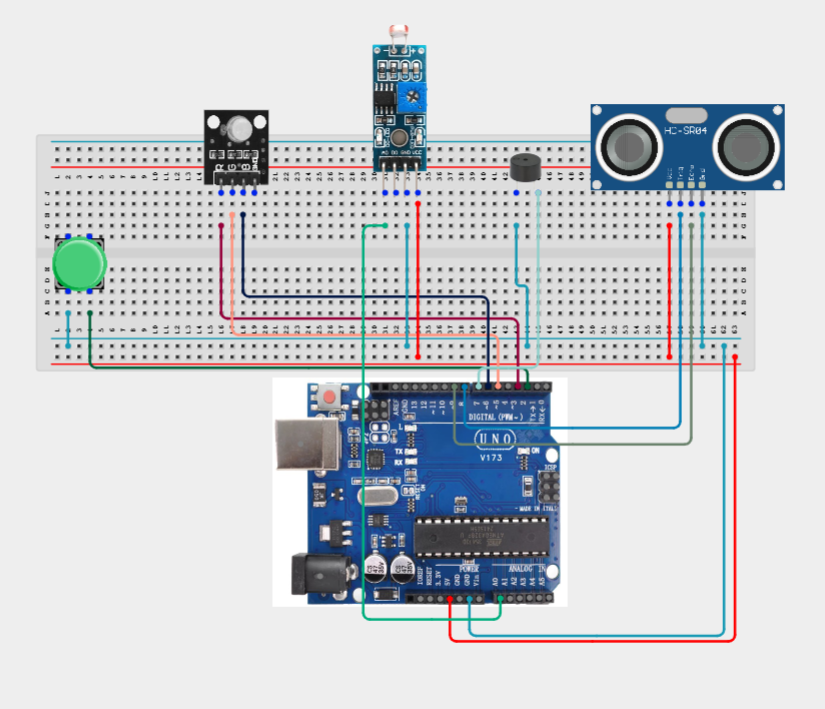
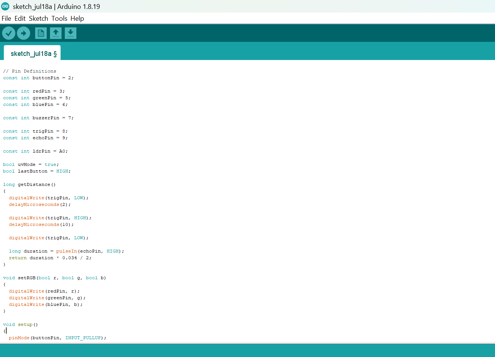
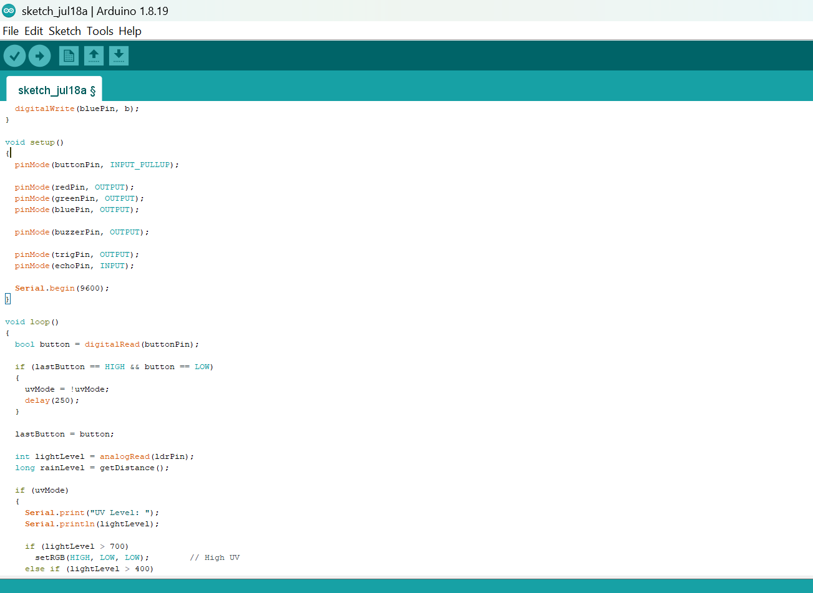
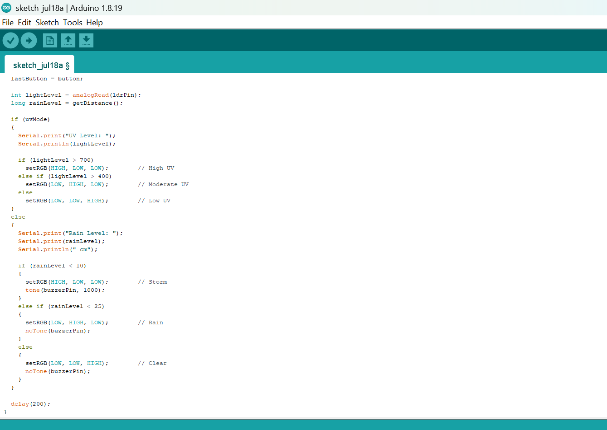

# Project 3.28.1: Smart Weather Station Console

| **Description** | A smart weather station that simulates environmental monitoring by using an LDR module to represent UV light intensity, an ultrasonic sensor to simulate rainfall level, an RGB LED module to indicate weather conditions, a buzzer to warn of storm conditions, and a push button to switch between display modes. |
|------------------|----------------------------------------------------------------|
| **Use case**     |This project can be used in smart weather monitoring systems, environmental sensing, educational STEM projects, IoT weather stations, and embedded applications that require monitoring and displaying environmental conditions. |

## Components (Things You will need)

|  |  |  | | || |  ||
|-------------------------|-------------------------|-------------------------|-------------------------|-------------------------|--------------------------|-------------------------|--------------------------|--------------------------|

## Building the circuit

Things Needed:

- Arduino Uno = 1
- Arduino USB cable = 1
- Push button = 1
- LDR module = 1
- Ultrasonic sensor = 1
- RGB LED module = 1
- Buzzer = 1
- Jumper Wires

## Mounting the component on the breadboard

**Step 1:** Carefully mount the push button, LDR module, ultrasonic sensor, RGB LED module, buzzer on the breadboard.


_**NB:** For complex circuits, plan your component placement to minimize wire crossing and ensure clean connections._

## WIRING THE CIRCUIT

**Step 2:** Connect the 5V pin on the Arduino Uno to the positive (+) power rail on the breadboard.Connect the GND pin on the Arduino Uno to the negative (-) power rail on the breadboard.



**Step 3:** Connect the 5V pin on the Arduino Uno to the positive (+) power rail on the breadboard.Connect the GND pin on the Arduino Uno to the negative (-) power rail on the breadboard.



**Step 4:** Connecting the Push Button. Connect one terminal of the push button to Digital Pin 2.
Connect the opposite terminal to GND.



**Step 5:** Connecting the RGB LED Module. Connect the Red signal pin to Digital Pin 3. Connect the Green signal pin to Digital Pin 5.
Connect the Blue signal pin to Digital Pin 6.
Connect the module GND pin to GND.




**Step 6:** Connecting the Buzzer. Connect the positive (+) pin to Digital Pin 7.
Connect the negative (-) pin to GND.



**Step 7:** Connecting the Ultrasonic Sensor. Connect VCC to 5V. Connect GND to GND.
Connect TRIG to Digital Pin 8.
Connect ECHO to Digital Pin 9.



**Step 8:** Connecting the LDR Module. Connect VCC to 5V. Connect GND to GND.
Connect AO to Analog Pin A0.



_Make sure to connect the Arduino USB cable to the Arduino board._

## PROGRAMMING

**Step 1:** Open your Arduino IDE. See how to set up here: [Getting Started](../../Getting Started/Arduino_IDE_Setup.md).

**Step 2:** Write the complete program implementing the system logic with appropriate pin definitions, setup configuration, and the main control loop.

```cpp
// Libraries
// (No external libraries required)

// Pin Definitions
const int buttonPin = 2;

const int redPin = 3;
const int greenPin = 5;
const int bluePin = 6;

const int buzzerPin = 7;

const int trigPin = 8;
const int echoPin = 9;

const int ldrPin = A0;

bool uvMode = true;
bool lastButton = HIGH;

long getDistance()
{
  digitalWrite(trigPin, LOW);
  delayMicroseconds(2);

  digitalWrite(trigPin, HIGH);
  delayMicroseconds(10);

  digitalWrite(trigPin, LOW);

  long duration = pulseIn(echoPin, HIGH);
  return duration * 0.034 / 2;
}

void setRGB(bool r, bool g, bool b)
{
  digitalWrite(redPin, r);
  digitalWrite(greenPin, g);
  digitalWrite(bluePin, b);
}

void setup()
{
  pinMode(buttonPin, INPUT_PULLUP);

  pinMode(redPin, OUTPUT);
  pinMode(greenPin, OUTPUT);
  pinMode(bluePin, OUTPUT);

  pinMode(buzzerPin, OUTPUT);

  pinMode(trigPin, OUTPUT);
  pinMode(echoPin, INPUT);

  Serial.begin(9600);
}

void loop()
{
  bool button = digitalRead(buttonPin);

  if (lastButton == HIGH && button == LOW)
  {
    uvMode = !uvMode;
    delay(250);
  }

  lastButton = button;

  int lightLevel = analogRead(ldrPin);
  long rainLevel = getDistance();

  if (uvMode)
  {
    Serial.print("UV Level: ");
    Serial.println(lightLevel);

    if (lightLevel > 700)
      setRGB(HIGH, LOW, LOW);        // High UV
    else if (lightLevel > 400)
      setRGB(LOW, HIGH, LOW);        // Moderate UV
    else
      setRGB(LOW, LOW, HIGH);        // Low UV
  }
  else
  {
    Serial.print("Rain Level: ");
    Serial.print(rainLevel);
    Serial.println(" cm");

    if (rainLevel < 10)
    {
      setRGB(HIGH, LOW, LOW);        // Storm
      tone(buzzerPin, 1000);
    }
    else if (rainLevel < 25)
    {
      setRGB(LOW, HIGH, LOW);        // Rain
      noTone(buzzerPin);
    }
    else
    {
      setRGB(LOW, LOW, HIGH);        // Clear
      noTone(buzzerPin);
    }
  }

  delay(200);
}
```







**Step 3:** Save your code. _See the [Getting Started](../../Getting Started/Arduino_IDE_Setup.md) section_

**Step 4:** Select the arduino board and port _See the [Getting Started](../../Getting Started/Arduino_IDE_Setup.md) section:Selecting Arduino Board Type and Uploading your code_.

**Step 5:** Upload your code. _See the [Getting Started](../../Getting Started/Arduino_IDE_Setup.md) section:Selecting Arduino Board Type and Uploading your code_


## CONCLUSION

In this project, you learned how to build a smart weather station console using an Arduino, an LDR module, an ultrasonic sensor, an RGB LED module, a push button, and a buzzer. The system demonstrates how environmental conditions can be monitored, interpreted, and displayed using both visual and audible indicators.

By completing this project, you strengthened your understanding of analog sensing, ultrasonic distance measurement, mode selection, RGB LED control, threshold-based decision making, digital outputs, and developing intelligent environmental monitoring systems using Arduino.

