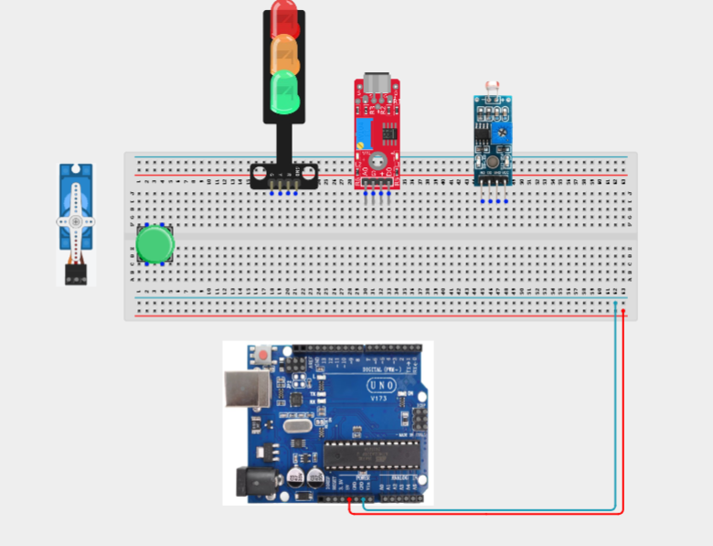
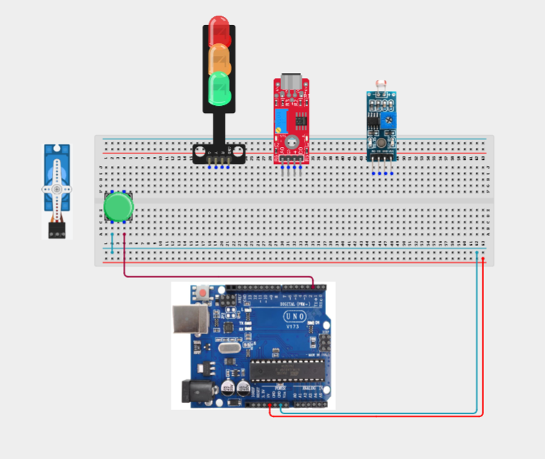
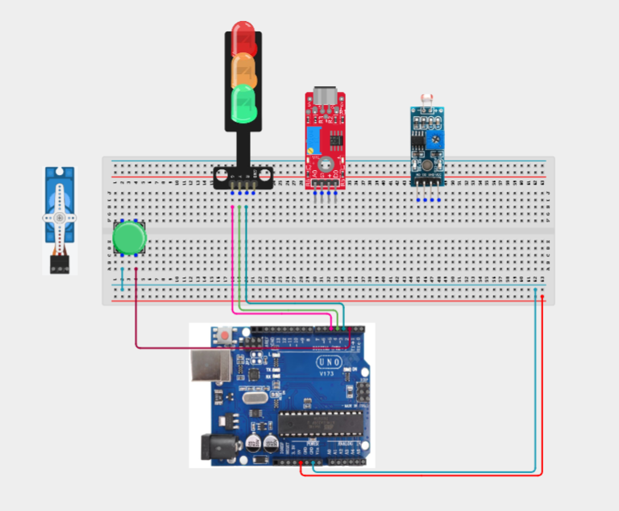
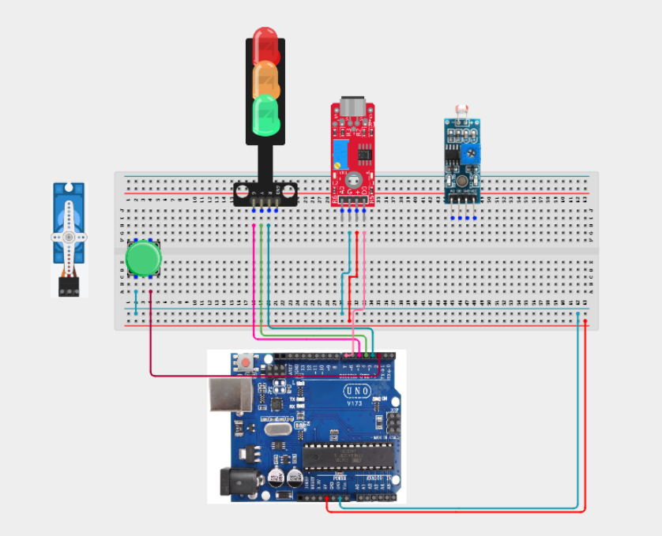
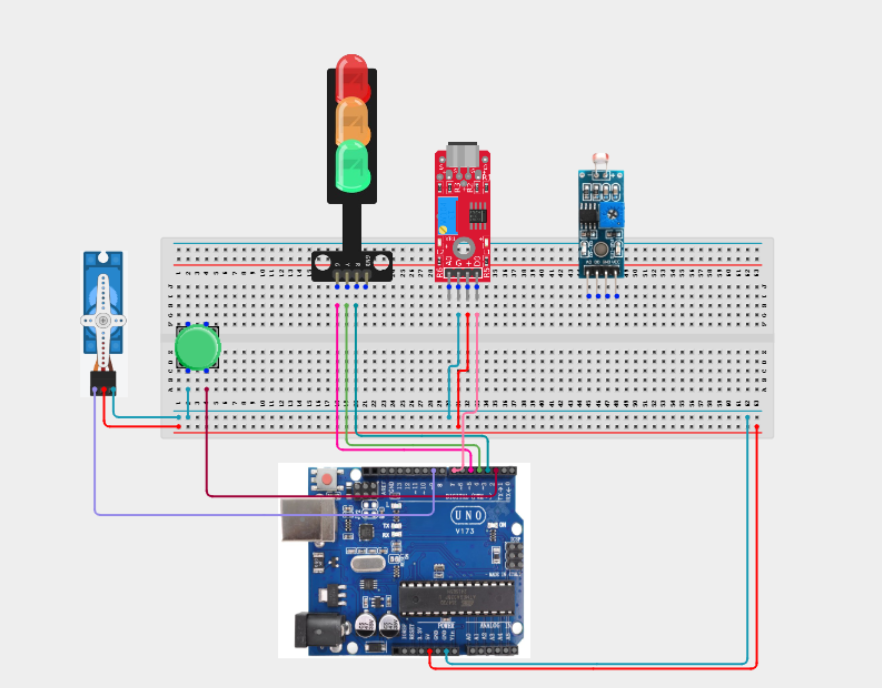
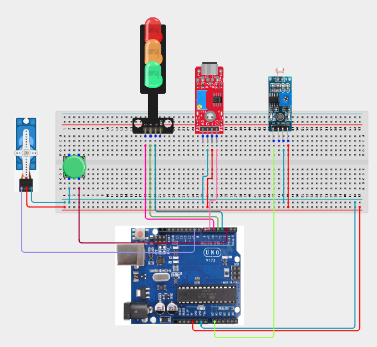
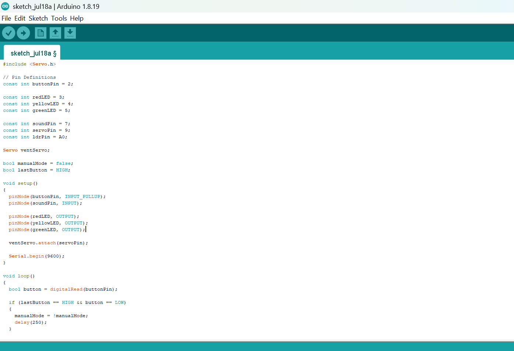
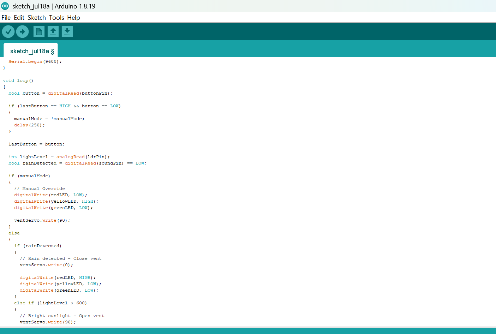
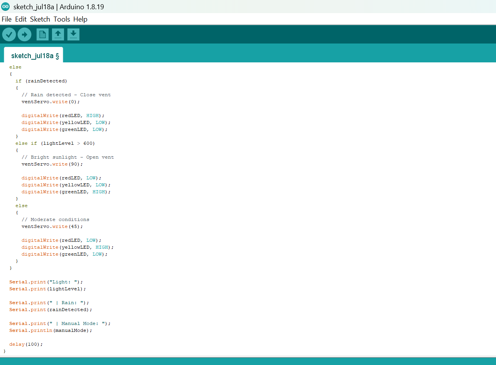

# Project 3.29.1: Automated Greenhouse Controller

| **Description** | A smart greenhouse controller that automatically opens or closes a ventilation flap using a servo motor based on ambient light levels, detects rainfall using a sound sensor, displays system status using a traffic light module, and allows manual override with a push button. |
|------------------|----------------------------------------------------------------|
| **Use case**     | This project can be used in automated greenhouse systems, smart agriculture, environmental control systems, precision farming, and embedded automation applications where environmental conditions determine ventilation and user intervention is required. |

## Components (Things You will need)

|  |  |  | | || |  ||
|-------------------------|-------------------------|-------------------------|-------------------------|-------------------------|--------------------------|-------------------------|--------------------------|--------------------------|

## Building the circuit

Things Needed:

- Arduino Uno = 1
- Arduino USB cable = 1
- Push button = 1
- LDR module = 1
- Sound sensor module = 1
- Traffic light module = 1
- Servo motor = 1
- Jumper Wires

## Mounting the component on the breadboard

**Step 1:** Carefully mount the push button, LDR module, sound sensor module, traffic light module, servo motor on the breadboard.


_**NB:** For complex circuits, plan your component placement to minimize wire crossing and ensure clean connections._

## WIRING THE CIRCUIT

**Step 2:** Connect the 5V pin on the Arduino Uno to the positive (+) power rail on the breadboard.Connect the GND pin on the Arduino Uno to the negative (-) power rail on the breadboard.



**Step 3:** Connecting the Push Button. Connect one terminal of the push button to Digital Pin 2.
Connect the opposite terminal to GND.



**Step 4:** Connecting the Traffic Light Module. Connect the Red LED signal pin to Digital Pin 3.
Connect the Yellow LED signal pin to Digital Pin 4.
Connect the Green LED signal pin to Digital Pin 5.
Connect the module GND pin to GND.



**Step 5:** Connecting the Sound Sensor.Connect VCC to 5V.
Connect GND to GND.
Connect DO to Digital Pin 7.



**Step 6:** Connecting the Servo Motor. Connect the red wire to 5V.
Connect the brown/black wire to GND.
Connect the orange/yellow signal wire to Digital Pin 9.



**Step 7:** Connecting the LDR Module. Connect VCC to 5V.
Connect GND to GND.
Connect AO to Analog Pin A0.



_Make sure to connect the Arduino USB cable to the Arduino board._

## PROGRAMMING

**Step 1:** Open your Arduino IDE. See how to set up here: [Getting Started](../../Getting Started/Arduino_IDE_Setup.md).

**Step 2:** Write the complete program implementing the system logic with appropriate pin definitions, setup configuration, and the main control loop.

```cpp
#include <Servo.h>

// Pin Definitions
const int buttonPin = 2;

const int redLED = 3;
const int yellowLED = 4;
const int greenLED = 5;

const int soundPin = 7;
const int servoPin = 9;
const int ldrPin = A0;

Servo ventServo;

bool manualMode = false;
bool lastButton = HIGH;

void setup()
{
  pinMode(buttonPin, INPUT_PULLUP);
  pinMode(soundPin, INPUT);

  pinMode(redLED, OUTPUT);
  pinMode(yellowLED, OUTPUT);
  pinMode(greenLED, OUTPUT);

  ventServo.attach(servoPin);

  Serial.begin(9600);
}

void loop()
{
  bool button = digitalRead(buttonPin);

  if (lastButton == HIGH && button == LOW)
  {
    manualMode = !manualMode;
    delay(250);
  }

  lastButton = button;

  int lightLevel = analogRead(ldrPin);
  bool rainDetected = digitalRead(soundPin) == LOW;

  if (manualMode)
  {
    // Manual Override
    digitalWrite(redLED, LOW);
    digitalWrite(yellowLED, HIGH);
    digitalWrite(greenLED, LOW);

    ventServo.write(90);
  }
  else
  {
    if (rainDetected)
    {
      // Rain detected - Close vent
      ventServo.write(0);

      digitalWrite(redLED, HIGH);
      digitalWrite(yellowLED, LOW);
      digitalWrite(greenLED, LOW);
    }
    else if (lightLevel > 600)
    {
      // Bright sunlight - Open vent
      ventServo.write(90);

      digitalWrite(redLED, LOW);
      digitalWrite(yellowLED, LOW);
      digitalWrite(greenLED, HIGH);
    }
    else
    {
      // Moderate conditions
      ventServo.write(45);

      digitalWrite(redLED, LOW);
      digitalWrite(yellowLED, HIGH);
      digitalWrite(greenLED, LOW);
    }
  }

  Serial.print("Light: ");
  Serial.print(lightLevel);

  Serial.print(" | Rain: ");
  Serial.print(rainDetected);

  Serial.print(" | Manual Mode: ");
  Serial.println(manualMode);

  delay(100);
}
```







**Step 3:** Save your code. _See the [Getting Started](../../Getting Started/Arduino_IDE_Setup.md) section_

**Step 4:** Select the arduino board and port _See the [Getting Started](../../Getting Started/Arduino_IDE_Setup.md) section:Selecting Arduino Board Type and Uploading your code_.

**Step 5:** Upload your code. _See the [Getting Started](../../Getting Started/Arduino_IDE_Setup.md) section:Selecting Arduino Board Type and Uploading your code_

## CONCLUSION

In this project, you learned how to build an automated greenhouse controller using an Arduino, an LDR module, a sound sensor, a servo motor, a traffic light module, and a push button. The system demonstrates how environmental conditions can automatically control greenhouse ventilation while still allowing users to manually override the system when necessary.

By completing this project, you strengthened your understanding of sensor integration, analog and digital input processing, servo motor control, environmental automation, manual override techniques, conditional programming, and designing intelligent agricultural control systems using Arduino.

