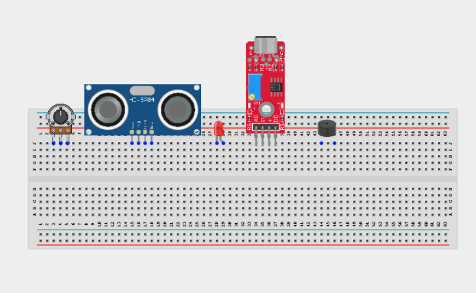
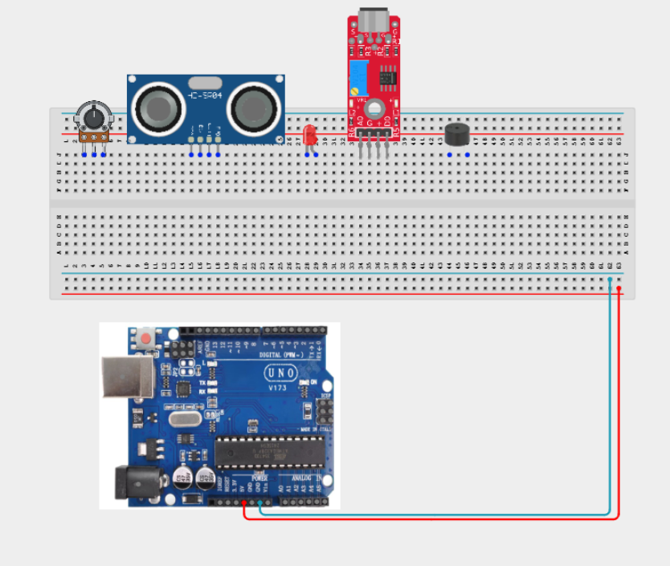
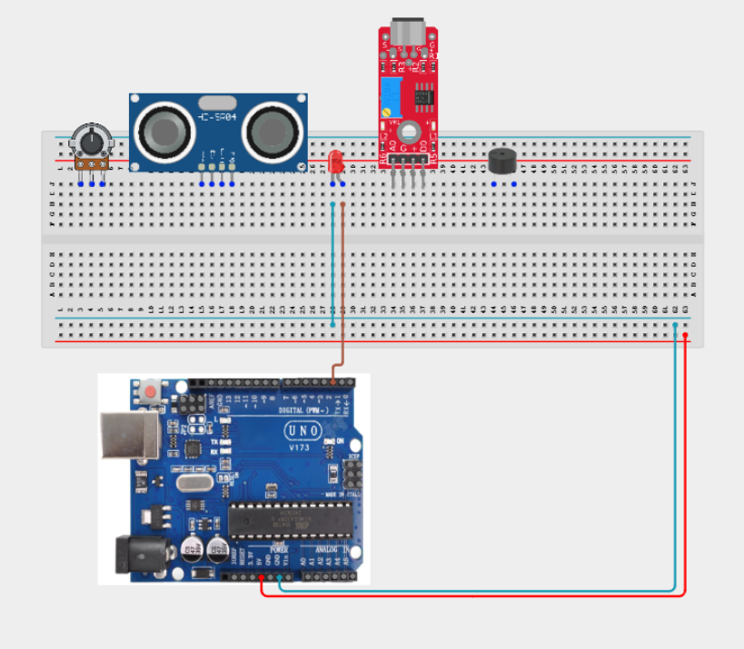
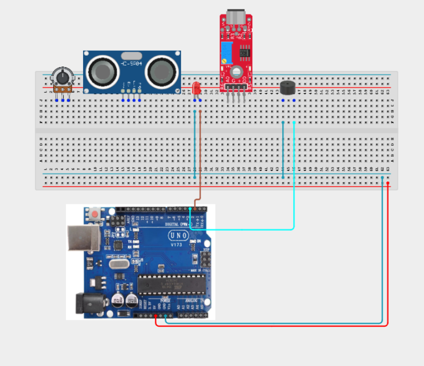
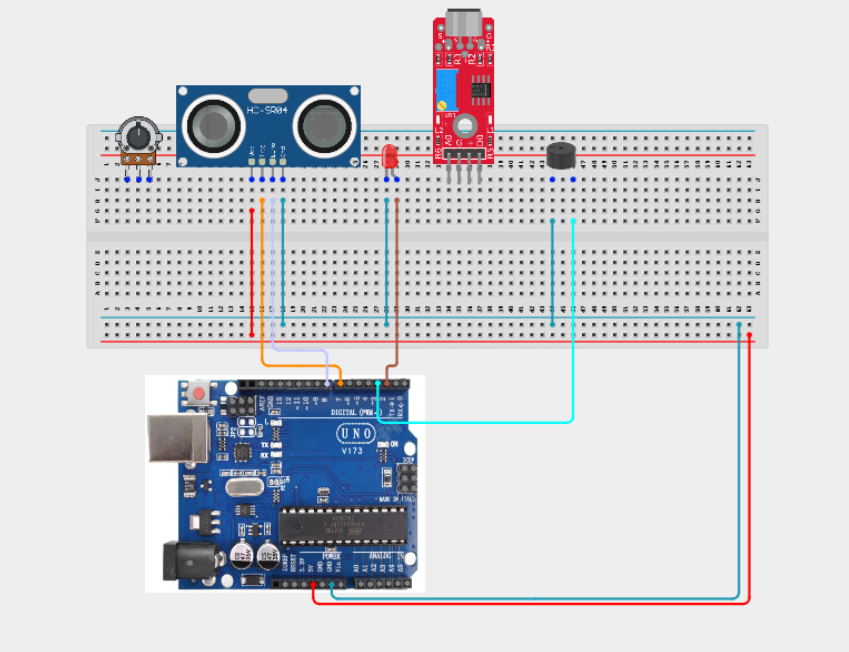
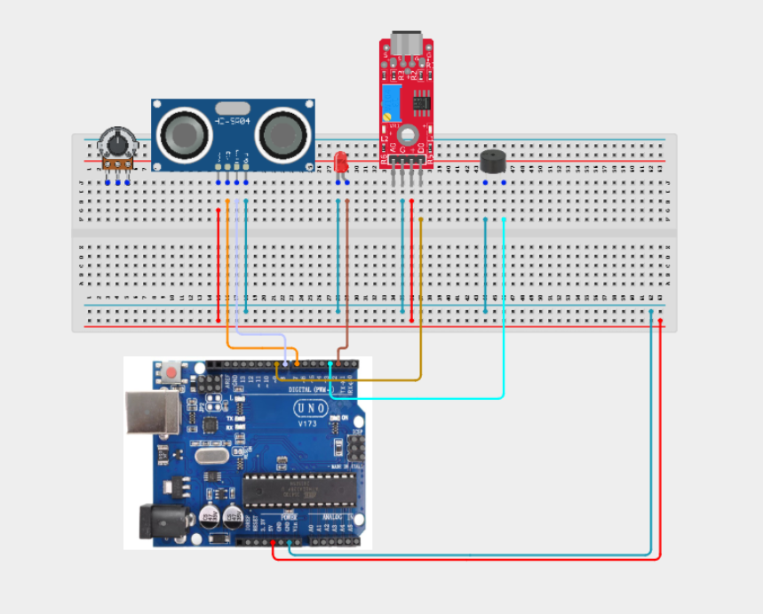
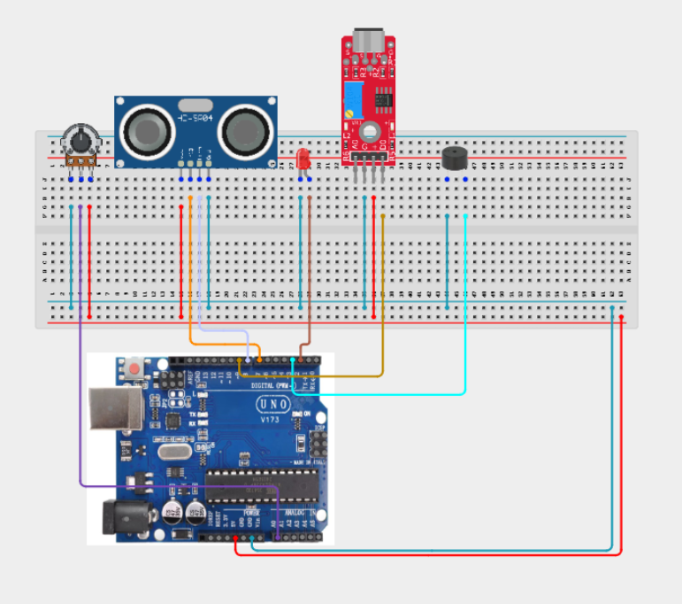
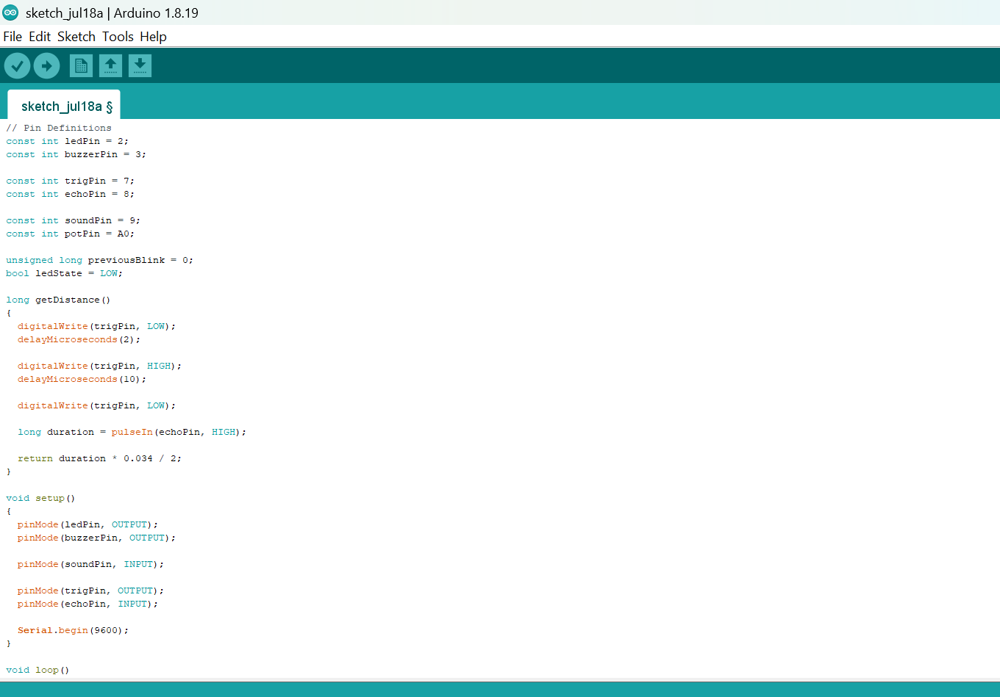
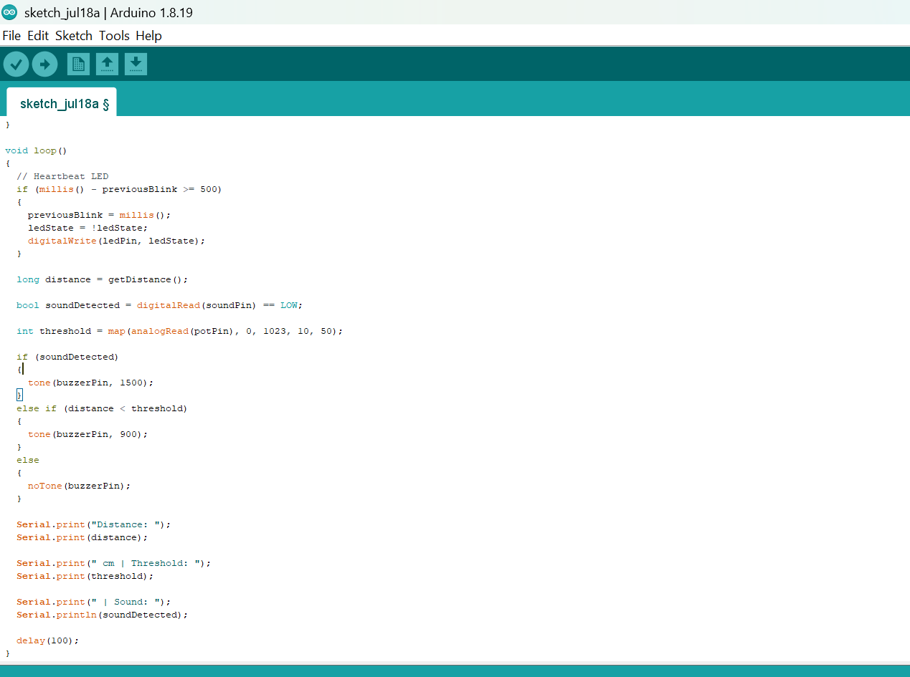

# Project 3.30.1: Industrial Safety Monitor

| **Description** | An industrial safety monitoring system that detects nearby objects using an ultrasonic sensor, monitors abnormal machine noise using a sound sensor, allows adjustable safety thresholds with a potentiometer, displays normal operation using a heartbeat LED, and activates different alarm levels through a buzzer. |
|------------------|----------------------------------------------------------------|
| **Use case**     | This project can be used in industrial safety monitoring, factory automation, machine protection systems, equipment condition monitoring, and embedded applications that require real-time hazard detection and warning. |

## Components (Things You will need)

|  |  |  | | || |  ||
|-------------------------|-------------------------|-------------------------|-------------------------|-------------------------|--------------------------|-------------------------|--------------------------|--------------------------|

## Building the circuit

Things Needed:

- Arduino Uno = 1
- Arduino USB cable = 1
- Ultrasonic sensor = 1
- Sound sensor module = 1
- Potentiometer = 1
- LED = 1
- Buzzer = 1
- Jumper Wires

## Mounting the component on the breadboard

**Step 1:** Carefully mount the ultrasonic sensor, sound sensor module, potentiometer, LED, buzzer on the breadboard.



_**NB:** For complex circuits, plan your component placement to minimize wire crossing and ensure clean connections._

## WIRING THE CIRCUIT

**Step 2:** Connect the 5V pin on the Arduino Uno to the positive (+) power rail on the breadboard.Connect the GND pin on the Arduino Uno to the negative (-) power rail on the breadboard.



**Step 3:** Connecting the LED.Connect the anode (long leg) of the LED to Digital Pin 2.
Connect the cathode (short leg) to GND.



**Step 4:** Connecting the Buzzer.Connect the positive (+) pin to Digital Pin 3.
Connect the negative (-) pin to GND.



**Step 5:** Connecting the Ultrasonic Sensor. Connect VCC to 5V.
Connect GND to GND.
Connect TRIG to Digital Pin 7.
Connect ECHO to Digital Pin 8.



**Step 6:** Connecting the Sound Sensor. Connect VCC to 5V.
Connect GND to GND.
Connect DO to Digital Pin 9.



**Step 7:** Connecting the Potentiometer. Connect the left pin to 5V.
Connect the right pin to GND.
Connect the middle (wiper) pin to Analog Pin A0.



_Make sure to connect the Arduino USB cable to the Arduino board._

## PROGRAMMING

**Step 1:** Open your Arduino IDE. See how to set up here: [Getting Started](../../Getting Started/Arduino_IDE_Setup.md).

**Step 2:** Write the complete program implementing the system logic with appropriate pin definitions, setup configuration, and the main control loop.

```cpp
// Pin Definitions
const int ledPin = 2;
const int buzzerPin = 3;

const int trigPin = 7;
const int echoPin = 8;

const int soundPin = 9;
const int potPin = A0;

unsigned long previousBlink = 0;
bool ledState = LOW;

long getDistance()
{
  digitalWrite(trigPin, LOW);
  delayMicroseconds(2);

  digitalWrite(trigPin, HIGH);
  delayMicroseconds(10);

  digitalWrite(trigPin, LOW);

  long duration = pulseIn(echoPin, HIGH);

  return duration * 0.034 / 2;
}

void setup()
{
  pinMode(ledPin, OUTPUT);
  pinMode(buzzerPin, OUTPUT);

  pinMode(soundPin, INPUT);

  pinMode(trigPin, OUTPUT);
  pinMode(echoPin, INPUT);

  Serial.begin(9600);
}

void loop()
{
  // Heartbeat LED
  if (millis() - previousBlink >= 500)
  {
    previousBlink = millis();
    ledState = !ledState;
    digitalWrite(ledPin, ledState);
  }

  long distance = getDistance();

  bool soundDetected = digitalRead(soundPin) == LOW;

  int threshold = map(analogRead(potPin), 0, 1023, 10, 50);

  if (soundDetected)
  {
    tone(buzzerPin, 1500);
  }
  else if (distance < threshold)
  {
    tone(buzzerPin, 900);
  }
  else
  {
    noTone(buzzerPin);
  }

  Serial.print("Distance: ");
  Serial.print(distance);

  Serial.print(" cm | Threshold: ");
  Serial.print(threshold);

  Serial.print(" | Sound: ");
  Serial.println(soundDetected);

  delay(100);
}
```




**Step 3:** Save your code. _See the [Getting Started](../../Getting Started/Arduino_IDE_Setup.md) section_

**Step 4:** Select the arduino board and port _See the [Getting Started](../../Getting Started/Arduino_IDE_Setup.md) section:Selecting Arduino Board Type and Uploading your code_.

**Step 5:** Upload your code. _See the [Getting Started](../../Getting Started/Arduino_IDE_Setup.md) section:Selecting Arduino Board Type and Uploading your code_


## CONCLUSION

In this project, you learned how to build an industrial safety monitoring system using an Arduino, an ultrasonic sensor, a sound sensor, a potentiometer, an LED, and a buzzer. The system demonstrates how multiple sensors can work together to monitor equipment conditions, detect potential hazards, and provide visual and audible warnings based on different safety levels.

By completing this project, you strengthened your understanding of distance measurement, threshold calibration, digital sensing, heartbeat indicators, multi-level alarm systems, industrial monitoring concepts, and designing reliable embedded safety systems using Arduino.
