# Project 3.31.1: Smart City Intersection Simulator

| **Description** | A smart city intersection simulator that automatically manages traffic flow using an ultrasonic sensor for vehicle detection, an LDR module for night mode, a push button for pedestrian crossing requests, a servo motor to simulate a railroad crossing gate, a traffic light module for traffic control, a potentiometer to adjust traffic signal timing, and a buzzer for pedestrian crossing and railroad warnings. |
|------------------|----------------------------------------------------------------|
| **Use case**     | This project can be used in intelligent transportation systems, smart city infrastructure, traffic management training, railway crossing simulations, and embedded control applications requiring adaptive traffic control and safety systems. |

## Components (Things You will need) 

|  |  |  | | || |! [Buzzer ](../../../assets/components/buzzer.webp) ||||
|-------------------------|-------------------------|-------------------------|-------------------------|-------------------------|--------------------------|-------------------------|--------------------------|--------------------------|--------------------------|--------------------------|

## Building the circuit

Things Needed:

- Arduino Uno = 1
- Arduino USB cable = 1
- Push button = 1
- Potentiometer = 1
- Ultrasonic sensor = 1
- LDR module = 1
- Traffic light module = 1
- Servo motor = 1
- Buzzer = 1
- Jumper Wires

## Mounting the component on the breadboard

**Step 1:** Carefully mount the push button, potentiometer, ultrasonic sensor, LDR module, traffic light module, servo motor, buzzer on the breadboard.

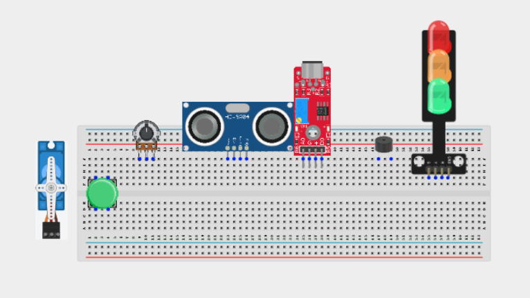

_**NB:** For complex circuits, plan your component placement to minimize wire crossing and ensure clean connections._

## WIRING THE CIRCUIT

**Step 2:** Connect the 5V pin on the Arduino Uno to the positive (+) power rail on the breadboard.Connect the GND pin on the Arduino Uno to the negative (-) power rail on the breadboard.

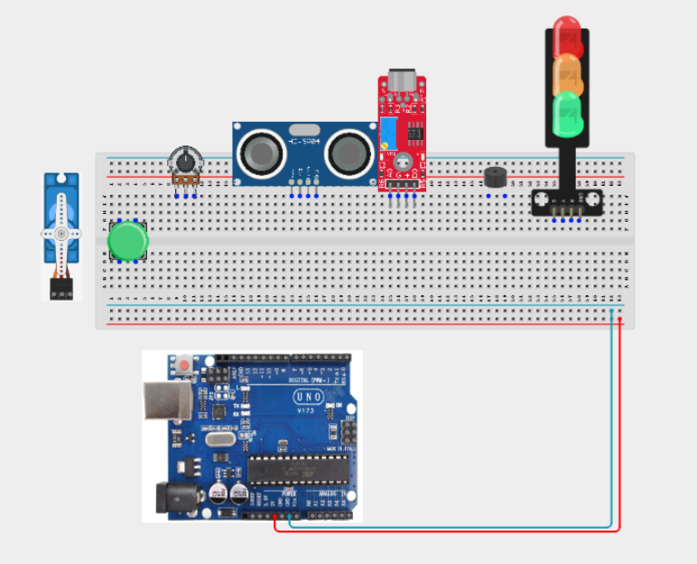

**Step 3:** Connecting the Push Button. Connect one terminal of the push button to Digital Pin 2.
Connect the opposite terminal to GND.

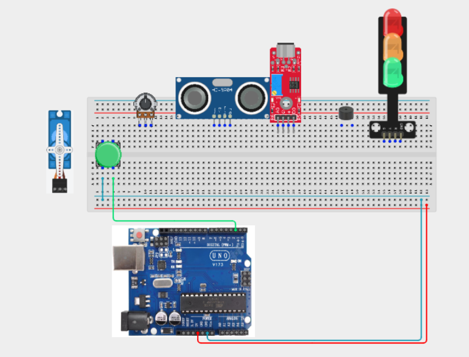

**Step 4:** Connecting the Traffic Light Module. Connect the Red signal pin to Digital Pin 3.
Connect the Yellow signal pin to Digital Pin 4.
Connect the Green signal pin to Digital Pin 5.
Connect the module GND pin to GND.


**Step 5:** Connecting the Buzzer. Connect the positive (+) pin to Digital Pin 6.
Connect the negative (-) pin to GND.

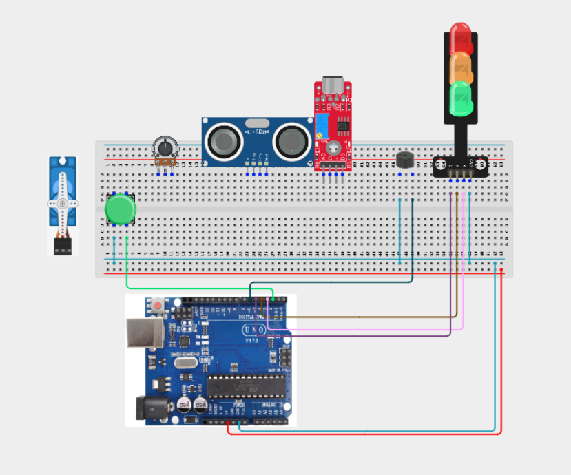

**Step 6:** Connecting the Ultrasonic Sensor. Connect VCC to 5V.
Connect GND to GND.
Connect TRIG to Digital Pin 7.
Connect ECHO to Digital Pin 8.

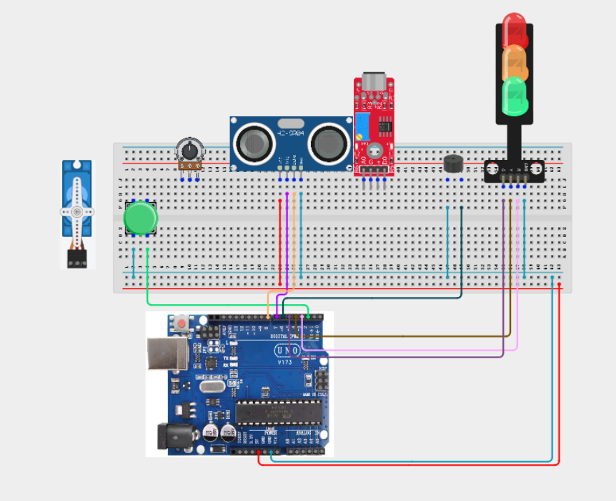

**Step 7:** Connecting the Servo Motor. Connect the red wire to 5V.
Connect the brown/black wire to GND.
Connect the signal wire to Digital Pin 9.

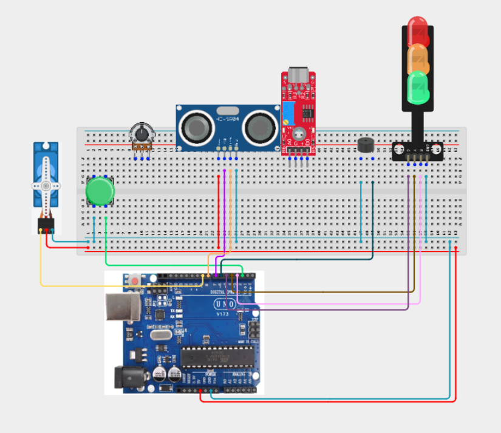

**Step 8:** Connecting the Potentiometer. Connect one outer pin to 5V.
Connect the other outer pin to GND.
Connect the center pin to Analog Pin A0.

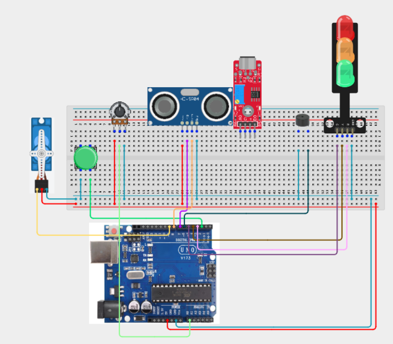

**Step 9:** Connecting the LDR Module. Connect VCC to 5V.
Connect GND to GND.
Connect AO to Analog Pin A1.

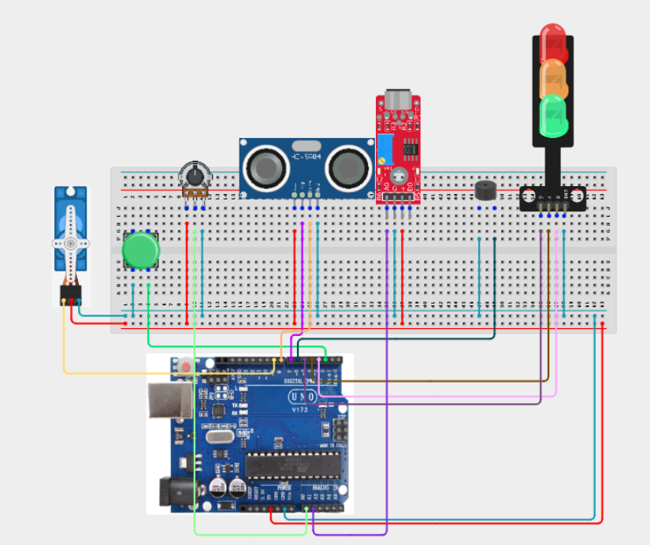

_Make sure to connect the Arduino USB cable to the Arduino board._

## PROGRAMMING

**Step 1:** Open your Arduino IDE. See how to set up here: [Getting Started](../../Getting Started/Arduino_IDE_Setup.md).

**Step 2:** Write the complete program implementing the system logic with appropriate pin definitions, setup configuration, and the main control loop.

```cpp
#include <Servo.h>

const int buttonPin = 2;

const int redPin = 3;
const int yellowPin = 4;
const int greenPin = 5;

const int buzzerPin = 6;

const int trigPin = 7;
const int echoPin = 8;

const int servoPin = 9;

const int potPin = A0;
const int ldrPin = A1;

Servo gate;

bool lastButton = HIGH;
bool pedestrianRequest = false;

long getDistance()
{
  digitalWrite(trigPin, LOW);
  delayMicroseconds(2);

  digitalWrite(trigPin, HIGH);
  delayMicroseconds(10);

  digitalWrite(trigPin, LOW);

  long duration = pulseIn(echoPin, HIGH);

  return duration * 0.034 / 2;
}

void setup()
{
  pinMode(buttonPin, INPUT_PULLUP);

  pinMode(redPin, OUTPUT);
  pinMode(yellowPin, OUTPUT);
  pinMode(greenPin, OUTPUT);

  pinMode(buzzerPin, OUTPUT);

  pinMode(trigPin, OUTPUT);
  pinMode(echoPin, INPUT);

  gate.attach(servoPin);

  Serial.begin(9600);
}

void loop()
{
  bool button = digitalRead(buttonPin);

  if (lastButton == HIGH && button == LOW)
  {
    pedestrianRequest = true;
    delay(200);
  }

  lastButton = button;

  long distance = getDistance();
  int light = analogRead(ldrPin);
  int greenTime = map(analogRead(potPin), 0, 1023, 3000, 8000);

  bool vehicleWaiting = distance < 20;
  bool nightMode = light < 350;

  if (vehicleWaiting)
  {
    digitalWrite(redPin, LOW);
    digitalWrite(yellowPin, LOW);
    digitalWrite(greenPin, HIGH);

    delay(greenTime);
  }

  if (pedestrianRequest)
  {
    digitalWrite(greenPin, LOW);
    digitalWrite(yellowPin, HIGH);

    delay(1000);

    digitalWrite(yellowPin, LOW);
    digitalWrite(redPin, HIGH);

    tone(buzzerPin, 1200);

    delay(3000);

    noTone(buzzerPin);

    pedestrianRequest = false;
  }

  if (nightMode)
  {
    digitalWrite(redPin, LOW);
    digitalWrite(greenPin, LOW);

    digitalWrite(yellowPin, HIGH);
    delay(500);
    digitalWrite(yellowPin, LOW);
    delay(500);
  }

  if (vehicleWaiting)
  {
    gate.write(90);
  }
  else
  {
    gate.write(0);
  }
}
```
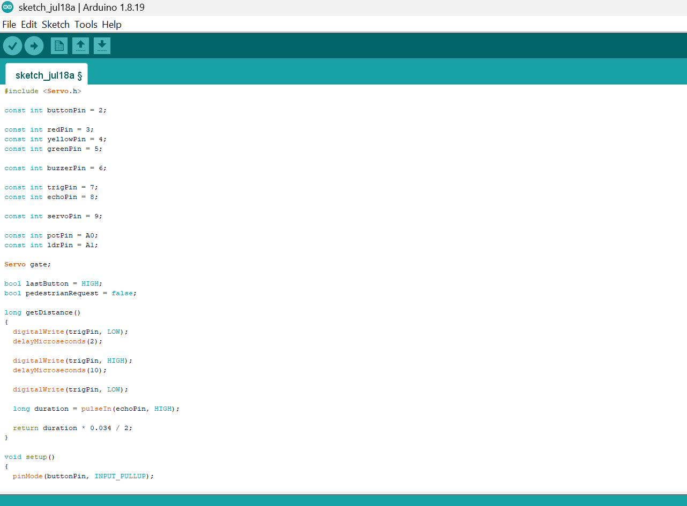

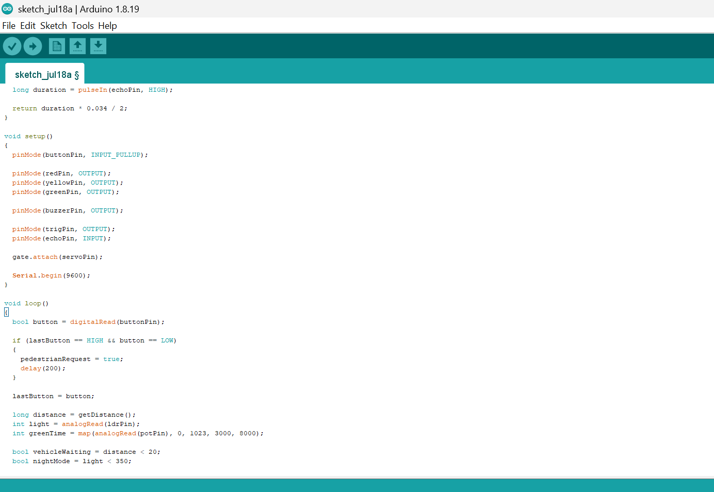

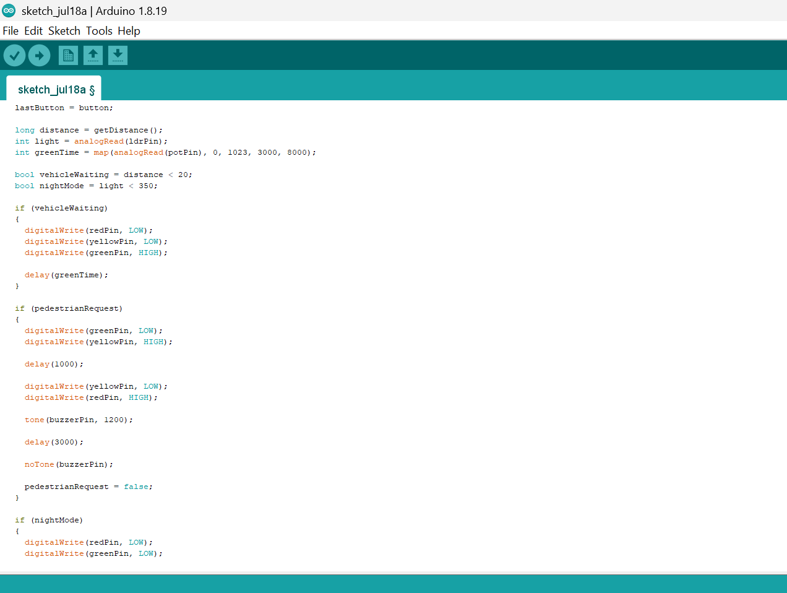

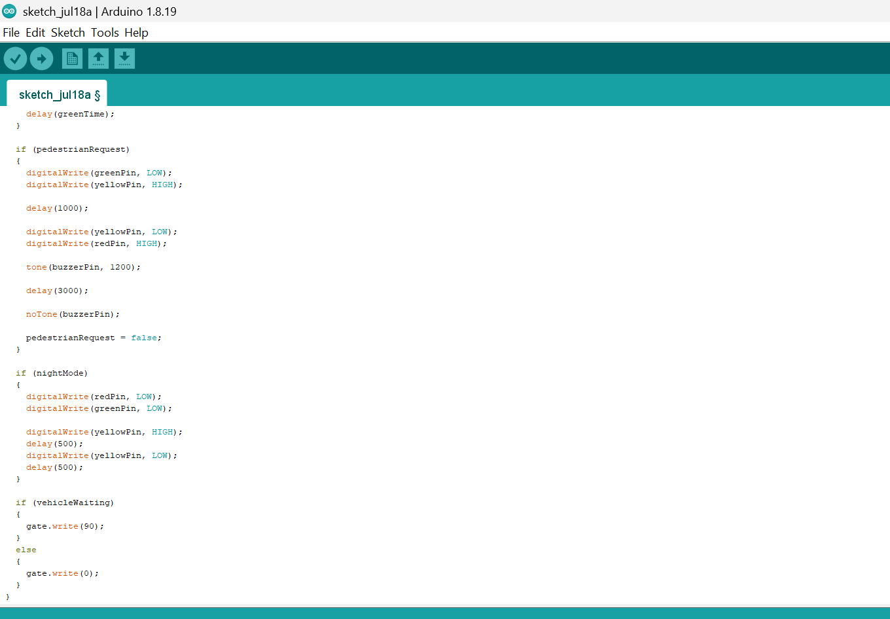

**Step 3:** Save your code. _See the [Getting Started](../../Getting Started/Arduino_IDE_Setup.md) section_

**Step 4:** Select the arduino board and port _See the [Getting Started](../../Getting Started/Arduino_IDE_Setup.md) section:Selecting Arduino Board Type and Uploading your code_.

**Step 5:** Upload your code. _See the [Getting Started](../../Getting Started/Arduino_IDE_Setup.md) section:Selecting Arduino Board Type and Uploading your code_

## CONCLUSION

In this project, you learned how to build a smart city intersection simulator using an Arduino, an ultrasonic sensor, an LDR module, a potentiometer, a push button, a traffic light module, a servo motor, and a buzzer. The system demonstrates how intelligent traffic control can adapt to changing traffic conditions, respond to pedestrian requests, and improve road safety through automated decision-making.

By completing this project, you strengthened your understanding of traffic signal sequencing, adaptive timing, environmental sensing, servo motor control, user interaction, smart transportation systems, finite state control, and designing intelligent embedded automation systems using Arduino.

