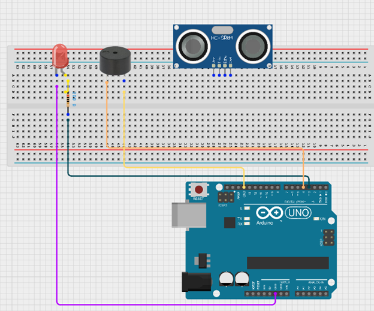
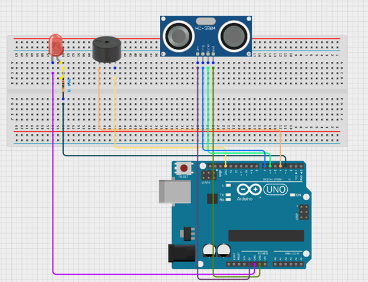
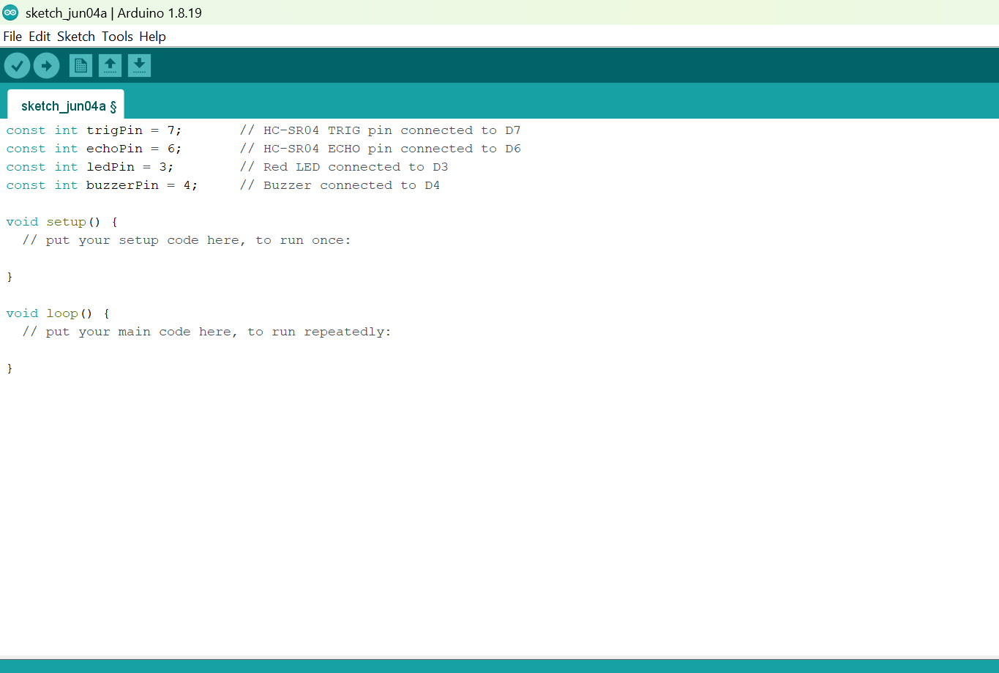
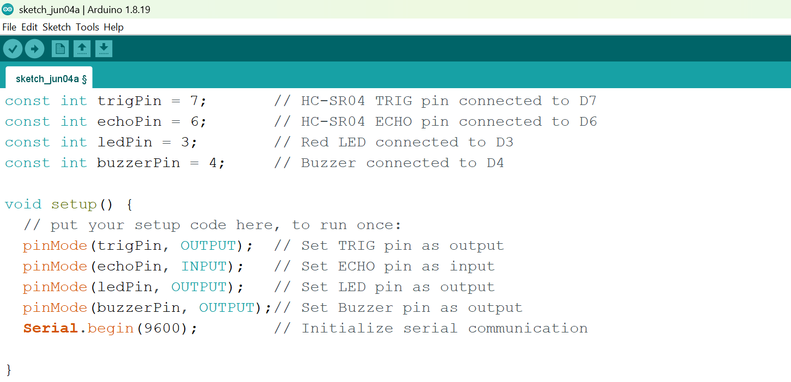
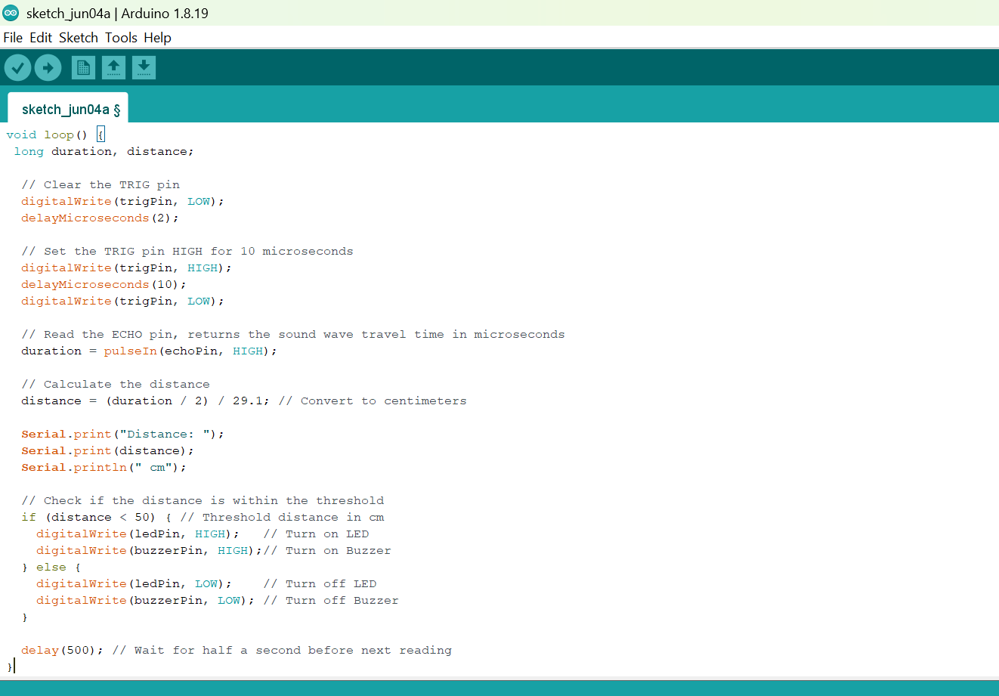

# Project 3.3.1: SMART SECURITY SYSTEM

| **Description** | This project demonstrates a smart security system using an ultrasonic sensor, a red LED, and a buzzer. The ultrasonic sensor detects nearby objects, and when movement or an object is within a set distance, the red LED turns on and the buzzer activates to provide an alert. |
|------------------|----------------------------------------------------------------|
| **Use case**     | This project can be used in parking systems to detect vehicles approaching a restricted area. When a car gets too close, the LED lights up and the buzzer sounds as a warning signal. |

## Components (Things You will need)

|  |  |  |  ||  |  |
|-------------------------|-------------------------|-------------------------|-------------------------|-------------------------|-------------------------|-------------------------|

## Building the circuit

Things Needed:

-	Arduino Uno = 1
-	Arduino USB cable = 1
-	Red LED = 1
-	Ultrasonic sensor = 1
-	Buzzer = 1
-	Jumper Wires 


## Mounting the component on the breadboard

**Step 1:** Insert the ultrasonic sensor into the breadboard. Then place the red LED into the breadboard beside the buzzer, making sure to identify the positive (long pin) and negative (short pin) correctly.

.

## WIRING THE CIRCUIT

**Step 2:** Connect the negative pin of the LED and the negative pin of the buzzer to the GND on the Arduino Uno using jumper wires. Then connect the positive pin of the LED through a resistor to Digital Pin 3, and connect the positive pin of the buzzer to Digital Pin 4 on the Arduino Uno.

.

**Step 3:** Connect the ultrasonic sensor to the Arduino Uno by linking the VCC pin to 5V, the GND pin to GND, the TRIG pin to Digital Pin 7, and the ECHO pin to Digital Pin 6 using jumper wires as shown in the circuit setup.

.

_**NB:** Make sure you identify where the positive pin (+) and the negative pin (-) is connected to on the breadboard. The longer pin of the LED is the positive pin and the shorter one, the negative PIN_.

_make sure you connect the arduino usb use blue cable to the Arduino board_.

## PROGRAMMING

**Step 1:** Open your Arduino IDE. See how to set up here: [Getting Started](../../Getting Started/Arduino_IDE_Setup.md).

**Step 2:** Before the void setup() function, type the following code:
``` cpp
// Pin definitions
Before the void setup() function, type:
const int trigPin = 7;       // HC-SR04 TRIG pin connected to D7
const int echoPin = 6;       // HC-SR04 ECHO pin connected to D6
const int ledPin = 3;        // Red LED connected to D3
const int buzzerPin = 4;     // Buzzer connected to D4
```
.

**Step 3:** Type this code as shown by the diagram.
``` cpp
void setup() {
 // put your setup code here, to run once:
  pinMode(trigPin, OUTPUT);  // Set TRIG pin as output
  pinMode(echoPin, INPUT);   // Set ECHO pin as input
  pinMode(ledPin, OUTPUT);   // Set LED pin as output
  pinMode(buzzerPin, OUTPUT);// Set Buzzer pin as output
  Serial.begin(9600);        // Initialize serial communication

}
```
.

**Step 4:** Type this code as shown by the diagram.

```cpp
void loop() { 
 // put your main code here, to run repeatedly:
 long duration, distance;
  
  // Clear the TRIG pin
  digitalWrite(trigPin, LOW);
  delayMicroseconds(2);
  
  // Set the TRIG pin HIGH for 10 microseconds
  digitalWrite(trigPin, HIGH);
  delayMicroseconds(10);
  digitalWrite(trigPin, LOW);
  
  // Read the ECHO pin, returns the sound wave travel time in microseconds
  duration = pulseIn(echoPin, HIGH);
  
  // Calculate the distance
  distance = (duration / 2) / 29.1; // Convert to centimeters
  
  Serial.print("Distance: ");
  Serial.print(distance);
  Serial.println(" cm");
  
  // Check if the distance is within the threshold
  if (distance < 50) { // Threshold distance in cm
    digitalWrite(ledPin, HIGH);   // Turn on LED
    digitalWrite(buzzerPin, HIGH);// Turn on Buzzer
  } else {
    digitalWrite(ledPin, LOW);    // Turn off LED
    digitalWrite(buzzerPin, LOW); // Turn off Buzzer
  }
  
  delay(500); // Wait for half a second before next reading
}
  ```
.

## Uploading the code

**Step 1:** Save your code. _See the [Getting Started](../../Getting Started/Arduino_IDE_Setup.md) section._

**Step 2:** Select **Arduino Uno** as your board type and choose the correct port. _See the [Getting Started](../../Getting Started/Arduino_IDE_Setup.md) section: Selecting Arduino Board Type and Uploading your code._

**Step 3:** Click the **Upload** button to transfer the code to the Arduino Uno.

**Step 4:** Open the Serial Monitor and set the baud rate to **9600** to view the distance readings detected by the ultrasonic sensor.

## OBSERVATION

The ultrasonic sensor continuously measures the distance of objects in front of it. When an object comes within the set detection range, the red LED turns ON and the buzzer sounds to indicate a possible security alert. When no object is detected within the range, the LED and buzzer remain OFF.

## CONCLUSION

Congratulations!

You have successfully built a smart security system using an Arduino Uno, an ultrasonic sensor, a red LED, and a buzzer.

In this project, you learned how to use an ultrasonic sensor to detect nearby objects and control output devices based on distance measurements. You also learned how sensors and actuators can work together to create an automated alert system.

This project introduces the basic concepts behind real-world security applications such as intrusion detection systems, parking sensors, automatic gates, and smart safety devices.


