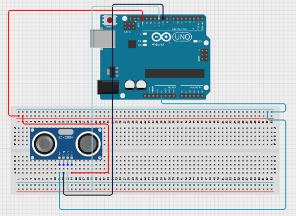
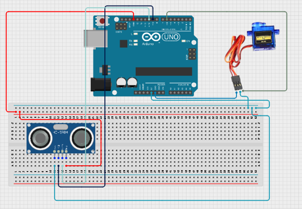
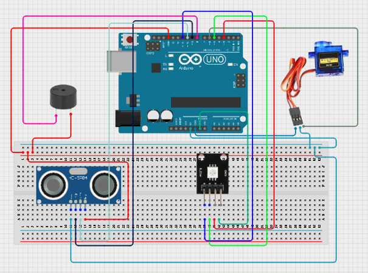
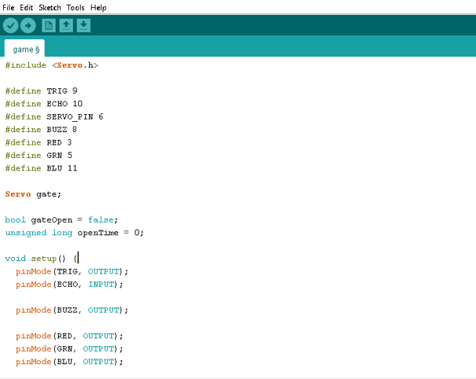

# Project 3.4.1: SECURITY GATE WITH AUDIO ALERT

| **Description** | This project creates an automatic security gate that opens when a vehicle or person approaches and provides visual and audible status indications.  |
|------------------|----------------------------------------------------------------|
| **Use case**     | Parking gates, compound entrances, automated access systems, smart security systems. |

## Components (Things You will need)

|  |  |  |  || | |  |
|-------------------------|-------------------------|-------------------------|-------------------------|-------------------------|-------------------------|-------------------------|-------------------------|

## Building the circuit

Things Needed:

-	Arduino Uno
-	Ultrasonic sensor 
-	RGB module
-	Servo motor
-	Breadboard
-	Jumper wires

## Mounting the component on the breadboard

**Step 1:** Connect one jumper wire from the 5V pin on the Arduino Uno to the positive rail of the breadboard and connect another jumper wire from the GND pin on the Arduino Uno to the negative rail of the breadboard.

.

## WIRING THE CIRCUIT

**Step 2:** Place the ultrasonic sensor on the breadboard.
Connect the ultrasonic sensor:
•	VCC → 5V 
•	GND → GND 
•	Trig → Pin 9 
•	Echo → Pin 10 

.

**Step 3:** Connect the servo motor:
•	Signal → Pin 6 
•	VCC → 5V 
•	GND → GND
Place the RGB LED on the breadboard.
Connect the RGB LED:
•	Red → Pin 3 
•	Green → Pin 5 
•	Blue → Pin 11 

.

**Step 4:**Place the buzzer on the breadboard.
Connect the buzzer:
•	Positive (+) → Pin 8 
•	Negative (-) → GND 

.

## PROGRAMMING

**Step 1:** Open your Arduino IDE. See how to set up here: [Getting Started](../../Getting Started/Arduino_IDE_Setup.md).

**Step 2:** Type the following code in your arduino IDE at the top of "void setup() { }" function as shown in the picture below.

**Step 7:** Save your code. _See the [Getting Started](../../Getting Started/Arduino_IDE_Setup.md) section_

**Step 8:** Select the arduino board and port _See the [Getting Started](../../Getting Started/Arduino_IDE_Setup.md) section:Selecting Arduino Board Type and Uploading your code_.

**Step 9:** Upload your code. _See the [Getting Started](../../Getting Started/Arduino_IDE_Setup.md) section:Selecting Arduino Board Type and Uploading your code_

## OBSERVATION
•	Green RGB LED indicates normal standby mode. 
•	Yellow RGB LED indicates a detected vehicle. 
•	The gate opens automatically when an object approaches. 
•	The gate closes automatically after the object leaves. 
 

## CONCLUSION
This project demonstrates automatic access control using distance sensing, servo control, RGB indication, and audio feedback.

