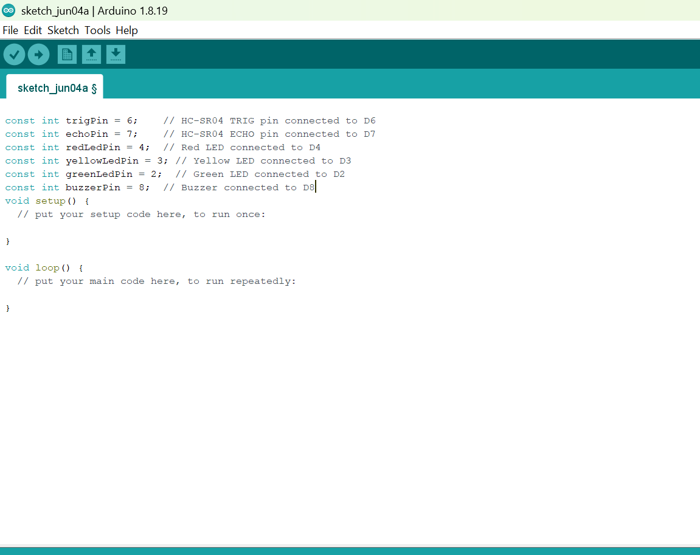
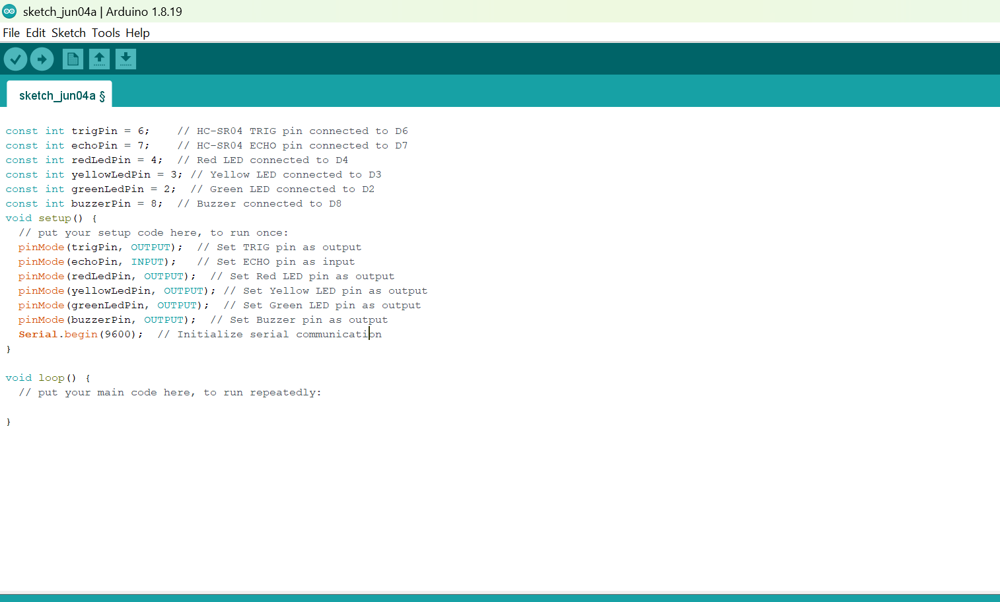
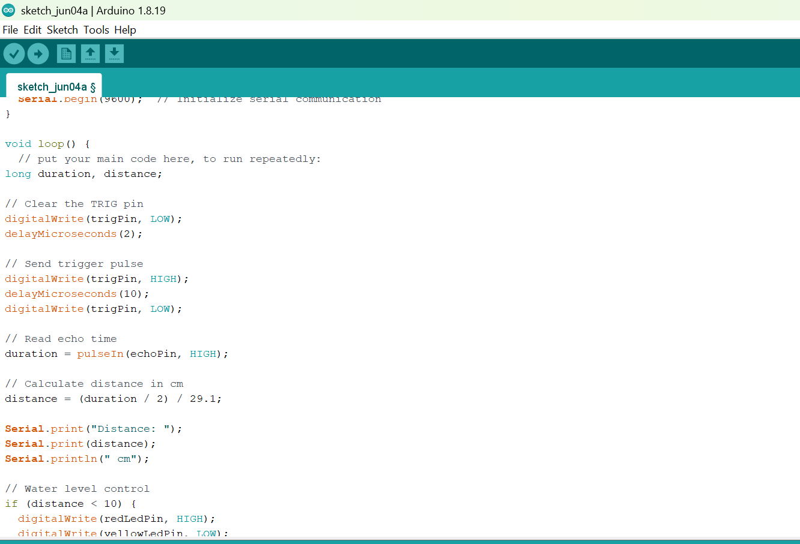
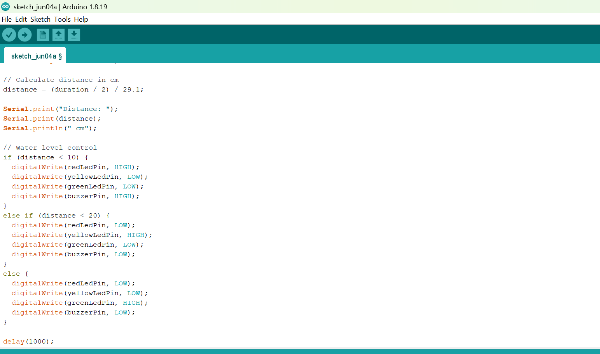

# Project 3.6.1: Smart Gauge System 

| **Description** | This project demonstrates how to build a water level monitoring system using an ultrasonic sensor, LEDs, and a buzzer. The ultrasonic sensor measures the water level, the LEDs indicate different water levels, and the buzzer provides an alert when the water reaches a certain point.  |
|------------------|----------------------------------------------------------------|
| **Use case**     | This project can be used in water storage tanks to monitor water levels automatically. For example, the LEDs can indicate whether the tank is low, medium, or full, while the buzzer alerts users when the tank is completely full to prevent water overflow. |


## Components (Things You will need)

|  |  |  |  || | ||
|-------------------------|-------------------------|-------------------------|-------------------------|-------------------------|-------------------------|-------------------------|-------------------------|


## Building the circuit

Things Needed:

-	Arduino Uno Board = 1
-	Arduino USB cable = 1
-	Breadboard = 1
-	LEDs = 3
-	Ultrasonic sensor = 1
-	Jumper Wires


## Mounting the component on the breadboard

**Step 1:** Insert the ultrasonic sensor into the breadboard. Then place the red, green, and yellow LEDs beside the sensor, ensuring the positive and negative pins are correctly identified. Connect a resistor to the positive pin of each LED, and insert the buzzer into the breadboard with the positive and negative pins properly positioned.

.

## WIRING THE CIRCUIT

**Step 2:** Connect the **negative (short) pin** of each LED (red, yellow, and green) to the **GND** pin on the Arduino Uno. Then connect the **positive (long) pin** of each LED **through a 220 Ω resistor** to its respective digital pin on the Arduino Uno using jumper wires as follows: connect the **red LED** to **Digital Pin 4**, the **yellow LED** to **Digital Pin 3**, and the **green LED** to **Digital Pin 2**. Ensure that each LED has its own resistor connected in series with the positive pin to limit the current flowing through the LED and protect it from damage.

.

**Step 3:** Connect the VCC pin of the ultrasonic sensor to the 5V pin on the Arduino Uno and connect the GND pin to GND. Then connect the TRIG pin to Digital Pin 7 and the ECHO pin to Digital Pin 6 on the Arduino 
Uno using jumper wires.

.

**Step 4:** Connect the positive pin (+) of the buzzer to a digital pin on the Arduino Uno (for example Digital Pin 8), and connect the negative pin (–) to the GND pin on the Arduino Uno.


## PROGRAMMING

**Step 1:** Open your Arduino IDE. See how to set up here: [Getting Started](../../Getting Started/Arduino_IDE_Setup.md).

**Step 2:** Before the void setup() function, type:
``` cpp
const int trigPin = 6;    // HC-SR04 TRIG pin connected to D6
const int echoPin = 7;    // HC-SR04 ECHO pin connected to D7
const int redLedPin = 4;  // Red LED connected to D4
const int yellowLedPin = 3; // Yellow LED connected to D3
const int greenLedPin = 2;  // Green LED connected to D2
const int buzzerPin = 8;  // Buzzer connected to D8
```



**Step 3:** Inside the void setup() function, type:
```cpp
pinMode(trigPin, OUTPUT);  // Set TRIG pin as output
  pinMode(echoPin, INPUT);   // Set ECHO pin as input
  pinMode(redLedPin, OUTPUT);  // Set Red LED pin as output
  pinMode(yellowLedPin, OUTPUT); // Set Yellow LED pin as output
  pinMode(greenLedPin, OUTPUT);  // Set Green LED pin as output
  pinMode(buzzerPin, OUTPUT);  // Set Buzzer pin as output
  Serial.begin(9600);  // Initialize serial communication
```




**Step 4:** Inside the void loop() function, type:
```cpp
long duration, distance;

// Clear the TRIG pin
digitalWrite(trigPin, LOW);
delayMicroseconds(2);

// Send trigger pulse
digitalWrite(trigPin, HIGH);
delayMicroseconds(10);
digitalWrite(trigPin, LOW);

// Read echo time
duration = pulseIn(echoPin, HIGH);

// Calculate distance in cm
distance = (duration / 2) / 29.1;

Serial.print("Distance: ");
Serial.print(distance);
Serial.println(" cm");

// Water level control
if (distance < 10) {
  digitalWrite(redLedPin, HIGH);
  digitalWrite(yellowLedPin, LOW);
  digitalWrite(greenLedPin, LOW);
  digitalWrite(buzzerPin, HIGH);
}
else if (distance < 20) {
  digitalWrite(redLedPin, LOW);
  digitalWrite(yellowLedPin, HIGH);
  digitalWrite(greenLedPin, LOW);
  digitalWrite(buzzerPin, LOW);
}
else {
  digitalWrite(redLedPin, LOW);
  digitalWrite(yellowLedPin, LOW);
  digitalWrite(greenLedPin, HIGH);
  digitalWrite(buzzerPin, LOW);
}

delay(1000);

```





**Step 4:** Save your code. _See the [Getting Started](../../Getting Started/Arduino_IDE_Setup.md) section_

**Step 5:** Select the arduino board and port _See the [Getting Started](../../Getting Started/Arduino_IDE_Setup.md) section:Selecting Arduino Board Type and Uploading your code_.

**Step 6:** Upload your code. _See the [Getting Started](../../Getting Started/Arduino_IDE_Setup.md) section:Selecting Arduino Board Type and Uploading your code_


## CONCLUSION
This project demonstrated how an ultrasonic sensor, LEDs, and a buzzer can be used together to monitor water levels in a tank. It helped in understanding how distance sensing works and how outputs like LEDs and buzzers can provide visual and audio alerts for real-life applications such as water level monitoring systems.

