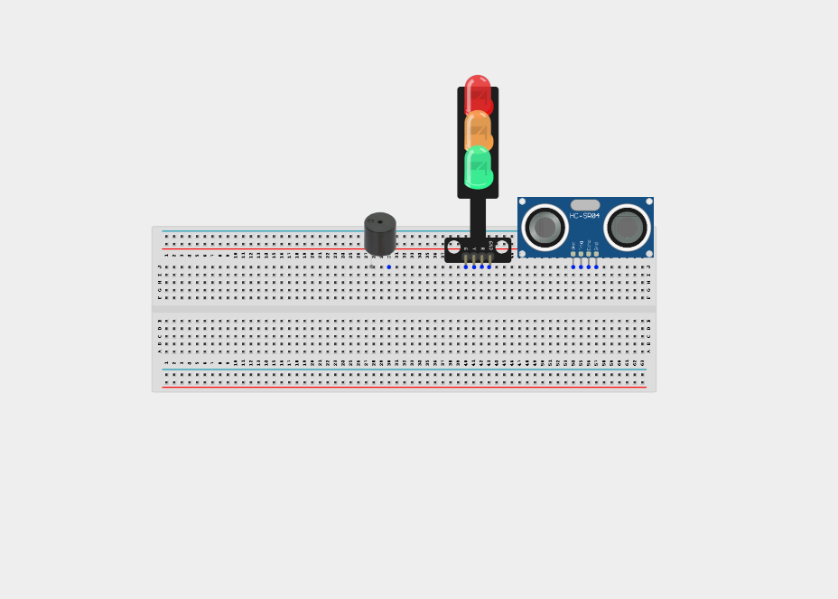
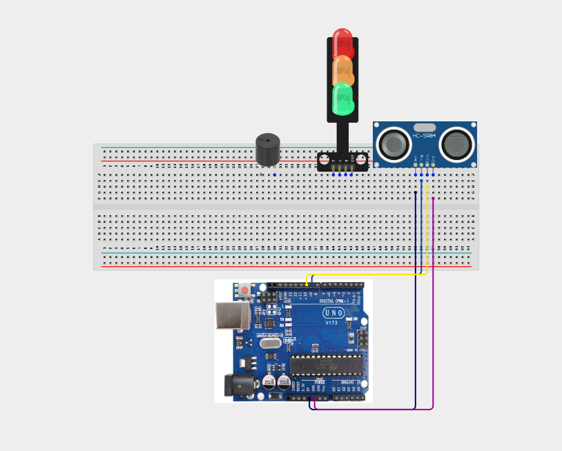
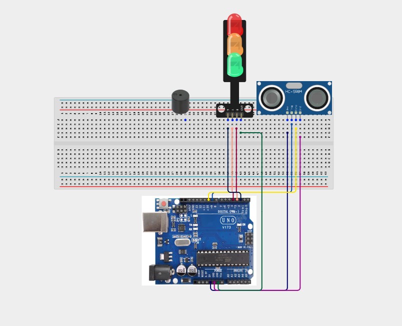
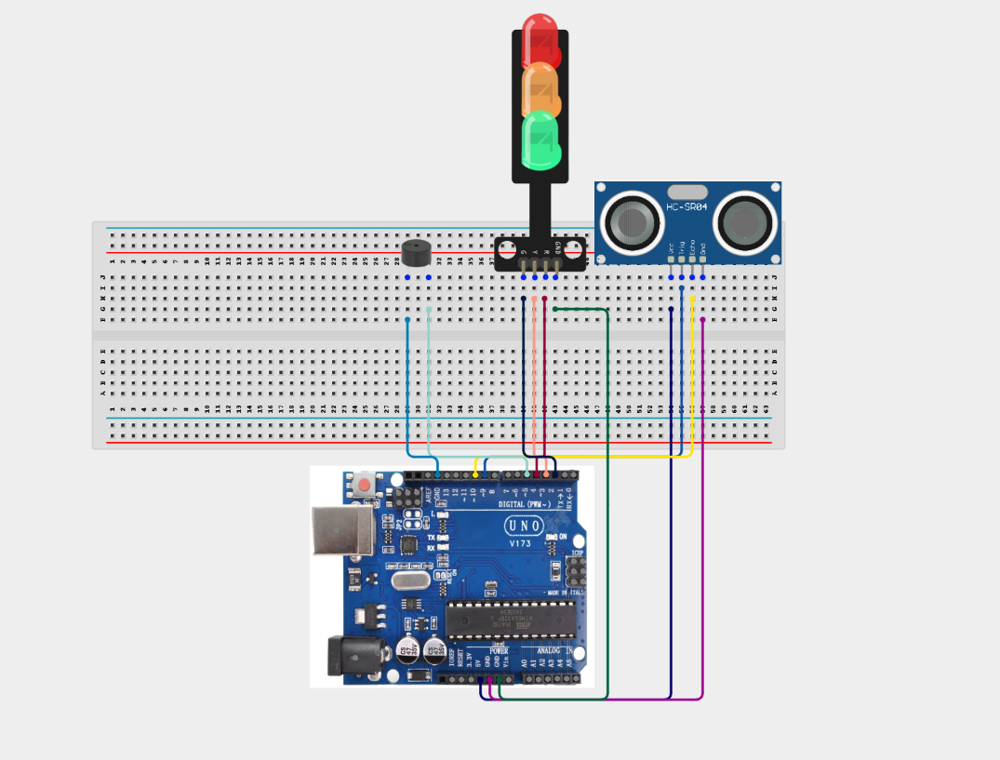
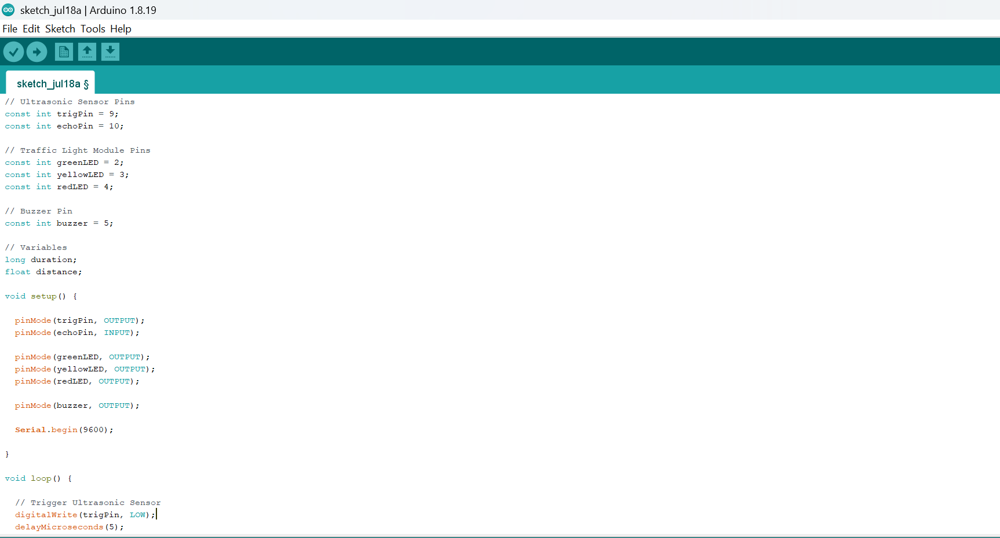
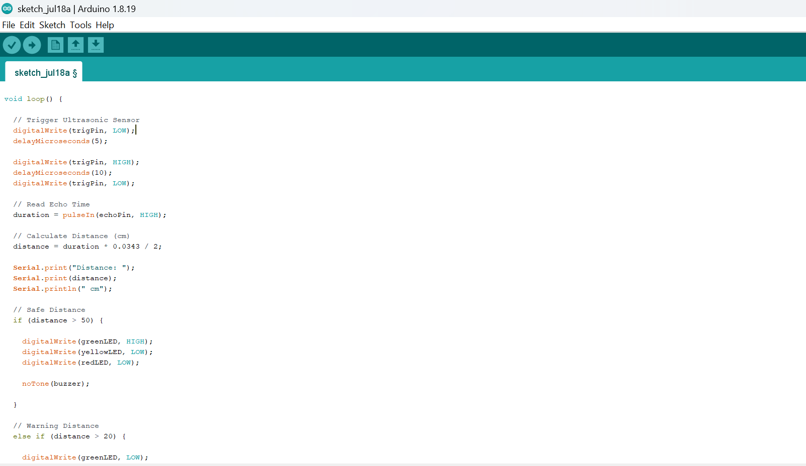
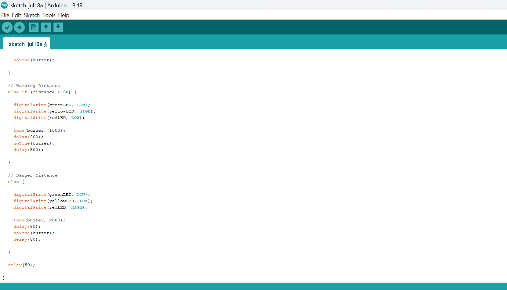

# Project 3.8.1: Proximity Parking Radar

| **Description** | Learn how to build a parking assistance system using an ultrasonic sensor, traffic light module, and buzzer. The system detects the distance of nearby objects and provides visual and audible warnings as the object gets closer.|
|------------------|----------------------------------------------------------------|
| **Use case**     | This project can be used as a parking assistance system for vehicles, obstacle detection in robotics, warehouse safety systems, and distance warning applications. |

## Components (Things You will need)

|  |  |  |  |  |  |  |
| --------------------------------------------------- | ------------------------------------------------------ | ----------------------------------------------------------- | --------------------------------------------------------- | ------------------------------------------------------ | ------------------------------------------------------ | ------------------------------------------------------ |

## Building the circuit

Things Needed:

- Arduino Uno = 1
- Arduino USB cable = 1
- Ultrasonic sensor = 1
- Buzzer = 1
- Traffic light module = 1
- Jumper Wires


## Mounting the component on the breadboard

**Step 1:** Carefully mount the Arduino Uno, Ultrasonic Sensor (HC-SR04), Traffic Light Module, and Buzzer on the breadboard, ensuring there is enough spacing between each component to allow for neat wiring and easy troubleshooting.



_**NB:** For complex circuits, plan your component placement to minimize wire crossing and ensure clean connections._

## WIRING THE CIRCUIT

**Step 2:** Connect the Ultrasonic Sensor (HC-SR04) to the Arduino Uno by connecting the VCC pin to 5V, the GND pin to GND, the TRIG pin to Digital Pin 9, and the ECHO pin to Digital Pin 10.



**Step 3:** Connect the traffic light module:

Traffic Light Module	Arduino Uno
Red	-> Digital Pin 4
Yellow	-> Digital Pin 3
Green -> Digital Pin 2
GND	-> GND



**Step 4:** Wire the buzzer as follows:

Buzzer	Arduino Uno
Positive (+) -> Digital Pin 5
Negative (-) -> GND



## PROGRAMMING

**Step 1:** Open your Arduino IDE. See how to set up here: [Getting Started](../../Getting Started/Arduino_IDE_Setup.md).

**Step 2:** Write the complete program implementing the system logic with appropriate pin definitions, setup configuration, and the main control loop.

```cpp
// Ultrasonic Sensor Pins
const int trigPin = 9;
const int echoPin = 10;

// Traffic Light Module Pins
const int greenLED = 2;
const int yellowLED = 3;
const int redLED = 4;

// Buzzer Pin
const int buzzer = 5;

// Variables
long duration;
float distance;

void setup() {

  pinMode(trigPin, OUTPUT);
  pinMode(echoPin, INPUT);

  pinMode(greenLED, OUTPUT);
  pinMode(yellowLED, OUTPUT);
  pinMode(redLED, OUTPUT);

  pinMode(buzzer, OUTPUT);

  Serial.begin(9600);

}

void loop() {

  // Trigger Ultrasonic Sensor
  digitalWrite(trigPin, LOW);
  delayMicroseconds(5);

  digitalWrite(trigPin, HIGH);
  delayMicroseconds(10);
  digitalWrite(trigPin, LOW);

  // Read Echo Time
  duration = pulseIn(echoPin, HIGH);

  // Calculate Distance (cm)
  distance = duration * 0.0343 / 2;

  Serial.print("Distance: ");
  Serial.print(distance);
  Serial.println(" cm");

  // Safe Distance
  if (distance > 50) {

    digitalWrite(greenLED, HIGH);
    digitalWrite(yellowLED, LOW);
    digitalWrite(redLED, LOW);

    noTone(buzzer);

  }

  // Warning Distance
  else if (distance > 20) {

    digitalWrite(greenLED, LOW);
    digitalWrite(yellowLED, HIGH);
    digitalWrite(redLED, LOW);

    tone(buzzer, 1000);
    delay(200);
    noTone(buzzer);
    delay(300);

  }

  // Danger Distance
  else {

    digitalWrite(greenLED, LOW);
    digitalWrite(yellowLED, LOW);
    digitalWrite(redLED, HIGH);

    tone(buzzer, 2000);
    delay(80);
    noTone(buzzer);
    delay(80);

  }

  delay(50);

}
```







**Step 3:** Save your code. _See the [Getting Started](../../Getting Started/Arduino_IDE_Setup.md) section_

**Step 4:** Select the arduino board and port _See the [Getting Started](../../Getting Started/Arduino_IDE_Setup.md) section:Selecting Arduino Board Type and Uploading your code_.

**Step 5:** Upload your code. _See the [Getting Started](../../Getting Started/Arduino_IDE_Setup.md) section:Selecting Arduino Board Type and Uploading your code_

## CONCLUSION

This project demonstrates how multiple input and output devices can work together to create an intelligent parking assistance system. It strengthens understanding of distance sensing, conditional programming, and real-world automation applications.

