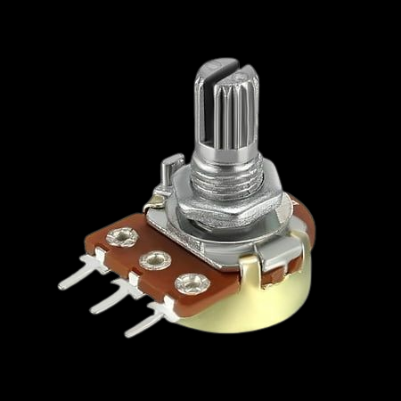
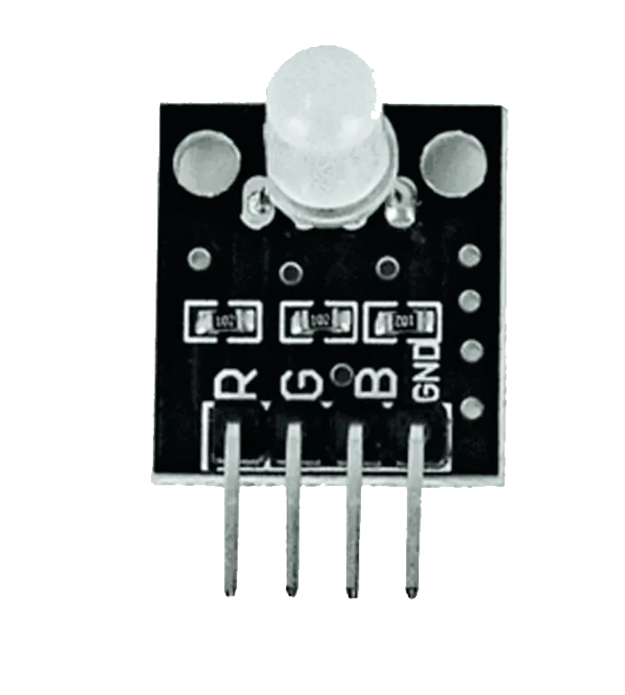
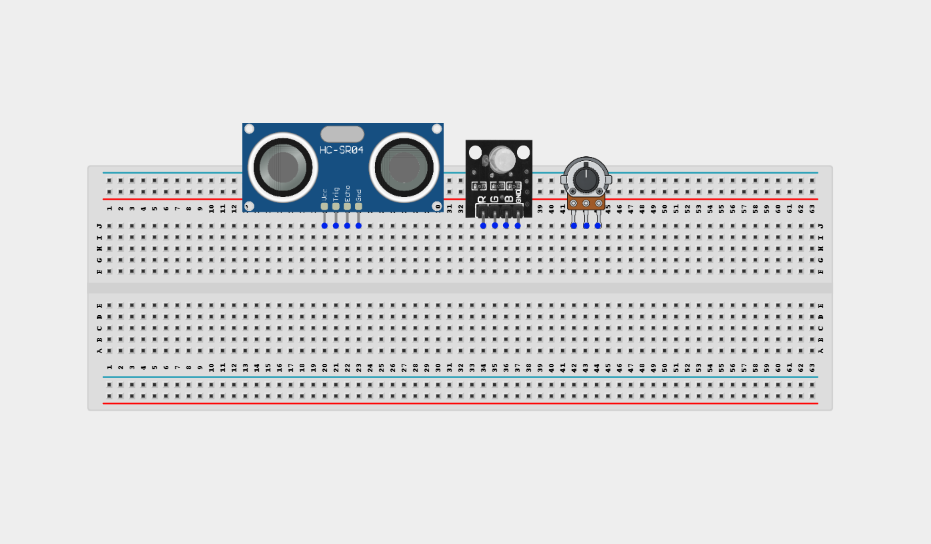
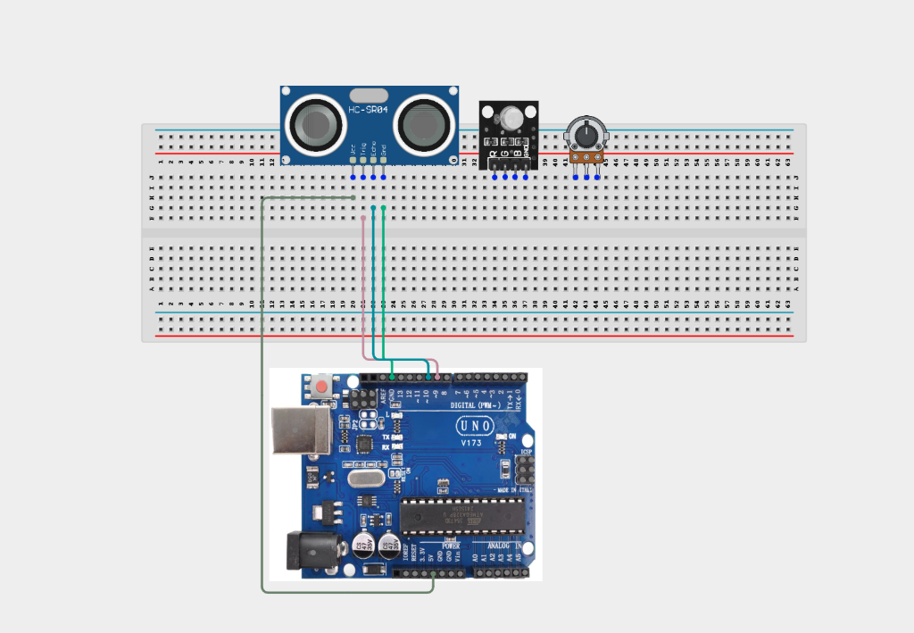
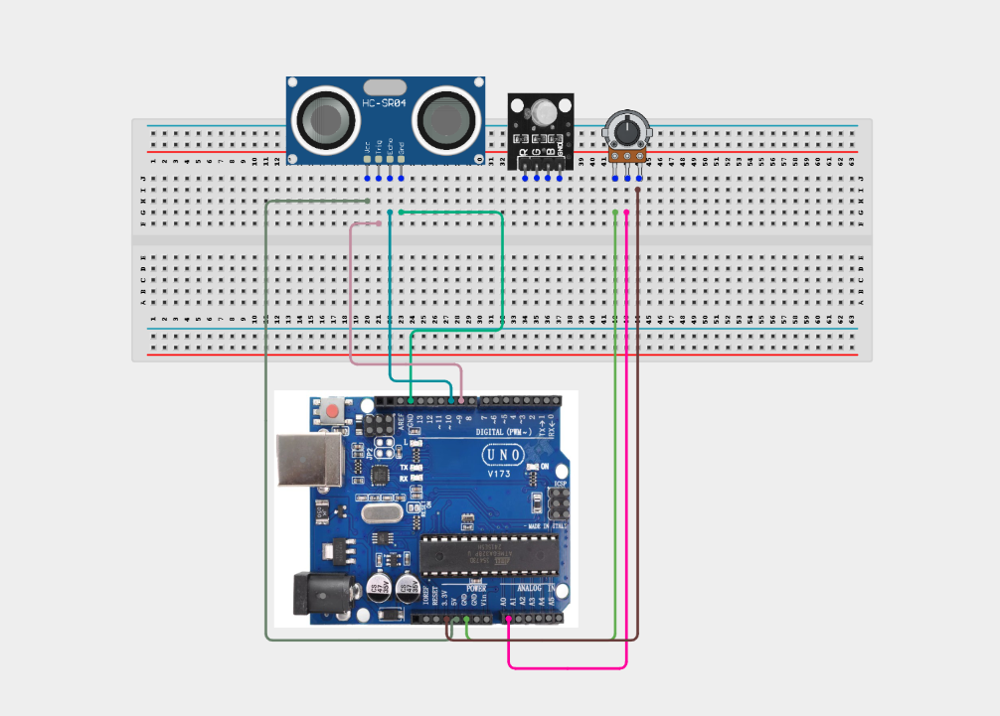
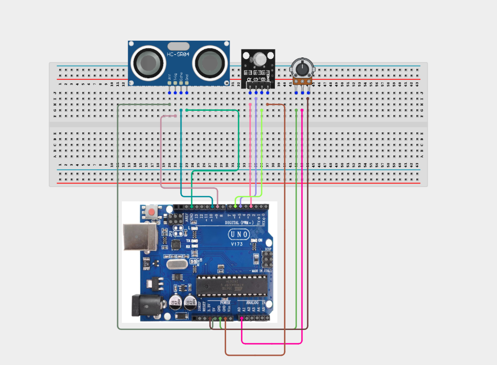
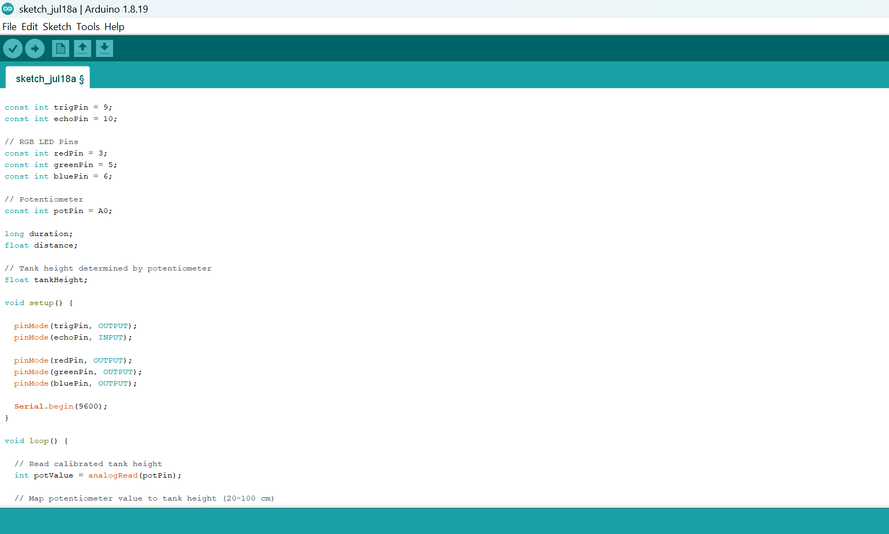
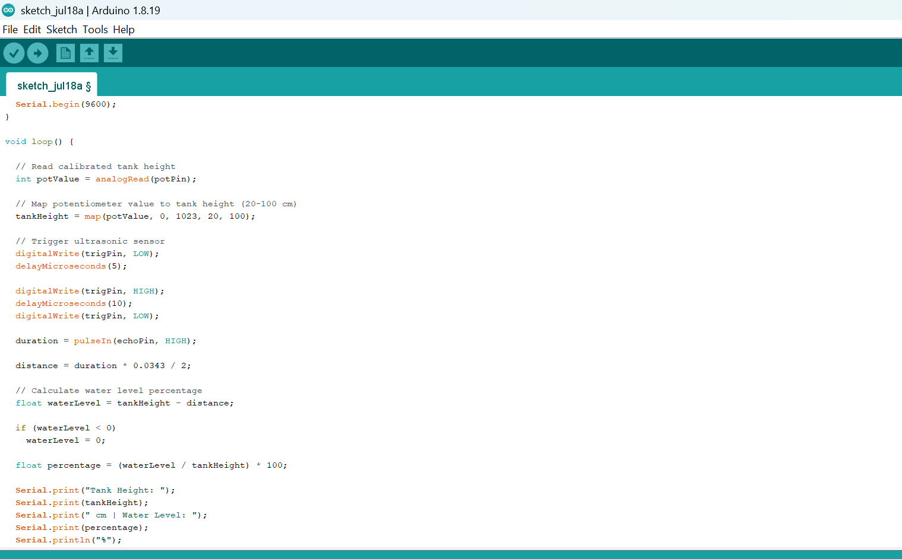
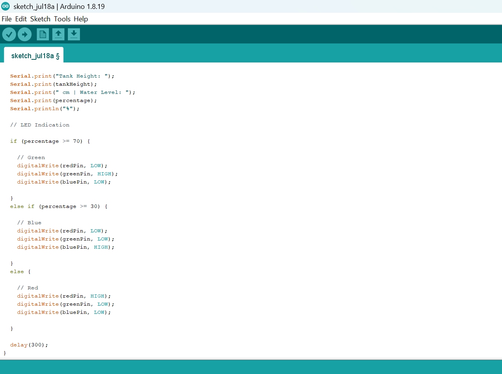

# Project 3.9.1: Calibrated Water Level Simulator

| **Description** |Learn how to build a calibrated water level monitoring system using an ultrasonic sensor, potentiometer, and RGB LED. The potentiometer is used to simulate different tank heights, while the ultrasonic sensor measures the water level and the RGB LED provides visual feedback based on the measured level.|
|------------------|----------------------------------------------------------------|
| **Use case**     | This project can be used for water tank monitoring, liquid storage management, industrial process control, smart irrigation systems, and automated reservoir level indication.|

## Components (Things You will need)

|  |  |  |  |  |  |  |
| --------------------------------------------------- | ------------------------------------------------------ | ----------------------------------------------------------- | --------------------------------------------------------- | ------------------------------------------------------ | ------------------------------------------------------ | ------------------------------------------------------ |

## Building the circuit

Things Needed:

- Arduino Uno = 1
- Arduino USB cable = 1
- Ultrasonic sensor = 1
- Potentiometer = 1
- RGB LED module = 1
- Jumper Wires
- 220Ω resistors


## Mounting the component on the breadboard

**Step 1:** Carefully mount the Ultrasonic Sensor (HC-SR04), Potentiometer, and RGB LED on the breadboard, ensuring there is enough space between each component to allow for neat wiring and easy troubleshooting.



_**NB:** For complex circuits, plan your component placement to minimize wire crossing and ensure clean connections._

## WIRING THE CIRCUIT

**Step 2:** Connect the Ultrasonic Sensor (HC-SR04) to the Arduino Uno by connecting the VCC pin to 5V, the GND pin to GND, the TRIG pin to Digital Pin 9, and the ECHO pin to Digital Pin 10.


**Step 3:** Connect the Potentiometer to the Arduino Uno by connecting the left pin to GND, the middle (wiper) pin to Analog Pin A0, and the right pin to 5V.



**Step 4:** Connect the RGB LED (common cathode) to the Arduino Uno by connecting the Red pin to Digital Pin 3, the Green pin to Digital Pin 5, the Blue pin to Digital Pin 6, and the Cathode (common negative) pin to GND.



_Make sure to connect the Arduino USB cable to the Arduino board._


## PROGRAMMING

**Step 1:** Open your Arduino IDE. See how to set up here: [Getting Started](../../Getting Started/Arduino_IDE_Setup.md).

**Step 2:** Write the complete program implementing the system logic with appropriate pin definitions, setup configuration, and the main control loop.

```cpp

const int trigPin = 9;
const int echoPin = 10;

// RGB LED Pins
const int redPin = 3;
const int greenPin = 5;
const int bluePin = 6;

// Potentiometer
const int potPin = A0;

long duration;
float distance;

// Tank height determined by potentiometer
float tankHeight;

void setup() {

  pinMode(trigPin, OUTPUT);
  pinMode(echoPin, INPUT);

  pinMode(redPin, OUTPUT);
  pinMode(greenPin, OUTPUT);
  pinMode(bluePin, OUTPUT);

  Serial.begin(9600);
}

void loop() {

  // Read calibrated tank height
  int potValue = analogRead(potPin);

  // Map potentiometer value to tank height (20–100 cm)
  tankHeight = map(potValue, 0, 1023, 20, 100);

  // Trigger ultrasonic sensor
  digitalWrite(trigPin, LOW);
  delayMicroseconds(5);

  digitalWrite(trigPin, HIGH);
  delayMicroseconds(10);
  digitalWrite(trigPin, LOW);

  duration = pulseIn(echoPin, HIGH);

  distance = duration * 0.0343 / 2;

  // Calculate water level percentage
  float waterLevel = tankHeight - distance;

  if (waterLevel < 0)
    waterLevel = 0;

  float percentage = (waterLevel / tankHeight) * 100;

  Serial.print("Tank Height: ");
  Serial.print(tankHeight);
  Serial.print(" cm | Water Level: ");
  Serial.print(percentage);
  Serial.println("%");

  // LED Indication

  if (percentage >= 70) {

    // Green
    digitalWrite(redPin, LOW);
    digitalWrite(greenPin, HIGH);
    digitalWrite(bluePin, LOW);

  }
  else if (percentage >= 30) {

    // Blue
    digitalWrite(redPin, LOW);
    digitalWrite(greenPin, LOW);
    digitalWrite(bluePin, HIGH);

  }
  else {

    // Red
    digitalWrite(redPin, HIGH);
    digitalWrite(greenPin, LOW);
    digitalWrite(bluePin, LOW);

  }

  delay(300);
}
```






**Step 7:** Save your code. _See the [Getting Started](../../Getting Started/Arduino_IDE_Setup.md) section_

**Step 8:** Select the arduino board and port _See the [Getting Started](../../Getting Started/Arduino_IDE_Setup.md) section:Selecting Arduino Board Type and Uploading your code_.

**Step 9:** Upload your code. _See the [Getting Started](../../Getting Started/Arduino_IDE_Setup.md) section:Selecting Arduino Board Type and Uploading your code_

## CONCLUSION

This project demonstrates how analog inputs and distance sensors can be combined to create a configurable water level monitoring system. It strengthens understanding of sensor calibration, analog signal processing, distance measurement, and real-world automation using Arduino.

