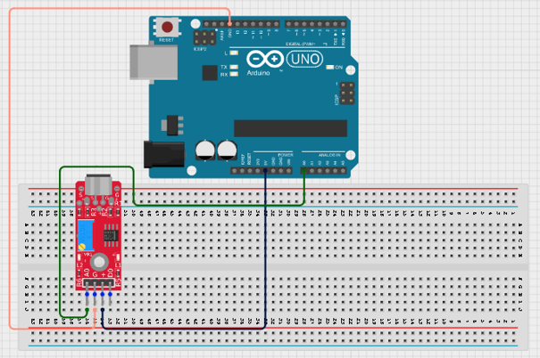
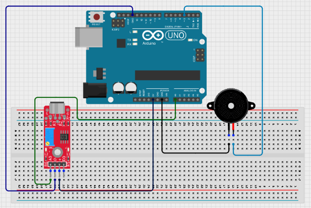
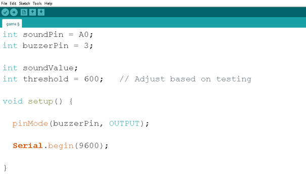
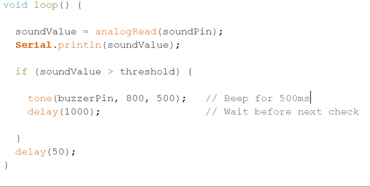

# Project 1.10.1:Noise Level Alarm

| **Description** | This project uses a sound sensor module to continuously monitor ambient noise levels. When the noise level exceeds a predefined threshold, a buzzer sounds an alarm to indicate excessive noise.
|
| --------------- | -------------------------------------------------------------------------------------------------------------------------------------------------------------------------------------------------------------- |
| **Use case** | Noise monitoring, classroom noise alerts, workplace sound monitoring, environmental awareness systems.|

## Components (Things You will need)

|  |  |  |  |  | |
| ---------------------------------------- | --------------------------------------------------- | ----------------------------------------------------------- | ----------------------------------------------------- | ------------------------------------------------------ | ------------------------------------------------------- |

## Mounting the component on the breadboard

**Step 1:** Place the Sound Sensor on the Breadboard.
Connect the sound sensor module:
•	VCC → 5V 
•	GND → GND 
•	AO (Analog Output) → A0 


.

**Step 2:** 
Place the Buzzer on the Breadboard.
Connect the buzzer:
•	Positive (+) terminal → Digital Pin 3 
•	Negative (−) terminal → GND 


.

**Step 3:** After completing the wiring, connect the Arduino Uno to the computer using the USB cable.

## PROGRAMMING

**Step 1:** Open your Arduino IDE. See how to set up here: [Getting Started](../../Getting Started/Arduino_IDE_Setup.md).

**Step 2:** Type the following codes before the void setup function.

``` cpp
int soundPin = A0;
int buzzerPin = 3;

int soundValue;
int threshold = 600;

```

**Step 3:** After the void setup ()within the curly brackets type the following codes.

``` cpp
pinMode(buzzerPin, OUTPUT);

Serial.begin(9600);

```

**Step 4:** : After the (void loop ()) within the curly brackets type

``` cpp
{
soundValue = analogRead (soundPin);
Serial.PrintIn(soundValue);

if (soundValue > threshold){
    tone(buzzerPin, 800, 500);
    delay(1000);

}
delay950
;
}
```

.

.


## Uploading the code

**Step 1:** Save your code. _See the [Getting Started](../../Getting Started/Arduino_IDE_Setup.md) section_

**Step 2:** Select the arduino board and port _See the [Getting Started](../../Getting Started/Arduino_IDE_Setup.md) section:Selecting Arduino Board Type and Uploading your code_.

**Step 3:** Upload your code. _See the [Getting Started](../../Getting Started/Arduino_IDE_Setup.md) section:Selecting Arduino Board Type and Uploading your code_


## OBERVATION
When the surrounding environment is quiet:
-	The buzzer remains off. 
-	The Serial Monitor displays lower sound values. 
When a loud sound is detected (such as clapping, shouting, or tapping near the sensor):
-	The sound value increases. 
-	The buzzer sounds an alarm. 
-	The Serial Monitor displays higher sound readings. 
If the alarm triggers too easily or not easily enough, adjust the threshold value in the code.


## CONCLUSION

This project demonstrates analog sensor reading, threshold comparison, sound level monitoring, buzzer control, and Serial Monitor communication. It provides a simple introduction to environmental sensing and alarm systems using Arduino.
