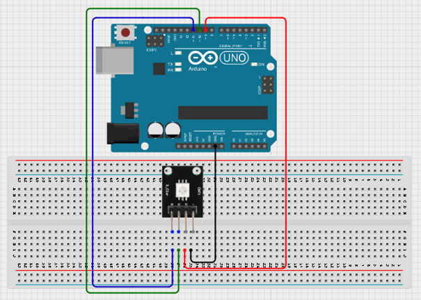
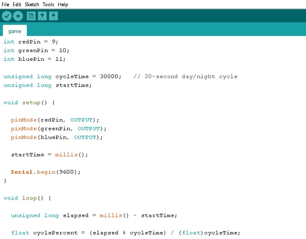
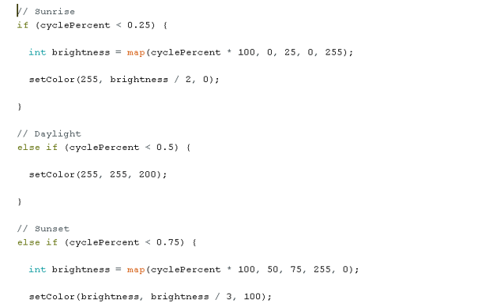
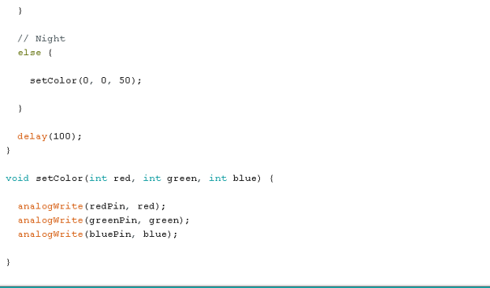

# Project 1.11.1:Smart Potentiometer

| **Description** | This project uses an RGB LED to simulate a complete day-and-night cycle. The LED gradually changes colours to represent sunrise, daylight, sunset, and nighttime, creating a visual demonstration of how natural lighting changes throughout the day.
| --------------- | -------------------------------------------------------------------------------------------------------------------------------------------------------------------------------------------------------------- |
| **Use case** | Smart lighting systems, mood lighting, day-night simulation, STEM demonstrations of natural light cycles.|

## Components (Things You will need)

|  |  |  |  | |
| ---------------------------------------- | --------------------------------------------------- | ----------------------------------------------------------- | ----------------------------------------------------- | ------------------------------------------------------ | 

## Mounting the component on the breadboard

Place the RGB LED on the breadboard.
Connect the RGB LED:
•	Red pin → Pin 9 
•	Green pin → Pin 10 
•	Blue pin → Pin 11 
•	Common Cathode (-) → GND 

.

**Step 2:** After completing the wiring, connect the Arduino Uno to the computer using the USB cable.

## PROGRAMMING

**Step 1:** Open your Arduino IDE. See how to set up here: [Getting Started](../../Getting Started/Arduino_IDE_Setup.md).

**Step 2:** Type the following codes;

.

.

.

## Uploading the code

**Step 1:** Save your code. _See the [Getting Started](../../Getting Started/Arduino_IDE_Setup.md) section_

**Step 2:** Select the arduino board and port _See the [Getting Started](../../Getting Started/Arduino_IDE_Setup.md) section:Selecting Arduino Board Type and Uploading your code_.

**Step 3:** Upload your code. _See the [Getting Started](../../Getting Started/Arduino_IDE_Setup.md) section:Selecting Arduino Board Type and Uploading your code_

## OBERVATION
-	The RGB LED starts with a sunrise effect. 
-	The colour gradually changes to bright daylight. 
-	The LED transitions into sunset colours. 
-	A dim blue light represents nighttime. 
-	The cycle continuously repeats every 30 seconds. 

## CONCLUSION

This project demonstrates analog sensor reading, threshold This project demonstrates RGB LED colour mixing, PWM control, time-based automation, and natural light simulation. It provides a simple introduction to creating realistic lighting effects and understanding how colour transitions can be programmed using Arduino.
