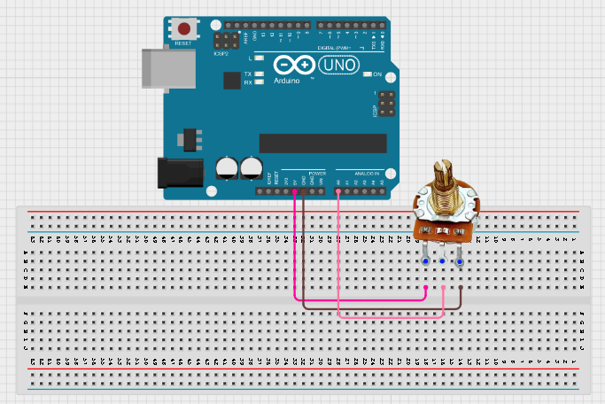
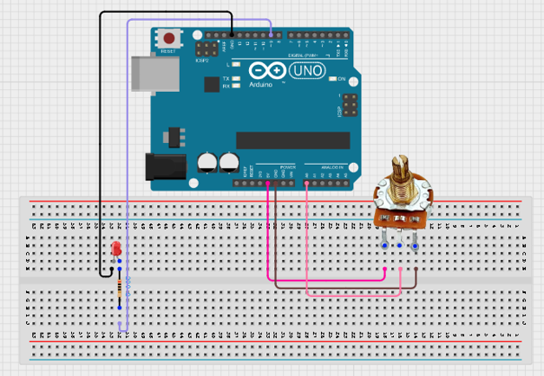
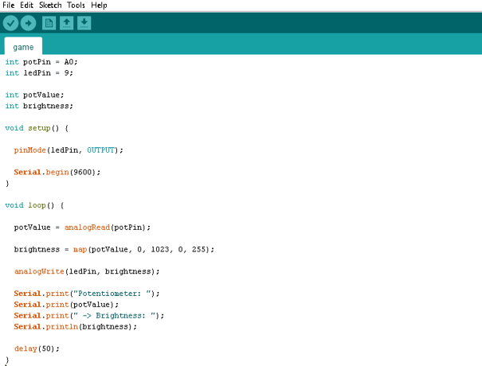

# Project 1.12.1:Smart Potentiometer

| **Description** | This project allows you to control the brightness of an LED using a potentiometer. As the potentiometer knob is rotated, the LED brightness increases or decreases smoothly.
| --------------- | -------------------------------------------------------------------------------------------------------------------------------------------------------------------------------------------------------------- |
| **Use case** | Light dimmers, brightness control systems, user input devices, analog sensor demonstrations.|

## Components (Things You will need)

|  |  |  |  | |
| ---------------------------------------- | --------------------------------------------------- | ----------------------------------------------------------- | ----------------------------------------------------- | ------------------------------------------------------ | 

## Mounting the component on the breadboard

Place the potentiometer on the breadboard.
Connect the potentiometer:
•	Left pin → 5V 
•	Right pin → GND 
•	Middle pin (wiper) → A0 

.

**Step2:**
Place the LED on the breadboard.
Connect the LED:
•	Longer leg (anode) → One leg of a 220Ω resistor 
•	Other leg of the resistor → Digital Pin 9 
•	Shorter leg (cathode) → GND 

.

**Step 3:** After completing the wiring, connect the Arduino Uno to the computer using the USB cable.

## PROGRAMMING

**Step 1:** Open your Arduino IDE. See how to set up here: [Getting Started](../../Getting Started/Arduino_IDE_Setup.md).

**Step 2:** Type the following codes

.

## Uploading the code

**Step 1:** Save your code. _See the [Getting Started](../../Getting Started/Arduino_IDE_Setup.md) section_

**Step 2:** Select the arduino board and port _See the [Getting Started](../../Getting Started/Arduino_IDE_Setup.md) section:Selecting Arduino Board Type and Uploading your code_.

**Step 3:** Upload your code. _See the [Getting Started](../../Getting Started/Arduino_IDE_Setup.md) section:Selecting Arduino Board Type and Uploading your code_

## OBERVATION
When the potentiometer is rotated:
-	Turning it fully counterclockwise makes the LED turn OFF. 
-	Turning it slightly increases the LED brightness gradually. 
-	Turning it halfway produces medium brightness. 
-	Turning it fully clockwise makes the LED reach maximum brightness. 
-	The Serial Monitor displays the potentiometer reading and the corresponding brightness value. 
 

## CONCLUSION

This project demonstrates analog input reading, PWM output control, voltage division, and signal mapping. It provides a practical introduction to how sensors can be used to control electronic outputs proportionally, a concept widely used in lighting systems, motor speed controllers, and industrial automation.
